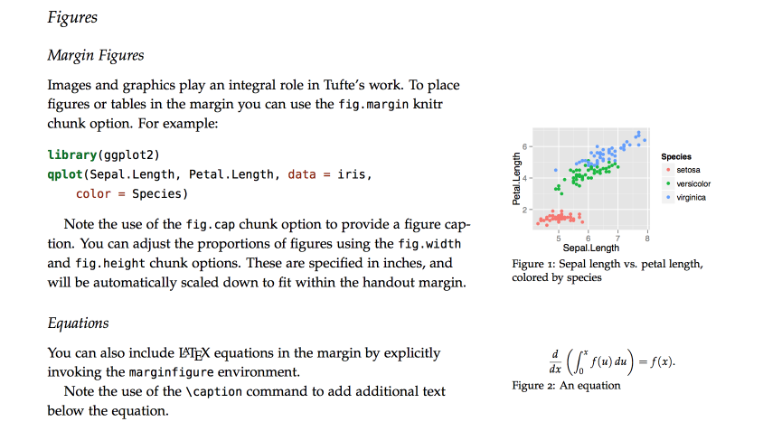

## Содержание

* Чем занимается "Интеллектуальный анализ данных".
* Инструмент для работы: пакет R. Что это и почему именно он?
* Установка R и RStudio. Дополнительные пакеты.
* Полезные ресурсы.
* R Markdown — создание отчетов.


## Интеллектуальный анализ данных = Data Mining

**Data Mining** занимается выявлением в данных ранее неизвестных закономерностей, описанием этих закономерностей, а также прогнозированием на их основе.

\tiny

```
PRICE  SQFT  AGE FEATS   NE    CUST     COR         TAX
2050	2650	13	7	1	1	0	1639
2080	2600	-9999	4	1	1	0	1088
2150	2664	6	5	1	1	0	1193
2150	2921	3	6	1	1	0	1635
1999	2580	4	4	1	1	0	1732
1900	2580	4	4	1	0	0	1534
1800	2774	2	4	1	0	0	1765
1560	1920	1	5	1	1	0	1161
1450	2150	-9999	4	1	0	0	-9999
1449	1710	1	3	1	1	0	1010
1375	1837	4	5	1	0	0	1191
1270	1880	8	6	1	0	0	930
1250	2150	15	3	1	0	0	984
1235	1894	14	5	1	1	0	1112
1170	1928	18	8	1	1	0	600
1180	1830	-9999	3	1	0	0	733
1155	1767	16	4	1	0	0	794
1110	1630	15	3	1	0	1	867
1139	1680	17	4	1	0	1	750
...
```

Выборка данных по продаже домов в Альбукерке (шт. Нью-Мексико, США).


## Data Mining $\subset$ Data Science

Data Mining (интеллектуальный анализ данных) — часть **науки о данных** (data science), куда входят:

* Статистический анализ данных (statistics)
* Машинное обучение (machine learning)
* Распознавание образов (pattern recognition)
* Большие данные (big data)
* Глубокое обучение (deep learning)
* Анализ текстов (text mining)

Все эти дисциплины тесно связаны друг с другом.

Будем называть наш предмет просто — **Анализ данных**.


## Основные направления

* Прогнозирование (prediction)
* Выявление структуры (structure discovery)
* Выявление взаимоотношений (relationship mining)
* Ранжирование (ranking)
* ...


## Прогнозирование

Цель прогнозирования — разработать модель, предсказывающую значение интересующей величины (выходной переменной) по значениям независимых переменных (предикторов).

Прогнозирование предполагает обучение модели на данных. Обучение — настройка параметров модели.

Обучение происходит на данных, где для заданных значений предикторов известны значения выходной переменной (обучающие данные). Научившись, модель позволяет предсказать значение выходной переменной для новых (неразмеченных) данных.

Если выходная переменная принимает непрерывные значения, то мы имеем дело с **регрессией** — поиском зависимости между входными и выходной переменными. Если выходная переменная имеет конечный дискретный набор значений (классов), то говорят о задаче **классификации**.


## Выявление структуры

Алгоритмы выявления структуры пытаются обнаружить в данных структуру, без использования каких-либо априорных представлений о ней. 

Наиболее известной группой подобных алгоритмов являются алгоритмы кластеризации. 

Кластеризация является логическим продолжением идеи классификации. Но:

* для классификации нужны обучающие данные, в которых известна связь между предикторами и выходной переменной (меткой класса). Число классов задано.
* при кластеризации обучающих данных нет, а число классов заранее не известно. Данные — одни предикторы без метки классов.

Результатом кластеризации является разбиение множества объектов на группы близких в каком-либо смысле объектов.


## Выявление взаимоотношений

\small

Цель выявления взаимоотношений — установить взаимосвязи между переменными в наборе данных с бОльшим числом переменных. Например, определить, какие переменные сильнее всего связаны с интересующей или в какой из пар связанных переменных связь сильнее, чем в других.

В **поиске связующих правил** целью является найти правила вида "if-then", указывающие на то, что если (if) одни переменные принимают какое-то множество значений, то (then) другая переменная будет иметь определенное значение. Например, если в транзакции встретился набор товаров A, то можно сделать вывод, что в этой же транзакции должен появиться набор товаров B.

**Поиск последовательных шаблонов** является дальнейшим развитием поиска связующих правил и предназначен для выявления взаимоотношений между проявлениями последовательных во времени событий (если пользователь приобрел товар А, то впоследствии он приобретет товар B).


## Ранжирование

**Ранжирование** (machine-learned ranking) — задача сортировки набора элементов исходя из их релевантности. Релевантность понимается по отношению к некоторому объекту. 

1. В задаче информационного поиска объект — это запрос, элементы — всевозможные документы (ссылки на них), а релевантность — соответствие документа запросу
2. В задаче рекомендаций объект — это пользователь, элементы — тот или иной рекомендуемый контент (товары, видео, музыка), а релевантность — вероятность того, что пользователь воспользуется (купит/лайкнет/просмотрит) данным контентом.

Обучающая выборка состоит из выборки поисковых запросов, подмножества документов, им отвечающим, и оценок релевантности каждого документа запросу. 


## Примеры использования

Сферы применения: везде, где имеются какие-либо данные.

Преимущества: скорость, автоматизация, точность, возможность масштабирования.

* рекомендательные системы в интернет-коммерции; 
* социальные сети — влияние на выборы; 
* поисковые системы — оперативное предсказание эпидемий; 
* массовые онлайн-курсы: прогнозирование оценок, рекомендации студентам; 
* розничные сети: подбор товаров;
* лечебные учреждения: истории болезней, диагнозы; 
* наблюдения за погодой; 
* банки: кредитный скоринг и рекомендательные системы; 
* технические системы (самолет): управление, предотвращение аварий; 
* ...


## Почему стоит заниматься анализом данных

* это современно.
* это востребовано: ["Data Scientist: The Sexiest Job of the 21st Century (Harvard Business Review, 10/2012)"](https://hbr.org/2012/10/data-scientist-the-sexiest-job-of-the-21st-century)
* это неплохо оплачивается —  в среднем [113 тыс. дол. в год](https://www.glassdoor.com/Salaries/data-scientist-salary-SRCH_KO0,14.htm) против [63.5 тыс. дол.](https://www.glassdoor.com/Salaries/programmer-salary-SRCH_KO0,10.htm) у программистов.

Объем данных в цифровой форме растет гораздо быстрее темпов подготовки специалистов. На рынке труда наблюдается бум спроса на data science-специалистов ([пример](https://habr.com/ru/news/t/468925/)). Возникают новые отрасли по работе с данными.


## Поиск курсов по data science на Coursera 


## Кто такой Data scientist?

Это специалист, [владеющий тремя группами навыков](https://republic.ru/specials/data-economics/articles/learning_to_count/): 

1. IT-грамотность — программирование, придумывание и решение алгоритмических задач, владение софтом; 
2. знания математики и статистики; 
3. содержательный опыт в какой-то области — понимание запросов своей организации или задач своей отрасли науки.


## Инструментарий: пакет R

R — язык программирования для анализа данных.

Создан в 1993 г. Россом Айхэкой (**R**oss Ihaka) и Робертом Джентлменом (**R**obert Gentleman) в Оклендском технологическом университете (Новая Зеландия).

R — свободное ПО, распространяемое с открытым исходным кодом.

CRAN ([The Comprehensive R Archive Network](https://cran.r-project.org/)) — доступно более 15000 пакетов расширений. 

Позволяет реализовать полный цикл работ с данными: импорт данных, предварительную обработка, моделирование, валидацию, визуализацию результатов, подготовку документации.

[RStudio](https://www.rstudio.com/products/RStudio/) — отличная среда разработки. Есть Open Source Edition.


## Другие статистические пакеты

Проприетарные:

* SAS
* SPSS
* Statistica
* Minitab
* Stata

Свободные: 

* Python (+Pandas, scikit-learn)
* Julia


## Почему R?

Субъективно, потому что:

* более низкий порог вхождения, чем у Python;
* R заточен под статистическую обработку данных и машинное обучение, тогда как Python — язык программирования общего назначения, "дообученный" анализу данных.
* концепции анализа данных лучше осваивать на R — меньше программистских нюансов.

Но:

* Deep Learning — R может, но через Python.
* Big Data — понадобятся специальные инструменты. 
* Знание R+Python — совсем хорошо. Возможно, эту связку заменит Julia.


## Установка R: r-project.org


## Установка R: R for Windows


## Установка IDE RStudio


## Окна RStudio


## Настройка кодировки скриптов UTF-8: Tools/General Options... 


## Установка пакетов: Tools/Install Packages...


## R online

\large

* https://rdrr.io/snippets/ — запуск коротких скриптов.
* https://rstudio.cloud/ — R+Rstudio, куча предустановленных пакетов, нужна регистрация.


## Поиск информации по R


## Поиск пакета в СRAN


## R и анализ данных: литература

\small

* *Шипунов А. Б., Балдин Е. М. и др.* Наглядная статистика. Используем R!
* [*Шитиков В. К., Мастицкий С. Э.* Классификация, регрессия и другие алгоритмы Data Mining с использованием R](https://ranalytics.github.io/data-mining/)
* *Кабаков Р.* R в действии. Анализ и визуализация данных в программе R.
* *Мастицкий С. Э.* Визуализация данных с помощью ggplot2.
* [*Clark M.* An Introduction to Machine learning with Application in R](http://web.ipac.caltech.edu/staff/fmasci/home/astro_refs/ML_inR.pdf)
* *Шолле Ф.* Глубокое обучение на R.
* [*James G., Witten D., Hastie T., Tibshirani R.* An Introduction to Statistical Learning with Applications in R.](http://faculty.marshall.usc.edu/gareth-james/ISL/)
* [*Wickham H., Grolemund G.* R for Data Science](https://r4ds.had.co.nz)
* [*Hyndman R. G., Athanasopoulos G.* Forecasting: Principles and Practice](https://otexts.com/fpp2/)
* [*Chang W.* R Graphics Cookbook, 2nd edition](https://r-graphics.org)
* *Wickham H.* Advanced R, 2nd edition
* [*Gillespie C., Lovelace R.* Efficient R programming](https://csgillespie.github.io/efficientR/)
* [*Sonderegger D. L.* STA 444/5 - Introductory Data Science using R](https://dereksonderegger.github.io/444/index.html)

**Хранилища:** http://gen.lib.rus.ec, http://www.twirpx.com


## R и анализ данных: сайты и видеокурсы

* http://www.statmethods.net/ — сайт Р. Кабакова c материалами его книг.
* http://r-analytics.blogspot.com/ — сайт С. Э. Мастицкого.
* [*Aust F., Barth M.* papaja: Reproducible APA manuscripts with R Markdown](https://crsh.github.io/papaja_man/)
* *Аббакумов В.Л.* Анализ данных на R в примерах и задачах: [часть 1](https://compscicenter.ru/courses/data-mining-r-problems/2016-spring/classes/), [часть 2](https://compscicenter.ru/courses/data-mining-r-problems-2/2017-spring/classes/).
* [*Hastie T., Tibshirani R.* In-depth introduction to machine learning](https://www.dataschool.io/15-hours-of-expert-machine-learning-videos/)


## Другие курсы по машинному обучению

* [*Andrew Ng.* Machine Learning, Stanford University (Octave), 2017](https://www.youtube.com/playlist?list=PLLssT5z_DsK-h9vYZkQkYNWcItqhlRJLN)
* [*Andrew Ng.* Machine Learning, Stanford University (Octave),  2012](http://openclassroom.stanford.edu/MainFolder/CoursePage.php?course=MachineLearning). Курсы Эндрю Ына в рекламе не нуждаются.
* [*Воронцов К., Соколов Е.* Введение в машинное обучение (Python)](https://www.coursera.org/learn/vvedenie-mashinnoe-obuchenie)
* [*Кашницкий Ю.* Open Machine Learning Course (Python)](https://mlcourse.ai)


## Markdown: подготовка отчетов

Markdown — язык разметки текстовых документов.

**Документ в Markdown должен восприниматься как обычный текст, чтобы инструкции форматирования не бросались в глаза.** Вмешательство в текст должно быть минимальным.

Поэтому синтаксис Markdown полностью состоит из символов пунктуации, отобранных так, чтобы они выглядели похоже на то, что обозначают.

Например, звездочки вокруг слова действительно обращают на себя `*`внимание`*`. Списки в Markdown выглядят так, как и должны выглядеть списки. Даже цитаты выглядят как цитаты из электронной почты.


## Обычный текст

\scriptsize

```
Абзацы в Markdown отделяются от окружающего текста пустой строкой.

"Жесткий" перевод строки выполняется<br/> с помощью HTML-элемента `<br/>`.
```

\normalsize

\begin{center}\rule{0.75\linewidth}{\linethickness}\end{center}

Абзацы в Markdown отделяются от окружающего текста пустой строкой.

"Жесткий" перевод строки выполняется\linebreak с помощью HTML-элемента `<br/>`.


## Заголовки

```
# Заголовок 1

## Заголовок 2

#### Заголовок 4
```

\begin{center}\rule{0.75\linewidth}{\linethickness}\end{center}


## Шрифт

```
*курсив* и _курсив_
**полужирный** и __полужирный__
верхний индекс^2^   
~~зачеркнутый~~
```

\begin{center}\rule{0.75\linewidth}{\linethickness}\end{center}

*курсив* и _курсив_

**полужирный** и __полужирный__

верхний индекс^2^

~~зачеркнутый~~


## Списки

```
* маркированный список (символы: *,+,-)
* пункт 2 
    + подпункт 1 (в начале - табуляция)
    + подпункт 2 
     
1. нумерованный список
2. пункт 2
    + подпункт 1
```

* маркированный список (символы: `*`,`+`,`-`)
* пункт 2 
    + подпункт 1 (в начале - табуляция)
    + подпункт 2 
     
1. нумерованный список
2. пункт 2
    + подпункт 1


## Ссылки и рисунки

```
[ссылка](www.rstudio.com)


```

\begin{center}\rule{0.75\linewidth}{\linethickness}\end{center}

[ссылка](www.rstudio.com)

\begin{center}
\includegraphics[width=75pt]{images/rstudio_icon.png}\\
Рисунок
\end{center}


## Сноски

```
Непосредственно после текста, к которому нужно
сделать сноску, помещаем^[Текст сноски.]
```

\begin{center}\rule{0.75\linewidth}{\linethickness}\end{center}

Непосредственно после текста, к которому нужно сделать сноску, помещаем^[Текст сноски.]


## Таблицы

```
Заголовок таблицы  | Второй столбец
------------------ | ------------- 
Ячейка 1           | Ячейка 2
Ячейка 3           | Ячейка 4
```

\begin{center}\rule{0.75\linewidth}{\linethickness}\end{center}

Заголовок таблицы  | Второй столбец
------------------ | ------------- 
Ячейка 1           | Ячейка 2
Ячейка 3           | Ячейка 4


## Цитаты

Цитаты оформляются с помощью символа `>`.

```
> Donec sit amet nisl. Aliquam semper ipsum sit amet velit. Suspendisse
> id sem consectetuer libero luctus adipiscing.
```

> Donec sit amet nisl. Aliquam semper ipsum sit amet velit. Suspendisse
> id sem consectetuer libero luctus adipiscing.

Предварительно отформатированный текст:

    ```
    Donec sit amet nisl. Aliquam semper ipsum sit amet velit. 
    Suspendisse id sem consectetuer libero luctus adipiscing.
    ```
    
```
Donec sit amet nisl. Aliquam semper ipsum sit amet velit. 
Suspendisse id sem consectetuer libero luctus adipiscing.
```


## Pandoc

Pandoc — универсальный конвертер, преобразует документы из/в markdown, reStructuredText, textile, HTML, DocBook, LaTeX, MediaWiki markup, TWiki markup, OPML, Emacs Org-Mode, Txt2Tags, Microsoft Word docx, LibreOffice ODT, EPUB и Haddock.

Для каждого формата документов в Pandoc существуют шаблоны (template).

Шаблоны могут содержать переменные, их **можно настраивать**.

Значения переменных задаются в:

1. YAML-заголовке документа (метаданные);
2. командной строке при вызове Pandoc.


## Метаданные документа (YAML)

YAML (YAML Ain't Markup Language — "YAML — Не язык разметки") — формат для описания конфигурационных файлов, похожий на языки разметки (JSON).

Простейший YAML-заголовок для документа HTML:

```
---
title: "Sample"
output: html_document
---
```

Переменные шаблона: `title` и `output`.

Можно задавать пользовательские переменные, но их нужно включать в шаблон.

## Более сложный заголовок

```
---
title: "Интеллектуальный анализ данных"
subtitle: "Программа курса"
author: "Храмов Д.А."
date: "22.04.2017"
output: 
  html_document:
    toc: true
---
```

Другие форматы вывода (output):

* word_document
* beamer_presentation
* pdf_document
* ...


## Формулы

```
Может быть строчной $i^2 = -1$ или выключной

$$
\int x^2 dx = \frac{x^3}{3} + C
$$
```

Может быть строчной $i^2 = -1$ или выключной

$$
\int x^2 dx = \frac{x^3}{3} + C
$$


## Поддержка расширений Markdown

```
---
title: "Habits"
author: John Doe
date: March 22, 2005
output: md_document
    variant: markdown+grid_tables
---
```


## R Markdown

R Markdown (http://rmarkdown.rstudio.com/) — пакет R для подготовки документов и их преобразования в разные форматы (Pandoc внутри). Поддерживает создание документов

* HTML
* PDF
* MS Word
* Beamer (слайды в LaTeX)
* слайды на HTML5 
* документы в стиле Тафти 
* книг (bookdown)
* информационных панелей (flexdashboard) 
* интерактивных веб-приложений (shiny) 
* научных статей (rticles) 
* веб-сайтов
* ...


## "Живой" код на R, Python, SQL, ...

Вместо:
```
    ```{r,eval=FALSE}
    x <- seq(-pi,pi,.1) 
    plot(x,sin(x))
    ```
```

увидим в документе

```{r,echo=FALSE, fig.height=4}
x <- seq(-pi,pi,.1) 
plot(x,sin(x))
```


## RStudio: создать файл R Markdown


## RStudio: обработать документ R Markdown


## Процесс преобразования

\begin{center}
\includegraphics{images/workflow.png}
\end{center}


## Документы в стиле Тафти




## Информационная панель (dashboard)


## Настройка стилей документа Word, созданного в R Markdown

1. С помощью R Markdown создаем документ Word.
2. Настраиваем в нем нужные стили (абзац, заголовки, списки и т. д.).
3. Сохраняем этот документ Word в качестве стилевого файла (reference_docx).
4. Подключаем стилевой файл в документе .Rmd и используем настроенные стили
    
```
---
title: "Test Report"
author: "Your Name"
date: "28.04.2017"
output:
  word_document:
    reference_docx: word-styles-reference-01.docx
---
```


## Оформление библиографии в R Markdown

YAML-заголовок документа:

```
---
title: "Анализ методов даунскейлинга"
output: html_document:
bibliography: lst_downscaling.bib
csl: ieee-with-url.csl
---
```

* Название стилей оформления библиографии: https://www.overleaf.com/learn/latex/Biblatex_citation_styles
* Источник стилей (нужно положить в папку с Rmd-файлом) — Official repository for Citation Style Language (CSL) citation styles: https://github.com/Keniajin/styles
* Оформление цитат в R Markdown: https://crsh.github.io/papaja_man/writing.html#citations

Создать bib-файл можно с помощью `rcrossref::cr_cn()`.


## R Notebook

R Notebook – удобный инструмент для создания красивых аналитических отчетов, позволяет хранить вместе код, изображения, комментарии, формулы и графики. Это документ R Markdown "публикабельного" вида с исходником внутри.

Ближайший аналог: Jupyter Notebook (http://jupyter.org/).


## Ссылки по R Markdown

* **R Markdown Cheatsheet**: https://www.rstudio.com/wp-content/uploads/2016/03/rmarkdown-cheatsheet-2.0.pdf
* **R Markdown Reference Guide**: https://www.rstudio.com/wp-content/uploads/2015/03/rmarkdown-reference.pdf
* **Happy collaboration with Rmd to docx**: http://rmarkdown.rstudio.com/articles_docx.html
* [*Xie Y., Allaire J. J., Grolemund G.* R Markdown: The Definitive Guide](https://bookdown.org/yihui/rmarkdown/)

