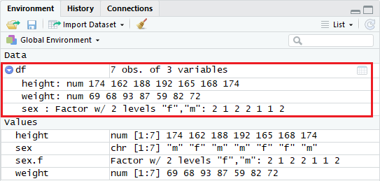
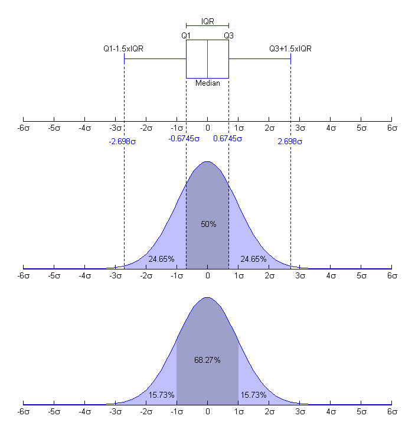

## Содержание

* Типы данных
* Описательная статистика: меры центра и разброса
* Разведочный анализ


## Типы данных: статистические шкалы

* **Номинативные (категориальные, качественные)**: цвета светофора, пол — арифметические операции невозможны
* **Ранговые**: финишный протокол гонки — возможно сравнение по величине
* **Количественные**
    * непрерывные: рост, вес
    * дискретные: число потомков, тестовые баллы

    
## Типы данных в R

\bcols
\column{.6\textwidth}

\large

* Количественные данные
    * числовые (numeric)
    * символьные (character)
    * логические (logical)
* Категориальные данные
    * факторы (factor)
    
\normalsize    
    
\column{.4\textwidth}

```
> 174
[1] 174
> class(174)
[1] "numeric"
> class(174L)
[1] "integer"
> class("174L")
[1] "character"
> class('174L')
[1] "character"
> class(TRUE)
[1] "logical"
> class(T)
[1] "logical"
```

\ecols

Что означает `[1]`?


## Количественные переменные. Векторы

\small

```{r}
height <- c(174, 162, 188, 192, 165, 168, 174)

class(height)      # класс переменной
str(height)        # структура переменной
is.vector(height)  # проверка: это вектор?
```

Векторы в R – числовые, символьное и логические – играют роль элементарных типов данных, из которых строятся все остальные типы. Скаляры представляют собой векторы единичной длины.


## Особенности синтаксиса R

\large

1. В именах переменных можно использовать точку `'.'`. Часто ее используют вместо `'_'`. Обращение к методам объекта или элементам данных осуществляется через `'$'`.
2. Присваивание обозначается стрелкой `<-`. Можно использовать обычное равенство `=`. 


## График

```{r}
plot(height)
```


## Доступ к элементам

\small

```{r}
height[1]              # 1-й элемент
length(height)         # длина вектора
height[2:5]            # элементы со 2-го по 5-й
height[-1]             # все элементы, кроме 1-го
height[length(height)] # последний элемент
```


## Номинативные данные

```{r}
sex <- c("m", "f", "m", "m", "f", "f", "m")

str(sex)
is.character(sex) # проверка: это символьные данные?
# plot(sex)       # выдает сообщение об ошибке
```


## Создаем фактор

\small
```{r, fig.width=5, fig.height=3}
sex.f <- factor(sex)
str(sex.f)
plot(sex.f)
```


## Группируем данные

```{r}
weight <- c(69, 68, 93, 87, 59, 82, 72)
plot(height, weight)
```


## Добавляем тип маркера (pch)

```{r, fig.height=5}
as.numeric(sex.f) # тип маркера должен быть числом
plot(height, weight, pch=as.numeric(sex.f))
```


## Добавляем цвет (col)

```{r}
plot(height, weight, pch=as.numeric(sex.f), 
     col=as.numeric(sex.f))
```


## .. и легенду

```{r, eval=FALSE}
levels(sex.f) # уровни фактора
nlevels(sex.f) # число уровней
```
```{r, fig.height=5}
plot(height, weight, pch=as.numeric(sex.f), 
     col=as.numeric(sex.f))
legend("topleft", pch=1:nlevels(sex.f), 
       col=1:nlevels(sex.f), legend=levels(sex.f))
```


## Контейнеры разнородных элементов: списки

```{r}
l <- list(1,"a", c(TRUE, F))

str(l)
str(l[1])   # l[1]   - доступ к 1-му подсписку
str(l[[1]]) # l[[1]] - доступ к 1-му элементу
```


## Списки: имена элементов

```{r}
l <- list(num=1, ch="a", log=c(TRUE, F))
str(l)
l$log
length(l$log)
```


## Таблица (data frame)

```{r}
df <- data.frame(height, weight, sex)
```



## Таблицы: просмотр содержимого 

```{r, eval=F}
View(df)
```
{ width=250px }


## Операции в окне Environment


## Таблицы: доступ к элементам

```{r}
df[1,1]       # элемент 1-й строки и 1-го столбца
df$height[1]  # 1-й элемент столбца с именем height
df[,1]        # 1-й столбец
df[1,c("height","sex")] # 1-я строка столбцов height и sex
```


## Таблицы: терминология

Таблица — основной способ представления данных. Строки таблицы содержат наблюдения, столбцы — признаки.

* строка = наблюдение = объект
* колонка = столбец = признак (feature) = переменная


## Генеральная совокупность и выборка

**Генеральная совокупность** (population) — множество всех объектов, относительно которых мы хотим сделать выводы в рамках нашего исследования.

*На какое множество объектов вы хотели бы обобщить результаты ваших исследований?* — это и есть генеральная совокупность.

Некоторые элементы, случайным образом взятые из генеральной совокупности называются, **выборкой** (sample).

Выборка должна быть **репрезентативной**, то есть служить моделью (уменьшенной копией) генеральной совокупности.


## Меры центральной тенденции: среднее

```{r}
height <- c(174, 162, 188, 192, 165, 168, 174)
```

$$\bar x = \frac{\sum_{i=1}^n x_i}{n}$$

```{r}
mean(height) # sum(height)/length(height)
```

```{r, echo=F, fig.width=5, fig.height=2.5}
stripchart(height, method = "stack", offset = .5, at = .15, pch = 19)
```

## Меры центральной тенденции: медиана

```{r}
height <- c(174, 162, 188, 192, 165, 168, 174)
median(height)
order(height)
height[order(height)]
```


## Меры центральной тенденции: влияние выбросов

```{r}
height <- c(height, 225)
mean(height)
median(height)
mean(height, trim=1/8)
```

Если в выборке присутствуют выбросы, выбираем в качестве меры среднего медиану или усеченное (урезанное) среднее (mean() с опцией trim).


## Меры разброса: дисперсия, стандартное отклонение и квантили

$$\sigma = \frac{\sum_{i=1}^n (x_i - \bar x)^2 }{n-1}$$

```{r}
var(height)
```

$$s = \sqrt{\sigma} = \sqrt{\frac{\sum_{i=1}^n (x_i - \bar x)^2 }{n-1}}$$

```{r}
sd(height)
```


## Меры разброса: квантили

```{r, echo=F}
height[order(height)]
```
```{r}
max(height) - min(height) # размах выборки
```
```{r}
summary(height)           # квартили
IQR(height)               # межквартильный размах
```

Меры центра характеризуют точность, а меры разброса — кучность.


## Немного терминологии

"Статистика" имеет три значения:

1. Наука, изучающая общие вопросы сбора, измерения и анализа массовых статистических (количественных или качественных) данных.
2. Сами статистические данные.
3. Числовая функция от выборки, не зависящая от параметров распределения: среднее, дисперсия и т. д.

Говоря о статистиках мы имеем в виду третье из указанных значений.

Среднее и дисперсия как и другие статистики относятся к генеральной совокупности.

Если статистика относится к выборке, говорят о выборочном среднем, выборочной дисперсии и т. п.

Но: на практике мы всегда (почти) имеем дело с выборками. Поэтому слово "выборочный" мы будем опускать, говоря просто о среднем и дисперсии.


## Разведочный анализ


## Набор данных Swiss Bank Notes

Данные из книги: *Flury, Riedwyl. Multivariate statistics. A practical approach, Chapman & Hall, 1988.*

* X1: длина банкноты
* X2: высота банкноты, измеренная слева
* X3: высота справа
* X4: кайма нижняя
* X5: кайма верхняя
* X6: диагональ центральной картинки

\large

Нужно определить, подлинная банкнота или фальшивая.


## Фрагмент данных

```
Length H_l H_r dist_l dist_up Diag
214,8 131,0 131,1 9,0 9,7 141,0
214,6 129,7 129,7 8,1 9,5 141,7
214,8 129,7 129,7 8,7 9,6 142,2
214,8 129,7 129,6 7,5 10,4 142,0
215,0 129,6 129,7 10,4 7,7 141,8
215,7 130,8 130,5 9,0 10,1 141,4
215,5 129,5 129,7 7,9 9,6 141,6
214,5 129,6 129,2 7,2 10,7 141,7
```


## Загрузка данных

```{r}
getwd()                 # где находится рабочий каталог?
# setwd('path/to/data') # установить рабочий каталог
swiss.0 <- read.table("data/Swiss Bank Notes.dat", 
                      header=T, sep="", dec=",")
head(swiss.0, n=3)     # выведем "голову" таблицы
```


## Знакомство с данными. Проверка на пропуски

\scriptsize
```{r}
dim(swiss.0)     # размеры таблицы swiss.0
summary(swiss.0)
```
\normalsize
`summary` позволяет увидеть возможные ошибки в данных.


## Гистограммы

Гистограмма — "оценка" плотности распределения случайной величины, построенная по выборке. Пусть $n_i$ число элементов выборки, попавших в $i$-й интервал $\Delta_i$.

$$
h_i = n_i
$$
```{r, fig.height=5}
hist(swiss.0$dist_up)
```


## Построение гистограммы 

1. Множество значений, которое может принимать элемент выборки, разбивается на несколько интервалов (bins), чаще всего — одинаковых, но не обязательно. 
2. Эти интервалы откладываются на горизонтальной оси. 
3. Над каждым интервалом строится прямоугольник, высота которого пропорциональна числу элементов выборки, попавших в соответствующий интервал. 

Если используются интервалы разной длины, то высота прямоугольника выбирается таким образом, чтобы его площадь была пропорциональна числу элементов выборки, которые попали в этот интервал.


## Нормализация гистограммы

Нормализация позволяет сравнить разные выборки и оценить долю от общего числа данных, попавших в определенный интервал
$$
h_i = \frac{n_i}{n \Delta_i}
$$
```{r, fig.height=5}
hist(swiss.0$dist_up, freq = F)
```

Площадь под кривой — самое важное, что мы должны видеть на гистограмме.


## Гистограмма позволяет увидеть выбросы

— аномально большие или аномально малые наблюдения
```{r}
outliers <- c(5.9,5.1,15.1,14.9,5.2)
data_with_outliers <- c(swiss.0$dist_up, outliers)
```
```{r, fig.height=5}
hist(data_with_outliers)
```


## Гистограмма порождает гипотезы

Гипотеза: длина <= 140 — один вид банкнот; длина > 141 — другой вид.

```{r, fig.height=5}
hist(swiss.0$Diag)
```


## Гистограмма: открытые вопросы

* Сколько должно быть интервалов? [Histogram. Number of bins and width](https://en.wikipedia.org/wiki/Histogram)
* Должны ли интервалы быть равными?

```{r, fig.height=4}
hist(swiss.0$Diag, breaks=18)
```

Почему интервалов не 18? Из справки: "...the number is a suggestion only; the breakpoints will be set to pretty values".


## Гистограмма и оценка плотности распределения

```{r, fig.height=5}
hist(swiss.0$dist_up, freq = F, col = "lightblue", 
ylab = "Probability density",
main = "Histogram with density plot")
lines(density(swiss.0$dist_up), col = "red", lwd = 2)
```


## Раскроем карты

Из 200 банкнот первые 100 — подлинные, остальные фальшивые. 

\small

```
> swiss.0[swiss.0$Diag <= 140,]

    Length   H_l   H_r dist_l dist_up  Diag
70   214.9 130.2 130.2    8.0    11.2 139.6
101  214.4 130.1 130.3    9.7    11.7 139.8
102  214.9 130.5 130.2   11.0    11.5 139.5
105  214.7 130.2 130.3   11.8    10.9 139.7
106  215.0 130.2 130.2   10.6    10.7 139.9
...
198  214.8 130.3 130.4   10.6    11.1 140.0
199  214.7 130.7 130.8   11.2    11.2 139.4
200  214.3 129.9 129.9   10.2    11.5 139.6

> nrow(swiss.0[swiss.0$Diag <= 140,])

[1] 91
```


## Матрица диаграмм рассеивания

```{r}
pairs(swiss.0) # или: plot(swiss.0)
```


## Диаграмма рассеивания (scatter plot)

```{r}
plot(swiss.0$Length, swiss.0$Diag, xlab="Length",
ylab="Diagonal", main="Swiss Bank Notes")
```


## Добавим столбец — индикатор типа банкнот

Добавим в таблицу столбец-индикатор origin, сообщающий о подлинности банкноты. Код '1' означает, что банкнота подлинная, код '0' — банкнота фальшивая.

```{r}
origin <- c(rep(1, 100), rep(0, 100))
# Объединяем таблицу и вектор в новую таблицу
swiss.1 <- data.frame(swiss.0, origin)
```

## Диаграмма рассеивания: использование маркеров точек

```{r, eval=F}
# Рисуем правильно смасштабированные оси координат, 
# но данные не выводим (type="n")
plot(swiss.1$Length, swiss.1$Diag, type="n", 
xlab="Length", ylab="Diagonal", 
main="Swiss Bank Notes")
# Условия выбора подлинных и фальшивых банкнот
l <- swiss.1$origin == 1
o <- swiss.1$origin == 0
# Добавляем точки, соответствующие подлинным банкнотам
points(swiss.1$Length[l], swiss.1$Diag[l], pch=3)
# Добавляем точки, соответствующие фальшивым банкнотам
points(swiss.1$Length[o], swiss.1$Diag[o], pch=1)
```


##

```{r, echo=F}
# Рисуем правильно смасштабированные оси координат, 
# но данные не выводим (type="n")
plot(swiss.1$Length, swiss.1$Diag, type="n", 
xlab="Length", ylab="Diagonal", 
main="Swiss Bank Notes")
# Условия выбора подлинных и фальшивых банкнот
l <- swiss.1$origin == 1
o <- swiss.1$origin == 0
# Добавляем точки, соответствующие подлинным банкнотам
points(swiss.1$Length[l], swiss.1$Diag[l], pch=3)
# Добавляем точки, соответствующие фальшивым банкнотам
points(swiss.1$Length[o], swiss.1$Diag[o], pch=1)
```


## Ящик с усами, он же боксплот (box-whisker plot, boxplot)


$$
X_1 = Q_1 - 1.5(Q_3-Q_1) = Q_1 - 1.5 IQR, \quad X_2 = Q_3 + 1.5 IQR
$$
$X_1$ — нижняя граница уса, $X_2$ — верхняя граница уса, $Q_1$ — первый квартиль, $Q_3$ — третий квартиль


## Квартили нормального распределения




## Боксплот: замечания

Длину интервала $1.5*IQR$ можно изменить при помощи аргумента `range` функции `boxplot()`. 

Наблюдения, находящиеся за пределами "усов", потенциально могут быть выбросами. Следует внимательно относиться к такого рода нестандартным наблюдениям - они вполне могут оказаться "нормальными" для исследуемой совокупности, и поэтому не должны удаляться из анализа без дополнительного расследования причин их появления.

Выбросы (outliers) находятся в пределах от $> 1.5*IQR$ до $< 3*IQR$. Они отображаются кружками.

Экстремальные выбросы (extrems) > $3*IQR$. Обозначаются звездочками.


## Строим боксплот: plot

\small
```{r, fig.height=5}
# При использовании plot координата X должна быть фактором
is.factor(swiss.1$origin)
swiss.1$origin <- as.factor(swiss.1$origin)
plot(swiss.1$origin, swiss.1$Diag)
```


## Строим боксплот: boxplot

```{r, fig.height=5}
boxplot(Diag ~ origin, swiss.1)
```

* `y ~ x1 + x2 + ...` — формула. Запись означает "y зависит от x1, x2" взятых аддитивно. 
* origin не нужно делать фактором.


## Зачем нужен боксплот?

\small
Ящик с усами — упрощенная версия гистограммы. Он хорош для сравнения нескольких выборок.

```{r, fig.height=6}
boxplot(mpg ~ cyl, data=mtcars, main="Car Mileage Data",
xlab="Number of Cylinders", ylab="Miles Per Gallon")
```


## Резюме по разведочному анализу

Разведочный анализ данных — анализ основных свойств данных, нахождение в них общих закономерностей, распределений и аномалий, построение начальных моделей с использованием инструментов визуализации.

Цель разведочного анализа: максимальное "проникновение" в данные.

Вопросы, которые нужно выяснить:

1. Какой тип у данных, каким способом они представлены?
2. Однородны ли данные? В каких единицах измерены показатели?
3. Можно ли предположить нормальное распределение данных?
4. Нужна ли очистка данных: есть ли пропущенные данные, выбросы, опечатки?


## Инструменты

* read.table()
* summary()
* hist()
* boxplot()

Если при попытке загрузки данных в R возникает ошибка, возможно это результат неправильного оформления и/или ввода данных.


## Пропуски в данных

\scriptsize

```{r}
dat <- read.table("data/Albuquerque_Home_Prices_data.txt",
                  header = T)
summary(dat)
```

* В AGE и TAX есть пропуски.
* `-9999` — обозначает пропуск в данных.


## Исправляем пропуски: na.strings

\scriptsize

```{r}
dat <- read.table("data/Albuquerque_Home_Prices_data.txt",
                  header = T, na.strings = "-9999")
summary(dat)
```

Что делать с пропусками дальше — зависит от задачи.


## Бимодальное распределение

Медиана не чувствительна к выбросам. Но есть ситуации, когда отказывает и медиана.

```{r, echo=F}
n <- 300
x <- c(rnorm(n), rnorm(n, mean = 10))
hist(x, main="")
```


##

Среднее и медиану легко подсчитать, но что это даст?

```{r}
summary(x)
```

Здесь нужна **мода** — число, которое встречается среди наблюдений наиболее часто. В нашем случае таких числа два (0 и 10), поэтому распределение называется *бимодальным* (дву-модальным)

Бимодальное распределение — повод продолжать исследование, чтобы найти причину, которая делит наблюдения на два класса.


## Выделение воды на снимке космического радара


##

\scriptsize

```{r}
library(raster)

r <- raster("data/louisiana_SAR.tif")
hist(values(r))
```


##

\Large

* Нижнее распределение с пиком -22.5 дБ — водные объекты.
* Верхнее распределение с пиком -13.5 дБ — суша.


## Что такое "типичный город"?

Анализируем численность населения городов России по данным переписи 1959 года. Названия городов даны современные. Население задано в тысячах человек.

Нужно узнать численность населения, проживающего в типичном городе и попутно определить, что же такое "типичный город".

Данные находятся в файле `town_1959.csv`

Задаем рабочую папку и начинаем анализ с импорта данных в R.

```{r}
town.1959 <- read.table("data/town_1959.csv", header=T, 
sep=",", encoding = 'UTF-8')
```


## Проверим себя

\small
Посмотрим на данные.

Зачем смотреть, если все вроде бы правильно? 

Но: если бы мы пропустили любой из параметров 
`header=T` или `sep=","`, то результат импорта был бы неправильным.
```{r}
head(town.1959, n=5)
```

Столбец с номером нам не нужен, уберем его
```{r}
town.1959$`номер` <- NULL
```


## Посмотрим описательные статистики

\small
Гипотеза: типичный город задается средним арифметическим по выборке.

```{r}
summary(town.1959[,2])
```

**Наблюдение 1.** Среднее арифметическое больше 3 квартили!
Уточним.

```{r}
sum(town.1959[,2] < 52.93)/nrow(town.1959) * 100
```

**Наблюдение 2.** Если в качестве населения типичного города
России взять среднее арифметическое, то 82% городов России
имеет население меньше, чем население типичного города.
Что вызывает дискомфорт. Такое наблюдение не воспринимается
как типичное.

## Выборка содержит выбросы?

\small
Сколько всего наблюдений?
```{r}
nrow(town.1959)
```
Если принять, что Москва и Санкт-Петербург — выбросы, и 
исключить их из выборки, получим следующее
```{r}
summary(town.1959[-c(1,2),2])
```

Посмотрим, на сколько процентов изменилось среднее арифметическое
```{r}
(52.93 -  45.00)/ 52.93 * 100
```

Какую долю городов мы удалили из выборки?
```{r}
2/1004 * 100
```

##

**Наблюдение 3.** После отбрасывания 0.2% наблюдений среднее арифметическое уменьшилось на 15%. При этом медиана уменьшилась на 100 человек.

### Вывод

Если выборка содержит выбросы, т. е. аномально большие или аномально маленькие наблюдения, то вычисление среднего арифметического становится ненадежным методом определения типичного значения.

Медиана лучше, потому что она устойчива к выбросам.


## Некоторые полезные команды

\small
Вычисление среднего
```{r}
mean(town.1959[,2])
```

Вычисление медианы
```{r}
median(town.1959[,2])
```

Вычисление усеченного среднего, р=0.95 (`trim` отсекает с каждой стороны распределения по .025)
```{r}
mean(town.1959[,2], trim = .025)
```

Но! Усеченное среднее плохо воспринимается заказчиком.


## Сколько выбросов и каково распределение данных?

На гистограмме видны только выбросы
```{r, fig.height=5.5}
hist(town.1959[,2])
```

Но сколько их?


## Логорифмируем данные

Внешне распределение похоже на лог-нормальное. Поэтому логорифмируем данные.

Теперь на гистограмме видно, что у нас 3 выброса
```{r, fig.height=5.5}
hist(log(town.1959[,2]), breaks=44)
```


## Итак...

когда мы описываем типичное значение, стоит серьезно подумать и...

* если распределение данных колоколообразное, то лучше использовать среднее арифметическое.
* если распределение несимметричное, то используем медиану. Допустимо также использовать усеченное среднее.


## Удаление выбросов: проверка

```{r}
# Выделим численность населения в отдельную переменную
x <- town.1959[,2]
# Посмотрим, много ли кандидатов на выбросы
boxplot(x)
```


## Нормализация распределения

```{r}
x <- log(town.1959[,2])
boxplot(x)
```


## Удалим выбросы

Выбросами считаются объекты, выходящие за границы "усов"

```{r}
# Вычислим 1-ю и 3-ю квантиль
qnt <- quantile(x, probs=c(.25, .75))
# Выбросы выходят за границы 1.5*IQR
H <- 1.5 * IQR(x)

y <- x
y[x < (qnt[1] - H)] <- NA
y[x > (qnt[2] + H)] <- NA
```


## Выборка после удаления выбросов

```{r}
boxplot(y)
```

## Что это были за города?

\small

```{r}
head(town.1959[is.na(y),c(1,2)])
tail(town.1959[is.na(y),c(1,2)])
```


## Замечания по выбросам

```{r}
# Сколько всего выбросов?
sum(is.na(y))
```

**Лечение может быть опаснее болезни: вместе с "выбросами" могут быть удалены ценные данные.**

Самостоятельно удалите из выборки экстремальные выбросы (экстремумы)

```
H <- 3 * IQR(x)
```

и проверьте, какие города будут удалены в этом случае.

Удалять выбросы можно без нормализации распределения.


## Типичные города в 1959 г.

```{r}
tmd <- median(town.1959[,2])
cnd <- (town.1959[,2] >= 0.99*tmd)&
  (town.1959[,2] <= 1.01*tmd)
town.1959[cnd,]
```
