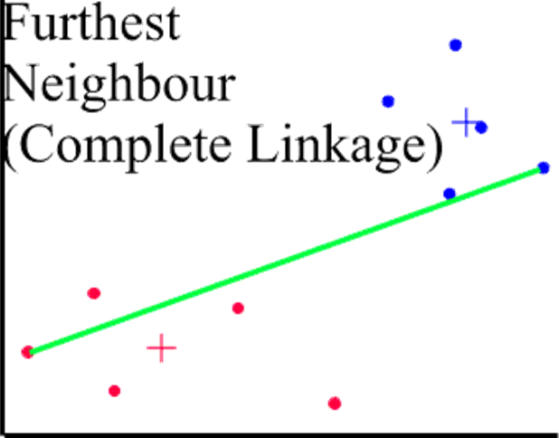

## Содержание

* Постановка задачи кластеризации
* Выбор меры расстояния между точками
* Выбор расстояния между кластерами
* Выбор числа кластеров
* Стандартизация данных
* Алгоритм иерархического кластерного анализа


## Кластерный анализ: терминология и постановка задачи

**Кластер** — калька слова «cluster», то есть «сгусток», «скопление)» и т.п.

Другие названия: обучение без учителя, распознавание образов без учителя.

Кластерный анализ: 

1. разбивает набор объектов на группы (кластеры);
2. определяет число кластеров.


## Задача: сегментация рынка

По данным о покупателях (результаты опроса, поведение на сайте интернет-магазина) выявить и описать/понять рыночные сегменты.

Прежде, чем фирма определится, какие сегменты рынка создают для нее наибольшие возможности, надо решить, какие сегменты уже существуют.


## Задача: определение групп клиентов

Страховая компания интересуется группами, на которые разделяются потенциальные клиенты. Результаты классификации используются, чтобы для разных групп определять оптимальные цены на услуги, оптимальные тарифы, ...

Для разбиения потребителей на группы можно выбирать разные наборы характеристики объектов, например возраст, образование, место жительства, тип личности, и так далее.

Несложно разделить покупателей на сегменты по **одной** (или по каждой) характеристике. Кластерный анализ помогает выявить уже сложившееся разбиение потребителей на «группы со схожими потребностями в отношении конкретного товара или услуги, достаточными ресурсами, а также готовностью и возможностью покупать» учитывая **все** выбранные показатели одновременно.


## Задача: товарные группы для рекомендательной системы

На рынке присутствует большой выбор товаров схожего назначения под разными торговыми марками. Надо разбить товары на группы.
 
Иногда такое разбиение известно и получается без применения статистической техники. Например, компьютеры бывают «для дома», «для офиса», «серверы», «игровыее» и т. д.

Кластерный анализ применяется, если нет классификации, признанной всеми.

Важно! Результат будет зависеть от выбора набора показателей.


## Внимание! Возможна путаница

Разделение объектов на группы нередко называют **классификацией**. Однако в Data Mining и смежных дисциплинах классификация – это совсем другая задача.

* **Кластерный анализ**: какие группы объектов существуют? сколько этих групп?
* **Классификация** (обучение с учителем): к какой из заранее заданных групп следует отнести новый объект (наблюдение).


## Идея кластеризации: сведем задачу к геометрической

* Каждый объект — точка.
* Похожие объекты расположены «близко» друг к другу.
* Различающиеся объекты расположены «далеко».
* Скопления похожих точек образуют кластер.

{ width=220px }


## Технические проблемы

\Large

* Как считать расстояние между точками (объектами)?
* Как считать расстояние между кластерами?


## Расстояние между точками

* Евклидово расстояние
* Квадрат евклидова расстояния
* Расстояние городских кварталов (манхэттенское расстояние, расстояние таксиста)
* Расстояние Чебышева
* Степенное расстояние
...


## Меры расстояния между точками — 1

### Евклидово расстояние

Наиболее распространенная функция расстояния. Представляет собой геометрическое расстояние в многомерном пространстве:
$$
d(x,x^\prime) = \sqrt{\sum_{i=1}^n (x_i -x_i^\prime)^2}
$$

### Квадрат евклидова расстояния

Применяется для придания большего веса более отдаленным друг от друга объектам. Это расстояние вычисляется следующим образом:
$$
d(x,x^\prime) = \sum_{i=1}^n (x_i -x_i^\prime)^2
$$


## Меры расстояния между точками — 2

### СтепеннОе расстояние

Применяется в случае, когда необходимо увеличить или уменьшить вес, относящийся к размерности, для которой соответствующие объекты сильно отличаются. Степенное расстояние вычисляется по следующей формуле:
$$
d(x,x^\prime) = \sqrt[r]{\sum_{i=1}^n (x_i -x_i^\prime)^p} ,
$$
где $r$ и $p$ – параметры, определяемые пользователем. $p$ отвечает за постепенное взвешивание разностей по отдельным координатам, $r$ – за прогрессивное взвешивание больших расстояний между объектами. Если оба параметра – $r$ и $p$ — равны двум, то это расстояние совпадает с расстоянием Евклида.


## Расстояние Manhattan

{ width=300px }


## Меры расстояния между точками — 3

### Расстояние городских кварталов (манхэттенское расстояние)

Это расстояние является средним разностей по координатам. Для этой меры влияние отдельных больших разностей (выбросов) уменьшается, так как они не возводятся в квадрат.
$$
d(x,x^\prime) = \sum_{i=1}^n |x_i - x_i^\prime|
$$

### Расстояние Чебышева

Это расстояние может оказаться полезным, когда нужно определить два объекта как «различные», если они существенно различаются по какой-либо одной координате. 
$$
d(x,x^\prime) = \max(|x_i - x_i^\prime|)
$$


## Меры расстояния между точками — 4

### Расстояние Хэмминга

Число позиций, в которых соответствующие символы двух слов одинаковой длины различны
$$
d(1011101, 1001001) = 2
$$
$$
d(2173896, 2233796) = 3
$$
$$
d(toned, roses) = ?
$$
Для категориальных данных (мера несогласия).


## Когда какое расстояние использовать?

Начинаем с евклидова или с Манхэттен. 

При выборе между евклидовым и Манхэттен спрашиваем себя: если точки различаются по одной из координат, то похожи или нет соотвествующие им объекты? Евклидово расстояние эту непохожесть подчеркнет, а Манхэттен сгладит.


## Расстояние между кластерами

* Среднее невзвешенное расстояние (Average linkage clustering).
* Центроидный метод (Centroid Method).
* Метод дальнего соседа, максимального расстояния (Complete linkage clustering).
* Метод ближайшего соседа (Single linkage clustering).
* Метод Варда (Ward's method).


## Среднее невзвешенное расстояние

{ width=300px }


## Центроидный метод

{ width=270px }
$$
\bar x_j = \frac{1}{N_j} \sum_i^{N_j} x_i, \quad \bar y_j = \frac{1}{N_j} \sum_i^{N_j} y_i .
$$


## Центроидный метод — 2

### Pro

* Вычислительная простота.
* Объем кластера не влияет.

### Contra

* Дендрограмма может иметь самопересечения.


## Метод дальнего соседа

\scriptsize
Этот метод обычно работает очень хорошо, когда объекты происходят из отдельных групп. Если же кластеры имеют удлиненную форму или их естественный тип является «цепочечным» (ленточным), то этот метод непригоден.

{ width=250px }


## Метод ближайшего соседа

\scriptsize
Результирующие кластеры имеют тенденцию объединяться в цепочки.

{ width=250px }


## Растояние Sørensen–Dice (индекс сходства)

Расстояние между сайтами.

$$
Q = \frac{2 \cdot |A \cap B|}{|A|+|B|}
$$
$|A|$, $|B|$ – число элементов множеств A и B соответственно. 

Совместное отсутствие исключается из рассмотрения, а случаи одновременного наличия при подсчете удваиваются.

Расстояние (индекс) предложено биологами в 1940-х годах.

Пример использования: [Поиск похожих проектов на GitHub](https://habr.com/ru/post/185932/).  A, B – списки фолловеров проекта.


## Метод Варда (Ward)

В качестве расстояния между кластерами берется прирост суммы квадратов расстояний объектов до центров кластеров, получаемый в результате их объединения. 

На каждом шаге алгоритма объединяются такие два кластера, которые приводят к минимальному увеличению внутригрупповой суммы квадратов (целевой функции). Этот метод направлен на объединение близко расположенных кластеров и "стремится" создавать кластеры малого размера.

Теперь можно использовать не только квадрат евклидова расстояния.


## Выраженные кластеры – все равно какой метод


## Ленточные кластеры: попарное среднее


## Еще ленточные кластеры...


## И снова неудача


## Метод ближайшего соседа


## Бывает и так...


## Начинающим рекомендуем

* метод Варда (Ward's method) — плотные шаровидные скопления;
* метод ближайшего соседа (Single linkage clustering) — ленточные кластеры;
* среднее невзвешенное расстояние (Average linkage clustering) — плотные шаровидные скопления.


## Участие аналитика в кластерном анализе

1. Отбор переменных.
2. Преобразование данных. Стандартизация.
3. Выбор расстояния между объектами.
4. Выбор расстояния между кластерами.


## Какие переменные будут использоваться при анализе

* Все? Избыточные переменные могут перетащить одеяло информативности на себя.
* Как влияет цвет глаз покупателя на средний объем выпиваемого пива?
* Распознавание танков.

Если вы считаете, что чем больше информации тем лучше, то почему вы не слушаете три радиостанции одновременно?


## С другой стороны...

Некоторые переменные очень важны, но данные о них нам не удается получить. Тогда информацию о них можно восстановить по другим переменным.

* Если нам неизвестны зарплаты/доходы покупателей, но для каждого из них известны профессия, образование и стаж работы, исключение этих трех переменных влечет за собой исключение из рассмотрения платежеспособности покупателей.
* Если классифицируются школы, и не включены ни переменная «число школьников», ни переменная «число учителей», то кластеры будут формироваться без учета размера школ.


## Вывод

* Правильный выбор переменных очень важен.
* Критерием при отборе переменных для анализа является в первую очередь ясность интерпретации полученного результата, во вторую – здравый смысл и интуиция исследователя.


## Стандартизация переменных

Надо ли стандартизировать переменные? Правило для новичка:

* Если Вы не знаете, стандартизировать или нет, то стандартизируйте.

**Нужно стандартизировать:**

{ width=250px }


## Способы стандартизации

Если данные в столбцах несоизмеримы, то они должны стать соизмеримыми.

1. Максимальное значение = 1, минимальное = 0 (-1)
$$
z_i=\frac{x_i-\min(x)}{\max(x)-\min(x)}
$$
2. Среднее равно 0, выборочная дисперсия равна 1

$$
z_i=\frac{x_i-\bar x}{sd(x)}
$$
Реализовано в функции `scale`.


## Если кластеров нет...

то они все равно будут найдены

{ width=280px }

Если кластерный анализ дал вам решение, то это вовсе не означает, что в данных есть кластеры.


## Результаты кластерного анализа нуждаются в интерпретации

**Вопрос:** Какой вариант кластеризации даст лучшие результаты?

**Ответ:** Тот, который вы смогли понять и проинтерпретировать.

Кластерный анализ нацелен на то чтобы **лучше понять** имеющиеся данные. Однако иногда удается лишь **сократить размерность** данных.


## Алгоритм иерархического кластерного анализа

1. Каждый объект — кластер.
2. Выбираем два кластера, расположенных ближе всего друг к другу и объединяем их.
3. Повторяем шаг 2... пока не объединим все кластеры.

Когда нужно остановить объединение? В этом поможет дендрограмма.


## Тестовые данные и дендрограмма

\bcols
\column{.5\textwidth}

{ width=220px }

\column{.5\textwidth}

{ width=220px }

\ecols

\small

По OX размещаются объекты (не обязательно в порядке возрастания), по OY - расстояние между кластерами.

Для двумерных данных кластеры видны и так, но дендрограмма позволяет перенести идею объединения кластеров в многомерное пространство.


## Построение дендрограммы

{ width=300px }

1. Кластеру соответствует вертикальная линия.
2. Объединению кластеров соответствует горизонтальная линия.
3. Высота горизонтальной линии есть расстояние между кластерами в момент объединения.


## Где на дендрограмме кластеры?


## Где обрезать дендрограмму?

Поводом для обрезания может служить скачок в расстояниях между кластерами.

{ width=300px }


## Упражнение: соответствие между парами

{ width=120px } 
{ width=170px }

{ width=120px } 
{ width=170px }

{ width=120px } 
{ width=170px }


## Резюме

Иерархический кластерный анализ требует выбора способа подсчета расстояния между объектами и расстояния между кластерами. Кроме того, надо угадать число кластеров. При этом неясной остается геометрия кластеров. 

Таким образом, многое надо угадать и осмыслить. Не всегда это удается.


## Сегментация потребителей безалкогольных напитков

Компания провела опрос с целью выявить, какие напитки предпочитают респонденты. Опрошенные указывали, какие напитки из предложенного списка они пьют регулярно.

* COKE: Coca-Cola,
* D_COKE: диетическая Coca-Cola,
* D_PEPSI: диетическая Pepsi-Cola,
* D_7UP: диетический 7-Up,
* PEPSI: Pepsi-Cola,
* SPRITE: Sprite
* TAB: минеральная вода
* SEVENUP: 7-Up

Данные в файле beverage.csv


## Шаг 1. Чтение данных

\small
Обеспечиваем, чтобы файл beverage.csv находился в рабочей папке

```{r,eval=FALSE}
beverage.01 <- read.table("beverage.csv", header=T, 
                          sep=";")
```
```{r,echo=FALSE}
beverage.01 <- read.table("data/beverage.csv", header=T, sep=";")
```
\scriptsize
```{r}
head(beverage.01, n=4)
```
\small

### Вопросы для самопроверки

1. На что указывает опция header=T
2. На что указывает опция sep=";"


## Шаг 2. Удаление пропущенных значений

```{r}
x <- c(1,2,3,NA,5,6,7)
summary(x)
```

В данной задаче пропущенных значений нет и удалять нечего.

В будущем, чтобы удалить строки, которые содержат пропущенные значения, закодированные NA делаем:

```{r,eval=F}
beverage.02 <- na.omit(beverage.01)
```


## Шаг 3. Стандартизация переменных

В данной задаче переменные измерены в одной и той же шкале, поэтому стандартизировать их **не нужно**.

В будущем, чтобы стандартизировать столбцы:

\small
```{r,eval=F}
# Вариант 1 - к среднему 0 и стандартному отклонению 1
beverage.02 <- scale(beverage.01[,2:9], center=T, scale=T)
# Вариант 2 - к минимуму 0 и максимуму 1
maxs <- apply(beverage.01[,2:9], 2, max)
mins <- apply(beverage.01[,2:9], 2, min)
beverage.02 <- scale(beverage.01[,2:9], center = mins, 
                     scale = maxs-mins)
# Вариант 3 - использовать rescaler() из пакета reshape
# Вариант 4 - использовать data.Normalization() 
#             из пакета clusterSim
```


##  Шаг 4. Процедура кластерного анализа

Создаем матрицу попарных расстояний

```{r}
dist.beverage <- dist(beverage.01[,2:9])
# по умолчанию используется евклидово расстояние
```

**Здесь может быть проблема.** Если число объектов N, то размерность матрицы dist - N x N и может быть сравнимо с размером ОЗУ.

Проводим кластерный анализ, результаты записываем 
в список clust.beverage

```{r}
clust.beverage <- hclust(dist.beverage, "ward.D")
```


##

Смотрим краткую сводку результатов анализа

```{r}
clust.beverage
```

Часто предыдущие действия объединяют в одну команду

\small

```{r,eval=FALSE}
(clust.beverage <- hclust(dist(beverage.01[,2:9]),"ward.D"))
```


## Вопросы для самопроверки:

1. Что вычисляется с помощью команды `dist(beverage.01[,2:9])`?
2. Почему именно 2:9 в команде `dist(beverage.01[,2:9])`?

Если нам нужно расстояние, которое не реализовано в функции `dist`, то создаем матрицу расстояний Х и приписываем ей класс `dist` командой `as.dist(X)`.


##  Шаг 5. Построение дендрограммы

```{r}
plot(clust.beverage)
```


##  Шаг 6. Определение числа кластеров

\Large

**Ответ:** 3 кластера (а может быть 2...)


## Сделаем красиво

На дендрограмме красными прямоугольниками выделим 3 кластера

```{r, eval=F}
rect.hclust(clust.beverage, k=3, border="red") 
```


##

Разделим наблюдения на 3 кластера.

Вектор `groups` содержит номер кластера, в который попал классифицируемый объект

\small
```{r}
groups <- cutree(clust.beverage, k=3) 
groups
```

Кластеры не обязательно будут пронумерованы слева направо.


## Шаг 7. Интерпретация результатов

\scriptsize Что общего у объектов кластера?

Для каждого напитка определяем, какой процент потребителей в кластере пил этот напиток

```{r}
colMeans(beverage.01[groups==1, 2:9])*100 # 1-й кластер
colMeans(beverage.01[groups==2, 2:9])*100 # 2-й кластер
colMeans(beverage.01[groups==3, 2:9])*100 # 3-й кластер
```

Мы можем также определить, сколько человек в кластере пили
тот или иной напиток. Для этого мы используем знание того, какие объекты входят в тот или иной кластер и определим сумму по каждому напитку (колонке таблицы) с помощью функции colSums.


## Вариант интерпретации

* 3-й кластер: поклонники диетических напитков и здорового образа жизни.
* 2-й кластер: любители "классики".
* 1-й кластер: недостаточный объем выборки не позволяет интерпретировать этот кластер. 


## Вопросы для самопроверки

1. Зачем было умножать на 100?
2. Почему средние арифметические дают долю потребителей?


## Промежуточные итоги

Мы проделали следующее:

1. Провели кластеризацию.
2. Определили по дендрограмме число кластеров.
3. Проинтерпретировали результаты.

Что произойдет, если мы выберем решение с двумя кластерами?

1-й и 2-й кластеры объединяются и мы теряем возможность выделить любителей классических напитков.

Мы выбираем решение с двумя кластерами, т.к. оно дает более содержательный, более выразительный результат.


##  Обзор результатов процедуры кластерного анализа

Какие результаты хранятся в списке clust.beverage?

```{r}
names(clust.beverage)
```


## История объединения кластеров

\small

* Если перед номером кластера '-', то это исходный кластер.
* Если минуса нет, то это кластер, полученный в результате объединения.
* Номер созданного кластера равен номеру строки.

```{r}
clust.beverage$merge
```


## Расстояния между кластерами в момент объединения

\scriptsize

```{r}
clust.beverage$height
```

\normalsize

0.0 означает совпадающие объекты.


## Порядок следования объектов на дендрограмме

```{r}
clust.beverage$order
```


## Еще...

\small
```{r}
# Метки классифицируемых объектов
clust.beverage$labels
# Метод вычисления расстояний между кластерами
clust.beverage$method
# Текст выполняемой команды
clust.beverage$call
# Метод вычисления расстояний между объектами
clust.beverage$dist.method
```

Метки — это названия объектов. Пока они не заданы.


## График "каменистая осыпь"

\small
```{r, fig.height=6}
nclust <- seq(length(clust.beverage$height),1,-1)
plot(nclust, clust.beverage$height, type = "b",
     xlab = "Number of clusters", 
     ylab = "Height",
     main = "Scree plot")
```


## Кластеризация ирисов

```{r, eval=FALSE}
str(iris)
```

\footnotesize

```{r, echo=FALSE}
str(iris)
```

{width=150px}


## Кластеризация по лепесткам


## Расстояние между кластерами: complete linkage (по умолчанию)

```{r}
clusters <- hclust(dist(iris[, 3:4]))
plot(clusters, xlab=NA, sub=NA, labels=FALSE)
```


##

Кластеров может быть 3 или 4.

Выберем вариант с 3-мя кластерами.

```{r}
cut <- cutree(clusters, 3)
table(cut, iris$Species)
```

Много ошибок.


## Расстояние между кластерами: Ward

```{r}
clusters <- hclust(dist(iris[, 3:4]), method = 'ward.D2')
plot(clusters, xlab=NA, sub=NA, labels=FALSE)
```


##

Кластеров может быть 3 или 5.

Выберем вариант с 3-мя кластерами.

```{r}
cut <- cutree(clusters, 3)
table(cut, iris$Species)
```

Гораздо лучше. Ошибка всего в 6 наблюдениях


## Дополнительная информация

* *StatSoft. Электронный учебник по статистике. Кластерный анализ.* [(http://statsoft.ru/home/textbook/modules/stcluan.html)](http://statsoft.ru/home/textbook/modules/stcluan.html) — раздел, посвященный кластерному анализу из учебника по статистике от компании StatSoft, разработчика пакета STATISTICA. Внимания достоин весь учебник.
* [Аббакумов В. Л. Анализ данных на R в примерах и задачах. Часть 1, весна 2016: Занятие 3 "Иерархический кластерный анализ"](https://compscicenter.ru/courses/data-mining-r-problems/2016-spring/classes/1786/) — источник ряда иллюстраций и примеров.

