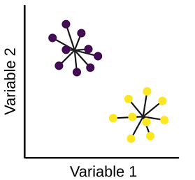
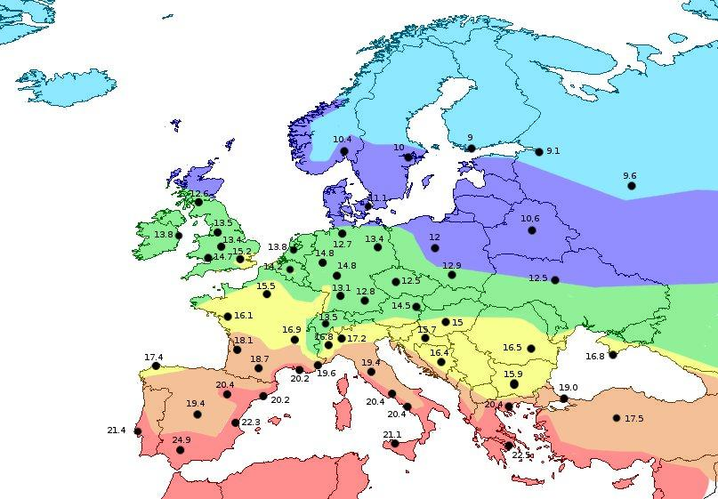
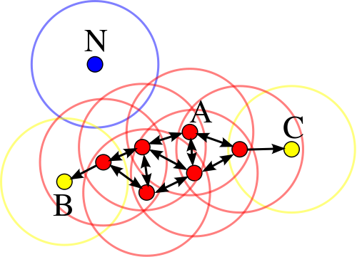
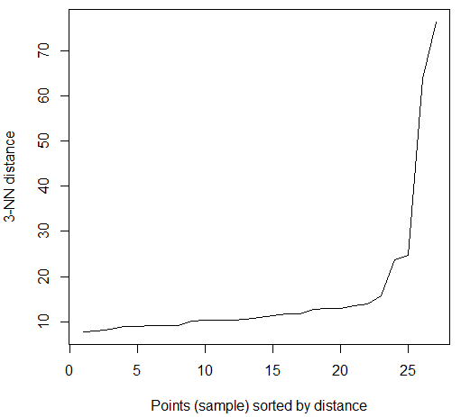

```{r, echo=FALSE}
list.of.packages <- c("dbscan")
new.packages <- list.of.packages[!(list.of.packages %in% installed.packages()[,"Package"])]
if(length(new.packages)) install.packages(new.packages, repos="http://cran.us.r-project.org")
```


## Особенности метода k-средних (k-means)

* Он быстрый. Но это не означает, что он небрежный.
* Он требует меньше памяти по сравнению с методами иерархической кластеризации.

**Ограничение 1.** *Число кластеров k нужно определять заранее.*

Это непросто. Позже мы обсудим процедуру определения числа кластеров.


## Алгоритм k-means

Выбирается k точек — центры начальных кластеров.

В цикле применяются следующие правила:

1. Каждый объект приписывается к тому кластеру, чей центр находится ближе.
2. После того, как объекты приписаны к кластерам, вычисляем новые центры кластеров. Центр кластера — это центр тяжести объектов кластера.

$$
\bar x_j = \frac{1}{N_j} \sum_i^{N_j} x_i, \quad \bar y_j = \frac{1}{N_j} \sum_i^{N_j} y_i .
$$


## Создадим 5 тестовых кластеров

```{r, echo=FALSE, warning=FALSE}

##  Шаг 1. Создаем набор данных, который предстоит кластеризовать

# Зададим зерно (начальное значение) для датчика случайных чисел
# чтобы у всех получались одинаковые картинки
set.seed(1234)

# Количество точек в каждом кластере
n.obj <- 900
# Стандартные отклонения (корень из дисперсии)
sd.1 <- 0.06

#  Генерируем кластеры

#  точки из 1-го кластера
x1 <- rnorm(n.obj, mean = 0.2, sd = sd.1)
y1 <- rnorm(n.obj, mean = 0.38, sd = sd.1)
#  точки из 2-го кластера
x2 <- rnorm(n.obj, mean = 0.49, sd = sd.1)
y2 <- rnorm(n.obj, mean = 0.25, sd = sd.1)
#  точки из 3-го кластера
x3 <- rnorm(n.obj, mean = 0.62, sd = sd.1)
y3 <- rnorm(n.obj, mean = 0.42, sd = sd.1)
#  точки из 4-го кластера
x4 <- rnorm(n.obj, mean = 0.42, sd = sd.1)
y4 <- rnorm(n.obj, mean = 0.78, sd = sd.1)
#  точки из 5-го кластера
x5 <- rnorm(n.obj, mean = 0.85, sd = sd.1)
y5 <- rnorm(n.obj, mean = 0.75, sd = sd.1)

# Объединим данные в матрицу
x.0 <- c(x1, x2, x3, x4, x5)
y.0 <- c(y1, y2, y3, y4, y5)
data.0 <- cbind(x.0, y.0)

## Шаг 2. Задаем начальные центры кластеров

# На практике центры кластеров - случайные точки. 
# Сейчас берем такие, чтобы процесс кластеризации 
# выглядел выразительно.

# Абсциссы точек
x.start <- c(0.50, 0.41, 0.43, 0.62, 0.38)
# Ординаты точек
y.start <- c(0.20, 0.22, 0.32, 0.36, 0.71)
# Объединим данные в матрицу и поместим ее в список
# для удобства работы с результатами кластеризации
clus.00 <- list()
clus.00$centers <- cbind(x.start, y.start)

## Шаг 3. Проводим кластеризацию по шагам

clus.01 <- kmeans(data.0, centers=clus.00$centers, iter.max=1, algorithm = "Lloyd")
clus.02 <- kmeans(data.0, centers=clus.01$centers, iter.max=1, algorithm = "Lloyd")
clus.03 <- kmeans(data.0, centers=clus.02$centers, iter.max=1, algorithm = "Lloyd")
clus.04 <- kmeans(data.0, centers=clus.03$centers, iter.max=1, algorithm = "Lloyd")
clus.05 <- kmeans(data.0, centers=clus.04$centers, iter.max=1, algorithm = "Lloyd")
clus.06 <- kmeans(data.0, centers=clus.05$centers, iter.max=1, algorithm = "Lloyd")
clus.07 <- kmeans(data.0, centers=clus.06$centers, iter.max=1, algorithm = "Lloyd")
clus.08 <- kmeans(data.0, centers=clus.07$centers, iter.max=1, algorithm = "Lloyd")
clus.09 <- kmeans(data.0, centers=clus.08$centers, iter.max=1, algorithm = "Lloyd")
clus.10 <- kmeans(data.0, centers=clus.09$centers, iter.max=1, algorithm = "Lloyd")
clus.11 <- kmeans(data.0, centers=clus.10$centers, iter.max=1, algorithm = "Lloyd")
clus.12 <- kmeans(data.0, centers=clus.11$centers, iter.max=1, algorithm = "Lloyd")
clus.13 <- kmeans(data.0, centers=clus.12$centers, iter.max=1, algorithm = "Lloyd")
clus.14 <- kmeans(data.0, centers=clus.13$centers, iter.max=1, algorithm = "Lloyd")
clus.15 <- kmeans(data.0, centers=clus.14$centers, iter.max=1, algorithm = "Lloyd")

# Задаем размер точек на графиках
cex.1 <- 0.2
# Задаем цвета кластеров
col.1 <- c("green", "blue", "cyan", "darkorchid", 
           "darkgoldenrod")
# Исходные данные
plot(data.0, col="grey10", pch=19, main="Iteration 0", cex=cex.1)
```


## Как работает k-means

```{r,echo=FALSE}
# Исходные данные
plot(data.0, col="grey10", pch=19, main="Iteration 1", cex=cex.1)
# Центры кластеров в начале итерации
points(clus.00$centers, col="red", pch=19, cex=9*cex.1)
```

##

```{r,echo=FALSE}
# --------------------- Итерация 1 --------------------------------
# Распределяем объекты по кластерам
plot(data.0, col=col.1[clus.01$cluster], pch=19, main="Iteration 1", 
     cex=cex.1)
# Исходные центры кластеров
points(clus.00$centers, col="red", pch=19, cex=9*cex.1)
# Новые центры кластеров
points(clus.01$centers, col="black", pch=19, cex=9*cex.1)
# Стрелки - перемещение центров кластеров
arrows(clus.00$centers[,1], clus.00$centers[,2], 
       x1=clus.01$centers[,1], y1=clus.01$centers[,2], 
       col="red", lwd=2, angle=15, length=0.1)
```

##

```{r,echo=FALSE}
# Итерация 2
plot(data.0, col="grey10", pch=19, main="Iteration 2", cex=cex.1)
points(clus.01$centers, col="red", pch=19, cex=9*cex.1)
```

##

```{r,echo=FALSE}
# Итерация 2
# Распределяем объекты по кластерам и отображаем перемещение центров
plot(data.0, col=col.1[clus.02$cluster], pch=19, main="Iteration 2", cex=cex.1)
points(clus.01$centers, col="red", pch=19, cex=9*cex.1)
points(clus.02$centers, col="black", pch=19, cex=9*cex.1)
arrows(clus.01$centers[,1], clus.01$centers[,2], 
       x1=clus.02$centers[,1], y1=clus.02$centers[,2], 
       col="red", lwd=2, angle=15, length=0.1)
```

##

```{r,echo=FALSE}
# Итерация 3
# Распределяем объекты по кластерам и отображаем перемещение центров
plot(data.0, col=col.1[clus.03$cluster], pch=19, main="Iteration 3", cex=cex.1)
points(clus.02$centers, col="red", pch=19, cex=9*cex.1)
points(clus.03$centers, col="black", pch=19, cex=9*cex.1)
arrows(clus.02$centers[,1], clus.02$centers[,2], 
       x1=clus.03$centers[,1], y1=clus.03$centers[,2], 
       col="red", lwd=2, angle=15, length=0.1)
```

##

```{r,echo=FALSE}
# Итерация 4
# Распределяем объекты по кластерам и отображаем перемещение центров
plot(data.0, col=col.1[clus.04$cluster], pch=19, main="Iteration 4", cex=cex.1)
points(clus.03$centers, col="red", pch=19, cex=9*cex.1)
points(clus.04$centers, col="black", pch=19, cex=9*cex.1)
arrows(clus.03$centers[,1], clus.03$centers[,2], 
       x1=clus.04$centers[,1], y1=clus.04$centers[,2], 
       col="red", lwd=2, angle=15, length=0.1)
```

##

```{r,echo=FALSE}
# Итерация 5
# Распределяем объекты по кластерам и отображаем перемещение центров
plot(data.0, col=col.1[clus.04$cluster], pch=19, main="Iteration 5", cex=cex.1)
points(clus.04$centers, col="red", pch=19, cex=9*cex.1)
points(clus.05$centers, col="black", pch=19, cex=9*cex.1)
arrows(clus.04$centers[,1], clus.04$centers[,2], 
       x1=clus.05$centers[,1], y1=clus.05$centers[,2], 
       col="red", lwd=2, angle=15, length=0.1)
```

##

```{r,echo=FALSE}
plot(data.0, col=col.1[clus.06$cluster], pch=19, main="Iteration 6", cex=cex.1)
```

##

```{r,echo=FALSE}
plot(data.0, col=col.1[clus.07$cluster], pch=19, main="Iteration 7", cex=cex.1)
```

##

```{r,echo=FALSE}
plot(data.0, col=col.1[clus.08$cluster], pch=19, main="Iteration 8", cex=cex.1)
```

##

```{r,echo=FALSE}
plot(data.0, col=col.1[clus.09$cluster], pch=19, main="Iteration 9", cex=cex.1)
```

##

```{r,echo=FALSE}
plot(data.0, col=col.1[clus.10$cluster], pch=19, main="Iteration 10", cex=cex.1)
```

##

```{r,echo=FALSE}
plot(data.0, col=col.1[clus.11$cluster], pch=19, main="Iteration 11", cex=cex.1)
```


## Расстояние между элементами

**Ограничение 2.** *Используется только евклидово расстояние.*

Недостаток исправляется в других вариантах метода k-средних. Например, в методе k-медоидов (k-medoids).

Алгоритм кластеризации k-medoids похож на алгоритм k-средних, но на каждой итерации центры кластеров рассчитываются не как среднее, а как медиана точек (медоиды). То есть, центр кластера обязательно должен являться одной точек кластера.

Алгоритм k-medoids реализован в пакете **flexclust**.

Напомним, что кластеризация будет работать хорошо, если расстояние между точками **действительно отражает сходство объектов**. 


## Выбор начального расположения центров кластеров

\footnotesize

**Ограничение 3.** *Результат зависит от начальных центров кластеров.*

Наиболее популярны два метода.

### 1. Forgy (фамилия)

Случайным образом выбираются k наблюдений. Они и будут начальными центрами кластеров.

Существенно, что выбирается именно k наблюдений, а не k произвольных случайных векторов - не будет пустых кластеров.

### 2. Случайное разбиение (Random Partition)

Каждое наблюдение случайным образом приписывается к одному из кластеров. Находятся центры тяжести кластеров. Они и будут начальными центрами.

В методе Random Partition начальные значения центров кластеров могут незначительно отличаться от центра тяжести всего набора данных, а затем будут постепенно "расползаться" к своим кластерам.

**k-means++** — улучшенная версия алгоритма кластеризации k-means. Суть улучшения заключается в нахождении более «хороших» начальных значений центроидов кластеров.


## Шаг 1. Создадим набор данных, который предстоит кластеризовать

\small
```{r, eval=FALSE}
# Зададим зерно для датчика случайных чисел
set.seed(1234)
# Количество точек в каждом кластере
n.obj <- 900
# Стандартные отклонения (корень из дисперсии)
sd.1 <- 0.06

# Генерируем кластеры
#   точки из 1-го кластера
x1 <- rnorm(n.obj, mean = 0.2,  sd = sd.1)
y1 <- rnorm(n.obj, mean = 0.38, sd = sd.1)
#   точки из 2-го кластера
x2 <- rnorm(n.obj, mean = 0.49, sd = sd.1)
y2 <- rnorm(n.obj, mean = 0.25, sd = sd.1)
...
# Объединим данные в матрицу
x.0 <- c(x1, x2, x3, x4, x5); y.0 <- c(y1, y2, y3, y4, y5)
data.0 <- cbind(x.0, y.0)
```


## Шаг 2. Задаем начальные центры кластеров

```{r, eval=FALSE}
# На практике центры кластеров - случайные точки. 
# Сейчас берем такие, чтобы процесс кластеризации 
# выглядел выразительно.

# Абсциссы точек
x.start <- c(0.50, 0.41, 0.43, 0.62, 0.38)
# Ординаты точек
y.start <- c(0.20, 0.22, 0.32, 0.36, 0.71)
# Объединим данные в матрицу и поместим ее в список
# для удобства работы с результатами кластеризации
clus.00 <- list()
clus.00$centers <- cbind(x.start, y.start)
```


## Шаг 3. Проводим кластеризацию по шагам

```{r, eval=FALSE}
# Выполняем по одной итерации (iter.max=1),
# чтобы посмотреть, как работает процедура

clus.01 <- kmeans(data.0, centers=clus.00$centers, 
                  iter.max=1, algorithm = "Lloyd")
clus.02 <- kmeans(data.0, centers=clus.01$centers, 
                  iter.max=1, algorithm = "Lloyd")
...
clus.15 <- kmeans(data.0, centers=clus.14$centers, 
                  iter.max=1, algorithm = "Lloyd")
```
Будет появляться предупреждение:
```
## Warning: did not converge in 1 iteration
```


##  Шаг 4. Строим графики процесса кластеризации

\scriptsize
```{r, eval=F}
# Задаем размер точек на графиках
cex.1 <- 0.2
# Задаем цвета кластеров
col.1 <- c("green", "blue", "cyan", "darkorchid", 
           "darkgoldenrod")
# --------------------- Итерация 1 --------------------------------
# Исходные данные
plot(data.0, col="blue", pch=19, main="Iteration 0", cex=cex.1)
# Центры кластеров в начале итерации
points(clus.00$centers, col="red", pch=19, cex=9*cex.1)
# Распределяем объекты по кластерам
plot(data.0, col=col.1[clus.01$cluster], pch=19, main="Iteration 1", 
     cex=cex.1)
# Исходные центры кластеров
points(clus.00$centers, col="red", pch=19, cex=9*cex.1)
# Новые центры кластеров
points(clus.01$centers, col="black", pch=19, cex=9*cex.1)
# Стрелки - перемещение центров кластеров
arrows(clus.00$centers[,1], clus.00$centers[,2], 
       x1=clus.01$centers[,1], y1=clus.01$centers[,2], 
       col="red", lwd=2, angle=15, length=0.1)
```


## Шаг 5. Сохранение графиков в файл

```{r,eval=FALSE}
png(file = "iter0.png", bg = "transparent")
plot(data.0, col="blue", pch=19, main="Iteration 0")
dev.off()
```


## Определение числа кластеров

Мы не знаем точное число кластеров, но представляем себе в каком диапазоне оно находится.

Можно прогнать процедуру кластеризации много раз, задавая разное число кластеров, и выбрать наилучшую кластеризацию.

Вопрос: какая кластеризация наилучшая?


## Математическая модель k-means

Действие алгоритма k-средних таково, что он стремится минимизировать суммарное квадратичное отклонение точек кластеров от центров этих кластеров:

$$
W = \argmin_S \sum_{j=1}^k {\sum_{x_j \in S_i} (x_j - \mu_i)^2},
$$

* $k$ — число кластеров; $S_i$ — $i$-й кластер; $i=1,2,\ldots , k$; 
* $\mu_i$ — центр тяжести $i$-го кластера.

W — от Within-cluster sum of squares (WCSS). Это параметр `tot.withinss` в функции `kmeans`.


## Внутрикластерная сумма квадратов




## 

Модель позволяет ответить на вопрос, когда остановить алгоритм кластеризации:

2. малость падения `tot.withinss`.
1. число итераций

argmin — аргумент минимизации, т.е. аргумент, при котором данное выражение достигает минимума. В нашем случае значением функции является разбиение на кластеры.


## График "каменистая осыпь"

```{r, echo=FALSE}
cost_df <- data.frame()
set.seed(123)
for(k in 1:15){
  kmeans<- kmeans(x=data.0, centers=k, iter.max=100, algorithm = "Lloyd")
  cost_df<- rbind(cost_df, cbind(k, kmeans$tot.withinss))
}
names(cost_df) <- c("N.clusters", "W")
plot(cost_df, type="b")
```


## Строим "каменистую осыпь"

```{r, eval=FALSE}
# Таблица для хранения результатов
cost_df <- data.frame()
# Запускаем kmeans для k от 1 до 15
for(k in 1:15){
  kmeans<- kmeans(x=data.0, centers=k, iter.max=100, 
                  algorithm = "Lloyd")
  # Соберем в таблицу число кластеров c 
  # оценкой внутрикластерного расстояния
  cost_df<- rbind(cost_df, cbind(k, kmeans$tot.withinss))
}
# Даем имена столбцам таблицы
names(cost_df) <- c("N.clusters", "W")
# Строим график
plot(cost_df, type="b")
```


## Вопросы

\Large

* Почему кластеров 4, а не 5?
* Как будет выглядеть график, если кластеров нет?


## Если кластеризовать нужно много...

Понадобится способ автоматического определения излома (числа кластеров)

```{r, eval=F}
# Установим новый пакет. Кавычки обязательны!
install.packages("NbClust")

library(NbClust)

Best <- NbClust(data.0, distance = "euclidean", 
                min.nc = 2, max.nc = 15, 
                method = "ward.D", index = "alllong")
```

Приготовьтесь подождать несколько минут...


## Замечание по NbClust

Если выскакивает сообщение об ошибке, то, возможно, сбоит один из методов подбора числа кластеров. 

Возьмем из help'а список методов, вставим его "голову" в функцию и попробуем, постепенно добавляя в него новые методы, вычленить сбойный метод. 

Получаем пользу от оставшихся методов.


## Недостатки метода k-средних

* Число кластеров k нужно знать заранее. *Но есть способ его определить.*
* Только евклидово расстояние. *Переходим к k-medoids.*
* Результат зависит от начальных центров кластеров. *Лечится числом попыток выбора начальных центров.*
* Слишком много вычислений расстояний. На поздних итерациях мало точек переходят из кластера в кластер, вычисления для "определившихся" точек можно исключить. Только как?


## Сегментация потребителей безалкогольных напитков 

\small
```{r}
#  Читаем данные примера
beverage.01 <- read.table("data/beverage.csv", 
                          header=T, sep=";")
# Вспомним имена переменных
names(beverage.01)
# Убираем ненужный 1-й столбец
beverage.01[,1] <- NULL
# Удачно угадаем, что кластеров три
summ.3 = kmeans(beverage.01, 3, nstart = 10, iter.max = 100)
# Вспомним поля списка
names(summ.3)
```


##

\small
```{r}
# К каким кластерам принадлежат объекты?
summ.3$cluster
```

Важная опция `nstart` — число стартовых попыток задать центры кластеров. По результатам процедура выберет наилучшее с точки зрение `tot.withinss` решение.
```{r}
summ.31 = kmeans(beverage.01, 3, iter.max = 100, 
                 nstart = 10)
```
```{r}
summ.31$cluster
```

У вас результат может отличаться: разное число стартовых попыток, другие номера кластеров.


## Координаты центров кластеров — основной источник вдохновения для интерпретации

```{r}
options(digits=2) # иначе результат неудобно читать. 
# Транспонируем вектор координат центров кластеров
t(summ.3$centers)
```

Напомним, что в иерархической кластеризации для подсчета среднего по кластеру пришлось проделать некоторые вычисления.


## Другие результаты кластеризации

\scriptsize
```{r, echo=FALSE}
# Вернем отображение чисел как было
options(digits=7)
```
```{r}
# Сумма квадратов расстояний от объектов кластера до центра кластера
summ.3$withinss
# Сумма квадратов расстояний для всех кластеров sum(summ.3$withinss)
summ.3$tot.withinss
# Полная сумма квадратов: sum(33*(apply(beverage.01, 2, sd))^2)
summ.3$totss
# Межкластерная сумма квадратов: betweenss = totss - tot.withinss
summ.3$betweenss
# Размеры кластеров
summ.3$size
```


## Попробуем определить "правильное" число кластеров

```{r,eval=FALSE}
# Максимальное число кластеров
n.clust <- 15
# Вектор для хранения результатов
wcss <- vector(mode="numeric", length=n.clust)
# Запускаем kmeans для k от 1 до 15
for(i in 1:n.clust){
  wcss[i] <- kmeans(beverage.01, centers=i)$tot.withinss
}
plot(1:n.clust, wcss, type="b", xlab="Number of Clusters",
     ylab="Within clusters sum of squares")
```


## Scree plot

```{r,echo=FALSE}
set.seed(323)
```
```{r,echo=FALSE}
# Максимальное число кластеров
n.clust <- 15
# Вектор для хранения результатов
wcss <- vector(mode="numeric", length=n.clust)
# Запускаем kmeans для k от 1 до 15
for(i in 1:n.clust){
  wcss[i] <- kmeans(beverage.01, centers=i)$tot.withinss
}
plot(1:n.clust, wcss, type="b", xlab="Number of Clusters",
     ylab="Within clusters sum of squares")
```

\small

Вопрос: почему WCSS иногда увеличивается с ростом числа кластеров? Вроде бы это должна быть невозрастающая функция.


## Таблица сопряженности (contingency table)

\small
Реализуется функцией `table`.

```{r}
#  Попробуем решение с 4 кластерами и сравним результаты
summ.4 = kmeans(beverage.01, 4, iter.max = 100)
summ.3$size
summ.4$size
#  Для сравнения использовать команду
table(summ.3$cluster, summ.4$cluster)
```


## Сравним две кластеризации: `hclust` и `kmeans`

```{r}
dist.beverage <- dist(beverage.01)
clust.beverage <- hclust(dist.beverage, "ward.D")
groups <- cutree(clust.beverage, k=3)
table(summ.3$cluster, groups)
```


## Многомерное шкалирование в деле (`cmdscale`)

\small
```{r}
# Используем матрицу попарных расстояний
beverage.mds <- cmdscale(dist.beverage)
# и результаты k-means кластеризации
plot(beverage.mds, col=summ.3$cluster, xlab="Index", ylab="Y")
```

## Многомерное шкалирование (Multidimentional scaling)

Визуализацию многомерного пространства выполнить трудно. Есть много способов, но они значительно уступают в выразительности двух- и трехмерным графикам. 

**Идея:** давайте спроецируем данные на плоскость (или двумерное подпространство).

**Проблема:** как выбрать плоскость проекции?

Мы знаем расстояния между точками в пространстве и пытаемся расположить точки на плоскости так, чтобы расстояния ними были такими же как в исходном многомерном пространстве. Точнее, мы будем располагать точки на плоскости так, чтобы отклонения расстояний между ними от "правильных" расстояний в многомерном пространстве было минимальными.


##

Многомерное шкалирование (МШ) позволяет "спроецировать" многомерное пространство на двумерное.

Минимизация: придумываем критерий деформации расстояний и будем его минимизировать.

Почему МШ интересно в кластерном анализе? МШ основано на сохранении расстояний, а расстояния между точками - это как раз то, на чем основывается кластерный анализ.

**Что это дает.** Удовлетворительный результат кластерного анализа, отображенный через многомерное шкалирование, успокаивает, а неудовлетворительный дает повод призадуматься о качестве кластеризации в вашем исследовании.


## Потребление белков в Европе

\scriptsize
```{r}
## Шаг 1. Чтение данных
setwd("data")
data.01 <- read.table("Protein Consumption in Europe.csv", header=T, 
                       sep=";", dec = ",", row.names = 1)
# Проверим структуру таблицы: не получились ли строки вместо цифр?
str(data.01)
```
```{r, eval=F}
## Шаг 2. Удаление пропущенных значений
summary(data.01)
# В данной задаче пропущенных значений нет.
```
```{r}
## Шаг 3. Стандартизация переменных.
# к среднему 0 и ст. отклонению 1
data.02 <- scale(data.01, center = TRUE, scale = TRUE)
```


## Выбираем число кластеров k

```{r, echo=F}
## Шаг 4. Выбираем число кластеров k

# Максимальное число кластеров
n.clust <- 15
# Вектор для хранения результатов
wcss <- vector(length=n.clust)
for(i in 2:n.clust){
  wcss[i] <- kmeans(data.02, centers=i)$tot.withinss
}
plot(1:n.clust, wcss, type="b", xlab="Number of Clusters",
     ylab="Within clusters sum of squares")
```

Предположительно, число кластеров $k=5$.


## Процедура кластерного анализа

```{r}
# Проводим кластерный анализ с выбранным k
clust = kmeans(data.02, 5, iter.max = 100, nstart = 10)
```


## Интерпретируем результаты

\small

```{r, echo=F}
options(digits=2)
```
```{r}
t(clust$centers)
```

Само по себе это мало что дает. Нужна дополнительная информация: какие страны попали в какие кластеры? Будем делать так:

```{r, eval=F}
# Какие страны попали в 1-й кластер?
row.names(data.01[clust$cluster==1,])
# Их диета
colMeans(data.01[clust$cluster==1,])
```


## Страны и диеты

\scriptsize

```{r, echo=F}
row.names(data.01[clust$cluster==1,])
colMeans(data.01[clust$cluster==1,])
row.names(data.01[clust$cluster==2,])
colMeans(data.01[clust$cluster==2,])
row.names(data.01[clust$cluster==3,])
colMeans(data.01[clust$cluster==3,])
```


## Страны и диеты 2

\scriptsize

```{r, echo=F}
row.names(data.01[clust$cluster==4,])
colMeans(data.01[clust$cluster==4,])
row.names(data.01[clust$cluster==5,])
colMeans(data.01[clust$cluster==5,])
```


## Потребление белков в Европе




## Многомерное шкалирование

\scriptsize
```{r}
data.dist <- dist(data.02)
mds <- cmdscale(data.dist)
plot(mds, col = clust$cluster, xlab = "Index", ylab = "Y")
# Рисуем метки-названия стран
text(mds, labels = rownames(data.02), pos = 1, cex = .7)
```

Попробуйте использовать нестандартизированные данные
и увидите, что получится.


## Метод DBSCAN. Полезные точки и шум

**Недостаток иерархической кластеризации и K-средних:** они используют все точки данных для создания кластеров. На практике, некоторые точки являются более ценными и их желательно использовать при кластеризации, тогда как другие представляют собой "шум" и ошибки наблюдений.

**Алгоритмы кластеризации на основе плотности** принимают, что к кластерам относятся только точки, сгруппированные в плотные сгустки, а остальные точки — шум.

Наиболее известным алгоритмом кластеризации на основе плотности является  DBSCAN.


## DBSCAN (Density-Based Spatial Clustering of Applications with Noise)

Требуется настроить два параметра: радиус `eps` и плотность (число соседей) `minPts`.

Ключевые понятия:

* **Внутренняя точка** (core point) – имеет более `minPts` соседей (`r<eps`);
* **Граничная точка** (border point) – имеет меньше соседей, но является соседней к какой-либо внутренней точке;
* Остальные точки — шумовые (outliers);
* **Достижимость по плотности**: точка `q` достижима из внутренней точки `p`, если существует последовательность `eps`-соседних внутренних точек от `p` к `q`.


## Достижимость по плотности

\footnotesize

minPts = 4. Точка A и другие красные точки – внутренние, потому что имеют в окружности радиуса $\epsilon$ по крайней мере 4 соседа (включая саму точку).   Точки B и C – граничные. Они достижимы из внутренних точек. Все эти точки принадлежат одному кластеру. Точка N – шумовая, поскольку не является ни внутренней, ни достижимой.


{width=250px}

\tiny

Источник: https://en.wikipedia.org/wiki/DBSCAN#/media/File:DBSCAN-Illustration.svg


## Алгоритм DBSCAN

1. Выбрать точку p.
2. Если p — внутренняя, то 
    * Найти все достижимые по плотности точки из p
    * Сформировать кластер
3. Иначе – перейти к следующей точке.

Важно:

* Результат не зависит от порядка просмотра точек.
* Число кластеров задавать не нужно.


## Тестовые данные (две крайние слева точки -- шумовые)

```{r, echo=F}
data <- read.csv('data/test_clust.csv')
plot(data)
```


## K-means c 3-мя кластерами

```{r, echo=F}
cl <- kmeans(data, 3, nstart = 50)
plot(data, col = cl$cluster)
```


## DBSCAN: Выбор eps и minPts

### minPts

Рекомендация из библиотеки dbscan: `minPts >= (размерность_данных + 1)`.

### eps

* Ключевая идея: для всех точек одного кластера их k-тый сосед (k < размера кластера) находится на приблизительно одном и том же расстоянии.
* Соседи шумовых точек – далеко

### Выбор параметров

1. Зададимся числом соседей k (кандидат в `minPts`).
2. Строим график числа точек, отсортированных по расстоянию до k-го ближайшего соседа.
3. Искомое `eps` — начало крутого подъема на графике расстояний до k-го ближайшего соседа.


## График отсортированных расстояний (dbscan::kNNdistplot)




## Для подъема при eps = 15

```{r,echo=F}
cl.1 <- dbscan::dbscan(data, eps = 15, minPts = 3)
plot(data, col = cl.1$cluster+1)
```


## DBSCAN для набора данных Iris

```{r, eval=F}
library(dbscan)

data(iris)
iris <- as.matrix(iris[,1:4])

kNNdistplot(iris, k=4)
# "локоть" на расстоянии 0.5

cl <- dbscan(iris, eps = .5, minPts = 4)
pairs(iris, col = cl$cluster+1L)
```


##

```{r, echo=F}
suppressWarnings(library(dbscan))

data(iris)
iris <- as.matrix(iris[,1:4])

kNNdistplot(iris, k=4)
```


## Черные точки — шумовые

```{r, echo=F}
cl <- dbscan(iris, eps = .5, minPts = 4)
pairs(iris, col = cl$cluster+1L)
```


## Ссылки

1. [Машинное обучение. Кластеризация](http://edu.mmcs.sfedu.ru/pluginfile.php/18287/mod_resource/content/1/12%20Кластеризация.pdf)
2. [Clustering basic benchmark](http://cs.joensuu.fi/sipu/datasets/) — наборы данных для тестирования методов кластеризации.
3. [Rhys H. Machine Learning with R, tidyverse, and mlr](https://livebook.manning.com/book/machine-learning-for-mortals-mere-and-otherwise/meap-version-7/v-7/) — источник иллюстрации суммы внутрикластерных квадратов.
4. [K-Medoids in R: Algorithm and Practical Examples](https://www.datanovia.com/en/lessons/k-medoids-in-r-algorithm-and-practical-examples/)
5. [CLARA in R: Clustering Large Applications](https://www.datanovia.com/en/lessons/clara-in-r-clustering-large-applications/)
6. Пакет [clustree](https://cran.r-project.org/web/packages/clustree/index.html) позволяет видеть устойчивые кластеры, остающиеся неизменными несмотря на увеличение числа кластеров.
7. [Mean Shift](Clustering https://spin.atomicobject.com/2015/05/26/mean-shift-clustering/) — хорошее описание идеи алгоритма Mean Shift, очень полезного в задачах сегментации изображений.

