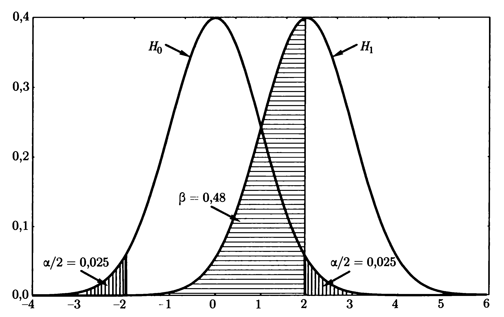

## Содержание

* Логика проверки статистических гипотез
* p-значение
* Статистические критерии
* Ошибки 1-го и 2-го рода


## Случай в Неаполе

"Однажды в Неаполе некто Галиани встретил человека из Базиликаты, который, встряхивая три игральные кости в чашке, держал пари, что выбросит три шестерки; и действительно он немедленно получил три шестерки. Галиани промолчал, но подумал, что такая удача возможна. Однако человеку из Базиликаты это удалось еще раз, и пари повторилось. Он положил кости назад в чашку и выкидывал их три, четыре, пять раз, и каждый раз выбрасывал три шестерки. «Кровь Вакха (итальянское ругательство), — вскричал Галиани, — кости налиты свинцом». Но почему Галиани так решил?"

\scriptsize

*Пойа Д.* Математика и правдоподобные рассуждения. — М.: Наука, 1975.


## Слишком маловероятно, чтобы быть правдой

\bcols
\column{.5\textwidth}

Галиани предположил, что кости симметричные. Если это так, то вероятность выпадения трех шестерок 5 раз подряд равна $(1/6^3)^5 \approx 2 \cdot 10^{-12}$ — настолько маловероятно, что практически невозможно. Следовательно, предположение о симметричности костей, скорее всего, неверно.

\column{.5\textwidth}


\ecols


## Статистическая  гипотеза

\Large

**Статистическая гипотеза** — предположение  относительно  генеральной совокупности, проверяемое по данным наблюдений (выборке).

\normalsize

**Генеральная совокупность** (population) — множество всех объектов, относительно которых мы хотим сделать выводы в рамках нашего исследования.

**Выборка** (sample) — множество элементов, случайным образом выбранных из генеральной совокупности.


## Примеры гипотез

* **Чему равен тот или иной параметр распределения?** После проведения рекламной кампании продажи товара возросли. Произошло это вследствие удачной кампании или мы имеем дело со случайными колебаниями на рынке? Необходимо оценить математическое ожидание (средние продажи).
* **Каково распределение случайной величины?** 
    1. Если распределение можно считать нормальным, то мы экономим деньги: чтобы добиться требуемой точности анализа можно опросить меньше покупателей.
    2. Если распределение экспоненциальное, то можно рассчитать время до поломки изделия и спланировать расходы на гарантийный ремонт.
* **Зависимы или нет две случайные величины?** Если возраст покупателей и объем покупки зависимы, то возраст надо учитывать при сегментации покупателей. Иногда такая зависимость бывает неочевидной: длина волос и рост людей — зависимые переменные.


## Свойства нормального распределения


\tiny

https://towardsdatascience.com/understanding-the-68-95-99-7-rule-for-a-normal-distribution-b7b7cbf760c2


## 


\tiny

https://statanaliz.info/statistica/proverka-gipotez/chto-takoe-proverka-statisticheskoj-gipotezy/


## Алгоритм проверки статистических гипотез

1. Сформулируем основную и альтернативную гипотезы.
2. Зададим уровень значимости.
3. (Сформулируем допущения и...) Выберем критерий для проверки гипотезы.
4. Тестируем данные: вычислим статистику критерия.
5. Выводы и интерпретация результатов.


##

Проверка любой статистической гипотезы выполняется по приведенному выше алгоритму. В разных источниках число шагов алгоритма и их порядок могут незначительно различаться.

Рассмотрим применение данного алгоритма для проверки гипотезы о выборочном среднем.

Каково распределение выборочных средних? Ответ на этот вопрос дает центральная предельная теорема.


## Центральная предельная теорема

Для случайных выборок объемом $n$, выделенных из генеральной совокупности со средним значением $\mu_0$ и дисперсией $\sigma$, при больших $n$ распределение выборочного среднего $\bar x$ приближается к нормальному со средним значением $\mu_{\bar x}$, равным

$$\mu_{\bar x} = \mu_0$$

и с дисперсией 

$$\sigma_{\bar x} = \sigma/\sqrt{n}$$

Точность приближения возрастает с возрастанием $n$.


## "Проверяем" ЦПТ: нормальное распределение генеральной совокупности

```{r,echo=FALSE}
mean <- 15.4; sd <- 2.5;

op <- par(mfrow=c(2,2))

pop <- rnorm(1000, mean, sd)
hist(pop, xlab=paste0("sd=", sd))

sample.100 <- rnorm(100, mean, sd)
hist(sample.100)

sample.means.100 <- rep(NA, 1000)
for (i in 1:1000) {
  sample.100 <- rnorm(100, mean, sd)
  sample.means.100[i] <- mean(sample.100)
}
sigma.100 <- round(sqrt(var(sample.means.100)), 3)
hist(sample.means.100, xlab=paste0("sd=", sigma.100))


sample.means.400 <- rep(NA, 1000)
for (i in 1:1000) {
  sample.400 <- rnorm(400, mean, sd)
  sample.means.400[i] <- mean(sample.400)
}
sigma.400 <- round(sqrt(var(sample.means.400)), 3)
hist(sample.means.400, xlab=paste0("sd=", sigma.400))

par(op)
```


## Равномерное распределение

```{r,echo=FALSE}
mean <- 15.4; sd <- 2.5;

d <- sd*sqrt(12)/2;

op <- par(mfrow=c(2,2))

pop <- runif(1000, min=mean-d, max=mean+d)
hist(pop, xlab=paste0("sd=", sd))

sample.100 <- runif(100, min=mean-sd, max=mean+sd)
hist(sample.100)

sample.means.100 <- rep(NA, 1000)
for (i in 1:1000) {
  sample.100 <- runif(100, min=mean-d, max=mean+d)
  sample.means.100[i] <- mean(sample.100)
}
sigma.100 <- round(sqrt(var(sample.means.100)), 3)
hist(sample.means.100, xlab=paste0("sd=", sigma.100))


sample.means.400 <- rep(NA, 1000)
for (i in 1:1000) {
  sample.400 <- runif(400, min=mean-d, max=mean+d)
  sample.means.400[i] <- mean(sample.400)
}
sigma.400 <- round(sqrt(var(sample.means.400)), 3)
hist(sample.means.400, xlab=paste0("sd=", sigma.400))

par(op)
```


## Экспоненциальное распределение

```{r,echo=FALSE}
mean <- 15.4

op <- par(mfrow=c(2,2))

pop <- rexp(1000, 1/mean)
hist(pop)

sample.100 <- rexp(100, 1/mean)
hist(sample.100)

sample.means.100 <- rep(NA, 1000)
for (i in 1:1000) {
  sample.100 <- rexp(100, 1/mean)
  sample.means.100[i] <- mean(sample.100)
}
sigma.100 <- round(sqrt(var(sample.means.100)), 3)
hist(sample.means.100, xlab=paste0("sd=", sigma.100))


sample.means.1000 <- rep(NA, 1000)
for (i in 1:1000) {
  sample.1000 <- rexp(1000, 1/mean)
  sample.means.1000[i] <- mean(sample.1000)
}
sigma.1000 <- round(sqrt(var(sample.means.1000)), 3)
hist(sample.means.1000, xlab=paste0("sd=", sigma.1000))

par(op)
```


## Пример: взвешиваем пингвинов

{width=120px}

Средний вес королевских пингвинов, полученный по результатам многолетних наблюдений в Антарктике, составляет 15.4 кг. Однако в прошлом году зоологи измерили 35 пингвинов, средний вес которых оказался 14.6 кг. Стандартное отклонение для популяции в целом равно 2.5 кг. Изменился ли за последний год средний вес популяции пингвинов?


## Формулируем основную и альтернативную гипотезы

**Основная (нулевая) гипотеза** утверждает, что ничего не случилось, никакого нового эффекта нет ("Все в порядке, расходитесь.")

В нашем случае это означает: математическое ожидание веса пингвинов как и прежде составляет $\mu_0 = 15.4$ кг.

$$H_0: \mu = \mu_0,$$

**Альтернативная гипотеза** утверждает, что эффект есть — что-то все-таки случилось. 

Математическое ожидание веса пингвинов уже не равно $\mu_0$:

$$H_1: \mu \neq \mu_0.$$


##

Гипотезы формулируются всегда именно в таком порядке. 

Основная гипотеза представляет собой конкретное утверждение. Альтернативная гипотеза, являющая просто отрицанием нулевой, представляет собой совокупность бесконечного числа утверждений.

Без основной гипотезы нам не на что было бы опереться (параметры генеральной совокупности). 


## Статистический критерий

Что убеждает нас в наличии эффекта?

Предположение: значительное расхождение средних значений.

Для оценки нам понадобятся: 

1. мера расстояния между средними;
2. распределение средних.

Мера расстояния (статистика критерия) и ее распределение вместе составляют **статистический критерий** для проверки гипотезы. 

В R реализовано множество статистических критериев в виде функций языка.


## Статистика критерия

**Статистика критерия** (test statistic) – мера отклонения между нулевой гипотезой $H_0$ и нашей выборкой.

Разность $\bar x - \mu_0$, характеризует отклонение выборки со средним $\bar x$ от нулевой гипотезы $\mu_0$. Деление этой разности на $\sigma / \sqrt{n}$ приводит к величине

$$z = \frac{\bar x - \mu_0}{\sigma / \sqrt{n}},$$
распределенной по нормальному закону, которая и будет статистикой критерия.

* $z$ – статистика критерия;
* $\bar x$ – наблюдаемое среднее арифметическое;
* $\mu$ – гипотетическое среднее генеральной совокупности;
* $\sigma$ – стандартное отклонение выборочных данных;
* $n$ – объем выборки.


## Уровень значимости

**Уровень значимости** ($\alpha$) — вероятность ошибки, с величиной которой вы готовы смириться.

Обычно считается возможным пренебрегать событиями, имеющими вероятность меньше 0.05. В других случаях принимаются вероятности 0.01, 0.005 или даже 0.001. Например, когда речь идет о разрушении сооружений, гибели судна и т. п. Эти величины — предмет договора.

В нашей задаче $\alpha = 0.05$

Принцип практической уверенности: вероятность ошибки мала настолько, что в единичном испытании ею можно пренебречь. Даже если бы мы повторили наши исследования 100 раз подряд (все наше исследование — это одно испытание), то ошиблись бы только в 5 случаях. 


## Область принятия и критическая область 


## Вычислим значение статистики критерия

\small
```{r}
xbar = 14.6            # выборочное среднее
mu0 = 15.4             # среднее генеральной совокупности
sigma = 2.5            # стандартное отклонение
n = 35                 # размер выборки

alpha = .05            # уровень значимости

z.half = qnorm(1-alpha/2) 
# Область принятия
c(-z.half, z.half)
# Значение статистики критерия
(z = (xbar-mu0)/(sigma/sqrt(n)))
```


## Попадает ли значение в критическую область?

```{r,echo=FALSE}
mean = 0; sd = 1
x <- seq(-4,4,length=100)*sd + mean
y <- dnorm(x,mean,sd)
plot(x, y, type="l", xlab="x", ylab="", main="mean=0, sd=1", yaxt="n")
lines(c(-1.96,-1.96), c(0,1), col="red")
lines(c(1.96,1.96), c(0,1), col="red")
lines(c(-1.89,-1.89), c(0,1), col="green")
text(0,0.1,"Oblast Prinyatiya", col="green")
text(-3,0.1,"Krit oblast", col="red")
text(3,0.1,"Krit oblast", col="red")
text(-1.89,0,"z_0")
```


## Выводы — 1

Значение $z = -1.89$ не попадает в критическую область $(-\infty,-1.96), (1.96, \infty)$. Следовательно у нас нет оснований для отклонения нулевой гипотезы при уровне значимости 0.05.

Неудобства: 

* значение зависит от выбранной статистики и от ее распределения, а хотелось бы универсального показателя;
* хотелось бы оценить, насколько маловероятны полученные результаты (они могут быть практически невозможны, а могут лежать возле уровня значимости).


## p-значение

**p-значение** (p-value) для выборки означает вероятность получить такую выборку или выборку еще более отклоняющуюся от $H_0$ при условии, что гипотеза $H_0$ справедлива. Иными словами, p-значение — это **наблюдаемый уровень значимости**.

$$p = P(|z| \geq z_{o} | H_0)$$

* $z_o$ – наблюдаемое значение статистики критерия.

p-значение позволяет делать оценки значимости, не зависящие от распределения (применяемого в конкретном критерии).

p-значение можно огрубленно трактовать как **вероятность принятия нулевой гипотезы**.


## 


\tiny

https://statanaliz.info/statistica/proverka-gipotez/chto-takoe-proverka-statisticheskoj-gipotezy/


## Принятие решения по p-значению

У нас есть две возможности. Нужно выбрать одну из них:

1. $p < \alpha$. **Отклонить гипотезу $H_0$.**
2. $p > \alpha$. **Не отклонять гипотезу $H_0$.**

Если p-значение меньше $\alpha$, то выборка значительно отличается от обычной. Следовательно, полученный результат **статистически значимый**.

Результат с уровнем значимости < 0.05 мы расцениваем как весьма маловероятный при условии принятия $H_0$. Если вероятность появления нашей выборки составляет менее 5%, то данные выборка и нулевая гипотеза противоречат друг другу. Мы не можем отклонить результат наблюдений (выборку), следовательно должны отклонить нулевую гипотезу.


## Выводы — 2

```{r}
p_value = 2 * pnorm(z) # p-значение
p_value                # для нижнего "хвоста"
p_value < alpha
```

**Вывод:** У нас нет оснований утверждать, что средний вес по популяции королевских пингвинов изменился за последний год (p = 0.058).


## Проделанные шаги по проверке гипотезы

1. Формулировка гипотез ($H_0$ и $H_1$)
2. Выбор критерия
3. Выбор уровня значимости
4. Проверка критерия
5. Выводы

Как видно, мы переставили местами шаги 2 и 3 алгоритма проверки статистических гипотез.


## Как совершаются открытия...

Когда вы услышите, что "Британские ученые доказали, что ..." — это означает, что кто-то собрал данные, выбрал статистический критерий, проверил гипотезу и p-значение оказалась ниже заданного уровня значимости.


## Неточности в формулировке вывода

В случаях, когда гипотеза $H_0$ отклонена, неверно автоматически утверждать, что принята альтернативная гипотеза $H_1$. 

Корректно утверждать только отклонение нулевой гипотезы $H_0$, тогда как для принятия $H_1$ не хватает проверки достаточных условий.

**Пример:** Нас интересует, делится ли число на 6? Мы доказали, что оно делится на 2. Если число не делится на 2, то оно точно делится на 6. Но больше мы ничего утверждать не можем, нужно продолжать работать.

Неверно утверждать по результатам проверки, что $H_0$ принята. Все наши выводы изначально делаются при этом предположении. Можно говорить о том, что результаты исследований не позволяют отклонить нулевую гипотезу.


## Что такое p-значение и как им пользоваться

\scriptsize

1. p-значение может показать, насколько данные не соответствуют выбранной модели.
2. p-значение не измеряет, насколько гипотеза верна. Это вообще утверждение не о самой гипотезе, а о том, насколько данные ей соответствуют.
3. Выводы только на основе p-значения делать нельзя. Это не бинарный выбор "да-нет". Мы имеем дело с вероятностями, поэтому для принятия решения нужна дополнительная информация.
4. При проведении исследований нужно предоставлять несколько альтернативных гипотез и сообщать обо всех полученных p-значениях, а не только о тех, которые оказались выше какого-то порогового значения. В противном случае происходит искажение информации из-за неполноты данных.
5. p-значение не измеряет размер эффекта либо важность результата. Меньшие p-значения не говорят о том, что что-то имеет больший эффект или большую важность. Сравнивать одно p-значение с другим нельзя, так же как нельзя сравнивать расчетные значения статистик разных моделей.
6. Само по себе p-значение не является хорошей мерой доказательства гипотезы. Без контекста и дополнительных данных, она дает очень ограниченную информацию. Анализ не должен ограничиваться оценкой p-значения.

\tiny

*Источник:* [The ASA Statement on p-Values: Context, Process, and Purpose](https://doi.org/10.1080/00031305.2016.1154108)


## Односторонние статистические критерии

Выше был показан двухсторонний критерий, когда проверка на отклонение производится в обе стороны.

Иногда имеет смысл рассматривать отклонение только в одну сторону. Например, если известно, что отклонение от гипотезы возможно только в сторону уменьшения, то правый "хвост" не рассматривают. Такой критерий называется односторонним.

Для выбора нужного "хвоста" в распределении используется гипотеза $H_1$:

$$H_1: \mu < \mu_0.$$

В нашем примере гипотеза $H_1$ означала бы, что пингвины стали весить меньше.


## Области принятия для одностороннего и двустороннего критериев

```{r, echo=FALSE}
mean = 0; sd = 1

x <- seq(-4,4,length=100)*sd + mean
y <- dnorm(x,mean,sd)

alpha = .05 
z.alpha = qnorm(alpha) # односторонний критерий

op <- par(mfrow=c(2,1))

# Двусторонний критерий

plot(x, y, type="l", xlab="x", ylab="", main="Two-Tailed Test", yaxt="n")

i <- x <=-1.96
polygon(c(-4,x[i],-1.96), c(0,y[i],0), col="red")

i <- x >= 1.96
polygon(c(1.96,x[i],4), c(0,y[i],0), col="red")

lines(c(z,z), c(-.1,1), lwd=2)
text(z -.3,.2,"p")

# Односторонний критерий

plot(x, y, type="l", xlab="x", ylab="", main="One-Tailed Test", yaxt="n")

i <- x <= z.alpha
polygon(c(-4,x[i],z.alpha), c(0,y[i],0), col="red")

lines(c(z,z), c(-.1,1), lwd=2)
text(z -.3,.2,"p")
```


## Ошибки 1-го и 2-го рода


**Мощность критерия** — способность критерия обнаружить имеющееся отклонение от нулевой гипотезы.


## Трактовка ошибок 1-го и 2-го рода

Предположим, что вы судья и вам предстоит решать виновен или не виновен обвиняемый. Как в этом случае будут выглядеть ошибки 1-го и 2-го рода?

Сформулируем нулевую гипотезу $H_0$. Она утверждает, что ничего не случилось: обвиняемый невиновен. $H_1$ предполагает, что обвиняемый виновен.

**Ошибка 1-го рода**: осуждение невиновного (принята $H_1$, хотя верна $H_0$).

**Ошибка 2-го рода:** снятие обвинений с виновного (принята $H_0$, хотя верна $H_1$).


## Что если верна гипотеза H1?

$$
z = \frac{\bar x - \mu_0}{\sigma / \sqrt{n}} = \frac{\bar x - \mu_0 - \mu_1 + \mu_1}{\sigma / \sqrt{n}} = \frac{\bar x - \mu_1}{\sigma / \sqrt{n}} + \frac{\mu_1 - \mu_0}{\sigma / \sqrt{n}}
$$

{ width=270px }

\small

Пример: задача распознавания образов, когда нам нужно определить, к какому из "колоколов" относится наблюдение.


## От чего зависит величина ошибки 2-го рода

$$
\Delta = \frac{\mu_1 - \mu_0}{\sigma / \sqrt{n}}
$$

* **Объем выборки**. При увеличении $n$ распределение, соответствующее альтернативной гипотезе $H_1$, будет сдвигаться вправо
* **Разность средних**: $\mu_1 - \mu_0$. Большей величине разности соответствует большая величина $\Delta$ и, следовательно, меньшая вероятность ошибки 2-ro рода. 
* **Дисперсия** $\sigma$. Вероятность ошибки 2-ro рода уменьшается при уменьшении дисперсии. 

Дисперсия характеризует точность измерений. Можно сказать, что ошибка 2-го рода уменьшается с увеличением точности измерений.


##

При уменьшении $\alpha$ вероятность ошибки 2-гo рода $\beta$ растет. Поэтому не следует принимать $\alpha$ слишком малым.

При увеличении критического значения $\alpha$ ошибка 2-го рода $\beta$ уменьшается. Однако не принято принимать $\alpha$ больше 0.05.

Если выборка маленькая (часто границей между большой и маленькой выборкой рекомендуют считать 30 наблюдений), то проверить гипотезу по ней удастся. Платой за малый размер выборки будет неприемлемо большая вероятность ошибки 2-го рода. 

Уменьшить ошибку 2-го рода очень сложно. Обычно для этого нужно:

* увеличить число анализируемых наблюдений. Необходимы большие выборки.
* использовать состоятельные критерии. Следите за современной литературой по теме.


## Ошибки, которые не совсем ошибки

\large

Ошибки 1-го и 2-го рода при проверке статистических гипотез не означают ошибки в расчетах. Даже если все сделано правильно нельзя быть абсолютно уверенным в ответе, поскольку невозможно повлиять на изменчивость выборок.


## Проверка гипотезы о средних: случай двух выборок

До сих пор мы сравнивали экспериментальные данные (выборку) с данными, имеющимися к моменту проведения эксперимента. А если таких данных нет? Тогда приходится ставить два эксперимента: сравнивать ситуацию "до" изучаемого явления и "после" него. В результате у нас получаться две выборки, которые нужно сравнить между собой.


## Сравнение двух выборок => сравнение центров 

Задача сравнения двух выборок, как правило, сводится к задаче сравнения одной из характеристик выборки.

**Центр распределения** — одно число, которое характеризует выборку. 

В качестве центра чаще всего используют среднее арифметическое, медиану или усеченное среднее. 

### Примеры

1. Сравнение средних продаж до и после проведения рекламной кампании.
2. Сравнение показателей работы сотрудников до и после курсов повышения квалификации.
3. Сравнение мнений мужчин и женщин в вопросе поддержки контроля продажи оружия.


## Проверка статистической гипотезы относительно выборочных средних. Случай больших выборок

Сравнение мнений мужчин и женщин (в баллах по 10-балльной шкале) в вопросе поддержки контроля продажи оружия:

Выборка 1 (мужчины) | Выборка 2 (женщины)
--------------------|---------------------
$\bar X_1 = 6.2$    | $\bar X_2 = 6.5$
$s_1 = 1.3$         | $s_2 = 1.4$
$N_1 = 324$         | $N_2 = 317$

Мужчины в меньшей степени поддерживают усиление контроля за ношением оружия. Является ли это различие статистически значимым или возникает вследствие простой случайности?


## Алгоритм проверки статистических гипотез

1. Сформулируем основную и альтернативную гипотезы.
2. Зададим уровень значимости.
3. Выберем критерий для проверки гипотезы.
4. Тестируем данные: вычислим статистику критерия.
5. Выводы и интерпретация результатов.


##

\small

### Шаг 1. Сформулируем основную и альтернативную гипотезы

**Основная гипотеза.** Математические ожидания двух генеральных совокупностей, представленных выборками, не отличаются друг от друга (математические ожидания равны)

$$H_0 : \mu_1 = \mu_2 ,$$

**Альтернативная гипотеза.** Математические ожидания различны

$$H_1 : \mu_1 \neq \mu_2 ,$$


### Шаг 2. Зададим уровень значимости: $\alpha = 0.05$


### Шаг 3. Критерий для проверки гипотезы

При больших размерах выборки (>100) в качестве распределения разностей выборочных средних можно принять нормальное распределение. Соответствующий критерий называется Z-критерий (Z-test).


## Шаг 4. Вычислим статистику критерия

\scriptsize

$$z = \frac{(\bar X_1 - \bar X_2) - (\mu_1 - \mu_2)}{\sigma_{\bar{x}-\bar{x}}} = \frac{\bar X_1 - \bar X_2}{\sigma_{\bar{x}-\bar{x}}} , \quad z_\alpha = \pm 1.96$$

т.к. в случае принятии гипотезы $H_0$ $(\mu_1 - \mu_2) = 0$.

$\sigma_{\bar{x}-\bar{x}}$ — стандартное отклонение распределения разностей средних значений выборок.

$$\sigma_{\bar{x}-\bar{x}} = \sqrt{ \frac{\sigma_1^2}{N_1} + \frac{\sigma_2^2}{N_2} }$$

Поскольку $\sigma_i$ неизвестны, то

$$\sigma_{\bar{x}-\bar{x}} = \sqrt{ \frac{s_1^2}{N_1 - 1} + \frac{s_2^2}{N_2 - 1} }$$

```{r}
X1 = 6.2; X2 = 6.5; s1 = 1.3; s2 = 1.4; N1 = 324; N2 = 317
sigma = sqrt( s1^2/(N1-1) + s2^2/(N2-1) )
z = (X1-X2)/sigma
```
```{r,echo=F}
(X1-X2)/sigma
```


## Шаги 4 и 5. Проверка попадания в критическую область и выводы

```{r}
alpha = 0.05
pval = 2 * pnorm(z)
```
```{r,echo=F}
pval
```
```{r}
pval < alpha
```

Вероятность принятия основной гипотезы составляет p = `r round(pval,3)`, что намного ниже уровня значимости 0.05. 

Гипотеза $H_0$ отклоняется.


## Выбор статистического критерия для проверки гипотезы о средних: случай малых выборок

При малых размерах выборки (<100) в качестве распределения
разностей выборочных средних обычно принимают распределение Стьюдента. Соответствующий критерий называется t-критерий (t-test).

### t-критерий Стьюдента

```{r,eval=F}
t.test(x, y, alternative = "two.sided", paired = FALSE, 
       var.equal = FALSE)
```

* Если выборки парные, рекомендуется использовать парный t-критерий Стьюдента.
* Если выборки независимые, рекомендуется использовать t-критерий Стьюдента для двух независимых выборок.


## Виды статистических критериев

1. **Параметрические критерии** – критерии,  которые  служат  для  проверки гипотез о параметрах распределения генеральной совокупности. До сих пор мы имели дело с гипотезами о математических ожиданиях.
2. **Критерии согласия** позволяют  проверять  гипотезы  о  соответствии  распределений генеральной совокупности известной теоретической модели. 
3. **Непараметрические критерии** используют в гипотезах, когда не требуется  знаний о конкретном виде распределений. 


## Проверка гипотезы о нормальности распределения случайной величины

**Гипотеза:** Случайная величина имеет нормальное распределение, значения параметров распределения заранее не известны.

**Конкурирующая гипотеза:** Распределение случайной величины отличается от нормального.

{ width=375px }


## Критерий Шапиро-Уилка 

Критерий Шапиро-Уилка: `shapiro.test(data)`.

От 3 до 5000 наблюдений.

Проверим нормальность распределения городов Украины по численности населения.

Нам нужно:

1. Прочитать данные.
2. Логарифмировать их.
3. Применить критерий Шапиро-Уилка.


##

```{r}
# Читаем данные
town.1959 <- read.table("data/town_ua_1959.csv", 
                        header=TRUE, sep=",")
# Логарифмируем
log.town.1959 <- log(town.1959[,3])
# Тест Шапиро-Уилка
shapiro.test(log.town.1959)
```

$p < \alpha = 0.05$ — отвергаем основную гипотезу, распределение не является нормальным.


## Критерий Колмогорова-Смирнова с поправкой Лиллиефорса (критерий Лиллиефорса)

```{r}
# Установим пакет для проверки гипотезы о нормальности
# распределения
# install.packages("nortest")
library(nortest)
lillie.test(log.town.1959)
```

\small

**Замечание:** критерий Лиллиефорса в данном случае — не лучший выбор.


## Когда какой критерий применять  

### Число наблюдений

* Если меньше 2000 наблюдений, рекомендуется использовать критерий Шапиро-Уилка.
* Если больше 2000, то применяют критерий Колмогорова-Смирнова с поправкой Лиллиефорса.


## Прагматический подход

**Вопрос:** Что делать, если результаты проверки одной гипотезы с помощью разных критериев противоречат друг другу?

**Ответ:** Выбрать основной критерий и с ним работать. Иначе, чем больше использовать критериев, тем больше шансов столкнуться с противоречивыми результатами.


## Нужно ли проверять гипотезу нормальности?

Методы, которые рассматриваются в курсе, работают не только когда переменные имеют нормальное распределение, но и когда распределение данных несущественно отличается от нормального.

В каком случае отклонение от нормальности не существенно?

Если мы будем строго придерживаться результатов тестов на нормальность, то мы будем здорово ограничивать себя. Например, не использовать критериев, предполагающих нормальность распределения (t-критерий и т.п.), хотя их можно было бы применить и для "почти-нормальных" распределений.


## Существенные отклонения от нормальности

Пусть гипотеза о нормальности распределения изучаемой переменной уже отвергнута. Существенны следующие отклонения от нормального распределения:

1. Наличие выбросов в данных.
2. Явная асимметрия гистограммы.
3. Очень сильное отклонение формы гистограммы от колоколообразной формы.


## Рекомендуется

* Строго относиться к присутствию выбросов.
* Снисходительно к отклонениям от симметрии.
* Наше отношение к колоколообразной форме гистограммы зависит от числа наблюдений. Если наблюдений меньше 30, то наше отношение в высшей степени либерально. Если число наблюдений находится между 30 и 150, мы относимся к отклонениям снисходительно, если имеется больше 150 наблюдений – строго.


## Существенно ли отклонение от нормальности?


## Существенно ли отклонение от нормальности?


## Существенно ли отклонение от нормальности?


## Лекарство

\Large

* Выбросы — удаляем (осторожно!)
* Асимметрия — преобразуем данные (например, логарифмируем, или преобразование Бокса-Кокса).
* Бимодальность — разбиваем выборку на подвыборки.

**Иногда лекарство опаснее болезни...**


## Связь между двумя переменными

Критерии статистической значимости необходимы для исключения возможности того, что результаты исследования были получены случайно. Эти критерии дают основания продолжать исследования.

Нужно выяснить с чем (каким объектом, явлением, ...) связаны полученные результаты, исследовать тесноту и направление этих связей.

### Зачем это нужно?

1. Выявление причинно-следственной связи между переменными.
2. Прогнозирование значений переменной по значениям связанной переменной.

Подробнее эту тему мы рассмотрим, когда будем изучать корреляцию.


## Недостатки науки о принятии статистических гипотез

* Мы не можем принять основную гипотезу. Мы может ее только отклонить или не отклонять.
* Произвол в выборе уровня значимости $\alpha$.
* Выбор критерия (теста) — затейлив и неоднозначен.


## Дополнительная информация

* *Хили Дж. Статистика: социологические и маркетинговые исследования. ДиасофтЮП, 2005.* — доступным языком описана процедура проверки гипотез (главы 8—11).
* *Мятлев В.Д. и др. Теория вероятностей и математическая статистика. Математические модели — М.: Академия, 2009.* — помимо процедуры проверки, описаны основные разновидности задач на проверку статистических гипотез.
* [*Словарь статистических терминов*](http://statistica.ru/glossary/general/) — если забудете определения.

