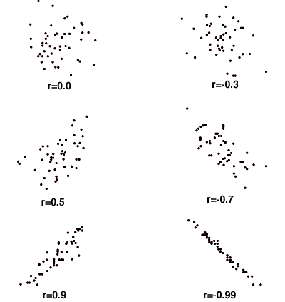
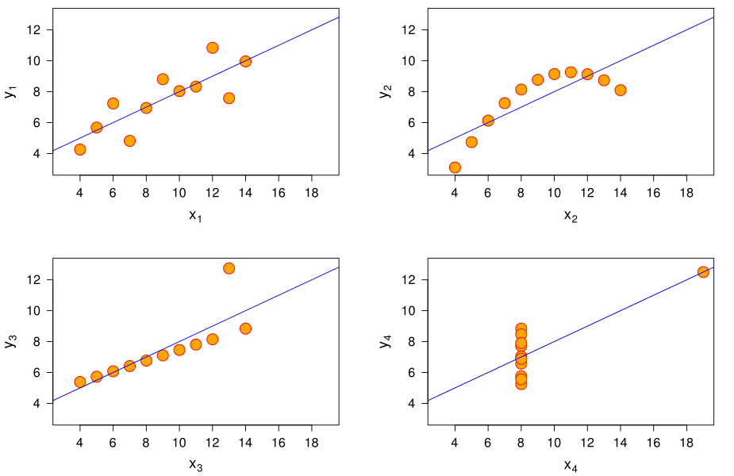
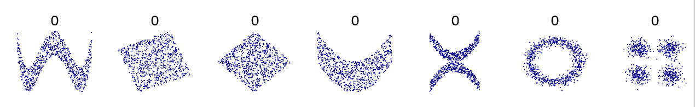
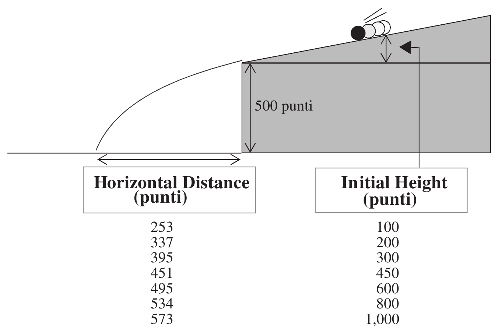

## Содержание

* Связь между двумя переменными. Корреляция.
* Связанность и причинно-следственная связь.
* Постановка задачи регрессии.
* Простая линейная регрессия.
* Построение прогностической модели.
* Оценка точности модели.


## Ковариация

**Ковариация** (*covariance = co + variance* — совместное изменение) — это мера того, как изменения одной переменной связаны с изменениями другой переменной.

Для пары случайных величин $(X,Y)$, принимающих дискретные значения $(x_i, y_i)$ $(i = 1, 2, \ldots, n)$ ковариация равна

$$
\operatorname{cov}(X,Y) = \frac{1}{n^2} \sum_{i=1}^n (x_i - \bar{x})(y_i - \bar{y})
$$

$\bar{x}$, $\bar{y}$ — средние значения $X$ и $Y$.


##

Величина $(x_i - \bar{x})(y_i - \bar{y})$ положительнa тогда и только тогда, когда $x_i$ и $y_i$ лежат на одной стороне от соответствующих средних. 

То есть: ковариация положительна, если $x_i$ и $y_i$ имеют тенденцию быть одновременно больше или одновременно меньше, чем их соответствующие средние значения. Если $x_i$ и $y_i$ находятся на противоположных сторонах от соответствующих средних значений, то ковариация отрицательна.

Но: на ковариацию влияет величина разброса (variation).


##

```
x = [1, 2, 3]
y = [4, 6, 10]

cov(x,y) = 2
```

Умножим обе переменные на 10. "Сила связи" между ними не изменится, а ковариация вырастет

```
x = [10, 20, 30]
y = [40, 60, 100]

cov(x,y) = 200
```


## Коэффициент корреляции Пирсона

Нормируем ковариацию и получим

$$
r = \frac{\sum (x_i - \bar x)(y_i - \bar y)}{\sqrt{\sum (x_i - \bar x)^2 \sum (y_i - \bar y)^2}} ,
$$

— коэффициент корреляции Пирсона, который изменяется в пределах от -1 до 1.

Чем сильнее тенденция $x_i$ и $y_i$ быть одновременно больше или одновременно меньше соответствующих средних значений, тем больше абсолютное значение коэффициента корреляции.

Коэффициент корреляции Пирсона $r$ распространен весьма широко. Часто его называют просто "коэффициентом корреляции" или даже "корреляцией", хотя есть и другие подобные коэффициенты.


## Направления связи: положительная, отрицательная, нулевая


\tiny

*Источник:* https://statistics.laerd.com/statistical-guides/pearson-correlation-coefficient-statistical-guide.php


## Сила корреляции

Интервал значений $r$	| Интерпретация
----------------------|---------------
0 – 0,2	              | Очень слабая корреляция
0,2 - 0,5	            | Слабая корреляция
0,5 – 0,7	            | Средняя корреляция
0,7 – 0,9	            | Высокая корреляция
0,9 - 1	              | Очень высокая корреляция

Зависит от области исследований. Следите за литературой по теме.


## Как это выглядит




## Пример: недвижимость в Альбукерке

Строим зависимость налогов (TAX) от площади дома (SQFT)

```{r,echo=FALSE}
# Читаем
x <- read.table("data/Albuquerque_Home_Prices_data.txt", 
                header=T, na.strings="-9999")
```
```{r, eval=FALSE}
x <- read.table("Albuquerque_Home_Prices_data.txt", 
                header=T, na.strings="-9999")
# Чтобы не писать каждый раз 'x'
attach(x)
# Рассмотрим зависимость налогов от площади дома
plot(SQFT,TAX)
# Вычислим корреляцию между величинами
(r = cor(SQFT,TAX))
```


## Зависимость налогов (TAX) от площади дома (SQFT)

```{r, echo=FALSE}
# Чтобы не писать каждый раз x
attach(x)
# Рассмотрим зависимость налогов (TAX) от площади дома (SQFT)
plot(SQFT,TAX)
# Вычислим корреляцию между величинами
(r = cor(SQFT,TAX, use = "complete.obs"))
```


## Сила линейной связи

Коэффициент корреляции Пирсона отражает **линейную** взаимосвязь между переменными.

Предположим $Y = bX$, тогда

$$
r = \frac{\sum (x_i - \bar x)(y_i - \bar y)}{\sqrt{\sum (x_i - \bar x)^2 \sum (y_i - \bar y)^2}} = \frac{b \sum (x_i - \bar x)(x_i - \bar x)}{b \sqrt{\sum (x_i - \bar x)^2 \sum (x_i - \bar x)^2}} = 1 .
$$

Малый коэффициент корреляции может означать как то, что линейная связь слаба, так и то что эта связь нелинейна.


## Квартет Анскомба: $r = 0.816$



\tiny

*Источник:* https://en.wikipedia.org/wiki/Anscombe%27s_quartet


## $r = 0$ и независимость переменных

Если две переменные независимы, их корреляция равна 0. Но наличие нулевой корреляции не означает, что переменные независимы.



\tiny

*Источник:* https://en.wikipedia.org/wiki/Pearson_correlation_coefficient


## Функции для расчета корреляции в R

```{r, eval=F}
cor(x, y = NULL, use = "everything",
    method = c("pearson", "kendall", "spearman"))

cor.test(x, y,
         alternative = c("two.sided", "less", "greater"),
         method = c("pearson", "kendall", "spearman"),
         exact = NULL, conf.level = 0.95, 
         continuity = FALSE, ...)
```

* `use = "everything"` — результат `cor()` будет равен NA, если хотя бы одно из наблюдений имеет пробел (NA).
* `use = "all.obs"` — наличие пробелов в наблюдениях вызовет ошибку. 
* `use = "complete.obs"` — наблюдения с пробелами удаляются. Рассматриваются только полные наблюдения, а если таких нет возникает ошибка.


##

Мы рассматривали коэффициент корреляции, относящийся к генеральной совокупности. На практике он чаще относится к выборке и является статистикой критерия связи между двумя переменными.

* *Хили Дж. Статистика: социологические и маркетинговые исследования. ДиасофтЮП, 2005.* — главы 12—15 посвящены проверке гипотез о связи между переменными.

### Три вопроса про статистические связи

1. Существует ли связь?
2. Если связь существует, то насколько на сильна?
3. Каково направление связи?


## Связь между переменными $\neq$ Причинная обусловленность

В идеале желательно выявить причинно-следственную связь между переменными (переменная $X$ является причиной изменения переменной $Y$), измерить ее силу и направление.

Но установить причинно-следственный характер связи между переменными статистика не может. Переменная $X$ связана с переменной $Y$, но обе они могут зависеть от третьей переменной $Z$.

Впрочем, для прогнозирования причинно-следственная связь не обязательна.


## Скрытая переменная. Бернард Шоу "Доктор на распутье"

"Даже опытные статистики часто оказываются не в состоянии оценить, до какой степени смысл статистических данных искажается молчаливыми предположениями их интерпретаторов... Легко доказать, что ношение цилиндров и зонтиков расширяет грудную клетку, удлиняет жизнь и дает относительный иммунитет от болезней... Университетский диплом, ежедневная ванна, обладание тридцатью парами брюк, знание музыки Вагнера, скамья в церкви короче, все, что подразумевает ... " 

Что по мнению Шоу объясняет все эти зависимости?

\note{
"большие средства и хорошее воспитание, ...""
}


## О вреде огурцов

\scriptsize

Огурцы вас погубят! Каждый съеденный огурец приближает вас к смерти. Удивительно, как думающие люди до сих пор не распознали смертоносности этого растительного продукта и даже прибегают к его названию для сравнения в положительном смысле («как огурчик!»). И несмотря ни на что, производство консервированных огурцов растет.

С огурцами связаны все главные телесные недуги и все вообще людские несчастья.

1. Практически все люди, страдающие хроническими заболеваниями, ели огурцы. Эффект явно кумулятивен.
2. 99,9% всех людей, умерших от рака, при жизни ели огурцы.
3. 100% всех солдат ели огурцы.
4. 99,7% всех лиц, ставших жертвами автомобильных и авиационных катастроф, употребляли огурцы в пищу в течение двух недель, предшествовавших фатальному несчастному случаю.
5. 93,1% всех малолетних преступников происходят из семей, где огурцы потребляли постоянно.

<!--Есть данные и о том, что вредное действие огурцов сказывается очень долго: среди людей, родившихся в 1839 г. и питавшихся впоследствии огурцами, смертность равна 100%. Все лица рождения 1869...1879 гг. имеют дряблую морщинистую кожу, потеряли почти все зубы, практически ослепли (если болезни, вызванные потреблением огурцов, не свели их уже давно в могилу). Еще более убедителен результат, полученный известным коллективом ученых-медиков: морские свинки, которым принудительно скармливали по 20 фунтов огурцов в день в течение месяца, потеряли всякий аппетит!-->

Единственный способ избежать вредного действия огурцов — изменить диету. Ешьте, например, суп из болотных орхидей. От него, насколько нам известно, еще никто не умирал. 

*Источник:* Физики продолжают шутить. — М.: "Мир", 1968.


## Зоопарк коэффициентов корреляции

Коэффициент корреляции Пирсона используется для оценки тесноты линейной связи между переменными в метрических шкалах (переменные ведут себя как действительные числа).

Для оценки корреляции между переменными в ранговых (порядковых) шкалах используются коэффициенты корреляции Спирмана (Spearman) или Кендала (Kendall).

Для оценки корреляции номинативных переменных используется коэффициент корреляции Крамера (Cramér).


## Пример связи между номинативными переменными: влияние аккредитации на трудоустройство социальных работников

\footnotesize

Случайная выборка объемом 100 выпускников колледжа, получивших диплом социального работника, разбита на категории по двум признакам: 1) обучался ли данный студент по программе, аккредитованной Советом по образованию социальных работников (независимая переменная $X$, категории которой соответствуют столбцам таблицы); 2) принят ли данный студент в течение 3-х месяцев после выпуска на должность социального работника (зависимая переменная $Y$, категории которой соответствуют строкам таблицы).

Таблица сопряженности:

|           | Аккредитован | Не аккредитован | Итого
----------- |--------------|-----------------|-------
Работает    | 30           | 10              | 40
Не работает | 25           | 35              | 60
Итого       | 55           | 45              | 100

**Существует ли зависимость между $X$ и $Y$?**


##

* Мы имеем дело с номинативными (номинальными) переменными.
* Зависимая и независимая переменные назначены произвольно. Можно поменять.
* По расположению переменных (столбцы, строки): думайте о таблице как о графике.
* Столбцы представляют собой условные распределения зависимой переменной $Y$ — т.е. значения зависимой переменной, соответствующие определенному значению (категории) независимой переменной.


## Критерий $\chi^2$ (хи-квадрат)

$$
\chi^2 = \sum \frac{(f_o - f_e)^2}{f_e}
$$
$f_o$ — наблюдаемые частоты ячеек, взятые из таблицы сопряженности;

$f_e$ — ожидаемые частоты ячеек, которые бы имели место в случае независимости переменных.

Чем больше различие между наблюдаемыми и ожидаемыми частотами, тем меньше вероятность того, что переменные являются независимыми.


## Расчет ожидаемых частот

Исходная таблица сопряженности:

|           | Аккредитован | Не аккредитован | Итого
----------- |--------------|-----------------|-------
Работает    | 30           | 10              | 40
Не работает | 25           | 35              | 60
Итого       | 55           | 45              | 100

$f_{e,11}$ = 55x40/100 = 22; $f_{e,12}$ = 45x40/100 = 18;

$f_{e,21}$ = 55x60/100 = 33; $f_{e,22}$ = 45x60/100 = 27.

Ожидаемые частоты:

|           | Аккредитован | Не аккредитован | Итого
----------- |--------------|-----------------|-------
Работает    | 22           | 18              | 40
Не работает | 33           | 27              | 60
Итого       | 55           | 45              | 100

Ожидаемая частота равна отношению площади элемента к площади всей фигуры (прямоугольника, S=100)


## Расчет ожидаемых частот 2

```{r,echo=FALSE}
plot.new()
plot.window(xlim = c(-10,110), ylim = c(-10,110))
lines(c(0,100),c(0,0))
lines(c(0,100),c(100,100))
lines(c(0,0),c(0,100))
lines(c(100,100),c(0,100))

lines(c(0,100),c(60,60), lty=2)
lines(c(55,55),c(0,100), lty=2)

text(27,-5,"55"); text(77,-5,"45");
text(105,30,"60"); text(105,80,"40");
text(27,80,"55*40/100 = 22")
text(27,30,"55*60/100 = 33")
text(77,80,"45*40/100 = 18")
text(77,30,"45*60/100 = 27")
```


## Расчет хи-квадрат

$$
\chi^2 = \sum \frac{(f_o - f_e)^2}{f_e}
$$

```{r}
# chi_2 = 
(30-22)^2/22 + (10-18)^2/18 + (25-33)^2/33 + (35-27)^2/27
```


## Оценка силы связи

Один из вариантов — коэффициент $\phi$

$$
\phi = \sqrt{\frac{\chi^2}{N}}
$$
$$
\phi = \sqrt{\frac{10.78}{100}} = 0.33
$$
Для таблицы 2х2 значения $\phi$ находятся в пределах от 0 (отсутствие связи) до 1 (полная связь). Для таблиц большего размера есть коэффициент **V Крамера**.


## Линейная регрессия

Если две переменные связаны, можно прогнозировать значения одной из них, пользуясь значениями другой.

**Регрессия** — прогнозирование значения одной *непрерывной* величины по наблюдениям других величин (как непрерывных, так и дискретных).

**Линейная регрессия** или линейный регрессионный анализ предполагает, что наблюдаемые величины (предикторы или регрессоры) связаны с прогнозируемой величиной (откликом) **линейно**.

Например, строится линейное уравнение, описывающее статистическую зависимость переменной $Y$ (уровня продаж) от переменной $X$ (расходов на рекламу). В результате аналитик может прогнозировать значение переменной $Y$. 


## Случай двух переменных $X$ и $Y$

### Дано

Наблюдения, то есть пары чисел $(x_i ,y_i)$.

Гипотеза, что имеется линейная статистическая зависимость между переменными $X$ и $Y$

\begin{equation}
Y = a+bX .
\label{eq:regression}
\end{equation}

### Найти

Оценки коэффициентов $a$ и $b$ уравнения регрессии \eqref{eq:regression}.

**Ключевое допущение:** модель линейна по параметрам $a$ и $b$.


## Геометрическая идея решения

Уравнение регрессии определяет прямую, наиболее близко проходящую ко всем точкам с координатами $(x_i ,y_i)$.

```{r, echo=FALSE}
# Рассмотрим зависимость налогов (TAX) от площади дома (SQFT)
plot(SQFT,TAX)
# Построим линейную регрессионную модель
reg <- lm(TAX ~ SQFT)
# Добавим к ней линию Y = a + bX
abline(a = reg$coefficients[1], b = reg$coefficients[2])
```


##

"Наиболее близко" означает "с наименьшим суммарным отклонением от...". То есть прямая проходит через средние арифметические.

### Вопросы

1. Как считается расстояние между прямой и точкой наблюдений?
2. Чем отличается график регрессии (scatter plot, диаграмма рассеяния) от обычного графика функции?


## Функция потерь

Линия регрессии в нашем случае — прямая:
$$
Y = f(X) = a + bX
$$

Подбираем $a$ и $b$ так, чтобы сумма квадратов отклонений точек линии регрессии $Y$ от наблюдаемых значений $y_i$ была минимальной:
$$
F(a,b) = \sum_{i=1}^N (y_i - f(x_i,a,b))^2 \rightarrow \min 
$$

$F$ — **функция потерь**. Потери стремятся свести к минимуму.


## Ищем минимум функции потерь

\footnotesize

Найдем значения $a$ и $b$, обращающие $F(a,b)$ в минимум

\begin{align*}
\sum_{i=1}^N (Y_i - (a + bX_i))\frac{\partial f}{\partial a} &= 0, \\
\sum_{i=1}^N (Y_i - (a + bX_i))\frac{\partial f}{\partial b} &= 0.
\end{align*}

Вычислим производные
$$
\frac{\partial f}{\partial a} = 1, \quad
\frac{\partial f}{\partial b} = X.
$$
Получим
\begin{align*}
\sum_{i=1}^N (Y_i - (a + bX_i)) &= 0, \\
\sum_{i=1}^N (Y_i - (a + bX_i))X_i &= 0.
\end{align*}


## Коэффициенты регрессии

Из двух уравнений выражаем значения двух неизвестных: $b$ (коэффициента наклона) и $a$ (свободного члена).

Коэффициент наклона характеризует силу влияния $X$ на $Y$:

$$
b = \frac{\sum (X_i - \bar X)(Y_i - \bar Y)}{\sum (X_i - \bar X)^2} ,
$$

При каждом изменении $X$ на 1, $Y$ изменяется на $b$.

$$
a = \bar Y - b \bar X .
$$

**Итог:** мы получили формулу линейной связи между величинами $Y$ и $X$ ($Y = a + bX$) с конкретными числовыми значениями $a$ и $b$. 

Если отклик $Y$ линейно зависит от единственной переменной, мы имеем дело с **простой линейной регрессией** (simple linear regression).


## Простая линейная регрессия

```{r}
data("cars")
```

На основе `r nrow(cars)` наблюдений построим уравнение регрессии
$$
\hat {Y}={\hat b}_{0}+{\hat b}_{1}X .
$$

которое является оценкой для
$$
Y=b_{0}+b_{1}X+\varepsilon .
$$

* $X$ — предиктор (speed = скорость, миль/час)
* $Y$ — отклик (dist = длина тормозного пути, фут)
* $b_0$, $b_1$ — коэффициенты регрессии

$\varepsilon = Y - \hat {Y}$ — ошибка (остаток, погрешность, невязка) равна разности между наблюдаемым и прогнозируемым значениями отклика.

```
Residual = Observed – Predicted
```


## Данные cars

```{r}
str(cars)
head(cars)
```

Встроенный в R набор данных. 

\small

Источник: *Ezekiel, M.* (1930) Methods of Correlation Analysis. Wiley.


## График

```{r}
scatter.smooth(x=cars$speed, y=cars$dist, 
                               main="Dist ~ Speed")
```


## Корреляция

```{r}
# Вычислим корреляцию между скоростью и 
# длиной тормозного пути
cor(cars$speed, cars$dist)
```


## Построим линейную модель

```{r}
# Построим модель для полного набора данных
linear_mod <- lm(dist ~ speed, data=cars)
print(linear_mod)
```

Получим формулу:
```
dist = -17.579 + 3.932*speed
```


## lm() — функция для подгонки линейных моделей

Функция `lm` принимает на вход обучающие данные и описание связи между откликом и предикторами, а возвращает линейную регрессионную модель.

```
lm(Y ~ X, data)
```

* `Y ~ X` — объект класса `formula`.
* `data` — обучающие данные: таблица с колонками `X`, `Y`, ...


##

```{r}
plot(cars$speed, cars$dist)
abline(linear_mod)
```


## Что находится внутри линейной модели

\scriptsize

```{r}
str(linear_mod)
```


## Полезные функции

```{r}
coef(linear_mod)        # коэффициенты модели
fitted(linear_mod)[1:5] # подогнанные значения Y
resid(linear_mod)[1:5]  # остатки
```


## Прогнозирование и доверительный интервал

Только прогноз для новых данных:
```
predict(model, data.frame(новые данные))
```
Прогноз с расчетом доверительного интервала:
```
predict(model, data.frame(новые данные), 
               level = 0.95, interval = "confidence")
```

```{r}
speed.new <- c(5,15,25,35,45)
preds <- predict(linear_mod, data.frame(speed = speed.new), 
                 level = 0.95, interval = "confidence")
```
```{r,echo=FALSE}
preds
```


##

```{r}
plot(cars$speed, cars$dist)
abline(linear_mod)
lines(speed.new, preds[ ,3], lty = 'dashed', col = 'red')
lines(speed.new, preds[ ,2], lty = 'dashed', col = 'red')
```


## Этапы линейной регрессии в R

1. Собрать числовые данные о связи предикторов с откликом.
2. Записать формулу, предположительно связывающую предикторы и отклик. Поместить эту формулу в функцию `lm()`.
3. Проанализировать качество регрессионной модели при помощи `summary()`.
4. По результатам выполнения `lm()` найти коэффициенты регрессии. Записать с их помощью уравнение регрессии $Y=b_0+b_1X$.
5. Для прогнозирования новых значений отклика использовать функцию `predict()`. Определить доверительный интервал прогноза.


## Измеряем качество регрессионной модели: среднеквадратичная ошибка

$$
\text{Mean Square Error (MSE)} = \frac{1}{n}\sum_{i=1}^n (Y_i - (a+bX_i))^2 .
$$
$$
\text{Root Mean Square Error (RMSE)} = \sqrt{\frac{1}{n}\sum_{i=1}^n (Y_i - (a+bX_i))^2} .
$$

```{r}
MSE <- mean(linear_mod$residuals^2)
(RMSE <- sqrt(MSE))
```


## Измеряем качество регрессионной модели: коэффициент детерминации

Насколько построенная нами модель лучше описывает данные по сравнению с некой базовой характеристикой?

В качестве базовой характеристики выступает среднее арифметическое $\bar Y$.

* Измеряем сумму квадратов отклонений для регрессионной модели

$$
\frac{1}{n} \sum_{i=1}^n (Y_i - (a+bX_i))^2
$$

* Измеряем сумму квадратов отклонений для базовой модели

$$
\frac{1}{n} \sum_{i=1}^n (Y_i - \bar Y)^2
$$


## Коэффициент детерминации $R^2$

$$
R^2 = 1 - \frac{\frac{1}{n} \sum_{i=1}^n (Y_i - (a+bX_i))^2}{\frac{1}{n} \sum_{i=1}^n (Y_i - \bar Y)^2}, \quad 0 \leq R^2 \leq 1
$$
```{r,echo=FALSE}
plot(cars$speed, cars$dist)
abline(linear_mod)
abline(mean(cars$dist), 0, col="blue")
```


## Коэффициент детерминации для зависимости тормозного пути от скорости

```{r}
summary(linear_mod)$r.squared
```

Наша модель хороша, если она дает большой выигрыш по сравнению с базовой моделью.

В данном случае это так.


## Свойства $R^2$

\small

* Коэффициент детерминации, в отличие от MSE, — величина безразмерная.
* Коэффициент детерминации работает для зависимостей вида

$$
Y = a + b_1 X_1 + b_2 X_2 + ... + b_n X_n .
$$

### Интерпретации коэффициента детерминации

$$
R^2 = \frac{\frac{1}{n} \sum_{i=1}^n (Y_i - \bar Y)^2 - \frac{1}{n} \sum_{i=1}^n (Y_i - (a+bX_i))^2}{\frac{1}{n} \sum_{i=1}^n (Y_i - \bar Y)^2} \cdot 100\%
$$

* На сколько процентов улучшилась модель по сравнению с базовой.
* Какой процент вариации $Y$ объясняется влиянием всех независимых переменных (предикторов). 

Если $X_i$ всего один, то $R^2$ равен квадрату коэффициента корреляции между этим $X_i$ и $Y$.


## Диагностика модели: summary()

\footnotesize

```{r}
summary(linear_mod)
```


## summary()

* `Call` — как вызывалась функция `lm`.
* `Residuals` — описание остатков модели. 
* `Coefficients` — оценка качества подбора коэффициентов модели.
    * `Estimate` — оценки коэффициентов модели,
    * `Std. Error` — их стандартные отклонения,
    * `t value` и `Pr(>|t|)` — t-значения и вероятности нулевой гипотезы, что коэффициент равен нулю.
* стандартное отклонение регрессии (Residual standard error) — RMSE.
* коэффициенты детерминации — обычный (Multiple R-squared) и скорректированный (Adjusted R-squared).
* `F-statistic` — результаты F-теста нулевой гипотезы об одновременном равенстве нулю всех коэффициентов регрессионной модели.


## Шаг 1. Создадим обучающую и проверочную выборки данных

До сих пор мы строили модель линейной регрессии, используя весь набор данных. В этом случае невозможно оценить точность работы модели на новых данных. 

Новых данных у нас нет, но мы сделаем их из имеющихся.

Разделим набор данных в соотношении 80:20 (обучение:тестирование). Построим модель на обучающей выборке из 80% данных и затем оценим точность ее прогноза на тестовой (проверочной) выборке из оставшихся 20% данных.


##

```{r}
# Разделим данные на обучающую и тестовую выборки

# Зерно генератора случайных чисел нужно 
# для воспроизводимости результата
set.seed(100)
# Номера строк, которые попадут в обучающую выборку
train_ind <- sample(1:nrow(cars), 0.8*nrow(cars))
training <- cars[ train_ind, ] # обучающая выборка
test     <- cars[-train_ind, ] # тестовая выборка
```


## Шаг 2. Построим модель на тренировочных данных и используем ее для прогноза на проверочных данных


```{r}
# Построим модель, обученную на обучающей выборке
lm_mod <- lm(dist ~ speed, data=training)
# Спрогнозируем тормозной путь на тестовой выборке
predicted <- predict(lm_mod, test)
```


## Шаг 3. Проанализируем качество модели по summary

\small

```{r}
summary(lm_mod)
```


## Шаг 4. Оценка точности прогноза

Коэффициент корреляции между реальными и прогнозными значениями можно использовать как простейшую меру точности прогноза. Высокие значения корреляции показывают, что реальные и прогнозные значения изменяются сонаправленно (одновременно увеличиваются или уменьшаются).

\small

```{r}
actuals_preds <- data.frame(actual=test$dist, predicted)
(correlation_accuracy <- cor(actuals_preds))
actuals_preds[1:4,]
```


## Дополнительные меры точности: MinMax accuracy и MAPE

$$
\text{MinMax Accuracy} = mean \left({\frac{min(actual,predicted)}{max(actual,predicted)}}\right) ,
$$
$$
\text{Mean Absolute Percentage Error (MAPE)} = 
$$
$$
= mean\left({\frac{|predicted - actual|}{actual}}\right) .
$$


## MinMax accuracy и MAPE

```{r}
min_max_accuracy <- mean(apply(actuals_preds, 1, min) / 
                         apply(actuals_preds, 1, max))
mape <- mean(abs((actuals_preds$predicted -
        actuals_preds$actual))/actuals_preds$actual)

min_max_accuracy
mape
```


## Необходимость перекрестной проверки

Предположим, модель удовлетворительно предсказывает на 20%-ной тестовой выборке. Достаточно ли этого, чтобы утверждать, что модель всегда будет предсказывать столь же точно? Возможно, наша тестовая выборка всего лишь счастливое исключение.

Нужно показать, что построенная модель хорошо работает на любой подобной обучающей выборке.

Разделим наши данные на $k = 5$ непересекающихся частей. Сохраняя каждую часть в качестве тестовой выборки, построим модель на оставшихся $(k-1)$ частях данных и рассчитаем среднеквадратичную ошибку прогноза. 

Проделаем эту операцию для каждой из $k$ частей. Затем вычислим среднее значение полученных среднеквадратичных ошибок. Эта метрика является более устойчивым показателем качества прогноза чем среднеквадратичная ошибка, построенная по единственной тестовой выборке.


## Эксперимент Галилея



\tiny

Ramsey F., Schafer D. The Statistical Sleuth: A Course in Methods of Data Analysis, 3rd Edition, 2013


## Квадратичная аппроксимация

```{r}
# Данные из: Ramsey F., Schafer D. The Statistical
# Sleuth: A Course in Methods of Data Analysis, 
# 3rd Edition, 2013

height = c(100, 200, 300, 450, 600, 800, 1000)
distance = c(253, 337, 395, 451, 495, 534, 574)

# Модель в форме квадратичного полинома
lm.r = lm(distance ~ height + I(height^2))
```


##

\small

```{r}
summary(lm.r)
```


## Закон движения тела

Галилей теоретически обосновал и экспериментально доказал, что тело, брошенное горизонтально или под углом к горизонту, будет двигаться по параболе.

Данные эксперимента дают нам формулу:

```
distance = 200.211950 + 0.706182*height - 0.000341*height^2
```

```{r}
# Создадим высоты для прогноза
h = seq(100, 1000, 10)
# Вычислим расстояния для каждой из новых высот
dist = 200.211950 + 0.706182*h - 0.000341*h^2
```


## Зависимость длины полета от начальной высоты

```{r}
plot(height, distance)  # исходные данные
lines(h, dist, lty=1)   # результаты подгонки
```


## Формулы

**"Линейная модель" означает линейность относительно коэффициентов регрессии $b_i$**

* $y = b_0 + b_1 x + b_2 x^2$ — линейная модель.
* $y = b_0 x^{b_1}$ — нелинейная модель.

### Примеры

\scriptsize

* `Y ~ A` — прямая со свободным членом $b_0$, заданным неявно
$$
Y = b_0 + b_1A
$$
* `Y ~ -1 + A` — прямая без свободного члена; будет проходить через (0,0)
$$
Y = b_1A
$$
* `Y ~ A + I(A^2)` — полином; внутри функции `I()` можно задавать операции, которые трактуются в обычном для математики смысле
$$
Y = b_0+ b_1A + b_2A^2
$$


## Примеры формул

\scriptsize

* `Y ~ A + B` — модель 1-го порядка, в которой A и B не взаимодействуют
$$
Y = b_0 + b_1A + b_2B
$$
* `Y ~ A:B` — модель, содержащая только взаимодействие между A и B (1-го порядка)
$$
Y = b_0 + b_1 AB
$$
* `Y ~ A*B` — полная модель 1-го порядка, учитывающая как A и В, так и взаимодействие между ними (эквивалент: `Y ~ A + B + A:B`)
$$
Y = b_0 + b_1A + b_2B + b_3AB
$$
* `Y ~ (A + B + C)^2` — модель включает все эффекты 1-го порядка и все взаимодействия вплоть до $n$-го порядка, где $n$ задается показателем в `(...)^n` (эквивалент: `Y ~ A*B*C – A:B:C`)
$$
Y = b_0 + b_1A + b_2B + b_3C + b_4AB + b_5AC + b_6AC
$$


## Дополнительные материалы

* [MachineLearning.ru: Коэффициент детерминации](http://www.machinelearning.ru/wiki/index.php?title=Коэффициент_детерминации) — о скорректированном коэффициенте детерминации.
* [Prabhakaran S. Linear Regression With R](http://r-statistics.co/Linear-Regression.html)
* [Ramsey F., Schafer D. The Statistical Sleuth: A Course in Methods of Data Analysis, 3rd Edition, 2013](http://gen.lib.rus.ec/search.php?req=The+Statistical+Sleuth%3A+A+Course+in+Methods+of+Data+Analysis&lg_topic=libgen&open=0&view=simple&res=25&phrase=1&column=def). Данные Галилея находятся в пакете [Sleuth3](https://cran.r-project.org/package=Sleuth3).


