```{r echo=FALSE, warning=FALSE}
list.of.packages <- c("car","usdm")
new.packages <- list.of.packages[!(list.of.packages %in% installed.packages()[,"Package"])]
if(length(new.packages)) install.packages(new.packages, repos="http://cran.us.r-project.org")
```


## Содержание

* Многомерная регрессия: значимость коэффициентов и коллинеарность.
* Теорема Гаусса-Маркова.
* Анализ остатков.


## Уравнения многомерной линейной регрессии

$$
y_i = \beta_0+\beta_1 x_{i,1}+\beta_2 x_{i,2} + \ldots + \beta_k x_{i,k} + \varepsilon_i, \quad i = 1, \ldots, n.
$$
Добавим фиктивную переменную, тождественно равную 1
$$
x_{1,0} = x_{2,0} = \ldots = x_{k,0} = 1.
$$
Это позволит записать систему нормальных уравнений в матричном виде:
$$
\left(\begin{array}{c}
y_1 \\
y_2 \\
\cdots \\
y_n
\end{array}
\right) = 
\left(\begin{array}{ccccc}
x_{1,0} & x_{1,1} & x_{1,2} & \cdots & x_{1,k} \\
x_{2,0} & x_{2,1} & x_{2,2} & \cdots & x_{2,k} \\
\cdots & \cdots & \cdots & \cdots & \cdots \\
x_{n,0} & x_{n,1} & x_{n,2} & \cdots & x_{n,k} \\
\end{array}\right) \cdot
\left(\begin{array}{c}
\beta_0 \\
\beta_1 \\
\cdots \\
\beta_k
\end{array}
\right) + 
\left(\begin{array}{c}
\varepsilon_0 \\
\varepsilon_1 \\
\cdots \\
\varepsilon_k
\end{array}
\right) .
$$
$$
\bar y = X \cdot \bar \beta + \bar \varepsilon .
$$


## Критерий качества

Среднеквадратичная ошибка (MSE):

$$
Q = \sum_{i=1}^n \left( y_i - (\beta_0+\beta_1 x_{i,1}+\beta_2 x_{i,2} + \ldots + \beta_k x_{i,k}) \right)^2 .
$$
$$
Q = \sum_{i=1}^n \varepsilon_i^2 .
$$

В матричном виде

$$
Q = \bar \varepsilon^T \bar\varepsilon = (\bar y - X \cdot \bar \beta)^T (\bar y - X \cdot \bar \beta) .
$$


## Ищем минимум критерия качества

Лучшие $\beta_i$ соответствуют минимуму ошибки:

$$
\frac{\partial Q}{\partial \beta_i} = 0, \quad i = 0, \ldots, k.
$$
После дифференцирования, получим:
$$
-2X^T \bar y + 2 X^T X \bar\beta = 0,
$$
$$
X^T X \bar\beta = X^T \bar y .
$$
Отсюда найдем $\beta$
$$
\bar\beta = (X^T X)^{-1} X^T \bar y .
$$


## Недвижимость в г. Альбукерке, шт. Нью-Мексико, США

Данные (117 наблюдений) являются случайной выборкой из записей о перепродажах домов, совершенных между 15 февраля и 30 апреля 1993. Информация предоставлена Советом риэлтеров Альбукерке (Albuquerque Board of Realtors).

\small

Переменные:

* PRICE — продажная цена в сотнях долларов; 
* SQFT  — площадь в квадратных футах; 
* AGE   — возраст дома (количество лет); 
* FEATS — количество дополнительных удобств из 11 возможных: dishwasher, refrigerator, microwave, disposer, washer, intercom, skylight(s), compactor, dryer, handicap fit, cable TV access; 
* NE    — дом расположен в престижном районе на северо-востоке города (1), или нет (0);
* CUST  — тип постройки: был ли дом обычной постройки (0), или нет (1), 
* COR   — как расположен дом, на углу (1) или нет (0). 
* TAX   — величина налогов за владение домом (в долларах). 


## Дадим прогноз цен

### Задача

Построить модель, позволяющую по имеющимся параметрам спрогнозировать цену дома.

### Гипотеза

Зависимость цены от переменных — линейная.

### Порядок решения

1. Построение модели цены
2. Интерпретация коэффициентов
3. Отбор переменных


## С чего начать?

```{r,eval=FALSE}
# Загрузка данных
x <- read.table("Albuquerque_Home_Prices_data.txt", 
                   header=T, na.strings="-9999")

summary(x) # Проверка

# Построим модель, зависящую ото всех переменных
itog1 <- lm(PRICE ~ SQFT + AGE + FEATS + NE + CUST + 
              COR + TAX, x)
summary(itog1)
```


## Таблица наблюдений `x`

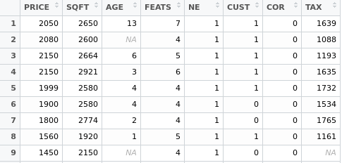


## Модель, зависящая ото всех переменных

\scriptsize

```
Call:
lm(formula = PRICE ~ SQFT + AGE + FEATS + NE + CUST + COR + TAX, 
    data = x)

Residuals:
    Min      1Q  Median      3Q     Max 
-466.28  -82.29    6.75   78.70  484.84 

Coefficients:
             Estimate Std. Error t value Pr(>|t|)    
(Intercept)  92.74480  101.60704   0.913 0.365137    
SQFT          0.35222    0.09575   3.679 0.000515 ***
AGE          -0.56508    2.00253  -0.282 0.778807    
FEATS         4.38961   18.55499   0.237 0.813822    
NE          -17.38534   47.27462  -0.368 0.714397    
CUST        174.94108   53.72371   3.256 0.001887 ** 
COR         -73.58234   49.13007  -1.498 0.139633    
TAX           0.49887    0.15849   3.148 0.002598 ** 
---
Signif. codes:  0 ‘***’ 0.001 ‘**’ 0.01 ‘*’ 0.05 ‘.’ 0.1 ‘ ’ 1

Residual standard error: 158.9 on 58 degrees of freedom
  (51 observations deleted due to missingness)
Multiple R-squared:  0.8623,	Adjusted R-squared:  0.8456 
F-statistic: 51.86 on 7 and 58 DF,  p-value: < 2.2e-16
```


## На что обращать внимание?

1. Множественный коэффициент детерминации `Multiple R-squared`. Если он мал, то нужно искать другую модель. Например, нелинейную.
2. Коэффициенты: столбец `Estimate`. Их можно интерпретировать.
3. Столбец `Pr(>|t|)` содержит результат проверки гипотезы о том, что коэффициент равен 0. Помогает понять, какие переменные нужно рассматривать.

Заметим, что 51 наблюдение с пропусками автоматически удаляются.


## Оставим в модели только переменные с "ненулевыми" коэффициентами

```{r, eval=FALSE}
itog2 <- lm(PRICE ~ SQFT + CUST + TAX, x)
summary(itog2)
```

\small

```
Coefficients:
            Estimate Std. Error t value Pr(>|t|)    
(Intercept) 164.7319    56.9888   2.891 0.004690 ** 
SQFT          0.1881     0.0613   3.069 0.002743 ** 
CUST        162.0664    45.1363   3.591 0.000507 ***
TAX           0.7090     0.1014   6.989 2.83e-10 ***
---
Signif. codes:  0 ‘***’ 0.001 ‘**’ 0.01 ‘*’ 0.05 ‘.’ 0.1 ‘ ’ 1

Residual standard error: 164.9 on 103 degrees of freedom
  (10 observations deleted due to missingness)
Multiple R-squared:  0.8207,	Adjusted R-squared:  0.8155 
F-statistic: 157.2 on 3 and 103 DF,  p-value: < 2.2e-16
```

Все в порядке?


## (Мульти)коллинеарность

Допустим, что задана зависимость
$$
Z = 6X + 8Y .
$$

Одновременно известно, что
$$
Y = 2X .
$$

В таком случае к коэффициентам при X и Y нельзя относиться серьезно.

Возможно:
\begin{align*}
Z &= 11Y,  \\
Z &= 4X + 90Y, \\
Z &= 22X, \\
...
\end{align*}

Именно в такую ситуацию мы попали.


## Что делать?

\large

1. Удалить одну из коллинеарных переменных.
2. В более сложных случаях — использовать метод главных компонент. Он преобразует исходные переменные в новые некоррелированные переменные. Новые переменные будут линейными комбинациями исходных. Их меньше. Но их труднее интерпретировать.


## Поиск коллинеарных переменных: корреляция

\scriptsize

```{r,echo=FALSE}
# Читаем
x <- read.table("data/Albuquerque_Home_Prices_data.txt", 
                header=T, na.strings="-9999")
```
```{r}
cor(x, use = "complete.obs", method = "pearson")
```

Ищем сильную корреляцию предикторов (не с PRICE!).


## Поиск коллинеарных переменных: матрица диаграмм рассеяния

```{r}
pairs(~ SQFT + AGE + FEATS + TAX, data = x)
# Или так: pairs(x[,c("SQFT", "AGE", "FEATS", "TAX")])
```


## Исключаем налоги (TAX) из модели

\small

```{r, eval=FALSE}
itog3 <- lm(PRICE ~ SQFT + AGE + FEATS + NE + CUST + COR, x)
summary(itog3)
```
```
Coefficients:
             Estimate Std. Error t value Pr(>|t|)    
(Intercept)  83.14037  102.73572   0.809  0.42151    
SQFT          0.63719    0.05119  12.448  < 2e-16 ***
AGE          -3.72095    1.80540  -2.061  0.04357 *  
FEATS         3.25714   18.93246   0.172  0.86398    
NE          -14.32888   49.23057  -0.291  0.77200    
CUST        148.47950   54.40590   2.729  0.00829 ** 
COR         -83.39862   51.26812  -1.627  0.10895    
---
Signif. codes:  0 ‘***’ 0.001 ‘**’ 0.01 ‘*’ 0.05 ‘.’ 0.1 ‘ ’ 1

Residual standard error: 174.4 on 61 degrees of freedom
  (49 observations deleted due to missingness)
Multiple R-squared:  0.8295,	Adjusted R-squared:  0.8128 
F-statistic: 49.47 on 6 and 61 DF,  p-value: < 2.2e-16
```


## Следующая попытка: с новыми "ненулевыми" коэффициентами

\small

```{r, eval=FALSE}
itog4 <- lm(PRICE ~ SQFT + AGE + CUST, x)
summary(itog4)
```
```
Coefficients:
             Estimate Std. Error t value Pr(>|t|)    
(Intercept)  72.48077   84.52629   0.857  0.39437    
SQFT          0.63914    0.04712  13.565  < 2e-16 ***
AGE          -4.28913    1.68111  -2.551  0.01313 *  
CUST        149.31462   53.72717   2.779  0.00715 ** 
---
Signif. codes:  0 ‘***’ 0.001 ‘**’ 0.01 ‘*’ 0.05 ‘.’ 0.1 ‘ ’ 1

Residual standard error: 174.2 on 64 degrees of freedom
  (49 observations deleted due to missingness)
Multiple R-squared:  0.8216,	Adjusted R-squared:  0.8132 
```


## Интерпретация модели

Модель цены дома:

```
PRICE = 72.48 + 0.64*SQFT - 4.29*AGE + 149.31*CUST
```

* Сильнее всего цена зависит от дополнительных удобств (CUST).
* Чем старше дом, тем он дешевле.
* Как интерпретировать свободный член уравнения?

**Идеологическое замечание:** разработка модели — процесс последовательных приближений к цели.


## Цены на женские кольца с бриллиантами

Построить модель цены в зависимости от веса бриллианта

\small

Наблюдения `diamond.dat`: вес бриллианта в каратах (`weight`), цена на женское золотое кольцо с данным бриллиантом (`price`) в сингапурских долларах.

На каждом кольце находится один бриллиант. Кольца сделаны из золота пробы 20 каратов (1 карат = 1/24 часть чистого золота, то есть чистое золото имеет пробу 24 карата).

### Варианты моделей

\begin{align*}
price &= a + b * weight,   \\
price &= a + b * weight^2, \\
price &= a + b * weight + c * weight^2.
\end{align*}

Какая из моделей лучше?


## Коэффициент детерминации

\small

```{r, eval=F}
# Загрузим данные (x.1).
# Переставим столбцы и добавим столбец квадратов веса
names(x.1) <- c("PRICE", "WEIGHT", "WEIGHT2")

# Простейшая модель
itog1 <- lm(PRICE ~ WEIGHT, x.1)
# Модель, предложенная ювелирами
itog2 <- lm(PRICE ~ WEIGHT2, x.1)
# Модель, зависящая ото всех переменных
itog3 <- lm(PRICE ~ WEIGHT + WEIGHT2, x.1)
```

Модель | $R^2$
-------|--------
1      | 0.9783
2      | 0.9703
3      | 0.9789

Так выбрать модель не получится.


## Содержательная интерпретация

\scriptsize

```{r, eval=F}
# 1)
itog1 <- lm(PRICE ~ WEIGHT, x.1)  
#             Estimate Std. Error t value Pr(>|t|)    
# (Intercept)  -259.63      17.32  -14.99   <2e-16 ***
# WEIGHT       3721.02      81.79   45.50   <2e-16 ***
# 2)
itog2 <- lm(PRICE ~ WEIGHT2, x.1)
#             Estimate Std. Error t value Pr(>|t|)    
# (Intercept)   141.66      10.69   13.25   <2e-16 ***
# WEIGHT2      7993.11     206.15   38.77   <2e-16 ***
# 3)
itog3 <- lm(PRICE ~ WEIGHT + WEIGHT2, x.1)
#             Estimate Std. Error t value Pr(>|t|)    
# (Intercept)  -174.13      74.24  -2.346   0.0235 *  
# WEIGHT       2920.13     681.30   4.286 9.47e-05 ***
# WEIGHT2      1739.90    1469.47   1.184   0.2426    
```

1. Модель проста, но цена кольца без бриллианта -259.63 сингапурских доллара, что не логично. Нелогичная интерпретация — признак плохой модели.
2. Здесь свободный член $a>0$, что логично.
3. За кольцо без бриллианта снова приплачивают. Кроме того, коэффициент при квадрате веса можно считать равным нулю. Хотя в модели №2 `WEIGHT2` был информативной переменной.


## Противоречие: WEIGHT2 одновременно информативная и неинформативная переменная

**Гипотеза:** что если WEIGHT и WEIGHT2 линейно зависимы?

В алгебре это утверждение нелепо. Но мы имеем дело со статистикой. Здесь слабое отклонение параболы от прямой воспринимается как случайное.

Самостоятельно посчитайте корреляцию между WEIGHT и WEIGHT2, чтобы проверить, что мы имеем дело с коллинеарностью.


## График зависимости WEIGHT2 от WEIGHT

```{r, echo=F}
# Загрузка данных
x.0 <- read.table("data/diamond.dat")
# Переставим солбцы и добавим столбец квадратов
x <- cbind(x.0[,c(2,1)], x.0[,1]^2)
names(x) <- c("PRICE", "WEIGHT", "WEIGHT2")

plot(x$WEIGHT, x$WEIGHT2)
```


## Вывод

В первой и третьей моделях значение свободного члена нелогично. 

В третьей модели, благодаря коллинеарности WEIGHT и WEIGHT2, можно удалить переменную WEIGHT.

Таким образом, следует предпочесть вторую модель.


## Теорема Гаусса-Маркова

Формулирует условия, при которых метод наименьших квадратов позволяет получить наилучшие оценки параметров линейной модели регрессии.

Для простоты рассмотрим модель простой линейной регрессии, в которой наблюдения $Y$ связаны с $X$ следующим образом: 
$$
Y_{i}=b_{0}+b_{1}X_{i}+\varepsilon_{i} .
$$


## Формулировка теоремы

Пусть на основе $n$ наблюдений оценивается уравнение регрессии
$$
{\hat {Y}}_{i}={\hat b}_{0}+{\hat b}_{1}X_{i} .
$$

Тогда, если данные обладают следующими свойствами:

1. Модель данных правильно специфицирована; 
2. Все $X_{i}$ детерминированы и не все равны между собой; 
3. Ошибки не носят систематического характера, то есть $\mathbb {E} (\varepsilon_{i})=0\ \forall i$;
4. Дисперсия ошибок одинакова и равна $\sigma ^{2}$; 
5. Ошибки некоррелированы, то есть ${\mathop {\mathrm {Cov} }}(\varepsilon_{i},\varepsilon_{j})=0\ \forall i,j$; 

— то оценки полученные методом наименьших квадратов оптимальны в классе линейных несмещенных оценок.


## Условия Гаусса-Маркова 1

Спецификация (запись) модели
$$
y_i = b_0 \cdot x_{i0} + b_1 \cdot x_{i1}+\varepsilon_i , \quad 
x_{i0}=1, \quad i=1, 2, \ldots , n.
$$

1. Если модель линейна по параметрам $b_i$, то спецификация корректна.
2. Отсутствует недоопределенность (упущены важные факторы) и переопределенность (приняты во внимание ненужные факторы). Это влечет за собой отсутствие коллинеарности.


## Условия Гаусса-Маркова 2

**Все $X_{i}$ детерминированы и не все равны между собой.**

Если все $X_{i}$ равны между собой, то $X_{i}=\bar {X}$, и в уравнении оценки коэффициента наклона прямой в линейной модели в знаменателе будет ноль, из-за чего будет невозможно оценить коэффициенты $b_i$.

$$
b = \frac{\sum (X_i - \bar X)(Y_i - \bar Y)}{\sum (X_i - \bar X)^2} ,
$$


## Условия Гаусса-Маркова 3

**Ошибки не носят систематического характера: $\mathbb {E} (\varepsilon_{i})=0\ \forall i$**

Случайная часть $\varepsilon_{i}$ может быть иногда положительной, иногда отрицательной, но она не должна иметь систематического смещения ни в каком из двух возможных направлений.

Если уравнение регрессии включает постоянный член $b_0$, то это условие выполняется автоматически, так как постоянный член отражает любую систематическую постоянную составляющую в $Y$, которую не учитывают объясняющие переменные, входящие в уравнение регрессии.


## Условия Гаусса-Маркова 4

**Дисперсия ошибок одинакова.**

Одинаковость дисперсии ошибок принято называть **гомоскедастичностью**. 

Если это условие не выполняется, то коэффициенты регрессии, найденные по методу наименьших квадратов, будут неэффективны

Более эффективные результаты будут получаться путём применения модифицированных методов оценивания (взвешенный МНК или оценка ковариационной матрицы по формуле Уайта или Дэвидсона—Маккинона).


## Условия Гаусса-Маркова 5

**Ошибки $\varepsilon _{i}$ распределены независимо от $\varepsilon _{j}$ при $i\neq j$.**

Это условие предполагает отсутствие систематической связи между значениями случайного члена в любых двух наблюдениях. Если один случайный член велик и положителен в одном направлении, не должно быть систематической тенденции к тому, что он будет таким же великим и положительным (то же можно сказать и о малых, и об отрицательных остатках).

**Обычно не выполняется в случае временных рядов!**

При невыполнении этого условия оценки, полученные по методу наименьших квадратов, будут неэффективны.


## Выводы из теоремы

* Эффективность оценки означает, что она обладает наименьшей дисперсией.
* Несмещенность оценки означает, что ее математическое ожидание равно истинному значению.

Несколько упрощая: метод наименьших квадратов позволяет получить наилучшие линейные оценки, если остатки $\varepsilon_i$ обладают следующими свойствами:

1.  Нормальным распределением. 
2.  Взаимонезависимостью. 
3.  Нулевым математическим ожиданием. 
4.  Постоянной дисперсией. 

Проверка этих свойств называется **анализом остатков**. 

Анализ остатков позволяет обосновать, что вы построили наилучшую из возможных линейных моделей.

В анализе остатков нам поможет `plot(linear_model)`.


## Анализ остатков. Пример: вес новорожденного

Файл `birthweight_reduced.csv` содержит данные о 42 новорожденных и их родителях. Нас интересует как зависит вес новорожденного (Birthweight, указан в фунтах, 1 брит. фунт = 453.59 грамма) от продолжительности беременности (Gestation, в неделях), роста и веса матери до беременности (mheight и mppwt в дюймах и фунтах соотвественно, 1 дюйм = 2.54 см) и от того, курит ли мать (smoker: 0 — не курит, 1 — курит)

*Источник:* http://www.statstutor.ac.uk/students/topics/r/statistical-analyses-using-r/


## Чтение и очистка от пропусков

\scriptsize

```{r}
babyData = read.csv('data/birthweight_reduced.csv')
head(babyData, n=3)
dim(babyData)
babyData = na.omit(babyData); dim(babyData)
```


## smoker — это фактор

```{r}
class(babyData$smoker)
babyData$smoker <- factor(babyData$smoker,
                        labels=c('Non-smoker','Smoker'))
```


## Проверка на мультиколлинеарность 1

\scriptsize

```{r}
attach(babyData)
pairs(~Birthweight+Gestation+mheight+mppwt,
      main='Birth weight scatterplots',
      col=c('red','blue')[smoker], pch=c(1,4)[smoker])
```


## Проверка на мультиколлинеарность 2

Матрица корреляции

```{r}
round(cor(cbind(Birthweight,Gestation,mppwt,mheight)),2)
```


## Проверка на мультиколлинеарность 3: tolerance

$R^2_j$ — коэффициент детерминации для регрессии $j$-го предиктора на остальные предикторы.

$$
tolerance = 1-R^2_j
$$
Пороговые значения:

* $> 0.2$ — допустимо
* $0.1$ — опасно!


## Проверка на мультиколлинеарность 4: VIF

VIF (Variance Inflation Factors) = 1/tolerance

* от 1 до 5 — хорошо
* от 5 до 10 — внимание, опасно!
* 10+ — данный предиктор существенно зависит от других предикторов

VIF сообщает, насколько "завышена" дисперсия коэффициента, по сравнению с тем, что было бы, если бы переменная не коррелировала с любой другой переменной в модели.


## Вычисление VIF в R


```{r, eval=F}
library(car)
vif(lm(Birthweight~Gestation+smoker+mheight+mppwt))
vif(lm(Birthweight~Gestation+smoker+mppwt))
```
```
## Gestation smoker mheight mppwt
## 1.087246 1.013175 1.838976 1.852606

## Gestation smoker mppwt
## 1.077986 1.010494 1.068478
```
```{r,eval=F}
vif(itog1) # Для недвижимости в Альбукерке
```

\small

```
    SQFT      AGE    FEATS       NE     CUST      COR      TAX 
6.197432 1.692336 1.459148 1.374965 1.385906 1.108327 6.476598 
```


## Считаем VIF'ы в пакете usdm

```{r,eval=FALSE}
library(usdm)
independents<-data.frame(cbind(Gestation,smoker,mppwt))
vif(independents)
```
```
  Variables      VIF
1 Gestation 1.077986
2    smoker 1.010494
3     mppwt 1.068478
```


## Строим регрессионную модель на основе независимых предикторов

\scriptsize

```{r}
reg1 <- lm(Birthweight~Gestation+smoker+mppwt)
summary(reg1)
```


## Анализ остатков: нормальность, гомоскедастичность и несмещенность оценок

```{r,fig.height=6}
plot(reg1, which = 1)
```


## Анализ остатков: нормальность

```{r,fig.height=5}
plot(reg1, which = 2)
```

Непонятно, насколько сильно отличается распределение от нормального.

\tiny

**О нормальных графиках КК (QQ plot):** https://stats.stackexchange.com/questions/101274/how-to-interpret-a-qq-plot


## Гистограмма для проверки нормальности

\small

```{r,fig.height=5}
hist(resid(reg1), xlim = range(c(-2.5,2.5)),
     main='Histogram of residuals',
     xlab='Standardised residuals',ylab='Frequency')
```

Мы ожидаем увидеть 95% стандартизованных остатков в диапазоне ±1.96


## Экстремальные значения

**Если**

более 5% остатков выходит за пределы диапазона ±1.96 или присутствуют экстремальные значения, выходящие из ±3

**то** 

выполните регрессию с экстремальными значениями и без них, чтобы увидеть насколько сильно присуствие таких наблюдений изменяет коэффициенты модели.


## Как выглядят проблемы: отсутствие нормальности

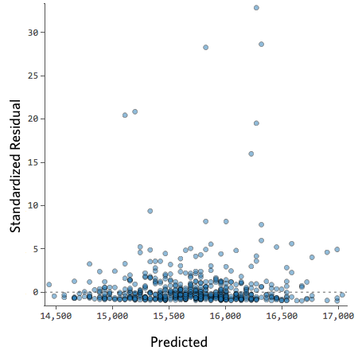

\tiny

Источник: http://docs.statwing.com/interpreting-residual-plots-to-improve-your-regression/


## Гетероскедастичность

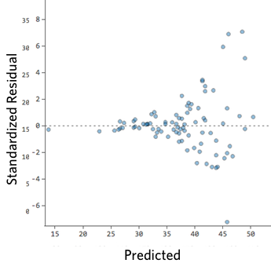


## Нелинейная зависимость

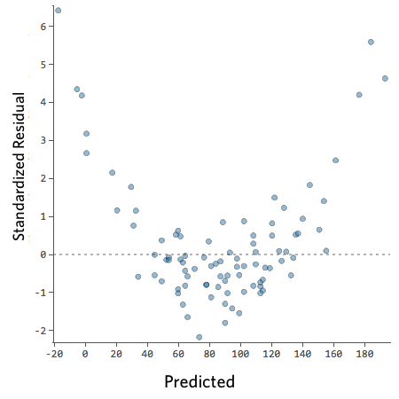


## Выбросы

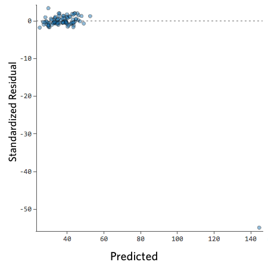


## Проверка на выбросы: расстояние Кука

Расстояние Кука (Cook's distance) для наблюдения показывает, насколько сильно изменится прогнозируемое значение $\hat Y$, если удалить это наблюдение из выборки. Иными словами, расстояние Кука характеризует **влиятельность** наблюдения.

Формула: https://en.wikipedia.org/wiki/Cook's_distance

### Какие наблюдения считать влиятельными?

Те, для которых расстояние Кука $D_{i}$:

* $> 1$
* $> 4/N$, где $N$ — число наблюдений (для параноиков).

Еще о влиятельности наблюдений: [How to read Cook's distance plots?](https://stats.stackexchange.com/questions/22161/how-to-read-cooks-distance-plots)

Напомню: наблюдения с большими остатками (выбросы) могут существенно исказить регрессионную модель.


## Проекционная матрица и рычаг

Регрессионная модель
$$
y = X \beta + \varepsilon.
$$

Оценка регрессионных коэффициентов:
$$
\hat\beta = (X^T X)^{-1} X^T y .
$$
Подогнанные значения
$$
\hat y = X \hat\beta .
$$
Связь подогнанных значений с результатами наблюдений:
$$
\hat y = X (X^T X)^{-1} X^T y .
$$
Проекционная матрица (projection matrix или hat matrix):
$$
H = X (X^T X)^{-1} X^T .
$$

Диагональный элемент $h_{ii} = [H]_{ii}$ называется **рычагом** (leverage) $i$-го наблюдения.


## 

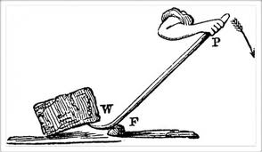


## Проверка на выбросы: рычаг

Рассмотрим графики остатков для 4-х наборов данных:

1. все хорошо
2. есть точка с длинным рычагом, но малым остатком
3. есть точка с коротким рычагом и большим остатком
4. есть точка с длинным рычагом и большим остатком

\small

```{r,eval=FALSE}
set.seed(20)

x1 = rnorm(20, mean=20, sd=3)
y1 = 5 + .5*x1 + rnorm(20)

x2 = c(x1, 30);        y2 = c(y1, 20.8)
x3 = c(x1, 19.44);     y3 = c(y1, 20.8)
x4 = c(x1, 30);        y4 = c(y1, 10)
```

Графики справа: `plot(lm, which = 4)`


## Все хорошо

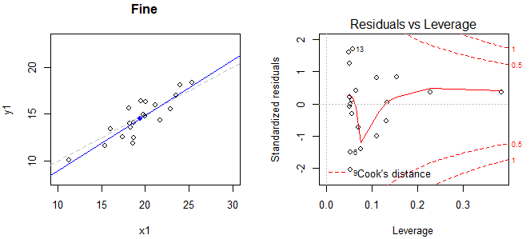


## Точка с длинным рычагом и малым остатком

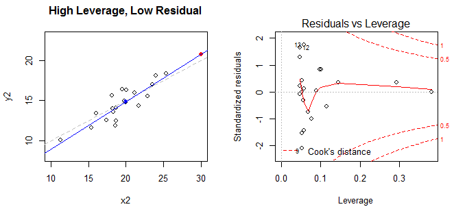


## Точка с коротким рычагом и большим остатком

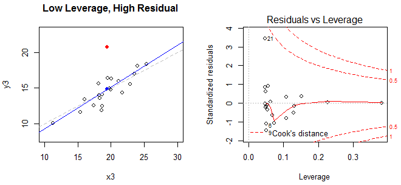


## Точка с длинным рычагом и большим остатком

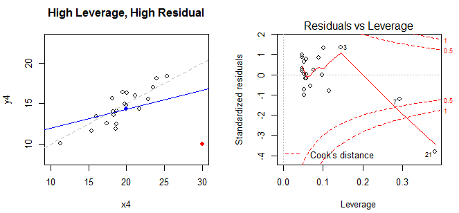


## Возвращаемся к исследованию веса новорожденных...

```{r}
plot(reg1, which = 4)
```


## 4-й график из серии plot()

```{r, eval=FALSE}
plot(reg1, which = 5)
```
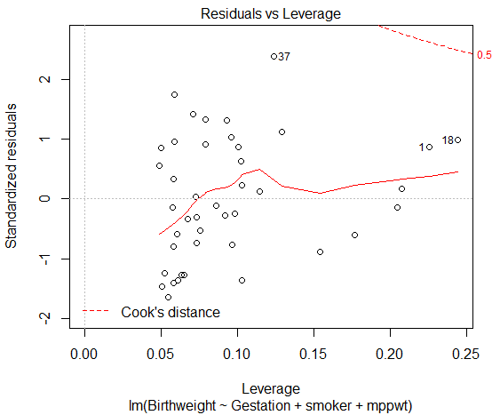


## Автокорреляция остатков

Одним из предположений относительно регрессии является независимость наблюдений, которая выражается в отсутствии корреляции между остатками.

Однако, если процесс развивается во времени, то вполне возможно, что последовательные наблюдения будут связаны друг с другом.

Тест Дурбина-Ватсона (Durbin-Watson test) проверяет отсутствие автокорреляции. Если автокорреляции нет (т.е. последовательные наблюдения не взаимосвязаны), то статистика Дурбина-Ватсона будут находится в пределах от 1.5 до 2.5. p-значение обычно принимается равным 0.05.


## Тест Дурбина-Ватсона

```{r,eval=FALSE}
library(car)
dwt(reg1)
```
```
 lag Autocorrelation D-W Statistic p-value
   1      -0.0774652      2.122239   0.782
 Alternative hypothesis: rho != 0
```

**Предположение об отсутствии автокорреляции обычно нарушается для временных рядов.**


## Выводы на основе регрессионной модели

\scriptsize

Множественная линейная регрессия проводилась в целях изучения взаимосвязи между весом новорожденного и 1) продолжительностью беременности (в неделях), 2) весом матери до беременности и 3) курением матери в течение беременности.

Показано наличие значимой взаимосвязи между продолжительностью беременности (гестационным возрастом) и весом новорожденного (p < 0.001), курением матери и весом новорожденного (p = 0.017), а также весом матери до беременности и весом новорожденного (p = 0.03).  

Отмечено увеличение веса новорожденного на 0.313 фунта за каждую дополнительную неделю гестационного возраста.  

На каждый дополнительный фунт веса матери, вес новорожденного увеличивается на 0.02 фунта.

Новорожденные у курящих матерей весят на 0.665 фунта меньше, чем у некурящих.  

Скорректированный коэффициент детерминации (adjusted R-squared) равен 0.58. Следовательно 58% изменений веса новорожденных может быть объяснено регрессионной моделью, включающей гестационный возраст, вес и курение матери. 


## Ложная корреляция

В первую очередь встречается при рассмотрении временных рядов. Если у нас есть две монотонные последователности чисел, то между ними будет большой коэффициент корреляции.

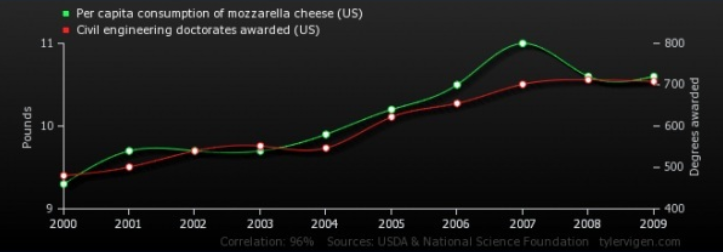


## Проблемы вычисления $\bar{\beta}$. 

Рассмотрим аппроксимацию зашумленной синусоиды:

```{r, eval=F}
x <- seq(0, 6, 0.5)

set.seed(1234)
y <- sin(x) + rnorm(length(x), 0, 0.8)

plot(x, y, type="p", col="red")
lines(x, sin(x), col="blue")
```


## 

```{r, echo=F}
x <- seq(0, 6, 0.5)

set.seed(1234)
y <- sin(x) + rnorm(length(x), 0, 0.8)

plot(x, y, type="p", col="red")
lines(x, sin(x), col="blue")
```


## Создаем обучающую и тестовую выборки

\scriptsize

```{r}
polinom.power <- 10 # степень полинома

# Создаем обучающую выборку
train <- data.frame(x0=rep(1,length(x)), 
                    x1=x, x2=x^2, x3=x^3, x4=x^4, x5=x^5, 
                    x6=x^6, x7=x^7, x8=x^8, x9=x^9,x10=x^10, y=y)

# Создаем тестовую выборку
x.test <- seq(min(x), max(x), 0.01)

test <- data.frame(x0=rep(1,length(x.test)), 
                   x1=x.test, x2=x.test^2, x3=x.test^3, x4=x.test^4, 
                   x5=x.test^5, x6=x.test^6, x7=x.test^7, 
                   x8=x.test^8, x9=x.test^9,x10=x.test^10)
```


## Решаем по формуле 

$$
\beta = (X^T X)^{-1} X^T y .
$$

```{r, eval=F}
# Нужны матрицы и векторы, а не таблицы.
X <- as.matrix(train[ ,-ncol(train)])
y <- as.vector(train[ , ncol(train)])
beta <- solve(t(X) %*% X, t(X) %*% y)
```
```
# Error in solve.default(t(X) %*% X, t(X) %*% y) : 
#   system is computationally singular: 
#   reciprocal condition number = 2.68983e-22
```
```{r, echo=F}
X <- as.matrix(train[ ,-ncol(train)])
y <- as.vector(train[ , ncol(train)])
```

Наличие последовательных степеней полинома практически гарантирует мультиколлинеарность. Она приводит к плохо обусловленной матрице.


## Регуляризация

Модифицируем критерий качества
$$
Q = \sum_{i=1}^n \varepsilon_i^2 + \lambda \cdot \sum_{i=1}^k \beta_i^2.
$$
$k$ — число переменных.

После дифференцирования измененного критерия получим новую формулу для вычисления $\beta_i$
$$
\bar\beta = (X^T X + \lambda D)^{-1} X^T \bar y ,
$$
где
$$
D = \left(\begin{array}{ccccc}
0 & 0 & 0 & \cdots & 0 \\
0 & 1 & 0 & \cdots & 0 \\
0 & 0 & 1 & \cdots & 0 \\
\cdots & \cdots & \cdots & \cdots & \cdots \\
0 & 0 & 0 & \cdots & 1 \\
\end{array}
\right) .
$$


## Берем $\lambda$ "с потолка"

```{r}
# lambda <- 1 слишком мало
lambda <- 5
# не учитываем столбец с y
num.parameters <- ncol(train)-1
# Создаем матрицу lambda*D
lambdaD <- lambda * diag(num.parameters)
lambdaD[1,1] <- 0
# Вычислим beta с регуляризованной матрицей
beta.r <- solve((t(X) %*% X + lambdaD), t(X) %*% y)
# Матрица тестовых данных
X.test <- as.matrix(test)
# Прогноз на тестовых данных
y.pred <- X.test %*% beta.r
```
```{r, eval=F}
plot(x.test, y.pred, type="l", col = "blue")
points(x, y, col="red")
```


##

```{r, echo=F}
plot(x.test, y.pred, type="l", col = "blue")
points(x, y, col="red")
```

Налицо явное переобучение, но матрица "спасена".


## Почему бы не воспользоваться `lm`?

```{r}
res.lm <- lm(y~.-x0, data=train)

y.pred <- predict.lm(res.lm, test)
```
```{r, eval=F}
plot(x.test, y.pred, type="l", col = "blue")
points(x, y, col="red")
```


##

```{r, echo=F}
plot(x.test, y.pred, type="l", col = "blue")
points(x, y, col="red")
```


## Понижаем степень полинома

\footnotesize

```{r, eval=F}
# степень полинома
polinom.power <- 7

# Создаем обучающую выборку
train <- data.frame(x0=rep(1,length(x)), 
                    x1=x, x2=x^2, x3=x^3, x4=x^4, x5=x^5, 
                    x6=x^6, x7=x^7, y=y)

# Создаем тестовую выборку
x.test <- seq(min(x), max(x), 0.01)
test <- data.frame(x0=rep(1,length(x.test)), 
                   x1=x.test, x2=x.test^2, x3=x.test^3, x4=x.test^4, 
                   x5=x.test^5, x6=x.test^6, x7=x.test^7)
```


## Используем процедуру `lm`

```{r, echo=F}
x <- seq(0, 6, 0.5)

set.seed(1234)
y <- sin(x) + rnorm(length(x), 0, 0.8)

# степень полинома
polinom.power <- 7

# Создаем обучающую выборку
train <- data.frame(x0=rep(1,length(x)), 
                    x1=x, x2=x^2, x3=x^3, x4=x^4, x5=x^5, 
                    x6=x^6, x7=x^7, y=y)

# Создаем тестовую выборку
x.test <- seq(min(x), max(x), 0.01)
test <- data.frame(x0=rep(1,length(x.test)), 
                   x1=x.test, x2=x.test^2, x3=x.test^3, x4=x.test^4, 
                   x5=x.test^5, x6=x.test^6, x7=x.test^7)

res.lm <- lm(y~.-x0, data=train)

y.pred <- predict.lm(res.lm, test)

plot(x.test, y.pred, type="l", col = "blue")
points(x, y, col="red")
```


## Получим $\beta$ прямыми вычислениями

```{r}
X <- as.matrix(train[ ,-ncol(train)])
y <- as.vector(train[ , ncol(train)])
beta <- solve(t(X) %*% X, t(X) %*% y)

# Матрица тестовых данных
X.test <- as.matrix(test)

# Прогноз на тестовых данных
y.pred.2 <- X.test %*% beta

# максимальное отличие между решениями, 
# полученными lm и расчетом по формуле
max(abs(y.pred.2 - y.pred))
```


## Применим регуляризацию

```{r}
lambda <- 1

# не учитываем столбец с y
num.parameters <- ncol(train)-1
# Создаем матрицу lambda*D
lambdaD <- lambda * diag(num.parameters)
lambdaD[1,1] <- 0
# Вычислим beta с регуляризованной матрицей
beta.r <- solve((t(X) %*% X + lambdaD), t(X) %*% y)
# Прогноз на тестовых данных
y.pred.3 <- X.test %*% beta.r
```
```{r, eval=F}
plot(x.test, y.pred.3, type="l", col = "blue")
points(x, y, col="red")
```


##

```{r, echo=F}
plot(x.test, y.pred.3, type="l", col = "blue")
points(x, y, col="red")
```


## Замечания

Истоки регуляризации: поиск условного экстремума -- метод множителей Лагранжа.

Почему `lm()` не жалуется на плохую обусловленность матрицы? Там не "чистое" обращение матрицы, а использование псевдообратной матрицы.

Регуляризация дает возможность вычислить обратную матрицу. 

Регуляризация сжимает аппроксимирующий полином. Даже случайным образом подбирая $\lambda$, мы получаем более разумный (менее переобученный) результат. В результате многочлен 10-й степени ведет себя как многочлен 3-й степени.

Про регуляризацию часто говорят так: она обеспечивает уменьшение дисперсии за счет увеличения смещения. Из-за добавления регуляризационного слагаемого теорема Гаусса-Маркова не работает и мы получим смещенную оценку параметров $\beta$.


## Как найти $\lambda$?

Подобрать, чтобы минимизировать ошибку на тестовой выборке.

Будет три выборки: обучающая, валидации и тестовая.

Выборка делится на три части: на обучающей настраиваются параметры алгоритма, на **валидационной** подбирается $\lambda$ (настраивается архитектура, метапараметры). Тестовая выборка служит только для проверки.

Вариант разбиения на выборки: обучающая (50\%), валидации (25\%) и тестовая (25\%).


## Приобретения и потери

**(+)** Берем более сложную модель, добавляем регуляризующее слагаемое -- и получаем рабочую модель. Да, "обрезанная" будет экономней, но чтобы ее получить нужно потратить время.

**(—)** мы теряем часть контроля за моделью. Мы уже не можем интерпретировать параметры модели. Соответственно, не можем трактовать результаты моделирования.


## Варианты штрафа за большие значения весов

* с квадратами — *ridge regression* — гребневая регрессия
$$
Q = \sum_{i=1}^n \varepsilon_i^2 + \lambda \cdot \sum_{i=1}^k \beta_i^2.
$$

Не-квадратные слагаемые дают результаты с бОльшим числом коэффициентов $\beta$, близких к нулю.

* с модулями — *LASSO* (Least Absolute Shrinkage and Selection Operator)
$$
Q = \sum_{i=1}^n \varepsilon_i^2 + \lambda \cdot \sum_{i=1}^k | \beta_i |.
$$


##

Оба метода позволяют "зажать" вектор коэффициентов линейной модели так, чтобы у нас не проявлялась проблема мультиколлинеарности. 

LASSO обладает дополнительным интересным свойством обнулять некоторые веса признаков, тем самым выбрасывая признаки из модели. 

Оба метода имеют параметр регуляризации, который можно также называть параметр селективности. Варьируя этот параметр в методе LASSO мы можем исключать больше или меньше признаков из модели. 

Метод *ElasticNet* объединяет LASSO и гребневую регрессию.


## Регуляризация: лекарство или яд?

Регуляризация — необходимое зло. Ключевое слово — *необходимое*.

Если модель слишком сложна для обучающего набора данных, мы обречены на переобучение. Но регуляризация дает нам шанс.

По мнению некоторых современных аналитиков регуляризацию надо применять **всегда**.


## А если не обращать матрицу?

Матрицу нам понадобилось обращать, чтобы найти минимум функции потерь. А что если воспользоваться для поиска минимума численным методом?

Как получить оценки параметров $\beta$ методом скорейшего спуска:

https://www.r-bloggers.com/linear-regression-by-gradient-descent/


## Дополнительная информация

* [Statistical Analyses Using R resources](http://www.statstutor.ac.uk/students/topics/r/statistical-analyses-using-r/) — интересный вводный материал по регрессионному анализу и вообще по анализу данных (лекции, скрипты, наборы данных).
* [R Tutorial. Multiple Linear Regression](http://www.r-tutor.com/elementary-statistics/multiple-linear-regression).
* [*Multicollinearity* - Wikipedia](https://en.wikipedia.org/wiki/Multicollinearity) — о диагностике и лекарствах от (мульти)коллинеарности.
* [Interpreting plot.lm()](https://stats.stackexchange.com/questions/58141/interpreting-plot-lm) — о графиках, генерируемых `plot.lm()` и понятии рычага.
* [Hebert M. Neural Networks. *School of Computer Science, Carnegie Mellon University*](https://www.cs.cmu.edu/afs/cs.cmu.edu/academic/class/15381-s06/www/nn.pdf) — связь между линейной регрессией и перцептроном.
* *Yaser S. Abu-Mostafa, Malik Magdon-Ismail, Hsuan-Tien Lin.* Learning From Data. A short course, AMLBook, 2012. — про регуляризацию и не только.
* Функция `biglm` в пакете [biglm](https://cran.r-project.org/web/packages/biglm/) позволяет обучать линейные модели на больших наборах данных.

