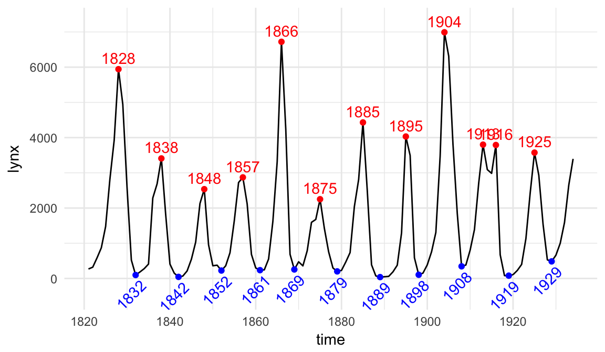
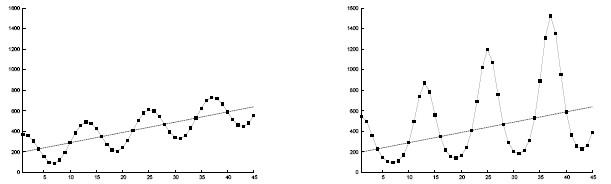
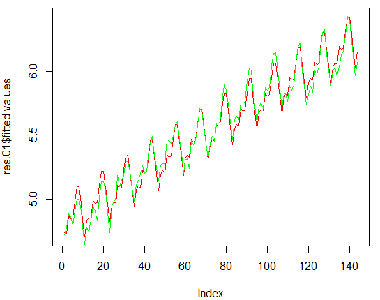
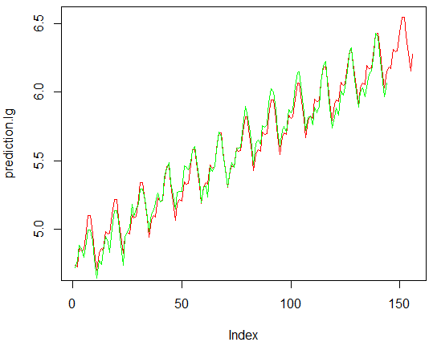
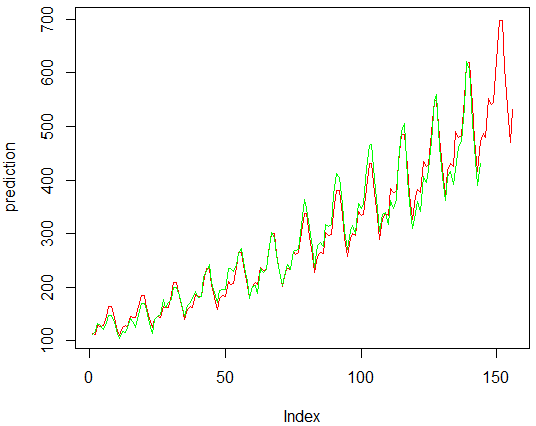

```{r, echo=FALSE}
data("AirPassengers")
```


## Содержание

* Прогноз. Виды прогностических моделей.
* Временной ряд.
* Последовательность работы над прогнозом.
* Линейная регрессия для коротких временных рядов.
* Экспоненциальное сглаживание. Метод Холта-Уинтерса.
* Оценка качества прогноза.


## Прогнозирование

**Прогноз** — это оценка будущего значения некоторой величины научными методами.

Прогнозы бывают качественные (высоко-средне-низко, растет-снижается) и количественные (конкретное число).

Количественные методы прогнозирования основываются разделяются на:

1. **причинно-следственные**: детерминированные математические модели (модель движения планет под действием сил гравитации); фундаментальный анализ в биржевой торговле.
2. **регрессионные**: связь между предикторами и откликом не обязательно причинно-следственная.
2. **временнЫе ряды**: нет никакой другой информации, кроме последовательности значений изучаемой переменной.


## Детектирование аномалий

При прогнозировании предполагается, что факторы, определявшие поведение рассматриваемой величины в прошлом, не изменят своего действия и в будущем.

Грамотно составленный прогноз должен выявить тенденции прошлого и распространить их в будущее. Если прогноз разойдется с действительностью, это будет означать, что в действие вступил **новый, ранее неизвестный фактор**.

Одна из целей прогноза: обнаружение необычных событий и оценка величины их воздействия.


## Временные ряды

**Временной ряд** — последовательность значений некоторого показателя $X$ (объема продаж, количества поломок) во времени. 

\small

Значение показателя $X$ в момент времени $t$ называют **уровнем** ряда.

$X$ может быть числом или вектором. В последнем случае говорят о многомерном временном ряде. Мы будем рассматривать одномерные временные ряды, где $X$ является числом.

{width=250px}


## Где используется прогнозирование временных рядов? 

\footnotesize

* Очевидное применение: прогноз объемов продаж. Кроме продаж есть закупки: товар нужно заказать (когда сделать заказ, чтобы на складе имелся запас?), разместить на складе (как изменяется свободное место на складе?), доставить заказчику (прогноз нагрузки на службу доставки позволит избежать коллапса логистики при пиковых нагрузках). В *планировании* этих операций мы сталкиваемся с временными рядами.
* Прогнозирование нагрузки на контактный центр, чтобы минимизировать затраты на фонд оплаты труда и обеспечить требуемую доступность контактного центра.
* Прогнозирование трафика позволяет определить количество серверов и пропускную способность канала для устойчивой работы, чтобы сервис не упал во время финала Лиги Чемпионов.
* Анализ сезонности и других видов цикличности, например при продаже билетов помогает ответить на вопрос: когда стоит делать скидки, а когда нет. *Важен не только прогноз, но и знание динамики отдельных компонент ряда.*
* Исследование связанности временных рядов позволяет *восстанить пропуски в данных*. Если один из рядов имеет пропуски, их можно восстановить, пользуясь связанным рядом.


## Составляющие временного ряда.

Временной ряд складывается из:

* устойчивой тенденции (тренда, $T$);
* cезонной составляющей ($S$), выражающейся в колебании значений показателя вокруг линии тренда;
* случайной составляющей (ошибки, $E$).

Понятие сезона может трактоваться широко: неделя, месяц, квартал, год или даже десятки лет. 

Иногда различают сезонную ($S$) и циклическую составляющие ($C$): сезонная соответствует месяцам года, циклическая имеет более короткий или длинный периоды.

Аддитивный ряд
$$
X = T + S + E .
$$

Мультипликативный ряд
$$
X = T \times S \times E .
$$


## Линейная регрессия

**Предупреждение:** это не самый лучший метод для прогнозирования временных рядов!

Лучше:

* экспоненциальное сглаживание;
* ARIMA.

**Но:** регрессионный анализ хорош для прогнозирования коротких временных рядов, когда для использования других методов недостаточно данных. А таких рядов много.


## Порядок работы с временным рядом

\Large

Построим график временного ряда и зададим себе 4 вопроса:

1. Есть ли у ряда тренд? 
2. Есть ли у ряда сезонность?
3. Меняет ли ряд свой характер?
4. Есть ли в данных выбросы?


## Прогнозирование пассажирских авиаперевозок

Международные пассажирские авиаперевозки (`series_g.csv` или набор данных AirPassengers).

Переменные:

1. date — Даты, по месяцам: с января 1949 по декабрь 1960 года.
2. series_g — Объем пассажирских авиаперевозок, в тысячах человек.

Построим график временного ряда и зададим себе 4 вопроса.

```{r,eval=FALSE}
ser.g.01 <- read.table("data/series_g.csv", 
                       header=T, sep=";")
plot(ser.g.01$series_g, type="l", ylab="series_g")
```


## 1. Есть ли у ряда тренд?

```{r,echo=FALSE}
ser.g.01 <- read.table("data/series_g.csv", header=T, sep=";")
plot(ser.g.01$series_g, type="l", ylab="series_g")
```

* Можно ли считать тренд линейным? Нелинейным?


## Линейный тренд

```{r, echo=FALSE}
data("AirPassengers")
plot(AirPassengers)
abline(reg=lm(AirPassengers ~ time(AirPassengers)))
```


## 2. Есть ли у ряда сезонность?



* Если сезонность есть, то к какому виду она относится: аддитивному или мультипликативному?


## 3. Меняет ли ряд свой характер?

\scriptsize

```{r, echo=FALSE}
wine <- read.table("data/wine_Austral.dat", sep="\t", header = T)
# Преобразуем год и месяц в дату
x <- paste(wine$year_,wine$month_,sep="-")
date <- as.Date(paste(x,"-01",sep=""))
plot(date, wine$sweet, type="b", ylab="sweet")
```

Пример ряда, меняющего свой характер (тренд, сезонность, автоковариация) — потребление ликеров в Австралии.

График помогает отрезать данные, которые уже устарели.


## Особенность линейного тренда


\tiny

Источник: https://www.kdnuggets.com/2017/02/hill-data-scientist-xkcd-story.html


## 4. Есть ли в данных выбросы?

Значения ряда AirPassengers, взятые по месяцам:

```{r,echo=FALSE}
boxplot(AirPassengers~cycle(AirPassengers))
```

Выбросы можно заменять на более разумные значения.


## Последовательность работы над прогнозом

Построить график и задать себе 4 вопроса:

1. Есть ли у ряда тренд? 
    * Можем ли мы аналитически описать этот тренд? (линейный, нелинейный)
2. Есть ли сезонность?
    * Если сезонность есть, то к какому виду она относится: аддитивному или мультипликативному?
3. Меняет ли ряд свой характер? (Помогает отрезать данные, которые уже устарели)
4. Есть ли в данных выбросы? (Их можно заменять на более разумные значения)


## У нас

* Тренд есть, тренд линейный.
* Сезонность есть, мультипликативная.
* Ряд характер не меняет.
* Выбросов не наблюдается. 

Чтобы из мультипликативной модели
$$
X = T \times S \times E
$$
получить уравнение регрессии вида (аддитивную модель)
$$
X = b_0 + \sum_{i=1}^N b_i T_i ,
$$
логарифмируем временной ряд
$$
\ln X = \ln T + \ln S + E .
$$

Для получения прогноза нужно выполнить потенцирование.


## Построим линию тренда

```{r, eval=F}
log.ser.g <- log(ser.g.01$series_g)

# Таблица с логарифмами и временем
ser.g.02 <- data.frame(log.ser.g, time = seq(log.ser.g))

# Строим регрессионную модель, зависящую только от времени
res.01 <- lm(log.ser.g ~ time, ser.g.02)

# Графики
plot(log.ser.g, type="l")
abline(reg=res.01)
```


##

```{r, echo=F}
log.ser.g <- log(ser.g.01$series_g)
plot(log.ser.g, type="l")
ser.g.02 <- data.frame(log.ser.g, time = seq(log.ser.g))
abline(reg=lm(log.ser.g ~ time, ser.g.02))
```


## Индикаторные переменные (dummy variables)

Нужны, чтобы моделировать сезонность (12 месяцев)
$$
Y = b_0 + b_1 T + \sum_{i=1}^{12} c_i D_i
$$
$D_i$ равна 1 для $i$-го месяца и 0 для остальных.

\scriptsize

```
    log.ser.g time. month.01 month.02 month.03 month.04  ... month.12
1    4.718499     1        1        0        0        0             0
2    4.770685     2        0        1        0        0             0
3    4.882802     3        0        0        1        0             0
4    4.859812     4        0        0        0        1             0
5    4.795791     5        0        0        0        0             0
6    4.905275     6        0        0        0        0             0
7    4.997212     7        0        0        0        0             0
8    4.997212     8        0        0        0        0             0
9    4.912655     9        0        0        0        0             0
10   4.779123    10        0        0        0        0             0
11   4.644391    11        0        0        0        0             0
12   4.770685    12        0        0        0        0             1
13   4.744932    13        1        0        0        0             0
...
```


## 

\small

Добавляем в ser.g.02 столбцы, соответствующие индикаторным переменным:

```{r, eval=FALSE}
res.01 <- lm(log.ser.g ~ time. + month.01 + month.02 + 
               month.03 + month.04 + month.05 + month.06 + 
               month.07 + month.08 + month.09 + month.10 + 
               month.11 + month.12, ser.g.02)
summary(res.01)
```
\scriptsize

```
Coefficients: (1 not defined because of singularities)
              Estimate Std. Error t value Pr(>|t|)    
(Intercept)  4.7054593  0.0194850 241.491  < 2e-16 ***
time.        0.0100688  0.0001193  84.399  < 2e-16 ***
month.01     0.0213211  0.0242461   0.879 0.380816    
month.02    -0.0007338  0.0242400  -0.030 0.975897    
month.03     0.1294934  0.0242344   5.343 3.92e-07 ***
month.04     0.0982245  0.0242294   4.054 8.59e-05 ***
month.05     0.0958519  0.0242250   3.957 0.000124 ***
month.06     0.2179981  0.0242212   9.000 2.25e-15 ***
month.07     0.3219404  0.0242179  13.293  < 2e-16 ***
month.08     0.3126456  0.0242153  12.911  < 2e-16 ***
month.09     0.1680110  0.0242132   6.939 1.64e-10 ***
month.10     0.0298527  0.0242118   1.233 0.219790    
month.11    -0.1138650  0.0242109  -4.703 6.41e-06 ***
month.12            NA         NA      NA       NA    
```


## Ловушка индикаторных переменных (dummy variables trap)

или уже знакомая коллинеарность.
$$
Y = b_0 + b_1 T + \sum_{i=1}^{12} c_i D_i
$$
В матричном виде
$$
\left[
\begin{array}{c}
y_1    \\
y_2    \\
\ldots \\
y_{144}
\end{array}
\right] = 
\left[
\begin{array}{cccccc}
1 & 1 & 1 & 0 & \ldots & 0 \\
1 & 2 & 0 & 1 & \ldots & 0 \\
\ldots & & & \ldots &  & \ldots \\
1 & 12 & 0 & 0 & \ldots & 1 \\
1 & 13 & 1 & 0 & \ldots & 0 \\
\ldots & & & \ldots &  & \ldots \\
1 & 144 & 0 & 0 & \ldots & 1 \\
\end{array}
\right]
\left[
\begin{array}{c}
b_0    \\
b_1    \\
c_1    \\
c_2    \\
\ldots \\
c_{12}
\end{array}
\right]
$$

Складывая столбцы с $c_1,\ldots, c_{12}$, получим столбец из одних 1, совпадающий со столбцом для $b_0$. **Налицо линейная зависимость!**


## Решение проблемы

Будем рассматривать не $N=12$ индикаторных переменных (по числу сезонов), а $N-1=11$. Тогда коэффициенты при индикаторных переменных приобретут вид $c_i-c_1$ и будут рассматриваться как значения относительно базового месяца (например, января).

$$
Y = (b_0-c_1) + b_1 T + \sum_{i=2}^{12} (c_i-c_1) D_i
$$


## Берем за базу берем январь

\small

```{r,eval=F}
res.01 <- lm(log.ser.g ~ time. +              month.02 + 
               month.03 + month.04 + month.05 + month.06 + 
               month.07 + month.08 + month.09 + month.10 + 
               month.11 + month.12, ser.g.02)
#  Просмотр результатов
summary(res.01)
```

\scriptsize

```
Coefficients:
              Estimate Std. Error t value Pr(>|t|)    
(Intercept)  4.7267804  0.0188935 250.180  < 2e-16 ***
time.        0.0100688  0.0001193  84.399  < 2e-16 ***
month.02    -0.0220548  0.0242109  -0.911  0.36400    
month.03     0.1081723  0.0242118   4.468 1.69e-05 ***
month.04     0.0769034  0.0242132   3.176  0.00186 ** 
month.05     0.0745308  0.0242153   3.078  0.00254 ** 
month.06     0.1966770  0.0242179   8.121 2.98e-13 ***
month.07     0.3006193  0.0242212  12.411  < 2e-16 ***
month.08     0.2913245  0.0242250  12.026  < 2e-16 ***
month.09     0.1466899  0.0242294   6.054 1.39e-08 ***
month.10     0.0085316  0.0242344   0.352  0.72537    
month.11    -0.1351861  0.0242400  -5.577 1.34e-07 ***
month.12    -0.0213211  0.0242461  -0.879  0.38082    
```


## В R всё проще: сезонные индикаторы — это факторы

\small

```{r,eval=FALSE}
#  Время
time <- 1:144
#  Сезонные индикаторы
month <- as.factor(rep(1:12,12))
# Объединяем результаты в таблицу
ser.g.02 <- data.frame(log.ser.g, time, month)
# Убеждаемся, что сезонные индикаторы заданы фактором.
# Иначе не избежать ловушки индикаторных переменных
class(ser.g.02$month)
```

\scriptsize

```
    log.ser.g time month
1    4.718499    1     1
2    4.770685    2     2
3    4.882802    3     3
4    4.859812    4     4
5    4.795791    5     5
6    4.905275    6     6
7    4.997212    7     7
8    4.997212    8     8
9    4.912655    9     9
10   4.779123   10    10
```


## Строим линейную регрессионную модель

\small

```{r, eval=FALSE}
res.01 <- lm(log.ser.g ~ ., ser.g.02)
summary(res.01)
```

\scriptsize

```
Coefficients:
              Estimate Std. Error t value Pr(>|t|)    
(Intercept)  4.7267804  0.0188935 250.180  < 2e-16 ***
time         0.0100688  0.0001193  84.399  < 2e-16 ***
month2      -0.0220548  0.0242109  -0.911  0.36400    
month3       0.1081723  0.0242118   4.468 1.69e-05 ***
month4       0.0769034  0.0242132   3.176  0.00186 ** 
month5       0.0745308  0.0242153   3.078  0.00254 ** 
month6       0.1966770  0.0242179   8.121 2.98e-13 ***
month7       0.3006193  0.0242212  12.411  < 2e-16 ***
month8       0.2913245  0.0242250  12.026  < 2e-16 ***
month9       0.1466899  0.0242294   6.054 1.39e-08 ***
month10      0.0085316  0.0242344   0.352  0.72537    
month11     -0.1351861  0.0242400  -5.577 1.34e-07 ***
month12     -0.0213211  0.0242461  -0.879  0.38082    
---
Signif. codes:  0 ‘***’ 0.001 ‘**’ 0.01 ‘*’ 0.05 ‘.’ 0.1 ‘ ’ 1

Residual standard error: 0.0593 on 131 degrees of freedom
Multiple R-squared:  0.9835,	Adjusted R-squared:  0.982 
```


## Подгонка для логарифма ряда

\small

```{r,eval=FALSE}
#  Нарисуем линии: красный - подгонка, зеленый - ряд
plot(res.01$fitted.values, type="l", col="red")
lines(ser.g.02$log.ser.g, col="green")
```

{width=250px}

## Прогнозирование логарифма ряда

\scriptsize

```{r,eval=FALSE}
# Создаем таблицу для новых значений
ser.g.03 <- data.frame(time=145:156, month=factor(1:12))
# Делаем прогноз при помощи модели res.01
прогноз.lg = predict.lm(res.01, ser.g.03)
# Объединяем подгонку и прогноз
prediction.lg <- c(res.01$fitted.values, прогноз.lg)
# Выводим на график
plot(prediction.lg, type="l", col="red")
lines(ser.g.02$log.ser.g, col="green")
```

{width=250px}


##

Функция `predict.lm` строит прогноз для новых значений переменных из таблицы `ser.g.03`, основываясь на результатах полученной линейной модели `res.01`.

Модель `res.01` можно сохранить в базе данных.

Вместо новой таблицы `ser.g.03` можно дополнить таблицу `ser.g.02` "запасом" из исходных данных для прогноза (`time`, `month`). Для этих данных фрагмент столбца `log.ser.g` будет пустым (`NA`). R достаточно умен, чтобы игнорировать этот "хвост" при создании линейной модели. 


## Прогноз: график

\scriptsize

```{r, eval=FALSE}
# Потенцируем результат
prediction  <- exp(prediction.lg)
# Выводим результат и прогноз
plot(prediction, type="l", col="red")
lines(ser.g.01$series_g, col="green")
```

{width=300px}


## Прогноз: результаты

```{r, eval=F}
exp(прогноз.lg)
```

```
       1        2        3        4        5        6
528.8388 534.1795 539.5742 545.0234 550.5276 556.0874 
       7        8        9        10       11       12 
561.7034 567.3760 573.1060  578.8938 584.7401 590.6454
```


## Вернемся к таблице коэффициентов

\small

```
Coefficients:
              Estimate Std. Error t value Pr(>|t|)    
(Intercept)  4.7267804  0.0188935 250.180  < 2e-16 ***
time         0.0100688  0.0001193  84.399  < 2e-16 ***
month2      -0.0220548  0.0242109  -0.911  0.36400    
month3       0.1081723  0.0242118   4.468 1.69e-05 ***
month4       0.0769034  0.0242132   3.176  0.00186 ** 
month5       0.0745308  0.0242153   3.078  0.00254 ** 
month6       0.1966770  0.0242179   8.121 2.98e-13 ***
month7       0.3006193  0.0242212  12.411  < 2e-16 ***
month8       0.2913245  0.0242250  12.026  < 2e-16 ***
month9       0.1466899  0.0242294   6.054 1.39e-08 ***
month10      0.0085316  0.0242344   0.352  0.72537    
month11     -0.1351861  0.0242400  -5.577 1.34e-07 ***
month12     -0.0213211  0.0242461  -0.879  0.38082    
---
Signif. codes:  0 ‘***’ 0.001 ‘**’ 0.01 ‘*’ 0.05 ‘.’ 0.1 ‘ ’ 1
```

Что она нам подсказывает?


## Достаточно ли данных? 

**Эмпирическое правило:** чтобы данных было достаточно для качественного прогноза на каждую переменную должно приходится по 30 наблюдений.

Исходят из того, что 30 наблюдений достаточно для хорошего представления данных, распределенных по нормальному закону.

У нас 12 переменных (время + сезонные поправки). Нужно 12*30=360 наблюдений, а есть всего 144.

Декабрьскую, январскую и февральскую сезонные поправки можно объединить в "зимнюю" поправку.

Объединение улучшит модель, так как на одну переменную будет приходится больше наблюдений. Теперь их нужно только 10*30=300, а не 360.

\scriptsize

Можно пойти дальше. Близость коэффициентов 7-го и 8-го месяцев намекает  взять в качестве базы 7-й месяц. Если сезонная поправка для 8-го месяца станет нулевой, то можно объединить 7-й с 8-м месяцем.

А далее, может быть, объединятся 4-й и 5-й месяцы?


## Прогноз продаж красного вина в Австралии

Набор данных о продажах вин в Австралии (`wine_Austral.dat`).

Ежемесячные данные с января 1980 по июнь 1994.

* fort — крепленые (тысячи литров)
* dry — сухие вина  (тысячи литров)
* sweet — сладкие вина  (тысячи литров)
* red — красные вина  (тысячи литров)
* rose — розовые вина  (тысячи литров)
* spark — игристые вина  (тысячи литров)
* total — общие продажи вин производителями в бутылках объемом не более одного литра

Необходимо построить прогноз на 8 месяцев.


## Читаем данные и строим график

\scriptsize

```{r, fig.height=6.5}
#  Шаг 0. Прочитаем данные. Внимание: разделитель полей Tab!
wine <- read.table("data/wine_Austral.dat", header=T, sep="\t")
#  Шаг 1. Предварительный анализ: построим график ряда
plot(wine$red, type="l")
```

## Результаты предварительного анализа

Из графика видно, что:

* Тренд есть, тренд линейный.
* Сезонность есть, мультипликативная.

Чтобы получить аддитивную сезонность,  можно попробовать рассмотреть логарифм ряда.


##  Шаг 2. Преобразование временного ряда

```{r}
log.wine <- log(wine$red)
#  Посмотрим результат на графике
plot(log.wine, type="l")
```


## Анализ логарифмированных данных

*  Тренд есть, тренд примерно линейный.
*  Сезонность есть, аддитивная.

Выводы:

* Преобразование привело к желаемому результату.
* Можно строить регрессионную модель с линейным трендом


##  Шаг 3. Создание дополнительных переменных

Создаем независимые переменные. Делаем это с запасом на те месяцы, 
для которых будет строиться прогноз

```{r}
len <- nrow(wine)+8 # Нужно 175+8 строк
#  Время
time <- 1:len
#  Сезонные индикаторы
month <- as.factor(rep_len(1:12, len))
#  Чтобы уравнять длины всех векторов 
#  добавим к исходным данным пропущенные значения
log.wine[175:len] <- NA
#  Для удобства работы склеиваем из векторов таблицу
wine.02 <- data.frame(log.wine, time,  month)
```


##  Шаг 4. Регрессионный анализ

\small

```{r,echo=FALSE}
res.01 <- lm(log.wine ~ . , wine.02)
```
```{r,eval=FALSE}
#  Линейная регрессия. За базу автоматически берется январь
res.01 <- lm(log.wine ~ . , wine.02)
#  Просмотр результатов
summary(res.01)
```

\scriptsize

```
Coefficients:
             Estimate Std. Error t value Pr(>|t|)    
(Intercept) 6.2131856  0.0348337  178.37  < 2e-16 ***
time        0.0055557  0.0001824   30.45  < 2e-16 ***
month2      0.2968686  0.0441120    6.73 2.83e-10 ***
month3      0.4719070  0.0441131   10.70  < 2e-16 ***
month4      0.5686400  0.0441150   12.89  < 2e-16 ***
month5      0.6984818  0.0441176   15.83  < 2e-16 ***
month6      0.7248984  0.0441210   16.43  < 2e-16 ***
month7      0.9315212  0.0448924   20.75  < 2e-16 ***
month8      0.9233443  0.0448928   20.57  < 2e-16 ***
month9      0.6769936  0.0448939   15.08  < 2e-16 ***
month10     0.5809970  0.0448957   12.94  < 2e-16 ***
month11     0.6657786  0.0448983   14.83  < 2e-16 ***
month12     0.7244539  0.0449017   16.13  < 2e-16 ***
---
Signif. codes:  0 ‘***’ 0.001 ‘**’ 0.01 ‘*’ 0.05 ‘.’ 0.1 ‘ ’ 1
```


##  Шаг 5. Подгонка для логарифма ряда

\small

Похоже, что тренд параболический: сначала реальный ряд выше подгонки, а затем начинает снижаться.
```{r}
plot(res.01$fitted.values,  type="l", col="red")
lines(wine.02$log.wine, col="green")
```


## Попытка с параболическим трендом

```{r, eval=FALSE}
#  Время
time <- 1:len
time2 <- time*time
...
wine.03 <- data.frame(log.wine, time, time2, month)
```

\scriptsize

```
              Estimate Std. Error t value Pr(>|t|)    
(Intercept)  6.128e+00  3.811e-02 160.795  < 2e-16 ***
time         8.549e-03  6.960e-04  12.283  < 2e-16 ***
time2       -1.711e-05  3.853e-06  -4.440 1.67e-05 ***
month2       2.968e-01  4.175e-02   7.109 3.67e-11 ***
month3       4.718e-01  4.175e-02  11.300  < 2e-16 ***
month4       5.685e-01  4.176e-02  13.616  < 2e-16 ***
month5       6.984e-01  4.176e-02  16.725  < 2e-16 ***
month6       7.249e-01  4.176e-02  17.358  < 2e-16 ***
month7       9.256e-01  4.251e-02  21.772  < 2e-16 ***
month8       9.173e-01  4.251e-02  21.577  < 2e-16 ***
month9       6.709e-01  4.251e-02  15.781  < 2e-16 ***
month10      5.749e-01  4.252e-02  13.523  < 2e-16 ***
month11      6.598e-01  4.252e-02  15.517  < 2e-16 ***
month12      7.185e-01  4.252e-02  16.898  < 2e-16 ***
```


## График с параболическим трендом

```{r,echo=FALSE}
#  Шаг 3. Создание дополнительных переменных

#  Время

time <- 1:len
time2 <- time*time

#  Сезонные индикаторы

month <- as.factor(rep_len(1:12, len))

#  Чтобы уравнять длины всех векторов 
#  добавим к исходным данным пропущенные значения

log.wine[175:len] <- NA

#  Для удобства работы склеиваем из векторов таблицу

wine.03 <- data.frame(log.wine, time, time2, month)

#  Шаг 4. Регрессионный анализ

#  Линейная регрессия.
#  за базу автоматически берется январь

res.02 <- lm(log.wine ~ . , wine.03)


#  Шаг 5. Подгонка для логарифма ряда

#  График. Сравним подгонку и ряд из логарифмов

plot(res.02$fitted.values,  type="l", col="red")
lines(wine.02$log.wine, col="green")
```

Стало лучше. Особенно в интересующей нас правой части графика.


## Итоги

```{r, echo=FALSE}
#  Шаг 6. Прогнозирование логарифма ряда

# Делаем прогноз при помощи модели res.02
прогноз.lg = predict.lm(res.02, wine.03)

# Потенцируем результат
prediction  <- exp(прогноз.lg)

# Выводим результат и прогноз
plot(prediction, type="l", col="red")
lines(wine$red, col="green")
```

\small

Возможно следует отрезать первые 4 года наблюдений и это позволит точнее прогнозировать размах сезонных колебаний на оставшейся части ряда (у первых 4-х лет он меньше).


## Метод экспоненциального сглаживания

Зачем понадобился еще один метод прогнозирования?

Недостатки регрессионного анализа для прогнозирования временных рядов:

* Тренд остается постоянным (прямая, парабола), тогда как в действительности он может измениться.
* Сезонность одна и та же от начала до конца измерений.

Регрессионные модели плохо работают при прогнозировании рядов, составляющие которых меняются со временем.

Этих недостатков лишен **метод экспоненциального сглаживания**. Кроме того, это очень простой метод.


## Модель экспоненциального сглаживания

$$
\begin{aligned}
\hat{x}_{0}&=x_{0}\\
\hat{x}_{t}&=\alpha x_{t}+(1-\alpha )\hat{x}_{t-1},\ t>0
\end{aligned}
$$

* $x_t$ — значение ряда в момент времени $t$;
* $\hat{x}_t$ — подогнанное значение в момент времени $t$;
* $\alpha$ — постоянная сглаживания (smoothing factor), $0 < \alpha < 1$.

При расчете прогноза методом экспоненциального сглаживания учитывается отклонение предыдущего прогноза от реального значения ряда
$$
\hat{x}_{t} = \hat{x}_{t-1} + \alpha(x_{t}-\hat{x}_{t-1})
$$


## Почему "экспоненциальное" и почему "сглаживание"?

\footnotesize

$$
\begin{aligned}
\hat{x}_{t}&=\alpha x_{t}+(1-\alpha)\hat{x}_{t-1}\\[3pt]
     &=\alpha x_{t}+\alpha (1-\alpha)x_{t-1}+(1-\alpha )^{2}\hat{x}_{t-2}\\[3pt]
     &=\alpha \left[x_{t}+(1-\alpha)x_{t-1}+(1-\alpha)^{2}x_{t-2}+(1-\alpha)^{3}x_{t-3}+\cdots + (1-\alpha)^{t-1}x_{1}\right]+\\
     &+(1-\alpha)^{t}x_{0}.
\end{aligned}
$$

\normalsize

Прогноз строится на основе предыдущих наблюдений, взятых с коэффициентами ${1, (1 - \alpha), (1 - \alpha)^2, (1 - \alpha)^3, ...}$, образующими убывающую ($0<\alpha<1$) геометрическую прогрессию. 

Геометрическая прогрессия является дискретный аналогом **экспоненциальной функции**. Получается, что вес наблюдений убывает по экспоненте — более старые наблюдения имеют меньший вес.

**Сглаживание**, потому что очередное значение прогноза получается как линейная комбинация предыдущих значений, что позволяет отфильтровать (сгладить) сезонную составляющую.


## Двойное экспоненциальное сглаживание

\small

Если ряд имеет тренд, значения такого ряда записываются как
$$
\hat{x}_t = a + bt .
$$
Тогда
$$
b = \hat{x}_t - \hat{x}_{t-1}
$$

Позволим теперь уровню $a$ и тренду ряда $b$ зависеть от времени.

Для $t = 1$
$$
\begin{aligned}
\hat{x}_{t} &= x_{t},\\
b_{t} &= x_{t}-x_{t-1}.\\
\end{aligned}
$$
Для $t > 2$
$$
\begin{aligned}
\hat{x}_t &= a_t + b_t \cdot t,\\
a_{t} &= \alpha x_{t}+(1-\alpha)(a_{t-1}+b_{t-1})\\
b_{t} &= \beta (a_{t}-a_{t-1})+(1-\beta )b_{t-1}\\
\end{aligned}
$$

* $\alpha$ — показатель сглаживания для уровня, $0< \alpha <1$;
* $\beta$ — показатель сглаживания для тренда, $0< \beta <1$.

$$
b_{t}=b_{t-1} + \beta (a_{t}-(a_{t-1}+b_{t-1})) .
$$


## Локальный тренд

Учет изменения тренда при помощи дополнительного экспоненциального сглаживания предложен Холтом (Holt) в 1957 г.

$b_{t}$ называют **локальным трендом**. Он позволяет ряду подстраиваться под изменение тренда. Но если тренд будет меняться слишком часто, такой метод прогноза будет работать плохо.

$a_{t}$ — **локальный уровень**.

Может теперь добавить в ряд сезонность?


## Метод Холта-Уинтерса

Тройное экспоненциальное сглаживание дает метод Холта-Уинтерса (Holt-Winters).

Модель с аддитивной сезонной составляющей:

$$
\begin{aligned}
\hat{x}_{t} &= a_t + b_t \cdot t + s_{t-L+1+(t-1) \mod L},\\
a_t &= \alpha (x_{t}-s_{t-L})+(1-\alpha)(a_{t-1}+b_{t-1}),\\
b_t &= \beta (a_{t}-a_{t-1})+(1-\beta)b_{t-1},\\
s_t &= \gamma (x_{t}-a_{t-1})+(1-\gamma)s_{t-L}.
\end{aligned}
$$

* $s_t$ — **локальная сезонность**;
* $\gamma$ — показатель сглаживания для сезонных изменений, $0< \gamma <1$;
* $L$ — длина периода (сезона).


## Модель с мультипликативной сезонной составляющей

$$
\begin{aligned}
\hat{x}_t&=(a_t+b_t \cdot t) \cdot s_{t-L+1+(h-1)\mod L},\\
a_t&=\alpha {\frac {x_{t}}{s_{t-L}}}+(1-\alpha)(a_{t-1}+b_{t-1}),\\
b_t&=\beta (a_{t}-a_{t-1})+(1-\beta)b_{t-1},\\
s_t&=\gamma {\frac {x_{t}}{a_{t}}}+(1-\gamma)s_{t-L}.\\
\end{aligned}
$$


##

Чтобы прогнозировать значения ряда с трендом и сезонной составляющей нам нужно задать значения трех параметров: $\alpha$, $\beta$, $\gamma$.

Область применения метода Холта-Уинтерса: краткосрочные прогнозы — на несколько месяцев вперед.


## Как найти $\alpha$, $\beta$ и $\gamma$

Ищем величины $\alpha$, $\beta$, $\gamma$ и начальных значений параметров сглаживания, которые минимизируют сумму квадратов ошибок (sum of squared errors)
$$
SSE=\sum _{t=1}^{T}(x_t-\hat{x}_t)^{2}=\sum _{t=1}^{T}e_{t}^{2}
$$
$e_{t}=x_{t}-\hat{x}_t$ — ошибки прогноза.

$t=1,…,T$.


## Пример: прогнозирование международных авиаперевозок

```{r, eval=FALSE}
#  Шаг 0. Прочитаем данные
ser.g.01 <- read.table("data/series_g.csv", 
                       header=T, sep=";")
#  Проверка: импортировали правильно?
summary(ser.g.01)

#  Шаг 1. Создадим временной ряд
ser.g.02 <- ts(data = ser.g.01[ ,2], frequency = 12, 
               start = c(1949, 1) )
```

`ts()` создает временной ряд (объект `ts`) — вектор с информацией о периоде сезонной составляющей (`frequency = 12`) и начальной дате ряда (`start = с(год, месяц)`).


## Временной ряд, созданный ts()

```{r,echo=FALSE}
#  Шаг 0. Прочитаем данные
ser.g.01 <- read.table("data/series_g.csv", header=T, sep=";")
#  Шаг 1. Создадим временной ряд
ser.g.02 <- ts(data = ser.g.01[ ,2], frequency = 12, start = c(1949, 1) )
#  Проверка: что получилось?
ser.g.02
```


## Рассмотрим график

```{r}
plot(ser.g.02)
```


## Проведем экспоненциальное сглаживание

```{r}
ser.g.HW <- HoltWinters(ser.g.02, seasonal = "mult")
```

Поиск параметров производится функцией оптимизации `optim()` (метод Нелдера-Мида).

* `optim.start` — начальные значения параметров: `c(alpha = 0.3, beta = 0.1, gamma = 0.1)`
* `optim.control` — передача списка параметров в функцию `optim`.

Простое экспоненциальное сглаживание с заданным коэффициентом $\alpha$:

```{r,eval=FALSE}
HoltWinters(ser.g.02, alpha=0.1, beta=FALSE, gamma=FALSE)
```


## `print(ser.g.HW)`

\tiny

```{r, echo=F}
print(ser.g.HW)
```

\small

Локальные значения $a$, $b$ и $s_i$ приведены для конца ряда.


## Визуализация составляющих ряда

```{r}
plot(fitted(ser.g.HW))
```


##

Объект класса "HoltWinters" содержит поле fitted с несколькими временными рядами. Функция fitted() возвращает значение этого поля:

* подогнанный временной ряд (xhat), 
* локальный уровень (a), 
* локальный тренд (b)
* сезонные компоненты (s1-s12)


## Прогнозируем: `predict()`

Прогнозируем на год вперед.

`n.ahead` — на сколько месяцев вперед прогнозировать

\scriptsize

```{r}
ser.g.predict <- predict(ser.g.HW, n.ahead=12)
ser.g.predict
```


## Строим график исходного ряда, подгонки и прогноза

```{r}
ts.plot(ser.g.02, ser.g.predict, ser.g.HW$fitted[,1], 
        col=c("black", "red", "orange"))
```


## Посмотрим доверительный интервал прогноза

```{r}
ser.g.predict <- predict(ser.g.HW, n.ahead=12, 
                    prediction.interval = T, level = 0.95)
plot(ser.g.HW, ser.g.predict)
```


## Когда экспоненциальное сглаживание проигрывает линейной регрессии

У коротких временных рядов (несколько сезонов) для качественного экспоненциального сглаживания недостаточно данных, тогда как предположение о постоянстве тренда и сезонных поправок вполне работоспособно.


## Как оценить ошибку прогноза?

1. Перед проведением анализа исходный временной ряд укорачивается на 7—10% (последний месяц, квартал и т.п.), и этот "хвост" ряда сохраняется для дальнейшего анализа.
2. Строится прогноз укороченного ряда на отрезанный период и результат сравнивается с отложенными данными. 

Если под конец наблюдаемого периода на поведение ряда не повлияли новые факторы, то полученная ошибка будет оценкой ошибки на будущий (прогнозный) период.


## Метрики ошибок

$$
\text{Root Mean Square Error (RMSE)} = \sqrt{\frac{1}{n}\sum_{t=1}^n (x_t - \hat{x}_t)^2} .
$$

$$
\text{Mean Absolute Error (MAE)} = \frac{1}{n}\sum_{t=1}^n |x_t - \hat{x}_t| .
$$

И множество других.


## Как выбрать метод прогноза?

Само по себе знание ошибки прогноза для "хвоста" ряда мало что дает при оценке качества модели.

Если построенная модель дает такую же ошибку, как модель "сегодняшнее значение - прогноз на завтра", то стоило ли огород городить?

Поэтому:

1. сравниваем прогноз с прогнозом по базовой (простейшей) модели. Если ваша модель точнее - продолжаем ею заниматься;
2. среди моделей, прошедших сравнение с базовой, выбираем ту, что дает наименьшую ошибку прогноза (RMSE, MAE и т.п.).


## Данные о продажах пива в Австралии

```{r}
library(forecast)
load("data/ausbeer.rda")
beer <- window(ausbeer, start=1992, end=2006-.1)
```
```{r,echo=F}
plot(beer)
```


## Среднее значение предыдущих наблюдений

```{r}
# h=5 - прогноз делается на ближайшие 5 наблюдений.  
forecast.1 <- meanf(beer, h=5)
```
```{r,echo=F}
plot(forecast.1)
```


## Наивный прогноз: по последнему значению ряда

```{r}
forecast.2 <- naive(beer, h=5)
```
```{r,echo=F}
plot(forecast.2)
```


## Наивный прогноз с учетом сезонности

```{r}
# Прогноз равен последнему наблюдаемому значению
# того же сезона.
forecast.3 <- snaive(beer, h=5)
```
```{r,echo=F}
plot(forecast.3)
```


## Метод Холта-Уинтерса

```{r}
forecast.4 <- hw(beer, h=5)
```
```{r,echo=F}
plot(forecast.4)
```


## Доверительные интервалы в forecast::plot

Темно-серый цвет на графиках отображает 95%-й доверительный интервал прогноза, светло-серый - 80%-й доверительный интервал. 

Уровни доверия задаются параметром `level` функций прогноза. По умолчанию: 'level = c(80, 95)'.


## Сравнение точности моделей

\tiny

```{r}
beer_test <- window(ausbeer, start=2006)
accuracy(forecast.1, beer_test)
```
```{r,echo=F}
accuracy(forecast.2, beer_test)
accuracy(forecast.3, beer_test)
accuracy(forecast.4, beer_test)
```


## Дополнительная информация

* [*Hyndman R. J., Athanasopoulos G.* Forecasting: Principles and Practice](https://otexts.org/fpp2/)
* [*forecast*](https://cran.r-project.org/web/packages/forecast/) — наиболее популярный пакет R для прогнозирования одномерных временных рядов. От Роба Хиндмана (Rob Hyndman) и компании.
* [*Quick-R.* Time Series and Forecasting](http://www.statmethods.net/advstats/timeseries.html) — сводка функций R, посвященных прогнозированию временных рядов, с сайта Р. Кабакова.
* [*r-statistics.co by Selva Prabhakaran.* Time Series Analysis](http://r-statistics.co/Time-Series-Analysis-With-R.html) — анализ временных рядов для новичков.
* [*Ostertagová E., Ostertag O.* Regression Analysis and Seasonal Adjustment of Time Series](http://pubs.sciepub.com/automation/3/3/16/index.html) —  моделирование сезонной компоненты с помощью тригонометрических функций.

