```{r,echo=FALSE}
data(iris)
```


## Содержание

* Постановка задачи классификации.
* Метод k-го ближайших соседей.
* Кроссвалидация (перекрестная проверка).


## Обучение с учителем (supervised learning)

\small

Дан набор данных $(X_i,y_i)$, где $X_i = (x_{1i}, x_{2i}, \ldots, x_{ni})$ — предикторы, $y_i$ — отклик.

\tiny

```{r, echo=FALSE}
iris[1:4,]
```

\small

Обучение. 

\scriptsize

Cтроится функция потерь, отражающая различие между реальным откликом и его модельным приближением -- ошибку, и зависящая от параметров алгоритма. Находится минимум этой функции. Параметрам алгоритма присваиваются те значения, при которых ошибка будет наименьшей. *Это не единственный способ обучения!*

\small

Прогноз. На вход алгоритма подаются новые данные — предикторы $X_i^{new}$

\tiny

```{r, echo=FALSE}
iris[100:103,-5]
```

\small

Обученный алгоритм вычисляет соответствующее этим предикторам значение отклика.


## Классификация и регрессия

Классификация и регрессия — разновидности задачи обучения с учителем, то есть обучения на готовых образцах.

В задачах регрессии множество $y_i$ — непрерывное (действительные числа). В задачах классификации $y_i$ — дискретное и конечное (например, 0 и 1). Каждый отклик $y_i$ указывает на класс, к которому относятся наблюдения.

{width=275px}

\tiny

Источник: https://www.fcodelabs.com/2018/12/13/Machine-Learning-Intro/


## Классификация и кластеризация

Обе делят полученные данные на группы (классы, кластеры).

Но: классификация нуждается в образцах для обучения, кластеризация в образцовых данных не нуждается.

Кластеризация — метод обучения без учителя (без образцов) — unsupervised learning.


## Метод k ближайших соседей

Метод k ближайших соседей (k-Nearest Neighbors, kNN):

* очень прост
* нечувствителен к выбросам
* обладает полезными математическими свойствами

### Нужны всего 2 управляющих параметра 

1. k — число ближайших соседей.
2. Способ вычисления расстояния между объектами.


## k = 1, "Скажи мне, кто твой друг, и я скажу кто ты" (Эврипид)

k = 1 — объект относится к тому же классу, что и его ближайший сосед.

Ближайший — значит максимально похожий. Снова возникает вопрос:
как задать расстояние между объектами (наблюдениями)?

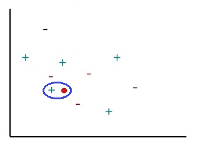{width=200px}


## k > 1 

Объект относится к тому классу, члены которого составляют большинство среди его k ближайших соседей.

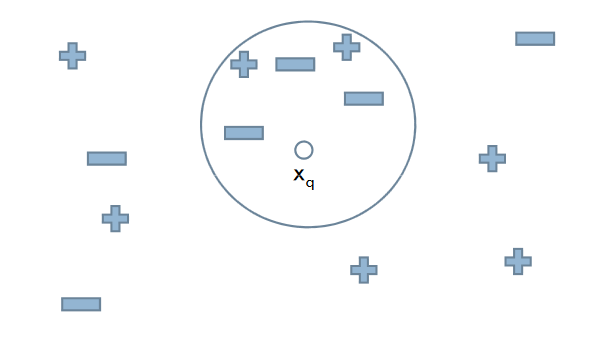


## Сколько соседей выбрать?

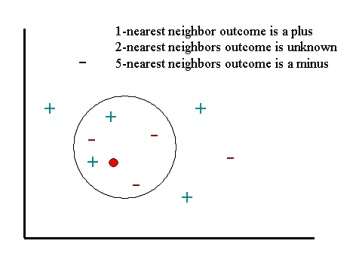{width=270px}

\tiny

Источник: http://www.statsoft.com/Textbook/k-Nearest-Neighbors


## Технические детали

* Если невозможно найти ровно k соседей, значение k увеличивают (вариант: выбирают случайным образом).
* Если невозможно определить, какой класс составляет большинство среди k соседей, значение k увеличивают (вариант: выбирают случайно).
* В случае задачи с двумя классами удобно использовать нечетные значения k.
* Правильно увеличивать k с ростом объема обучающей выборки n.
* k должно быть разным в зависимости от локальной плотности точек, но непонятно каким...

**Модификация метода: взвешиваем влияние соседей**

Каждому соседу приписывают вес, обратно пропорциональный расстоянию до него.


## Математические подробности

* Представление наблюдений в виде точек с координатами не является необходимым. Если мы можем сосчитать расстояния между точками, то можем классифицировать методом kNN.

* Отсутствуют предположения о распределении данных. При этом метод является состоятельным!

Состоятельная оценка — это точечная оценка, сходящаяся по вероятности к оцениваемому параметру.

Точечная оценка — число, предположительно близкое к оцениваемому параметру.

**Не предполагая ничего, мы, с ростом наших знаний (объема обучающей выборки), делаем при классификации все меньше и меньше ошибок.**


## Математические подробности 2

Одна из проблем классификации заключается в том, что теоретическое распределение объектов обучающей выборки неизвестно. Поэтому нельзя формально проверить, принадлежит ли распределение данной обучающей выборки к тому или иному классу. 

Одним из вариантов решения этой проблемы являются методы классификации, состоятельные на любом распределении обучающих данных. Таким свойством обладает метод k-ближайших соседей. 

Ложка дёгтя: универсально состоятельные методы могут сходиться (снижать риск ошибочной классификации с ростом обучающей  выборки) как угодно плохо (медленно) на некоторых распределениях обучающих данных. 

\tiny

*Источник:* Об эффективности методов классификации, основанных на минимизации эмпирического риска / В.И. Норкин, М.А. Кайзер // Кибернетика и системный анализ. — 2009. — № 5. — С. 93-105.


## Недостатки алгоритма

1. Необходимость хранить в памяти всю обучающую выборку.
2. Чувствительность к шуму и малоинформативным переменным.
3. Чувствительность к несбалансированности объемов классов.


## Необходимость хранить в памяти всю обучающую выборку — следствие ленивого обучения.

**Ленивое обучение** (lazy learning) — это способ обучения модели, при котором обобщение данных обучающей выборки откладывается до тех пор, пока не будет сделан запрос к системе. 

Это экономит силы, но: нужно хранить в памяти всю обучающую выборку.

**Лекарство:** хранить данные в виде R-tree или k-d tree.


## Чувствительность к шуму и малоинформативным переменным

**Лекарство № 1:** стандартизация и/или отбор признаков (feature selection).

Стандартизация предотвращает доминирование одной переменной над другими. **Не забывайте об этом простом средстве!**

**Лекарство № 2:** отбор признаков (feature selection, feature engineering)

* преобразования переменных (перенос начала координат в центр масс, переход к другим координатам).
* агрегация переменных (объединим несколько переменных в одну). 
* различные методы уменьшения размерности (например, метод главных компонент).


## Чувствительность к несбалансированности объемов классов

Несбалансированность объемов классов приводит к тому, что доминирующий класс может доминировать и в большинстве окрестностей.

**Лекарство:** выравнивание количества наблюдений в разных классах на этапе обучения.


## Метод k-го ближайшего соседа в R

### Пакеты

* **class**, knn(), $O(n)$ (время работы)
* **FNN** (fast k-nearest neighbor), knn(), $O(log(n))$
* **kknn** (Weighted k-Nearest Neighbors), kknn()
* **RWeka** — интерфейс к библиотеке WEKA

### "Метапакеты"— общий интерфейс к "почти всем" методам классификации и регрессии

* **caret** (Classification And REgression Training).
* **mlr3** (Machine Learning in R, 3-я версия)

Требуют установки пакетов, реализующих отдельные методы.

### Порядок работы

1. Загрузить/проверить/обработать данные.
2. Создать обучающую и тестовую выборки.
3. Определить оптимальное число k.
4. Обучить модель.
5. Оценить качество прогноза.


## Пример: классификация ирисов

\footnotesize

```{r}
data(iris)
iris[1:5,]
```
```{r, eval=FALSE}
summary(iris)
```

\tiny

```{r, echo=FALSE}
summary(iris)
```


##

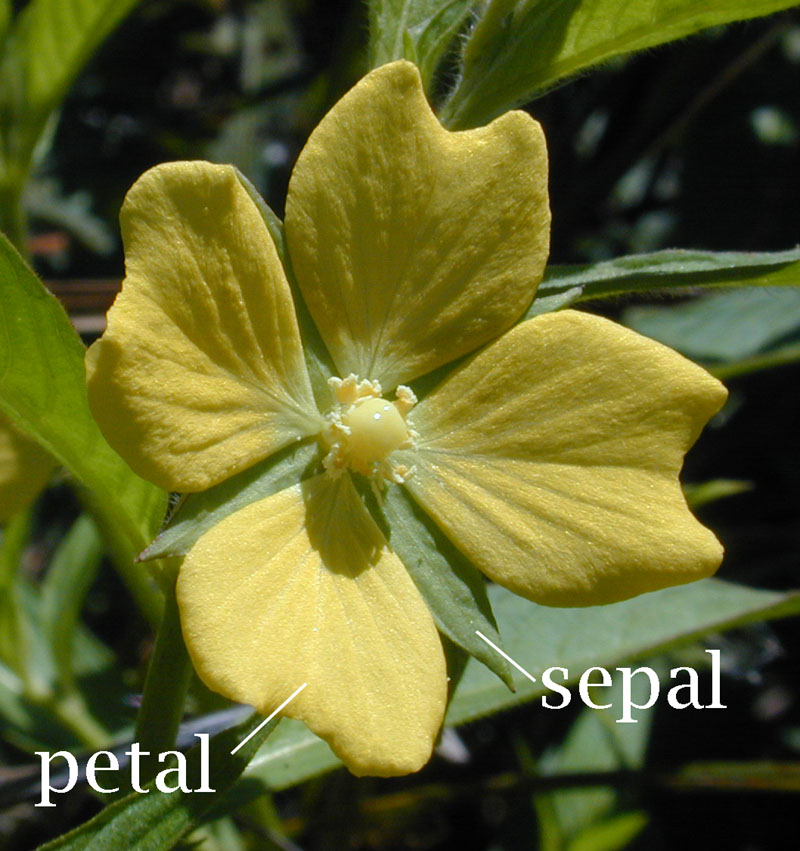

\tiny

Источник: https://en.wikipedia.org/wiki/Petal#/media/File:Petal-sepal.jpg


##

```{r, echo=FALSE}
plot(iris$Petal.Length, iris$Sepal.Length, col=iris$Species)
```


## Предварительная обработка данных

```{r, eval=FALSE}
iris.new <- iris

normalize <- function(x){
  return ((x-min(x))/(max(x)-min(x)))
}

iris.new[,-5] <- as.data.frame(lapply(iris[,-5],normalize))

summary(iris.new)
```


## summary(iris.new)

\footnotesize

```{r, echo=FALSE}
iris.new <- iris

normalize <- function(x){
  return ((x-min(x))/(max(x)-min(x)))
}

iris.new[,-5] <- as.data.frame(lapply(iris[,-5],normalize))

summary(iris.new)
```


## Создание обучающей и тестовой выборок

```{r}
ntrain <- round(0.8*nrow(iris.new), 0)

set.seed(123)
train_ind <- sample(1:nrow(iris), size = ntrain)

train <- iris.new[train_ind,-5]
train.target <- iris.new[train_ind,5]
test <- iris.new[-train_ind,-5]
test.target <- iris.new[-train_ind,5]
```


## Применяем kNN

```{r}
library(class)

model <- knn(train, test, cl=train.target, k=5)
```

`class` — рекомендованный пакет (recommended). Такие пакеты поставляются вместе с R, но их нужно загружать.

```{r,eval=FALSE}
model
```

\scriptsize

```{r,echo=FALSE}
model
```


## Оценка точности прогноза

```{r}
table(model, test.target)
```


## Другие применения kNN

\Large

Метод можно использовать для:

* **регрессии**. Модельное значение отклика равно среднему арифметическому откликов ближайших соседей.
* **импутации** (заполнения пробелов в данных).


## Пример: прогнозирование продаж нового сорта пива

Наблюдения об объемах продаж четырех известных сортов пива в 150 городах и мнение экспертов об уровне продаж в тех же городах нового сорта пива.

* продукт1,...,продукт4 — объем продаж пива сортов 1,..,4
* уровень — уровень продаж нового сорта пива (по мнению экспертов): 1 - низкие, 2 - средние, 3 - высокие.

Нам нужно спрогнозировать уровень продаж нового сорта пива для городов, которых нет в наборе, по данным о продажах в этих городах сортов пива 1-4.

\scriptsize

Источник: https://compscicenter.ru/media/course_class_attachments/R_%D0%B7%D0%B0%D0%BD%D1%8F%D1%82%D0%B8%D0%B5_8_1_knn.zip


## Чтение и проверка данных

\small

```{r}
sales <- read.table("data/discrim.txt", header=T, 
                    sep=";", row.names=1, encoding='UTF-8')
# Что находится в наборе?
sales[1:5,] # вместо head(sales)
dim(sales)
```


## Формируем обучающую и тестовую выборки

```{r}
# Чтобы результаты у меня и у вас совпадали
set.seed(1234)
# Формируем случайную подвыборку из 150*1/3 = 50 чисел
test.num <- sample(1:nrow(sales), 50, replace = FALSE)
# Тестовая выборка
test <- sales[test.num, 1:4]
# Обучающая выборка
train <- sales[-test.num, 1:4]
# Код класса для обучающей выборки
cl <- sales[-test.num, 5]
dim(test)
dim(train)
```


## Классификация данных тестовой выборки

```{r}
# Подключаем библиотеку class
library(class) # recommended
# Распознаем класс объектов из тестовой выборки
predicted.cl <- knn(train, test, cl, k = 3)
```

\small

```{r}
predicted.cl
sales[test.num, 5]
```


## Проверяем соответствие распознанного класса истинному классу

```{r}
table(predicted.cl, sales[test.num, 5])
```


## Определим значение k

```{r}
err <- rep(0,15)
for (i in 1:15)
{
  pred.knn <- knn(train, test, cl, k = i)
  err[i] <- sum(pred.knn != sales[test.num, 5])
}
err
```
```{r}
table(knn(train, test, cl, k = 5), 
      sales[test.num, 5])
```


## Спрогнозируем уровень продаж в новом городе

```{r}
new.town <- data.frame(66,25,40,17)
knn(sales[,-5], new.town, sales[,5], k = 5)
```


## Пример: прогноз цен на недвижимость в г. Бостон

\small

```{r}
suppressPackageStartupMessages(library(caret))
library(mlbench)

# Загрузим данные
data(BostonHousing)
bh <- BostonHousing

bh$chas <- as.numeric(as.character(bh$chas))
x <- as.matrix(bh[,1:13])
y <- as.matrix(bh[,14])
# Обучим модель
fit <- knnreg(x, y, k=3)
# Сделаем прогноз
predictions <- predict(fit, x)
# Оценим точность
(rmse <- sqrt(mean((bh$medv - predictions)^2)))
```


## Кроссвалидация (перекрестная проверка)

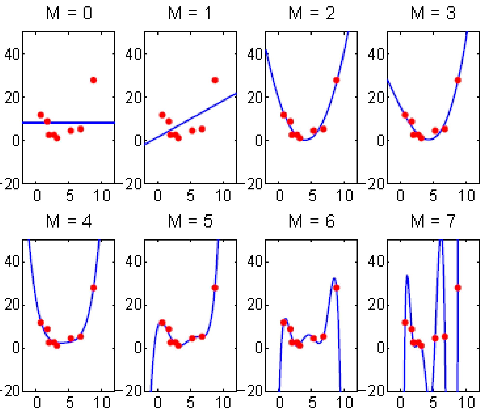


## Какая модель лучше?

Та, которая наилучшим образом подгоняет данные? (дает наименьшую среднюю квадратичную ошибку).

Тогда идеал — модель, график которой проходит через все точки наблюдений.

### Зачем нужна модель?

Чтобы успешно предсказывать **будущие** наблюдения. Наилучшей будет та модель, которая лучше всех будет подгонять **новые** данные.

### Аппроксимация vs. прогнозирование

Аппроксимация подгоняет имеющиеся данные, классификация и регрессия подгоняют новые данные.


## Переобучение 

\Large

**Overfitting** — чрезмерная подгонка или переобучение. Использование чрезмерно сложной модели для описания данных.

\normalsize

### Лирическое отступление

Портной научился хорошо шить костюмы для мистера Смита.

Пока он шьет для Смита — все идет хорошо. Но если он будет шить для Джонса по мерке, снятой со Смита, результат может быть намного хуже.


## Проблема

\Large

* У нас нет будущих значений…

### Решение

* Так сделаем их из прошлых!
* Отберем часть наблюдений и объявим их "будущими".

\normalsize

Следующий пример заимствован из "Cross-validation for detecting and preventing overfitting" Andrew W. Moore (www.cs.cmu.edu/~awm)


## Пример: выбор наилучшего полинома для регрессии

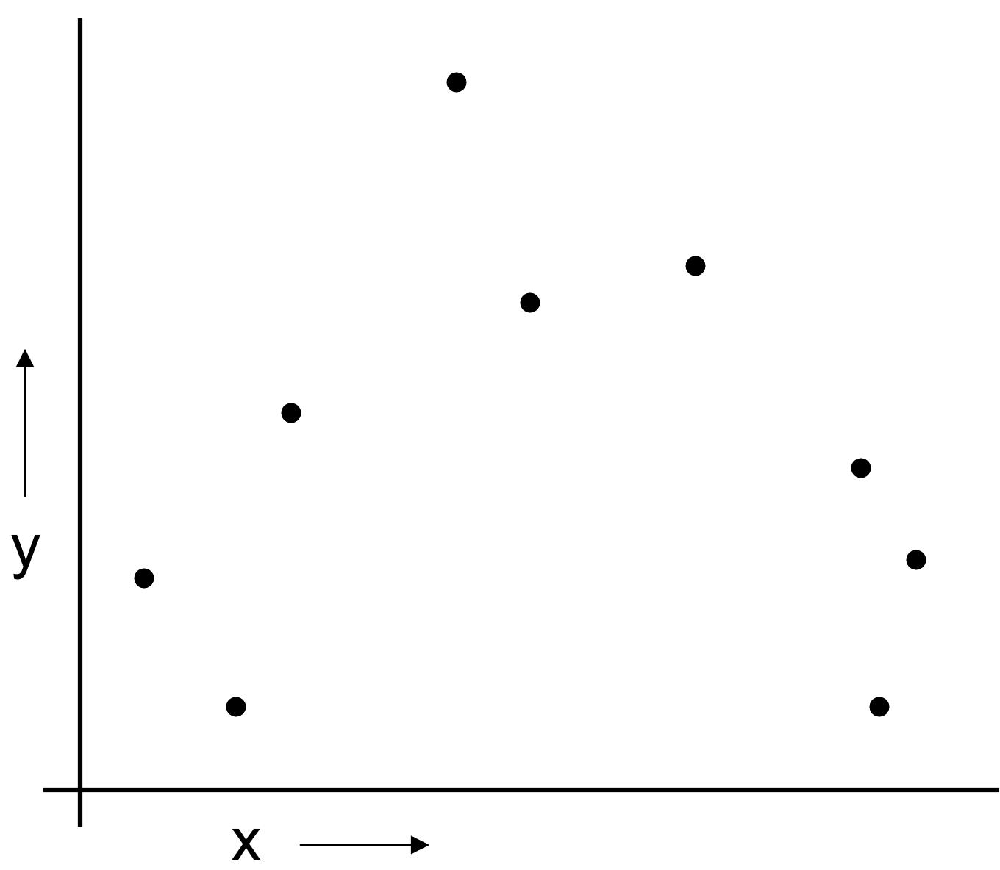


## Три варианта подгонки

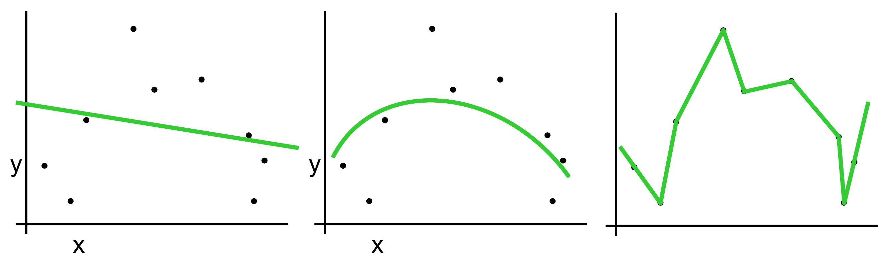


## Метод тестового множества (test-set cross-validation)

Случайным образом выберем 30% всех наблюдений и назовем их **тестовой 
выборкой**.

Остальные 70% наблюдений назовем **обучающей выборкой**.

* Обучающая выборка (training set) — имеющиеся наблюдения (образцы).
* Тестовая выборка (test set) — будущие наблюдения.

По наблюдениям из обучающей выборки построим модель.

Проверим модель на тестовой выборке.


## Обучающая и тестовая выборки

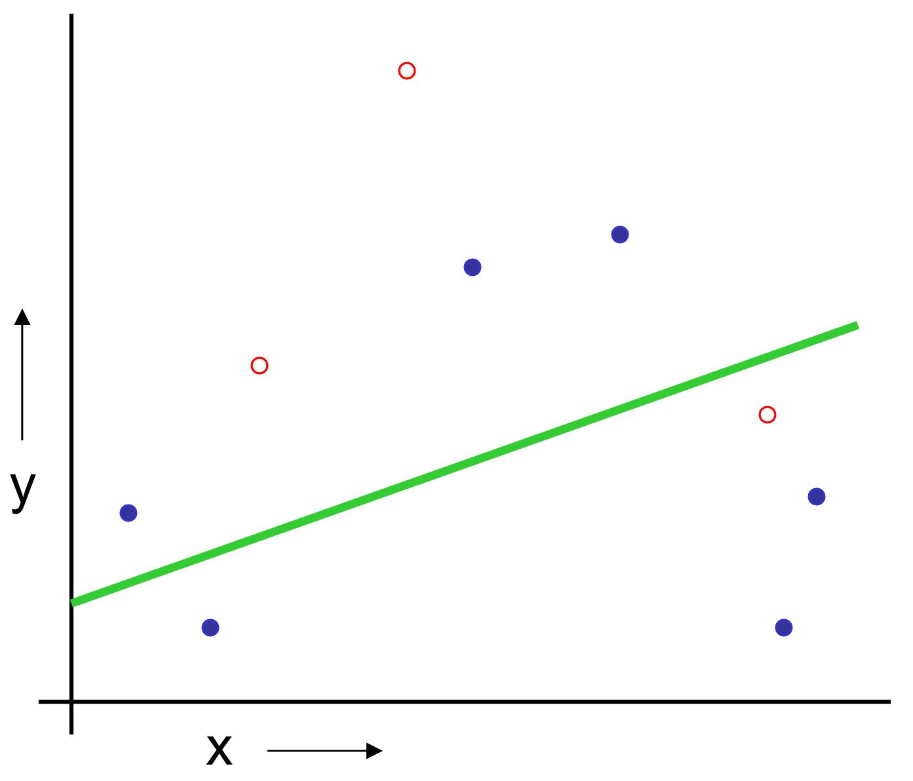


## Проверка подгонки на тестовой выборке

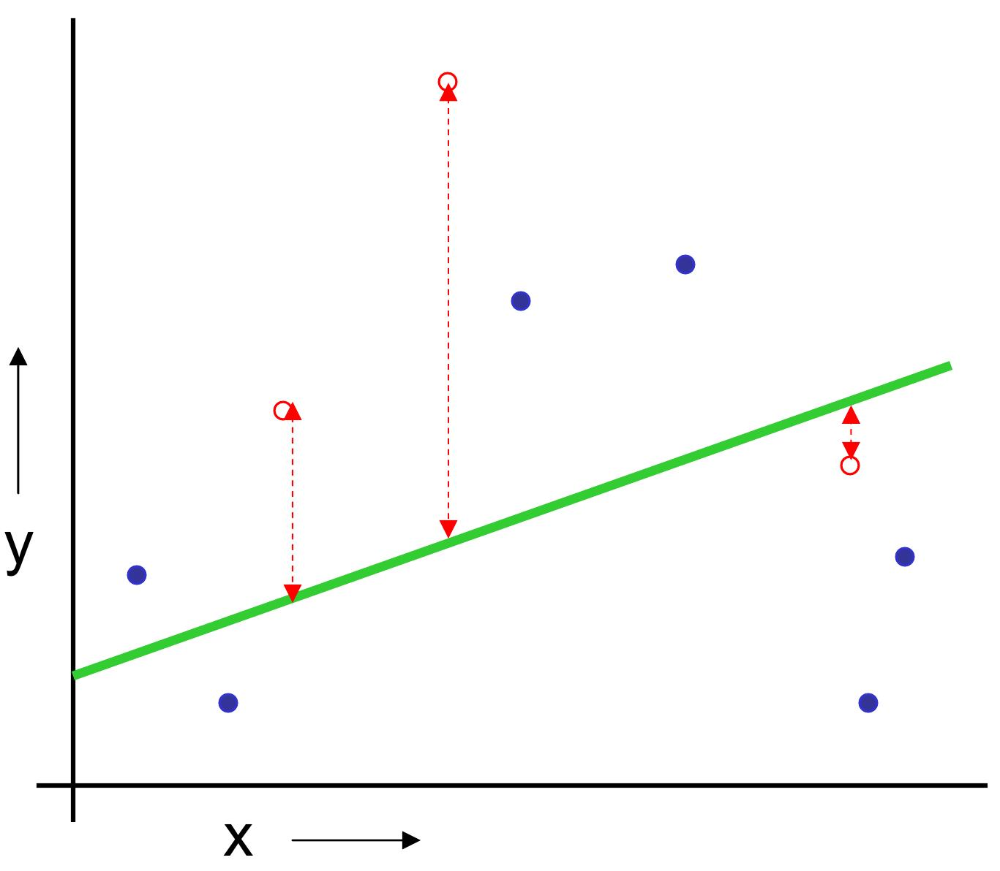


##

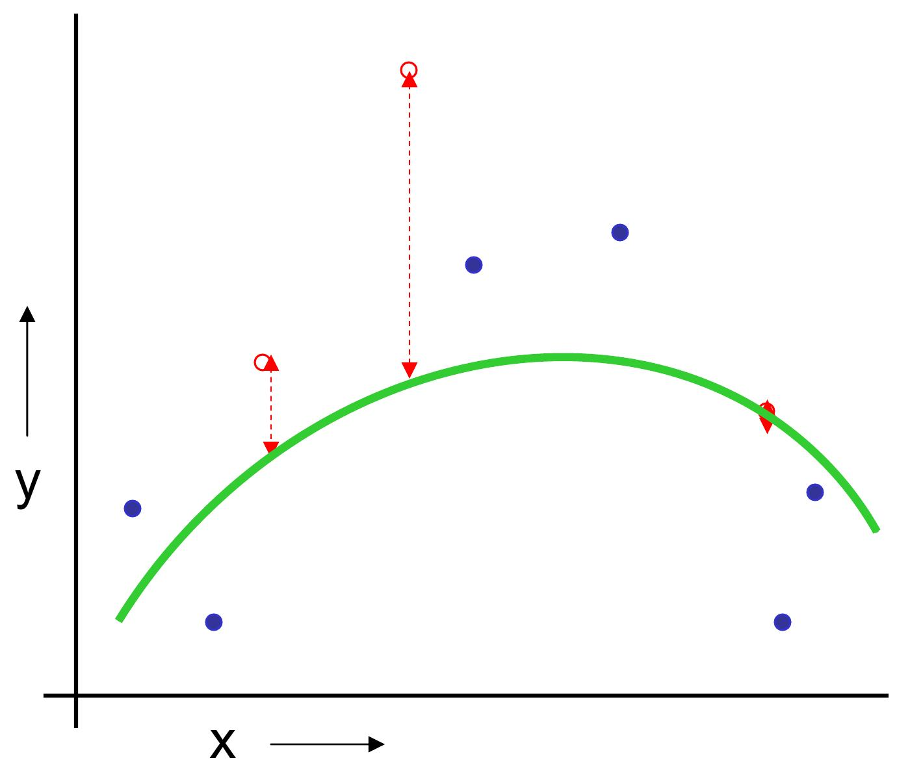


##

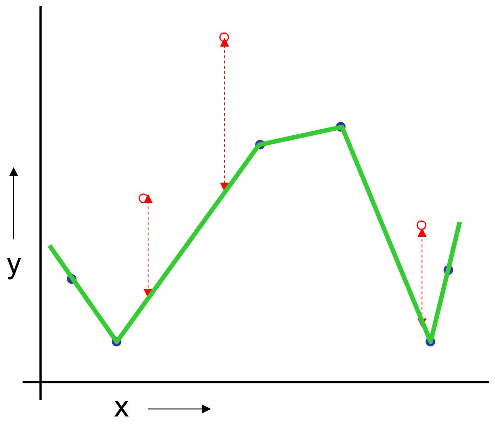


## Обсуждение метода тестового множества

### Достоинства

* Понятен.
* Очень просто реализуется;

### Недостатки

* Расточителен: при построении модели отбрасывается 30% данных
* Если данных мало, то как распределятся точки между обучающей и тестовой 
выборками? Дело случая. А это влияет на результат оценивания качества метода.

Другими словами: оценка качества модели с помощью тестового множества имеет большую дисперсию.

Может получится так, что для неудачной обучающей выборки мы получим заниженную оценку точности, а для удачной — завышенную. Как этого избежать?


## Проверка посредством исключенных наблюдений (leave-one-out cross validation, LOOCV)

Пусть у нас имеется n точек (наблюдений).

* Предыдущую процедуру выполняем n раз.
* Но: тестовое множество теперь состоит из одной точки, каждый раз новой (обучающее множество состоит из оставшихся n-1 точек). 
* За n шагов перебираем все точки множества. Каждый раз подсчитываем значение квадрата ошибки на тестовом наблюдении.
* Посчитаем среднее значение квадратов ошибок по всем n проверкам. Оно и даст нам оценку качества подгонки.


## Линейная регрессия

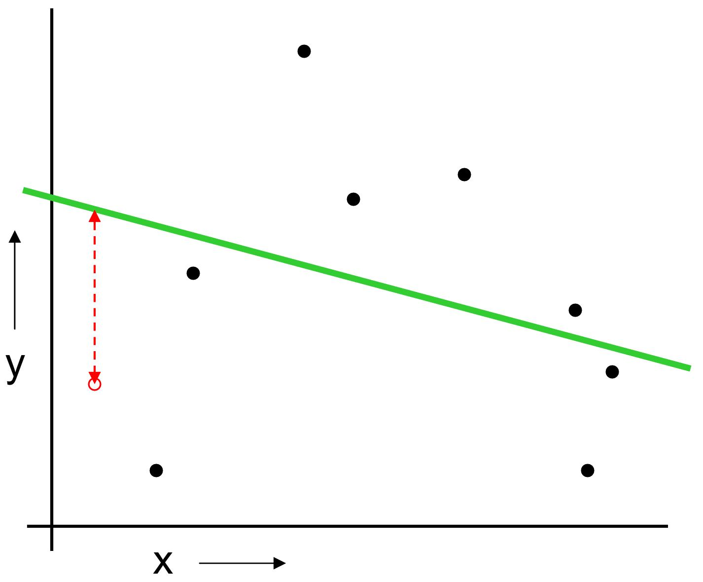


##

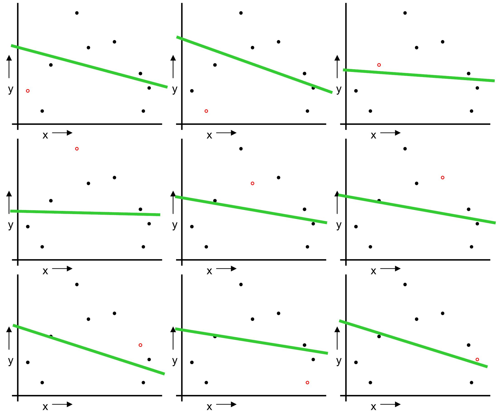


## Средние значения квадратов ошибок

* Для линейной регрессии: MSE = 2.12
* Для квадратичной регрессии: MSE = 0.962
* Для линии, проведенной по точкам: MSE = 3.33


## Сравнение методов

Метод исключенного наблюдения не расходует много данных.

Но: он требует больше вычислений.

Можно ли как-то объединить достоинства методов, чтобы сократить расходы на вычисления и экономно использовать имеющиеся данные?


## k-кратная кроссвалидация (k-fold cross-validation)

Случайным образом разобьем выборку на k одинаковых частей. В рассматриваемом примере k=3. 

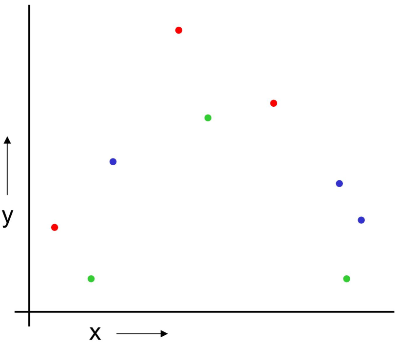


## Алгоритм

* Первая часть наблюдений (из k частей) — тестовая выборка.
* Все остальные наблюдения — обучающая выборка.
* Сосчитаем сумму квадратов ошибок для точек из тестового множества.


## Линейная регрессия

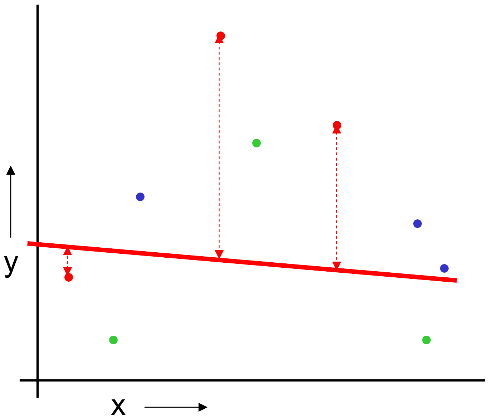


## Определяем обучающую выборку и тестовую выборку заново

* Вторая часть – тестовая выборка.
* Все остальные наблюдения – обучающая 
выборка.
* Сосчитаем сумму квадратов ошибок для точек из тестового множества.

и т. д.


##

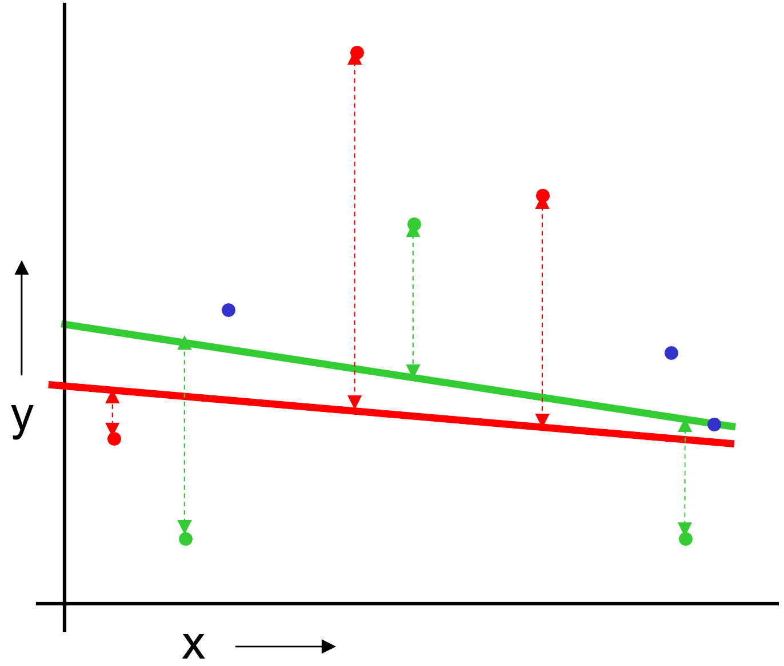


## Осталось сосчитать среднее значение квадратов ошибок

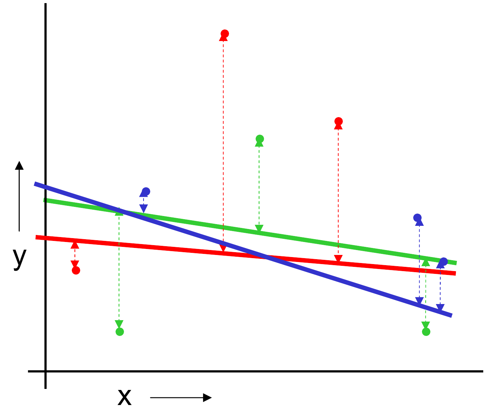


## Сравним результаты k-кратной кроссвалидации

* Для линейной регрессии: MSE = 2.05
* Для квадратичной регрессии: MSE = 1.11
* Для линии, проведенной по точкам: MSE = 2.93


## Выбор метода кроссвалидации

* **3-кратная кроссвалидация:** чуть более экономна, чем метод тестового множества; требует немного больше вычислений.
* **10-кратная кроссвалидация:** исключает из обучения 10% данных, чем метод тестового множества; требует в 10 раз больше вычислений чем метод тестового множества, но меньше чем метод исключенного наблюдения.
* **n-кратная кроссвалидация:** совпадает с методом исключенного наблюдения (LOOCV).

Обычно выбираемые методы лежат в диапазоне от 10-кратной кроссвалидации до метода исключенного наблюдения.


## Так как же выбрать значение k в методе kNN?

1. Вычислим методом LOOCV среднюю ошибку для моделей с разным значеним k
2. Выберем модель, давшую наименьшую ошибку, обучим ее на всем наборе данных и будем использовать для прогнозов.

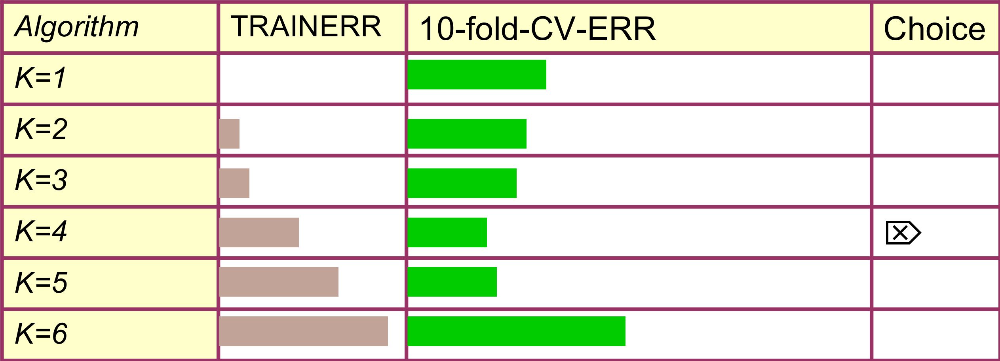


## ЧаВо по выбору k

\small

**Почему мы использовали LOOCV, а не, допустим, 10-кратную кроссвалидацию?**

В методе kNN вычисления выполняются очень быстро, так что 10-кратная кроссвалидация не имеет вычислительных преимуществ перед LOOCV (и при этом расходует больше наблюдений).

**Почему мы остановились на k=6?**

Увидели, что после k=3 ошибка начала расти с ростом k.

**Является ли значение k, полученное LOOCV, глобальным или локальным оптимумом?**

Конечно, это локальный оптимум.

**Что делать, если придется искать k в широком диапазоне, например, от 1 до 1000?**

1. Создать сетку и проверять значения k, например, через 50.
2. Перебирать по схеме k=$2^i$: k=1, k=2, k=4, k=8, k=16, k=32, k=64 … k=1024.
3. Использовать какой-либо из методов поиска локального экстремума.


## Где можно использовать кроссвалидацию?

* Для выбора наилучшего метода классификации.
* Для выбора наилучшего метода регрессии.
* Для определения степени полинома в линейной регрессионной модели.
* Для отбора признаков (feature selection).
* ...

**Кроссвалидация обычно используется для выбора алгоритма прогнозирования (классификации, регрессии) и настройки параметров этого алгоритма.**


## Вопросы для самопроверки

* Почему нельзя использовать ошибку, полученную на обучающем множестве, для выбора алгоритма обучения?
* Почему нельзя использовать ошибку, полученную на обучающем множестве, для выбора параметров алгоритма обучения (например, k в kNN).


## Пример: Классификация вин в пакете caret

Данные находятся в файле `wine.txt`. Взяты из [UCI machine learning repository](https://archive.ics.uci.edu/ml/machine-learning-databases/wine/wine.data).

Измеряются 13 характеристик химического состава вина для трех сортов вин, выращенных в одной и той же области Италии разными виноделами. Необходимо по значениям имеющихся переменных определить сорт вина.

Задача приобрела большую известность и активно обсуждалась. Оказалось, что статистические методы могут различать вина лучше профессиональных сомелье.

Еще один вариант решения этой задачи:

\scriptsize
http://dataaspirant.com/2017/01/09/knn-implementation-r-using-caret-package/


## Чтение данных

```{r}
suppressPackageStartupMessages(library(caret))

wine <- read.table('data/wine.txt', header=T, sep="\t")

# Тип вина Wine_type нужно переделать в фактор
wine$Wine_type <- as.factor(wine$Wine_type)

dim(wine)
```


## Проверка: что находится в наборе?

\tiny

```{r}
summary(wine)
```


## Разделение на обучающую и тестовую выборки

```{r}
set.seed(123)
# Разделим данные на обучающую (70%)
# и тестовую (30%) выборки
ind_train <- createDataPartition(wine$Wine_type, 
                                 p = 0.7, 
                                 list = FALSE)
train <- wine[ind_train,]
test <- wine[-ind_train,]
```


## Проверим сбалансированность классов

```{r}
# в оригинальных данных
prop.table(table(wine$Wine_type))*100
# и в обучающей выборке
prop.table(table(train$Wine_type))*100
```


## Настроим кроссвалидацию

```{r}
ctrl <- trainControl(method = "repeatedcv", 
                     number = 10, repeats = 3)
```


## Обучим модель

```{r}
knn_fit <- train(Wine_type ~., data = train, 
                 method = 'knn',
                 trControl = ctrl,
                 preProcess = c('center', 'scale'),
                 tuneLength = 15)
```

Выполняется ли здесь стандартизация? Попробуете не сделать стандартизацию и посмотрите на результаты классификации.


## Какое выбрано k?

\tiny

```{r}
knn_fit
```


##

```{r}
plot(knn_fit)
```


## Спрогнозируем тип вина для тестовых данных

```{r}
(prediction <- predict(knn_fit, newdata = test[,-14]))

# Проще так:
# prediction <- predict(knn_fit, newdata = test)
```


## Проверим точность прогноза

```{r, eval=FALSE}
confusionMatrix(prediction, test$Wine_type)
```
```
Confusion Matrix and Statistics

          Reference
Prediction  0  1  2
         0 17  0  1
         1  0 14  0
         2  0  0 20

Overall Statistics
                                          
               Accuracy : 0.9808          
                 95% CI : (0.8974, 0.9995)
    No Information Rate : 0.4038          
    P-Value [Acc > NIR] : < 2.2e-16
    ...
```

