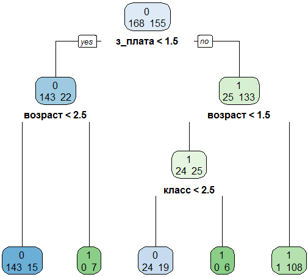
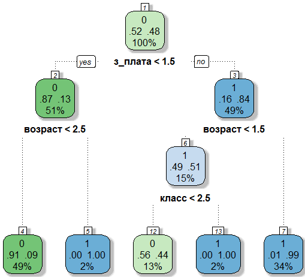
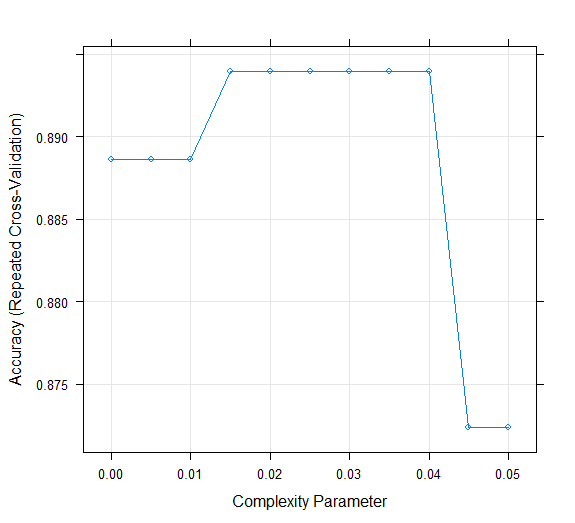

## Содержание

* Деревья принятия решений.
* Построение деревьев классификации и регрессии (CART).
* Классификация CART в пакете `caret`.


## Дерево обычное и дерево математическое

\bcols
\column{.5\textwidth}


\column{.5\textwidth}


\ecols


## Деревья принятия решений

Дерево, используемое для классификации, называется — **дерево принятия решения** (decision tree).


## Семейство методов

Семейство методов классификации при помощи одиночных деревьев: 

* ID3 (Iterative Dichotomiser 3)
* C4.5 (развитие ID3)
* CART (Classification And Regression Tree)
* CHAID (CHi-squared Automatic Interaction Detector)
* MARS: улучшает обработку числовых данных
* Conditional Inference Trees (ctree): не требуют обрезки

\tiny

Источник: https://en.wikipedia.org/wiki/Decision_tree_learning

\normalsize

Рассмотрим метод CART (Classification and regression trees), предложенный в 1983 г. четверкой известных ученых в области анализа данных: Лео Брейманом (Leo Breiman), Джеромом Фридманом (Jerome Friedman), Ричардом Олшеном (Richard Olshen) и Чарлзом Стоуном (Charles Stone). 


## Особенности метода

\Large

* Его результаты удобно интерпретировать.
* Используются как составная часть более продвинутых методов (например, случайных лесов) и для оценочной классификации (разведки).

Методы классификации при помощи деревьев очень популярны. 


## Бинарная классификация


## Алгоритм разбиения

1. Будем разделять пространство на части при помощи гиперплоскостей (в 2-мерном случае — это прямая, в 3-мерном — плоскость, то есть размерность на единицу меньше размерности пространства).
2. Разделяющая гиперплоскость должна быть перпендикулярна одной из осей координат.
3. Разделять будем так, чтобы в одной части оставалось больше объектов одного класса, а в другой — другого.


##


## 

Последующие прямые (гиперплоскости) будут делить одну из выделенных ранее полуплоскостей (полупространств)


##


##

Новый объект будет относиться к классу, который составляет большинство в данной области.


## Запись логических правил

* 1 область: ($x_1 < a$) AND ($x_2 < c$) AND ($x_2 > b$) -> "o"
* 2 область: $x_1 > a$ -> "+"
* ...

Всего 5 областей и 5 правил.

Такая запись правил очень удобна.

Первый взгляд на задачу — геометрический, второй — в виде формального логического правила. Где же тут деревья?


## Начинаем строить дерево

{width=150px}


## Основные понятия

* узел (node) — это множество наблюдений
    * родительский (parent node) — узел, который разделяется;
    * потомок (child node) — узел, возникший после деления родительского узла;
    * конечный узел (лист дерева) (final node, terminal node) — узел, который дальше не разделяется;
* пороговое значение — числа a, b, c, d в которых проходят сечения.


## Запись в форме дерева принятия решений


## Для разметки нового объекта

1. Смотрим, в каком узле оказалась точка.
2. Объекты какого класса составляют в этом узле большинство?
3. Приписываем этому классу новый объект.

Метод хорошо поддается интерпретации. Если вы не хотите использовать "черный ящик" (который выдает результат, но непонятно как), то используйте этот метод.


## Особенности построения дерева классификации в `rpart()`

Функция `rpart` реализует CART (Classification And Regression Trees). Слово CART защищено копирайтом, поэтому функцию пришлось назвать по-другому.

* Все узлы пронумерованы. Номера не идут подряд, а следуют правилу: узлы-потомки узла номер `n` имеют номера `2*n` и `2*n+1`. Это удобно, потому что по номеру узла можно определить номер его родителя.
* При расщеплении, когда условие выполнено, наблюдение попадает в левый узел.


## Нумерация узлов в `rpart()`


## Разновидность метода: oblique trees — косые или наклонные деревья

Отказываемся от требования перпендикулярности гиперплоскости осям координат.

* Для достижения цели понадобится меньше разбиений.
* Дает намного более сложные условия

\tiny

Источник: http://research.ijcaonline.org/volume82/number13/pxc3892023.pdf


## Разновидность: oblivious trees — забывающие деревья

Ужесточим условия:

1. Разделим дерево на слои по высоте.
2. Потребуем, чтобы на каждом слое разделение происходило только по одной переменной.

Выигрыш — в скорости выполнения расчетов.


## Пример забывающего дерева решений

{width=275px}

\scriptsize

* Входные признаки: уровень глюкозы (G), возраст (A), артериальная гипертензия (H) и беременность (P). 
* Бинарная целевая функция — страдает ли этот пациент диабетом. 
* Числа в терминальных узлах указывает количество объектов класса, прошедших по этому пути. Так, для пациентов с уровнем глюкозы ниже 107 и возрастом старше 50, у 10 диагностирован диабет, а у 2 — не диагностирован.

\tiny

Источник: [Rokach L., Maimon O. Decision Trees](http://www.ise.bgu.ac.il/faculty/liorr/hbchap9.pdf)


## Как строить разделяющие гиперплоскости

* Как искать пороговые значения?
* Как выбирать, по какой переменой разделять?

— как этот процесс автоматизировать, чтобы сделать из него функцию (потерь?).

Мы двигали разделяющую прямую так, чтобы с одной стороны было подавляющее число объектов одного класса, а с другой — другого.

Введем понятие **чистоты** (purity).


## Разбиение увеличивает чистоту


##

Нужно получить такое разбиение, чтобы результат его стал чище исходного неразделенного множества.

p('x') — вероятностью "крестиков" — называется доля крестиков в каком-то конкретном узле.

Узел чистый, когда $p_i = 1$ (в узле только "крестики") или $p_i = 0$ (только "нолики"). 

Максимально "грязный" (impurity) случай: $p_i = 0.5$.

Теперь нужна функция, которая будет измерять чистоту множества (узла).

Эта функция должна иметь минимум в точках 0 и 1 и максимум — где-то между ними, в идеале — в 0.5.


## Вот какая функция нужна

```{r, echo=F}
x <- seq(0,1,length=100)
y <- x*(1-x)
plot(x, y, type="l", xlab="p", ylab="Impurity measure")
```


## Если у нас будет такая функция, то

... можно будет сравнить чистоту множества до разделения и чистоту двух множеств, полученных после разделения. Если после разделения стало чище, то это хорошо.

Затем из всех возможных разделений возьмем то, что приводит к наиболее чистым результатам (максимально сокращает степень загрязненности).


## Способы измерения чистоты: 1) Энтропия

Понятие энтропии происходит из физики
$$
H_1 = -\sum _{i=1}^{N}p_{i}\log_2 p_{i}
$$

Рассмотрим некоторую систему, которая может принимать конечное множество состояний $x_i$ с вероятностями $p_i$. **Энтропия — мера неопределенности состояния системы.**

Энтропия 1) обращается в нуль, когда одно из состояний системы достоверно, а другие — невозможны; 2) при заданном числе состояний обращается в максимум, когда эти состояния равновероятны (с увеличением числа состояний энтропия увеличивается).

Знак минус перед суммой поставлен для того, чтобы энтропия была 
положительной (вероятности меньше единицы и их логарифмы отрицательны). 


## Способы измерения чистоты: 2) Индекс Джини (Gini index)

Функция $y = x(1-x)$ имеет минимумы и максимум как раз там, где нам нужно. Поэтому
$$
H_2 = \sum_{i=1}^N p_i (1-p_i) = 1- \sum_{i=1}^N p_i^2
$$
По умолчанию для измерения загрязненности мы будем использовать индекс Джини.

Другие формулы для измерения загрязненности:  https://en.wikipedia.org/wiki/Decision_tree_learning

Создатели метода CART разрабатывали его, чтобы отличать силуэты советских кораблей от американских. Оказалось, что лучше работает индекс Джини, хотя сперва применяли энтропию.

**Это означает, что при решении задачи стоит поиграть с мерами загрязненности.**

\note{
Коррадо Джини — итальянский статистик, социолог, демограф и экономист, один из ведущих теоретиков и идеологов фашизмa. Автор книги «Научные основы фашизма» (1927).
}


## Какую переменную для разбиения следует выбрать и какое установить для нее пороговое значение?

Используем метод перебора.

1. Перебираем переменную за переменной ($n$ — число переменных).
2. Для каждой переменной перебираем пороговые значение.
3. Для каждого порогового значения считаем $\Delta H$ — насколько сократится загрязненность (возрастет чистота) в результате разбиения. 
4. Выбираем переменную и пороговое значение, соответствующие максимальной $\Delta H$.

Зададимся некоторым разделением узла на 2 потомка. Тогда увеличение чистоты узлов измеряется как
$$
\Delta H = H_\text{родителя} - 
\left ( 
\frac{n_1}{n_\text{родителя}} H_\text{потомок1} + 
\frac{n_2}{n_\text{родителя}} H_\text{потомок2}
\right )
$$


## Правило останова

Когда нужно прекратить расщеплять?

1. $\Delta H < \delta_{min}$ — улучшение слишком мало.
2. Число слоев превысило заданное значение (maxdepth — "глубина" дерева).
3. Размер узла-родителя — не дробить слишком маленькие множества (minsplit).
4. Размер конечного узла — конечные узлы должны быть достаточно представительными для принятия решения относительно класса нового элемента (minbucket).

Почему нужно прекратить расщеплять: мы опасаемся переобучения.


## Кредитный скоринг

Моделируется задача кредитного скоринга. Нужно разработать процедуру, которая по данным о заемщике будет определять, надежен он или нет.

Данные о заемщике:

* `кредит` — кредитный рейтинг (низкий, высокий) — целевое значение.
* `класс` — информация о профессии ("Management", "Professional", "Clerical", "Skilled Manual", "Unskilled").
* `з_плата` — периодичность выдачи заработной платы (еженедельно, ежемесячно).
* `возраст` — возраст ("Молод (< 25)", "Средний(25-35)", "Пожилой( > 35)").
* `кр_карта` — наличие кредитной карты данного банка.


## Чтение и проверка данных

```{r}
# Шаг 0. Прочитаем данные
credit.01 <- read.table("data/credit.csv", 
                        header=T, sep=";", 
                        encoding = "UTF-8")
# Проверка: импортировали правильно?
credit.01[1:5,]
dim(credit.01)
```


## К каким классам относятся переменные?

\scriptsize

```{r}
class(credit.01[ , 1])
class(credit.01[ , 2])
class(credit.01[ , 3])
class(credit.01[ , 4])
class(credit.01[ , 5])
```


## Внимание аналитикам!

\Large

Теперь надо принимать решение: должны быть переменные факторами или нет?

То есть в какой из шкал — номинальной, порядковой или интервальной —  измерены переменные.


## Функция классификации

\small

```{r,eval=F}
library(rpart)
credit.01.res <- rpart(кредит ~ клаcс+з_плата+возраст+кр_карта, 
                             data = credit.01, method="class",
                             control=rpart.control(minsplit=10, 
                                                   minbucket=5, 
                                                   maxdepth=6) 
                      ) 
```

* `credit.01.res` — список с результатами (модель).
* `rpart` — функция, которая строит дерево.
* `data = credit.01` — анализируются переменные из таблицы `credit.01`.
* `method="class"` — строится дерево классификации, а не дерево регрессии.
* `model = TRUE` — сохранить копию данных внутри модели (списка credit.01.res).
* `control = rpart.control(minsplit=10, minbucket=5, maxdepth=6)` —
 какие правила останова использовать.
 
 
## Функция классификации: экономная запись формулы

\small

```{r,echo=FALSE}
library(rpart)
```
```{r}
credit.01.res <- rpart(кредит ~ ., 
                             data = credit.01, method="class",
                             control=rpart.control(minsplit=10, 
                                                   minbucket=5, 
                                                   maxdepth=6)
                      ) 
```


## Рисование дерева: встроенный plot

```{r,eval=F}
plot(credit.01.res)
text(credit.01.res, use.n=T)
```


## Рисование дерева: библиотека rpart.plot

```{r,eval=FALSE}
library(rpart.plot)
rpart.plot(credit.01.res, type=2, extra=1)
```

* `type` — где и какие делать подписи;
* `extra` — какую дополнительную информацию об узле следует отображать.


## 



Как трактовать дробные пороговые значения?


## Рисование дерева: rattle::fancyRpartPlot()




## Печать результатов

\small

```{r}
credit.01.res
```


## Расшифровка информации

```
node), split, n, loss, yval, (yprob)
```

* `node` — номер узла. Номера следуют правилу: узлы-потомки узла номер n имеют номера `2*n` и `2*n+1`;
* `split` — условие, которое должно быть выполнено, чтобы наблюдение попало в узел при расщеплении узла-родителя;
* `n` — общее количество наблюдений, попавших в узел из обучающей выборки;
* `loss` — число наблюдений другого класса, попавших в узел (число ошибок);
* `yval` — какой класс приписывается наблюдению из данного узла. Определяется тем, наблюдения какого класса составляют в узле большинство; 
* `(yprob)` — доля объектов из каждого класса в узле. Интерпретируется как вероятность того, что попавший в узел объект будет принадлежать классу.


## Управление печатью результатов

```{r}
print(credit.01.res, digits = 2)
```


## Подробный анализ результатов — summary()

```{r,eval=FALSE}
summary(credit.01.res)
```

`summary()` позволяет проследить за "проигравшими" вариантами разбиений.

Фрагмент ее работы:

\scriptsize

```
Node number 1: 323 observations,    complexity param=0.6967742
  predicted class=0  expected loss=0.4798762  P(node) =1
    class counts:   168   155
   probabilities: 0.520 0.480 
  left son=2 (165 obs) right son=3 (158 obs)
  Primary splits:
      з_плата  < 1.5 to the left,  improve=81.0164500, (0 missing)
      возраст  < 1.5 to the left,  improve=73.3493500, (0 missing)
      клаcс    < 2.5 to the right, improve=53.7945900, (0 missing)
      кр_карта < 0.5 to the left,  improve= 0.1134861, (0 missing)
  Surrogate splits:
      клаcс    < 2.5 to the right, agree=0.842, adj=0.677, (0 split)
      возраст  < 1.5 to the left,  agree=0.765, adj=0.519, (0 split)
      кр_карта < 0.5 to the left,  agree=0.542, adj=0.063, (0 split)
```


## Прогнозирование и подсчет ошибок

```{r,eval=FALSE}
predicted <- predict(credit.01.res, credit.01[ ,-1], 
                                          type="class")
table(credit.01[ ,1], predicted)
```

\scriptsize

```
> predicted
 1   2   3   4   5   6   7   8   9  10  11  12  13  14  15  16  17  18  19 
  1   0   0   1   1   0   1   0   0   0   0   0   0   0   0   0   0   0   0 
 20  21  22  23  24  25  26  27  28  29  30  31  32  33  34  35  36  37  38 
  0   0   0   0   0   0   0   0   0   0   0   0   0   0   0   0   0   0   0 
...
```

\normalsize

```{r,echo=FALSE}
predicted <- predict(credit.01.res, credit.01[ ,-1], 
                                          type="class")
table(predicted, credit.01[ ,1])
```

**Что плохо в выполненной проверке?**

В скрипте `scoring.R` показано как строить деревья, если данные измеряются в номинальной и порядковой шкалах.

\note{
Я обучал модель и проверял модель на всем множестве данных, что не хорошо. Нужно разбивать данные на обучающую и тестовую выборки.
}


## Прогноз кредитного рейтинга для новых данных

```{r}
new <- data.frame(2,2,2,1) 
names(new) <- names(credit.01)[-1]

predicted.new <- predict(credit.01.res, new, type="class")
```


## Переобучение

\large

Если ошибок на тестовой выборке существенно больше, чем на обучающей, то возможно мы имеем дело с переобучением.

### Лечение:

* Дерево нужно сокращать, то есть обрезать ненужные ветки. Делается это настройкой параметров `rpart.control()`.
* В пакете `rpart` функция для обрезки дерева: `prune`.


## Что приносит использование номинальных переменных?

\Large

Увеличение объема вычислений. Теперь нужно не просто делить упорядоченное множество на две части, а проверять условие для всех возможных разбиений неупорядоченного множества на две части.


## Достоинства и недостатки

### Достоинства

\footnotesize

* результаты легко интерпретировать
* позволяет строить нелинейные модели
* не нуждается в стандартизации данных
* устраняет нерелевантные признаки

### Недостатки

\footnotesize

* Неустойчивость классификации — если слегка "пошевелить" данные, дерево классификации также изменится, т.е. деревья чувствительны к шуму в данных.
* Склонность к переобучению: большие деревья требуют обрезки.
* Границы раздела параллельны осям координат.

**Лечение:** вместо одного дерева использовать множество деревьев (метод "случайного леса").

\tiny

[Ответ William Chen в топике "What are the disadvantages of using a decision tree for classification" на Quora](https://www.quora.com/What-are-the-disadvantages-of-using-a-decision-tree-for-classification)


## Классификация вин с помощью пакета `caret`

```{r, eval=FALSE}
library(caret)

wine <- read.table('../../data/wine.txt', 
                   header=T, sep="\t")
# Проверка: что находится в наборе?
wine[1:5,]
summary(wine)
dim(wine)

# Тип вина Wine_type нужно переделать в фактор
wine$Wine_type <- as.factor(wine$Wine_type)
```


## Деление выборки и управление обучением

```{r,eval=FALSE}
set.seed(123)
ind_train <- createDataPartition(wine$Wine_type, 
                                 p = 0.7, list = FALSE)
train <- wine[ind_train,]
test <- wine[-ind_train,]

ctrl <- trainControl(method = "repeatedcv", 
                     number = 10, repeats = 3)

rpart_grid <- expand.grid(cp=seq(0, 0.05, 0.005))
```


## Обучение

```{r,eval=FALSE}
# Используем information gain вместо gini 
# для измерения загрязненности
cart_fit <- train(Wine_type ~., data = train, 
                  method = 'rpart',
                  trControl = ctrl,
                  #preProcess = c('center', 'scale'),
                  parms = list(split='information'),
                  tuneGrid = rpart_grid
                  )
```


## Настройка параметров




## Влиятельность переменных


## Контроль ошибок

```{r, eval=FALSE}
confusionMatrix(prediction, test$Wine_type)
```
```
Confusion Matrix and Statistics

          Reference
Prediction  0  1  2
         0 16  0  2
         1  0 12  1
         2  1  2 18

Overall Statistics
                                          
               Accuracy : 0.8846          
                 95% CI : (0.7656, 0.9565)
    No Information Rate : 0.4038          
    P-Value [Acc > NIR] : 7.681e-13  
```


## Построим дерево с библиотекой rattle

\small

```{r, eval=FALSE}
library(rattle)
fancyRpartPlot(cart_fit$finalModel)
```


##  Дополнительная информация

* [*Terry M. Therneau, Elizabeth J. Atkinson.* An Introduction to Recursive Partitioning Using the RPART Routines](https://cran.r-project.org/web/packages/rpart/vignettes/longintro.pdf) — в лекции мы ориентировались на это руководство по `rpart`.
* [*Arthur Charpentier.* Classification From Scratch, Trees](https://freakonometrics.hypotheses.org/tag/rpart) — крачайшее руководство. Читайте про обрезку деревьев и оценку влиятельности признаков.
* [*Max Kuhn.* The caret Package](https://topepo.github.io/caret/) — книга о пакете `caret`, написанная его разработчиком.

