## Содержание

* Способы объединения моделей: стекинг, бэггинг, бустинг
* Бэггинг на примере Random Forest
* Бустинг: XGBoost
* Блендинг и стекинг


## Скрытая мудрость толпы?

\begin{center}
\includegraphics[width=80pt]{images/Francis_Galton_1850s.jpg}
\end{center}

* В 1906 сэр Фрэнсис Гальтон посетил сельскохозяйственную выставку.
* Посетителям выставки предложили отгадать вес призового быка.
* Около 800 человек дали свои оценки, но ни одна из них не была достаточно близка к точному значению.
* На удивление, среднее значение этих 800 попыток -- 1197 фунтов -- оказалось весьма близко к точному значению. Оно было 1198 фунтов.


## Приемы улучшения классификаторов

* Стекинг (stacking)
* Бэггинг (bagging)
* Бустинг (boosting)

**Идея:** берем много слабых классификаторов и пытаемся сделать из них один сильный.

**Слабый классификатор** — алгоритм, позволяющий классифицировать объекты с вероятностью ошибки меньшей, чем простое угадывание (0.5 для бинарной классификации).
**Сильный классификатор** — алгоритм классификации, позволяющий добиться произвольно малой ошибки обучения.


## Бэггинг (bagging = **b**ootstrap+**agg**regat**ing**)

Метод "Случайный лес" (random forest) — пример использования бэггинга.

Предложен Лео Брейманом (Leo Breiman) и Адель Катлер (Adele Cutler) в 1994 г.

Обозначения:

* Обучающая выборка состоит из N примеров (строк).
* Размерность пространства признаков равна M.

$$
X= \left [
\begin{array}{llcl}
x_{11} & x_{12} & \ldots & x_{1M} \\
x_{21} & x_{22} & \ldots & x_{2M} \\
\ldots & \ldots & \ldots & \ldots \\
x_{N1} & x_{N2} & \ldots & x_{NM} \\
\end{array}
\right ] ,
\qquad
Y = \left [
\begin{array}{l}
y_1    \\
y_2    \\
\ldots \\
y_N
\end{array}
\right ]
$$

## Бутстреп


## Бутстреп

**Бутстреп** (bootstrap) – метод оценки точности измерения (доверительного интервала, стандартной ошибки, ...) наблюдаемой величины по выборке.

Если наблюдаемой величиной $O$ является среднее значение по выборке, то оценку точности даст стандартная ошибка для этой выборки. Но что если хотим оценить точность измерения самой стандартной ошибки (асимметрии, эксцесса, ...)?

*У нас есть всего одна выборка – что делать? Сделаем из одной выборки много.*

Возьмем из исходной выборки **выборку с возвращением** (один и тот же элемент можно брать повторно)

* Исходная выборка: {1,2,3,4}
* Новая выборка: {**1**,4,**1**,3}

Все значения берутся с равной вероятностью $1/N$, где $N$ – число элементов выборки.


## Алгоритм бутстрепа

1. Создадим выборок столько, сколько нужно: {3,4,1,3}, {1,2,4,4}, {1,4,3,2}, ...
2. Для каждой вычислим $O$.
3. Вычислим среднее всех полученных $O$ и построим доверительный интервал.  Так мы получим оценку $O$ и покажем точность этой оценки.


## Оценим стандартную ошибку измерения длин чашелистиков

\small

```{r}
library(bootstrap)
data(iris)
set.seed(123) 
# Выборка длин чашелистиков
data <- iris$Sepal.Length
# Запустим бутстреп для sd 200 раз
bs <- bootstrap(data, nboot = 200, sd)
# Сохраним все полученные значения sd
values <- bs$thetastar
# Оценим среднее и доверительный интервал
mean(values)
quantile(values,c(0.05,0.95))
```


## Агрегирование

У нас есть результаты прогнозов, сделанных множеством алгоритмов. Как их объединить?

Простейший случай:

* **Для классификации:** берется класс, набравший наибольшее число голосов среди отдельных алгоритмов классификации.
* **Для регрессии:** берется среднее значений, полученных отдельными алгоритмами регрессии.


## Random Forest: принцип работы

1. Из обучающей выборки строится `ntree` наборов данных.
2. На каждом наборе данных обучается свое дерево.
3. Результаты прогнозов отдельных деревьев агрегируются (по большинству голосов/среднее значение).


## Схема алгоритма


## Все деревья разные, благодаря бустрепу

Брать все наблюдения и переменные не годится. В этом случае все деревья будут одинаковыми, а результат голосования тривиальным.

Прием бутстрепа заключается в то, что:

* Каждое дерево обучается на своей подвыборке исходных данных.
* Подвыборку составляет `sampsize` наблюдений и `mtry` переменных.

Вместо деревьев можно использовать другие классификаторы. Но: деревья быстро строятся, быстро обучаются, а потом и быстро работают.


## Построение обучающих подвыборок

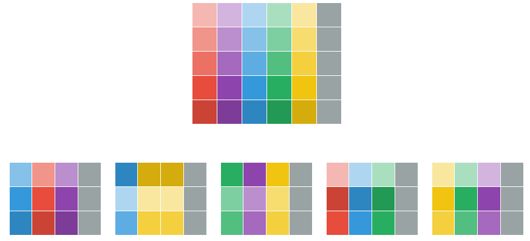


## Ключевые параметры модели

* `ntree` — число деревьев (подвыборок). *Тактика*: сделай много, потом сокращай!
(можно не обучать заново)
* `mtry` — число переменных в подвыборке. *Тактика* (Breiman): $\sqrt{M}$
* `sampsize` — число наблюдений в подвыборке. *Тактика*: $(2/3)N$
* `nodesize` — минимальное число наблюдений в узле. *Тактика*: 10 или больше.
* `replace` — подвыборка с возвращением или нет. *Тактика* (Breiman): с возвращением.

Подсказка: смотрите в справке значения параметров, принятые по умолчанию.


## Комментарии

1. Случайный лес как и одиночное дерево может использоваться в задачах регрессии. Если у вас нелинейная модель, то случайные леса — хороший кандидат для работы с ней.
2. Отбирая переменные, мы добиваемся декорреляции результатов разных деревьев.
3. Ошибка измеряется по out-of-bag error.

**out-of-bag** — наблюдения, которые не попали в подвыборку (сумку?).

Применим дерево, построенное на подвыборке, к тем наблюдениям, которые в эту подвыборку не попали. Ошибка классификации на таких наблюдениях и будет out-of-bag error. Напоминает ошибку на тестовом множестве.


## Оценка информативности переменных

Случайный лес позволяет оценить информативность (importance) переменных — насколько та или иная переменная влияет на результат классификации/регрессии.

Пусть у нас есть обученный лес. Мы берем один из столбцов (переменную) и случайным образом переставляем в нем значения. Если эта переменная важна для получения результатов (информативна), то качество распознавания сильно уменьшится. 

Информативность переменной вычисляется как разность двух out-of-bag ошибок: до и после перестановки значений в столбце. Чем больше эта разность, тем более информативна переменная.

Проведя эту процедуру по всем столбцам, получим информативность каждой переменной.


## Пример: классификация вин

```{r,eval=FALSE}
library(randomForest)

setwd("../data")
wine <- read.table("wine.txt", header=T, sep="", dec=".")
```


## Создание обучающей и тестовой выборок

```{r, eval=FALSE}
# Формируем случайную подвыборку
set.seed(1234)
test.num <- sample(1:nrow(wine), 60, replace = FALSE)
# Тестовая выборка
test <- wine[test.num, -ncol(wine)]
# Код класса для тестовой выборки
y.test <- wine[test.num, ncol(wine)]
# Обучающая выборка
train <- wine[-test.num, ]
# Делаем колонку меток класса фактором
train$Wine_type <- as.factor(train$Wine_type)
# Предикторы
x <- train[, -ncol(wine)]
# Отклик.
# Должен быть фактором, иначе выполняется регрессия
y <- train$Wine_type
```


## Сбалансированность классов

```{r,eval=F}
# Значения результирующей переменной сбалансированы?
table(y)
```
```
## y
## 0  1  2 
## 40 32 46 
```

### Для несбалансированных классов алгоритмы классификации сбоят!

Если число кликнувших по баннеру (класс 1) составляет 0.1% от числа некликнувших (класс 0), то классификатор отнесет всех к классу 0, причем с весьма малой ошибкой.


## Что делать с несбалансированностью?

1. Штрафовать за ошибки определенного вида (за ошибку в распознавании класса 1 как класса 0).
2. Пополнять "малые" классы (копиями строк-наблюдений).
3. Объединять несколько "малых" классов в один.

Классы          | 1   | 2   | 3      | 4     | 5
----------------|-----|-----|--------|-------|--------
Число элементов | 700 | 900 | **62** | **4** | **18**

Объединяем классы 3—5

Классы          | 1   | 2   | 3*
----------------|-----|-----|-----
Число элементов | 700 | 900 | 84  


## Задаем параметры леса

```{r,eval=FALSE}
# При bagging'е используем датчик случайных чисел!
set.seed(3217)
# Число деревьев в лесе
ntree.1 <- 500 # так по умолчанию
# Трассировка: число шагов через которые выдается 
# промежуточный результат
# do.trace = ntree.1/10
# Минимальное число наблюдений в узле
nodesize.1 <- 1
# Сохранить обученный лес
keep.forest.1 <- TRUE
```


## Запускаем функцию классификации

```{r,eval=FALSE}
rf.wine <- randomForest(x, y, 
                       ntree = ntree.1, 
                       mtry = floor(sqrt(ncol(wine))),
                       replace = FALSE, 
                       nodesize = nodesize.1, 
                       importance = TRUE, 
                       do.trace = ntree.1/10, 
                       keep.forest = keep.forest.1)
```


## Промежуточные результаты помогают определить нужное число деревьев

```
# ntree      OOB      1      2      3
#    50:   1.69%  0.00%  0.00%  4.35%
#   100:   0.00%  0.00%  0.00%  0.00%
#   150:   0.00%  0.00%  0.00%  0.00%
#   200:   0.00%  0.00%  0.00%  0.00%
#   250:   0.00%  0.00%  0.00%  0.00%
#   300:   0.85%  2.50%  0.00%  0.00%
#   350:   0.85%  2.50%  0.00%  0.00%
#   400:   0.85%  2.50%  0.00%  0.00%
#   450:   0.85%  2.50%  0.00%  0.00%
#   500:   0.85%  2.50%  0.00%  0.00%
```

Показывают, какой процент ошибок (OOB — out-of-bag error) допущен при распознавании каждого из сортов вина. И самое важное: при каком количестве деревьев.

Хороший результат получается уже при 100—250 деревьях.


## Размечаем тестовую выборку

```{r,eval=FALSE}
predict.wine <- predict(rf.wine, newdata = test)
# Оценим качество результата
table(y.test, predict.wine)
```
```
##       predict.wine
## y.test  0  1  2
##      0 19  0  0
##      1  0 16  0
##      2  1  2 22
```


## Попробуем теперь при `ntree = 250`

```{r,eval=FALSE}
# При bagging'е используем датчик случайных чисел!
set.seed(3217)
# Число деревьев в лесе
ntree.1 <- 250
...
# Повторяем операции...
```

```
##      predict.wine
## y.test  0  1  2
##      0 19  0  0
##      1  0 16  0
##      2  1  1 23
```

Лучше!


## График ошибки классификации

```{r, eval=FALSE}
plot(randomForest(Wine_type ~ ., train, keep.forest=FALSE, 
                  ntree=500))
```
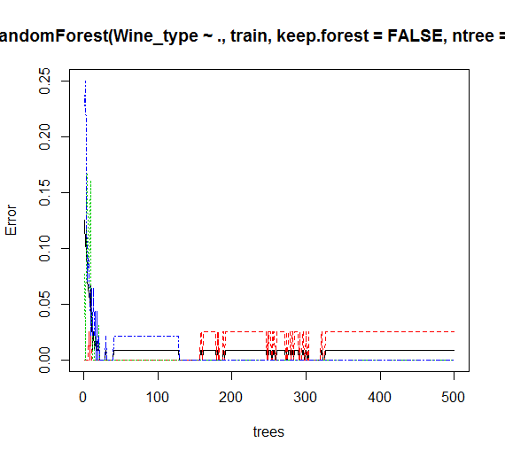

## Как проходило голосование?

```{r, eval=FALSE}
predict.wine.prob <- predict(rf.wine, newdata = test, 
                             type = "prob")
```
```
        0     1     2
21  0.936 0.012 0.052
111 0.060 0.044 0.896
108 0.008 0.056 0.936
110 0.096 0.008 0.896
150 0.040 0.880 0.080
177 0.020 0.968 0.012
2   0.956 0.008 0.036
40  0.916 0.048 0.036
114 0.000 0.004 0.996
87  0.000 0.000 1.000
117 0.004 0.000 0.996
92  0.020 0.044 0.936
...
```


## Влиятельность (Importance)

```{r,eval=FALSE}
varImpPlot(rf.wine, sort=F)
```

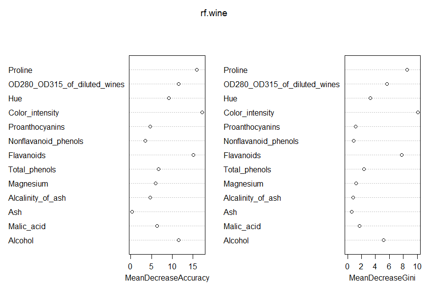


## Оценки влиятельности в табличном виде

```{r,eval=F}
import.wine <- importance(rf.wine, type=NULL, class=1, 
                          scale=TRUE)  
```

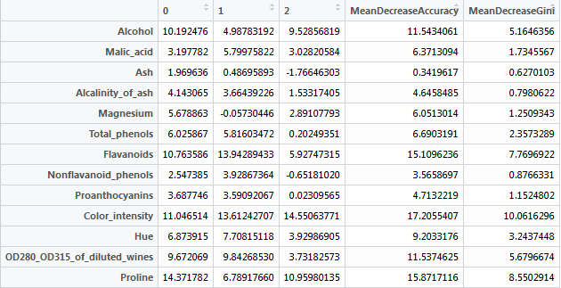


## Эффективность бэггинга

объясняется следующими обстоятельствами:

* Объекты-выбросы могут не попадать в некоторые обучающие подвыборки.
* Если каждый классификатор имеет высокую дисперсию (нестабильность), то комбинированный классификатор имеет меньшую дисперсию по сравнению с отдельными классификаторами.
* Благодаря различности базовых алгоритмов, их ошибки взаимно компенсируются при голосовании.

Случайные леса переобучают, но реже чем другие методы.


## Как работает бэггинг при регрессии

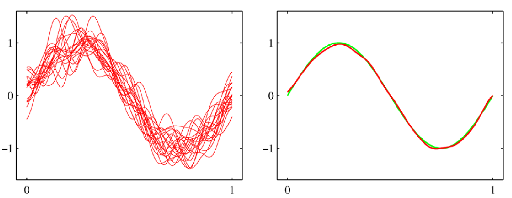

\tiny

Источник: [*Лев Уткин. Лекции по курсу “Машинное обучение”. Лекция 7 "Композиционные методы машинного обучения."*](http://www.levvu.narod.ru/Machine_Learning_LTU_7.pdf)


## Дополнительные материалы по бэггингу

* [ranger](https://cran.r-project.org/web/packages/ranger/index.html) — самая быстрая реализация случайного леса.
    * параметр `splitrule` задает способ формирования деревьев; `splitrule="extratrees"` создает extremely randomized trees (Geurts, P., Ernst, D., Wehenkel, L. (2006). Extremely randomized trees. Mach Learn 63:3-42. https://doi.org/10.1007/s10994-006-6226-1). Это самая быстрый по скорости обучения вариант случайного леса, а часто и самый точный.
    * параметр `oob.error = F`. Если не нужно считать out-of-bag error, классификатор обучается на 10—15% быстрее.
    
* `BostonHousing.Rmd` и `Albuquerque Home Prices__lm_rf.R` в папке `scripts` — сравнение по точности прогноза моделей линейной регрессии и случайного леса.
* [HackerEarth Blog. Practical Tutorial on Random Forest and Parameter Tuning in R](https://www.hackerearth.com/blog/developers/practical-tutorial-random-forest-parameter-tuning-r) — техника использования случайного леса в пакете [mlr3](https://cran.r-project.org/web/packages/mlr3/index.html).


## Бустинг (boosting)

*boosting* — повышение, усиление, форсирование.

### Идея бустинга

* Строим слабый классификатор.
* Смотрим, где он ошибается.
* Строим следующий классификатор, чтобы смоделировать ошибки предыдущего.
* ...


## Идея бустинга — более подробное

* Предположим, что мы угадали (но не точно):
$F(x_1) = 0.8$, когда $y_1 = 0.9$, затем $F(x_2) = 1.4$, когда $y_2 = 1.3$, ...
* Как улучшить модель, если нельзя изменить параметры функции $F$?
* **Идея:** Можно добавить к $F$ дополнительную модель $h_1$ так, что новая функция будет: $F(x) + h_1(x)$

$$
\begin{array}{lllclcl}
F(x_1) + h_1(x_1) &=& y_1 & & h_1(x_1) &=& y_1 - F(x_1) \\
F(x_2) + h_1(x_2) &=& y_2 & & h_1(x_2) &=& y_2 - F(x_2) \\
                &\ldots& &\text{или}&  &\ldots&            \\
F(x_n) + h_1(x_n) &=& y_n & & h_1(x_n) &=& y_n - F(x_n) \\                
\end{array}
$$
Построим регрессионную модель для $h_1(x)$, то есть модель для
новой обучающей выборки

$$
\{ (x_1, y_1 - F(x_1)), (x_2, y_2 - F(x_2)), \ldots, (x_n, y_n - F(x_n)) \}
$$


##

* Задача $h_1(x)$ — компенсировать недостаток существующей модели $F(x)$.
* Что делать, если модель $F(x) + h_1(x)$ снова нас не удовлетворяет?
* **Идея (подкупающая новизной)**: добавим новую модель $h_2(x)$.


## Бустинг напоминает разложение в ряд Тейлора

**Дано:** значение функции $f(x)$ и ее производных в точке $x_0$.
**Найти:** значение функции в некоторой точке $x$, близкой к $x_0$.

$$
\renewcommand{\arraystretch}{2.}
\begin{array}{lll}
f(x) &=& f(x_0) + {\frac{f'(x_0)}{1!}}(x - x_0) + ...\\
f(x) &=& f(x_0) + {\frac{f'(x_0)}{1!}}(x - x_0) + {\frac{f''(x_0)}{2!}}(x - x_0)^2 +  ... \\
 & \ldots & \\
f(x) &=& f(x_0) + {\frac{f'(x_0)}{1!}}(x - x_0) + {\frac{f''(x_0)}{2!}}(x - x_0)^2 + ... \\
 & & + {\frac{f^{(n)}(x_0)}{n!}}(x - x_0)^n + ...
\end{array}
$$


## Приближение $e^x$ рядом Тейлора в окрестности $x=0$

\bcols
\column{.5\textwidth}

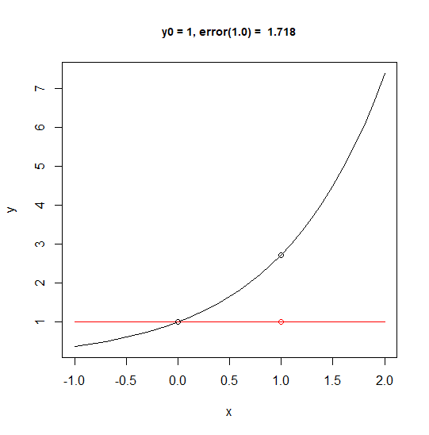


\column{.5\textwidth}

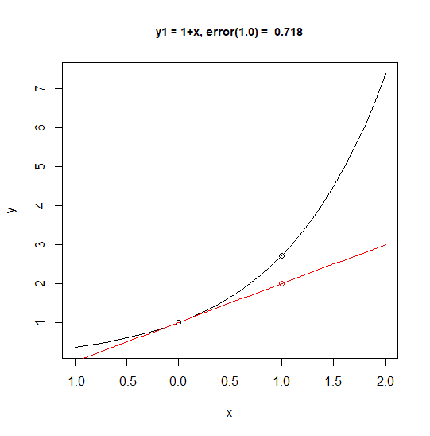

\ecols


##

\bcols
\column{.5\textwidth}

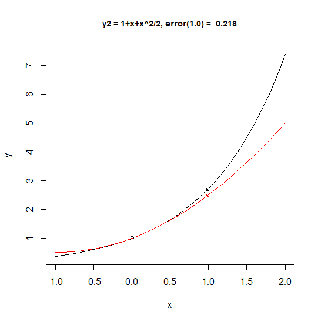


\column{.5\textwidth}

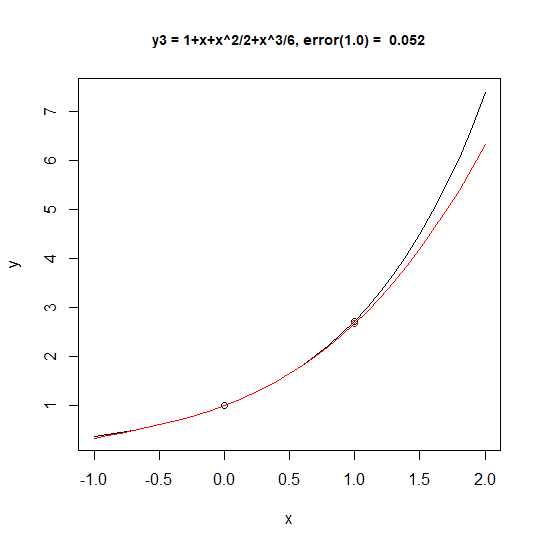

\ecols


##

\bcols
\column{.5\textwidth}

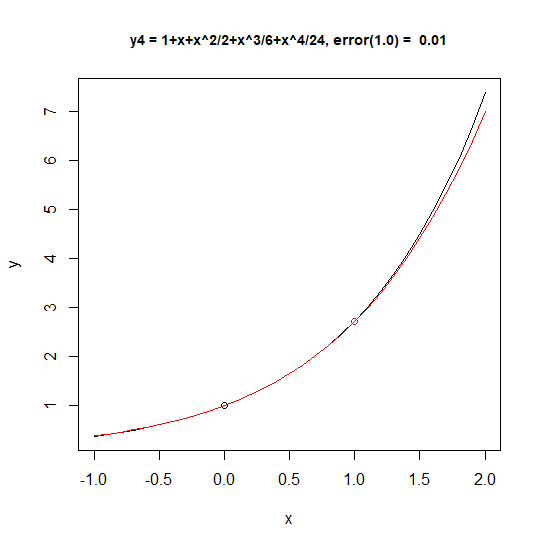


\column{.5\textwidth}

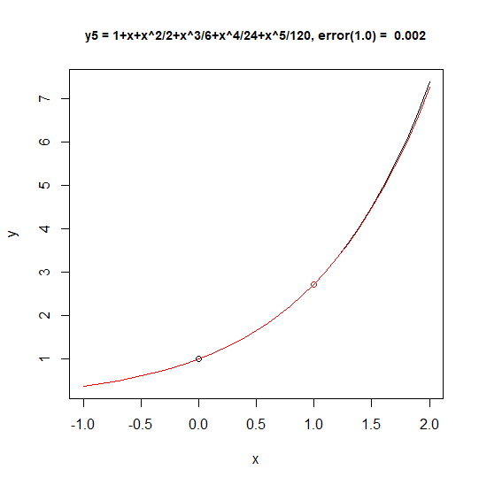

\ecols


## XGBoost

Рассмотрим метод **XGBoost** (E**x**treme **G**radient **Boost**ing — экстремальный градиентный бустинг). 

Алгоритм градиентного бустинга (Gradient Boosting) предложил Джером Фридман

* *J.H. Friedman*. Greedy Function Approximation: A Gradient Boosting
Machine, 2001, Annals of Statistics, 29 (5): 1189-1232

Экстремальный градиентный бустинг предложил Tianqi Chen в 2014 г.

В изложении мы следуем слайдам Т. Чена

* [*T. Chen.* Introduction to Boosted Trees, Oct. 22 2014](https://homes.cs.washington.edu/~tqchen/pdf/BoostedTree.pdf)

и документации к библиотеке XGBoost

* [XGBoost Tutorials. Introduction to Boosted Trees](https://xgboost.readthedocs.io/en/latest/tutorials/model.html)

а также используем рисунки, выполненные Т. Ченом.


## Модель и параметры

XGBoost используется в задачах обучения с учителем (регрессии, классификации, ранжировании), где наблюдениям $x_i$ соответствуют ответы (отклики) $y_i$.

Модель обучения с учителем — математическая формула, связывающая прогнозы значений $y_i$ ($\hat{y}_i$) с наблюдениями $x_i$. 

Линейная модель имеет вид

$$
\hat{y}_i = \sum_j \theta_j x_{ij} .
$$

Параметры $\theta_j$ заранее неизвестны. Их необходимо подобрать на основе обучающей выборки данных так, чтобы минимизировать ошибку прогноза.


## Целевая функция

Целевая функция ($\text{obj}$) состоит из двух частей: функции потерь $L$ и слагаемого, отвечающего за регуляризацию $\Omega$

$$
\text{obj}(\theta) = L(\theta) + \Omega(\theta) .
$$

Функция потерь характеризует точность прогноза. Например, через сумму квадратов его ошибок

$$
L(\theta) = \sum_i (y_i-\hat{y}_i)^2 .
$$

Слагаемое $\Omega(\theta)$ регулирует *сложность* модели, что помогает избежать переобучения.


## Управление сложностью

Моделируем наблюдения ступенчатой функцией. Нужна достаточно точная и в то же время простая модель.


## Решающее дерево (CART)


## Ансамбль решающих деревьев


Оценки, полученные отдельными деревьями, суммируются

$$
\hat{y}_i = \sum_{k=1}^K f_k(x_i)
$$

$K$ — число деревьев.


## Отличие бустинга от бэггинга

Разница — в способе добавления деревьев

* бэггинг — примеры выбираются так, что каждый пример имеет одинаковые шансы попасть в обучающую подвыборку;
* бустинг — обучающая выборка на каждой итерации определяется, исходя из ошибок классификации на предыдущих итерациях.


## Аддитивное обучение

Каждое дерево характеризуется функцией $f_i$. Будем добавлять деревья по одному. Обозначим прогноз на шаге $t$ через $\hat{y}_i^{(t)}$. Тогда

$$
\begin{split}\hat{y}_i^{(0)} &= 0\\
\hat{y}_i^{(1)} &= f_1(x_i) = \hat{y}_i^{(0)} + f_1(x_i)\\
\hat{y}_i^{(2)} &= f_1(x_i) + f_2(x_i)= \hat{y}_i^{(1)} + f_2(x_i)\\
&\dots\\
\hat{y}_i^{(t)} &= \sum_{k=1}^t f_k(x_i)= \hat{y}_i^{(t-1)} + f_t(x_i)\end{split}
$$


## Какое дерево добавлять?

Такое, структура которого ($f_t$) минимизирует целевую функцию

$$
\begin{split}\text{obj}^{(t)} & = \sum_{i=1}^n l(y_i, \hat{y}_i^{(t)}) + \sum_{i=1}^t\Omega(f_i) \\
          & = \sum_{i=1}^n l(y_i, \hat{y}_i^{(t-1)} + f_t(x_i)) + \sum_{i=1}^t\Omega(f_i) + \mathrm{constant} .\end{split} 
$$


##

Вспомним, что
$$
\sum_{i=1}^t\Omega(f_i) = \sum_{i=1}^{t-1}\Omega(f_i) + \Omega(f_t) .
$$

Тогда для квадратичной функции потерь целевая функция запишется как
$$
\begin{split}\text{obj}^{(t)} & = \sum_{i=1}^n (y_i - (\hat{y}_i^{(t-1)} + f_t(x_i)))^2 + \sum_{i=1}^t\Omega(f_i) \\
          & = \sum_{i=1}^n [2(\hat{y}_i^{(t-1)} - y_i)f_t(x_i) + f_t(x_i)^2] + \Omega(f_t) + \mathrm{constant} .\end{split}
$$
$n$ — число наблюдений.

Мы получили функцию, описывающую изменение потерь на текущем шаге $t$.

Будем подбирать $f_t$, чтобы добиться минимума
$$
\sum_{i=1}^n [2(\hat{y}_i^{(t-1)} - y_i)f_t(x_i) + f_t(x_i)^2] + \Omega(f_t) .
$$


## 

Для произвольной функции потерь целевая функция содержит разложение в ряд Тейлора по степеням $f_t$

$$
\text{obj}^{(t)} = \sum_{i=1}^n [l(y_i, \hat{y}_i^{(t-1)}) + g_i f_t(x_i) + \frac{1}{2} h_i f_t^2(x_i)] + \Omega(f_t) + \mathrm{constant} ,
$$
где $g_i$ и $h_i$ имеют вид
$$
\begin{split}g_i &= \partial_{\hat{y}_i^{(t-1)}} l(y_i, \hat{y}_i^{(t-1)})\\
h_i &= \partial_{\hat{y}_i^{(t-1)}}^2 l(y_i, \hat{y}_i^{(t-1)})\end{split}
$$
После удаления констант, целевая функция на шаге $t$ примет вид
$$
\sum_{i=1}^n [g_i f_t(x_i) + \frac{1}{2} h_i f_t^2(x_i)] + \Omega(f_t) .
$$
Пора уточнить, что понимается под сложностью модели.


## Сложность модели

Нужно задать функцию, описывающую сложность модели — $\Omega(f)$.

Сначала формализуем описание дерева $f_i$
$$
f_t(x) = w_{q(x)}, \quad w \in R^T, \quad q:R^d\rightarrow \{1,2,\cdots,T\} .
$$
$w$ — вектор оценок в листьях, $q$ — функция, присваивающая каждое наблюдение конкретному листу, $T$ — число листьев. 

В библиотеке XGBoost сложность модели описывается функцией
$$
\Omega(f) = \gamma T + \frac{1}{2}\lambda \sum_{j=1}^T w_j^2 .
$$
Это далеко не единственный вариант. Параметры $\gamma$ и $\lambda$ предстоит подбирать.


## Оценка сложности модели

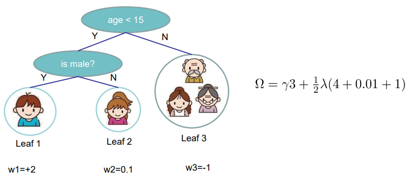


## Целевая функция полностью

$$
\text{obj}^{(t)} = \sum_{i=1}^n [g_i w_{q(x_i)} + \frac{1}{2} h_i w_{q(x_i)}^2] + \gamma T + \frac{1}{2}\lambda \sum_{j=1}^T w_j^2 .
$$

Введем $I_j = \{i|q(x_i)=j\}$ — множество номеров точек данных, попавших на j-й лист. Перепишем целевую функцию через номера листьев 
$$
\text{obj}^{(t)} = \sum^T_{j=1} [(\sum_{i\in I_j} g_i) w_j + \frac{1}{2} (\sum_{i\in I_j} h_i + \lambda) w_j^2 ] + \gamma T .
$$
Мы изменили индекс суммирования, потому что все точки данных на одном листе получают одинаковую оценку.

Введем обозначения $G_j = \sum_{i\in I_j} g_i$, $H_j = \sum_{i\in I_j} h_i$ и запишем целевую функцию еще короче
$$
\text{obj}^{(t)} = \sum^T_{j=1} [G_jw_j + \frac{1}{2} (H_j+\lambda) w_j^2] +\gamma T .
$$


##

$$
\text{obj}^{(t)} = \sum^T_{j=1} [G_jw_j + \frac{1}{2} (H_j+\lambda) w_j^2] +\gamma T .
$$
Все $w_i$ независимы друг от друга. Выражение $G_jw_j+\frac{1}{2}(H_j+\lambda)w_j^2$ представляет собой [квадратичную форму](https://ru.wikipedia.org/wiki/Квадратичная_форма), про которые известно, что
$$
\text{argmin}_x (Gx + \frac{1}{2}H^2) = -\frac{G}{H}, \ H > 0,
\quad \min_x (Gx + \frac{1}{2}H^2) = -\frac{1}{2}\frac{G^2}{H} .
$$
Отсюда наилучшее значение $w_i$ при заданной структуре дерева $q(x)$
$$
w_j^\ast = -\frac{G_j}{H_j+\lambda} ,
$$
а целевая функция будет равна
$$
\text{obj}^\ast = -\frac{1}{2} \sum_{j=1}^T \frac{G_j^2}{H_j+\lambda} + \gamma T .
$$


##


## Поиск дерева с наилучшей структурой

Перечислим все возможные структуры деревьев $q$:

* Рассчитаем оценку структуры для $q$ с помощью выражения

$$
\text{obj} = -\frac{1}{2} \sum_{j=1}^T \frac{G_j^2}{H_j+\lambda} + \gamma T .
$$

* Найдем лучшую структуру и для нее вычислим оптимальный вес листьев

$$
w_j^\ast = -\frac{G_j}{H_j+\lambda} .
$$

Проблема в том, что число возможных структур деревьев бесконечно.


## Реальный поиск дерева с наилучшей структурой

Деревья наращиваются по принципу жадного алгоритма:

* Начинаем с дерева глубины 0.
* Для каждого листового узла дерева пробуем сделать разделение (split). Изменение целевой функции после разделения имеет вид
$$
Gain = \frac{1}{2} \left[\frac{G_L^2}{H_L+\lambda}+\frac{G_R^2}{H_R+\lambda}-\frac{(G_L+G_R)^2}{H_L+H_R+\lambda}\right] - \gamma .
$$
Эта формула состоит из следующих частей: 1) оценки на новом левом листе 2) оценки на новом правом листе 3) оценки на исходном листе 4) регуляризации на дополнительном листе.

Напомним, что разделение узла направлено на увеличение степени чистоты. Поэтому если прирост частоты (gain) меньше $\gamma$, выполнять разделение нет смысла.

**Остается вопрос: как найти лучшее разделение узла?**


##

Рассчитаем выгоду от разделения узла. Допустим, для признака "возраст" (age)

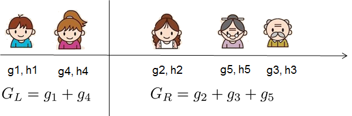

* Вычислим суммы $g$ и $h$ по обе стороны от разделения и рассчитаем
$$
Gain = \frac{1}{2} \left[\frac{G_L^2}{H_L+\lambda}+\frac{G_R^2}{H_R+\lambda}-\frac{(G_L+G_R)^2}{H_L+H_R+\lambda}\right] - \gamma .
$$
* Если наблюдения отсортировать по возрасту, то для поиска лучшего разделения данного признака будем перемещать границу раздела слева направо и проверять Gain.


## Алгоритм поиск наилучшего разделения

* Для каждого узла перечислить все признаки
* Для каждого признака отсортировать все наблюдения по значению данного признака
* С помощью сканирования слева направо найти наилучшее разделение для данного признака
* Выбрать наилучшее разделение среди всех перечисленных признаков.


## Алгоритм XGBoost

* Добавляем по одному дереву на кадой итерации
* В начале каждой итерации вычисляем
$g_i = \partial_{\hat{y}_i^{(t-1)}} l(y_i, \hat{y}_i^{(t-1)}), \quad
h_i = \partial_{\hat{y}_i^{(t-1)}}^2 l(y_i, \hat{y}_i^{(t-1)}) .$
* Ищем дерево $f_t(x)$ с наилучшей структурой
$\text{obj} = -\frac{1}{2} \sum_{j=1}^T \frac{G_j^2}{H_j+\lambda} + \gamma T .$
* Добавляем дерево $f_t(x)$ в модель $\hat{y}_i^{(t)} = \hat{y}_i^{(t-1)} + f_t(x_i)$
    * Обычно добавляем выражение: $\hat{y}_i^{(t)} = \hat{y}_i^{(t-1)} + \epsilon f_t(x_i)$.
    * $\epsilon$ — длина шага или shrinkage, берется в районе 0.1.
    * Это означает, что мы не выполняем полную оптимизацию на каждом шаге и оставляем шанс на улучшение для следующих итераций. Помогает предотвратить переобучение.
    
    
## Заключительные замечания

\large

* XGBoost не работает напрямую с категориальными данными. Их надо перекодировать с помощью [one-hot-кодировки](https://en.wikipedia.org/wiki/One-hot).
* Деревья и ансамбли деревьев используются не только для классификации/регрессии, но и для **ранжирования**.


## Дополнительные материалы по бустингу

### XGBoost

* Пакет [xgboost](https://cran.r-project.org/web/packages/xgboost/index.html) — реализует алгоритмы градиентного бустинга (не только экстремального). Параллельные вычисления и поддержка CUDA из коробки.

### CatBoost

* [CatBoost](https://catboost.ai) — пакет градиентного бустинга, разработанный в Яндекс. В отличие от XGBoost, позволяет напрямую работать с категориальными данными.
* [Neural Oblivious Decision Ensembles for Deep Learning on Tabular Data](https://arxiv.org/abs/1909.06312) — парни из Яндекса объясняют работу Catboost.

### LightGBM

* [LightGBM](https://github.com/microsoft/LightGBM/tree/master/R-package) — пакет градиентного бустинга от Microsoft. Отличается высокой скоростью обучения.
* [Quora. How does the LightGBM algorithm work conceptually?](https://www.quora.com/How-does-the-LightGBM-algorithm-work-conceptually)


## Настройка и применение XGBoost

* [Analytics Vidhya. How to use XGBoost algorithm in R in easy steps](https://www.analyticsvidhya.com/blog/2016/01/xgboost-algorithm-easy-steps/) — пошаговый пример использования XGBoost в R, до чего у нас так и не дошли руки
* [XGBoost Parameters](https://xgboost.readthedocs.io/en/latest/parameter.html) — дока по параметрам: чтобы знать, что настраивать.
* [Vivian S. Zhang. Kaggle Winning Solution Xgboost algorithm](https://www.slideshare.net/ShangxuanZhang/kaggle-winning-solution-xgboost-algorithm-let-us-learn-from-its-author) — От математических основ алгоритма до настройки параметров в конкретной задаче, Python.


## Стекинг (stacking)

Бэггинг и бустинг: не слишком ли мы все усложняем?

**Идея №1.** Обучим несколько разных алгоритмов классификации и в качестве прогноза будем выбирать класс, на который укажет большинство алгоритмов (в задачах регрессии — среднее результатов отдельных алгоритмов). 

Полученный результат часто превосходит по качеству все эти алгоритмы по отдельности. 

Возникает вопрос: зачем для объединения результатов ограничиваться только голосованием (усреднением).

**Идея №2.** Ансамблирование может выполнять еще один алгоритм машинного обучения (метаалгоритм).

Блендинг — простейшая версия стекинга.


## Блендинг (blending)

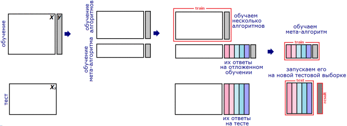

Обучающую выборку делят на две части. На первой обучают базовые алгоритмы. Затем получают их ответы на второй части и на тестовой выборке. Ответ каждого алгоритма рассматривается как новый признак (метапризнак). На метапризнаках второй части обучения настраивают метаалгоритм. Затем запускают его на метапризнаках тестовых данных и получают ответ.


## Модификации блендинга

Недостаток простейшей схемы блендинга — для обучения используется лишь часть обучающей выборки. Нужно много данных. 

Для повышения качества можно:

1. усреднить несколько блендингов с разными разбиениями обучающей выборки.
2. объединить обучающие (и тестовые) таблицы, полученные при разных разбиениях. Здесь мы получим несколько ответов для каждого объекта тестовой выборки (по одному от каждого алгоритма) — и усредним их.


##

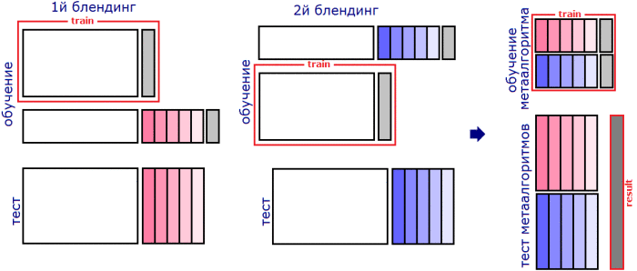


## Стекинг

Обучающую выборку разбивают на K частей. На всех частях, кроме одной, обучают базовый алгоритм, а на оставшейся получают ответы и трактуют их как значения метапризнаков этого алгоритма на этой части. Постепенно перебирая части, получают метапризнаки данного алгоритма для всей обучающей выборки. Затем переходят к следующему базовому алгоритму.

Для получения метапризнаков объектов тестовой выборки базовые алгоритмы обучают **на всей** обучающей выборке и берут их ответы на тестовой.

Вариант: для получения метапризнаков на тестовой выборке прогнать ее через алгоритмы, обученные для каждой из частей, а затем усреднить результаты.


## Схема стекинга при $K=3$

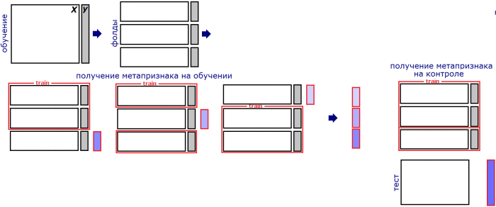


## Выбор алгоритмов

В отличие от бустинга и бэггинга при стекинге можно и нужно использовать алгоритмы разной природы. Например, гребневую регрессию вместе со случайным лесом. Для формирования метапризнаков, как правило, используют регрессоры.
Подготовка признакового пространства


## Признаковое пространство

Важно помнить, что для разных базовых алгоритмов нужны **разные** признаковые пространства. Если есть категориальные признаки с малым (3–4) числом категорий, то случайному лесу их можно подавать «как есть», а для регрессионных алгоритмов нужно предварительно выполнить [one-hot-кодировку](https://en.wikipedia.org/wiki/One-hot).


## Деформация метапризнакового пространства

Полезный прием — преобразование (деформация) метапризнакового пространства. Например, вместо стандартных метапризнаков (ответов алгоритмов) можно использовать одночлены над ними (например, все попарные произведения).


## Метапараметры

Параметры есть не только у базовых алгоритмов, но и у самого стекинга. 

Число частей $K$, на которые разбивают обучающую выборку стараются
выбрать максимальным, при котором алгоритм еще обучается за приемлемое время.


## Дополнительные материалы

* [*Дьяконов А.* Анализ малых данных. Cтекинг (Stacking) и блендинг (Blending)](https://dyakonov.org/2017/03/10/cтекинг-stacking-и-блендинг-blending/) — наиболее простое и связное изложение темы на русском. Много интересного в комментах. Из этой статьи я брал иллюстрации по стекингу.
* [caretEnsemble](https://cran.r-project.org/web/packages/caretEnsemble/index.html) — пакет стекинга моделей, дополняющий caret. Хорошая виньетка с примерами.
* [*Boehmke B., Greenwell B.* Hands-On Machine Learning with R. Chapter 15 Stacked Models](https://bradleyboehmke.github.io/HOML/stacking.html) — стекинг в библиотеке H2O. [Stacked Ensembles](http://docs.h2o.ai/h2o/latest-stable/h2o-docs/data-science/stacked-ensembles.html) — официальные доки.

