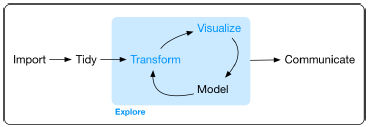
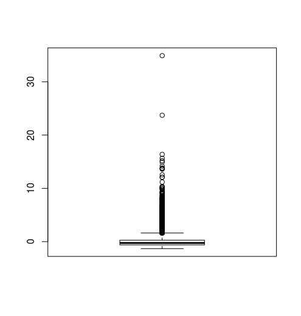

## Содержание

* Меры точности классификации
* Подготовка данных для анализа


## Accuracy — самая простая мера точности классификации

**Классификатор** — алгоритм классификации.

**(Overall) Accuracy** — доля объектов по которым классификатор принял правильное решение.
$$
Accuracy=\frac{P}{N}
$$

* $P$ – количество объектов по которым классификатор принял правильное решение;
* $N$ – размер обучающей выборки.


## Дисбаланс классов

Accuracy присваивает всем объектам одинаковый вес. Это плохо, если распределение объектов обучающей выборки сильно смещено в сторону какого-то класса.

Выборка: 95 кошек и 5 собак. Классификатор записывает всех животных в кошки.

\begin{table}
\centering
\begin{tabular}{ | p{2cm} p{2cm} | c c |}
\hline
\multicolumn{2}{|c|}{} & \multicolumn{2}{ |c| }{\bf{Факт}} \\
\multicolumn{2}{|c|}{} & Кошки & Собаки \\ \hline
\bf{Прогноз} & Кошки  & 95    & 5      \\
             & Собаки & 0     & 0      \\
\hline
\end{tabular}
\end{table}

Тем не менее...

$$
Accuracy=0.95
$$


## Матрица ошибок (confusion table)

\begin{table}
\centering
\begin{tabular}{ | p{2cm} p{2cm} | c c |}
\hline
\multicolumn{2}{|c|}{} & \multicolumn{2}{ |c| }{\bf{Actual}} \\
\multicolumn{2}{|c|}{} & Positive & Negative \\ \hline
\bf{Predicted} & Positive  & True Positive & False Positive \\
             & Negative  & False Negative & True Negative \\
\hline
\end{tabular}
\end{table}

* True Positive (TP)  – верно определены как положительные;
* True Negative (TN)  – верно определены как отрицательные;
* False Positive (FP) – ошибочно определены как положительные;
* False Negative (FN) – ошибочно определены как отрицательные.

Вне-диагональные элементы показывают случаи несовпадения между расчетными и реальными классами. 

Функции: `table`, `caret::confusionMatrix`.


## Точность и полнота для каждого класса

**Точность в пределах класса** (precision) – доля объектов принадлежащих данному классу среди всех объектов, которые алгоритм отнес к этому классу (доля настоящих больных среди всех пациентов, отнесенных классификатором к больным). 
$$
Precision = \frac{TP}{TP+FP}
$$
$Precision(\text{cats}) = \frac{95}{95+5} = 0.95$, $Precision(\text{dogs}) = \frac{0}{0} = NaN$.

**Полнота** (recall) или **чувствительность** (sensitivity) классификатора – доля найденных объектов класса среди всех объектов данного класса (вероятность того, что больной будет классифицирован именно как больной).
$$
Recall = Sensitivity = \frac{TP}{TP+FN}
$$
$Recall(\text{cats}) = \frac{95}{95+0} = 1$, $Recall(\text{dogs}) = \frac{0}{0+5} = 0$.


## Расчет точности и полноты

Дана выборка из 27 животных: 8 кошек, 6 собак и 13 кроликов.

Результат классификации:

\begin{table}
\centering
\begin{tabular}{ | p{2cm} p{2cm} | c c c |}
\hline
\multicolumn{2}{|c|}{} & \multicolumn{3}{ |c| }{\bf{Факт}} \\
\multicolumn{2}{|c|}{} & Кошки & Собаки & Кролики \\ \hline
             & Кошки   & 5     & 2      & 0       \\
\bf{Прогноз} & Собаки  & 3     & 3      & 2       \\
             & Кролики & 0     & 1      & 11      \\
\hline
\end{tabular}
\end{table}

Расчитаем общую точность, точность для класса и полноту данного классификатора.


## Расчеты - 1

Сумма значений диагональных элементов показывает общее количество правильно классифицированных объектов. Доля правильно классифицированных объектов от общего числа объектов $N$ называется общей точностью классификации:
$$
Overall\ Accuracy = \frac{\sum_{i=1}^n A_{ii}}{N}
$$
$Overall\ Accuracy = (5+3+11)/27 = 19/27$


## Расчеты - 2

\begin{table}
\centering
\begin{tabular}{ | p{2cm} p{2cm} | c c c | c |}
\hline
\multicolumn{2}{|c|}{} & \multicolumn{3}{ |c| }{\bf{Факт}} &  $\sum_{row}$  \\
\multicolumn{2}{|c|}{} & Кошки & Собаки & Кролики          &    \\ \hline
             & Кошки   & 5     & 2      & 0                & 7  \\
\bf{Прогноз} & Собаки  & 3     & 3      & 2                & 8  \\
             & Кролики & 0     & 1      & 11               & 12 \\ \hline
             & $\sum_{col}$ & 8     & 6    & 13            &    \\
\hline
\end{tabular}
\end{table}

$$
Precision_{c} = \frac{A_{cc}}{\sum_{j=1}^n A_{cj}}, \quad
Recall_{c} = \frac{A_{cc}}{\sum_{i=1}^n A_{ic}}
$$
Точность равна отношению соответствующего диагонального элемента матрицы и суммы всей строки класса, полнота – отношению диагонального элемента матрицы и суммы всего столбца класса. 


## Расчеты - 3

\begin{table}
\centering
\begin{tabular}{ | p{2cm} p{2cm} | c c c | c |}
\hline
\multicolumn{2}{|c|}{} & \multicolumn{3}{ |c| }{\bf{Факт}} &  $\sum_{row}$  \\
\multicolumn{2}{|c|}{} & Кошки & Собаки & Кролики          &    \\ \hline
             & Кошки   & 5     & 2      & 0                & 7  \\
\bf{Прогноз} & Собаки  & 3     & 3      & 2                & 8  \\
             & Кролики & 0     & 1      & 11               & 12 \\ \hline
             & $\sum_{col}$ & 8     & 6    & 13            &    \\
\hline
\end{tabular}
\end{table}

* Кошки: $Precision = 5/7, \quad Recall = 5/8$
* Собаки: $Precision = 3/8, \quad Recall = 3/6$
* Кролики: $Precision = 11/12, \quad Recall = 11/13$


## Насколько хороша данная классификация?

Идеальный вариант

\begin{table}
\centering
\begin{tabular}{ | p{2cm} p{2cm} | c c c |}
\hline
\multicolumn{2}{|c|}{} & \multicolumn{3}{ |c| }{\bf{Факт}} \\
\multicolumn{2}{|c|}{} & Кошки & Собаки & Кролики \\ \hline
             & Кошки   & 8     & 0      & 0       \\
\bf{Прогноз} & Собаки  & 0     & 6      & 0       \\
             & Кролики & 0     & 0      & 13      \\
\hline
\end{tabular}
\end{table}

В скобках указаны реальные точности.

* Кошки: $Precision = 1 \ (0.71), \quad Recall = 1 \ (0.63)$
* Собаки: $Precision = 1 \ (0.38), \quad Recall = 1 \ (0.5)$
* Кролики: $Precision = 1 \ (0.92), \quad Recall = 1 \ (0.85)$


## Практическая оценка качества классификации

\large

**Зависит от области науки, где классификация применяется.**

\normalsize

Для карт:

* общая точность $\ge 85\%$;
* разумно равные значения одноименных метрик для всех классов;
* зависит от задачи.

\tiny

Источник: [Global Land Cover Validation: Recommendations for Evaluation and Accuracy Assessment of Global Land Cover Maps](https://gofcgold.org/sites/default/files/docs/ReportSeries/GOLD_25.pdf)


## Где все это в R?

```
# Precision/User's accuracy
diag(cmatrix) /rowSums(cmatrix)

# Recall/Producer's accuracy
diag(cmatrix)/colSums(cmatrix)

# Все вместе и еще больше метрик
caret::confusionMatrix()
```


## Другая терминология: точность пользователя и точность производителя

\small

**Точность производителя** (producer's accuracy) для выбранного класса – отношение числа правильно классифицированных объектов этого класса к общему числу объектов класса. *Точность производителя = Recall*

Показывает, насколько вероятно, что создатель классификации верно выделил данный класс среди остальных.

Для кошек: $producer's accuracy = 5/8$

**Точность пользователя** (user's accuracy) – доля правильно классифицированных объектов класса от общего числа объектов, отнесенных классификатором к этому классу. *Точность пользователя = Precision*

Для кошек: $user's accuracy = 5/7$

Показывает пользователю классификации насколько вероятно, что данный класс совпадает с результатами классификации.


## Зоопарк названий метрик

Названия из разных наук:

* precision, recall – анализ данных, распознавание образов;
* sensitivity, specificity – медицинская диагностика;
* producer's accuracy, user's accuracy – картография, географические информационные системы.

[Wikipedia: Precision and recall](https://en.wikipedia.org/wiki/Precision_and_recall) – еще больше метрик с картинками.


## F-мера

Чем выше точность и полнота, тем лучше. Но в реальной жизни и то и другое одновременно недостижимо и приходится искать компромисс. 

Хочется иметь метрику, которая объединила бы информацию о точности и полноте классификатора. Такой метрикой является F-мера.

**F-мера** – среднее гармоническое между точностью и полнотой. Она стремится к нулю, если точность или полнота стремится к нулю.

$$
F = 2\frac{Precision \times Recall}{Precision + Recall} = \frac{2}{\frac{1}{Recall}+\frac{1}{Precision}}
$$


## Взвешенная F-мера

Обычная F-мера придает одинаковый вес точности и полноте. Поэтому она будет одинаково уменьшаться как при уменьшении точности, так и при уменьшении полноты. 

Если какая-то из этих метрик для вас важнее, можно придать точности и полноте различный вес:

$$
F = (\beta^2 + 1)\frac{Precision \times Recall}{\beta^2Precision + Recall}
$$

При $0<\beta<1$ приоритет отдается точности, а при $\beta>1$ – полноте (при $\beta=1$ формула сводится к предыдущей).


## caret::confusionMatrix, точность классификации ирисов

```{r, echo=FALSE}
suppressPackageStartupMessages(library(caret))

data(iris)

set.seed(123)
ind_train <- createDataPartition(iris$Species, p = 0.7, list = FALSE)
train <- iris[ ind_train,]
test  <- iris[-ind_train,]

ctrl <- trainControl(method = "repeatedcv", number = 10, repeats = 3)

knn_fit <- train(Species ~., data = train, method = 'knn',
                 trControl = ctrl,
                 preProcess = c('center', 'scale'),
                 tuneLength = 15)

prediction <- predict(knn_fit, newdata = test)
```

\tiny

```{r}
confusionMatrix(prediction, test$Species)
```


## Дополнительные материалы

Kappa ($\kappa$) – единая метрика точности классификации, работает в случае дисбаланса классов.

* [Cohen's kappa in plain English](https://stats.stackexchange.com/questions/82162/cohens-kappa-in-plain-english) – простыми словами.
* [Анализ малых данных: Функционалы качества бинарной классификации](https://dyakonov.org/2019/05/31/функционалы-качества-в-задаче-бинарн/) – простыми формулами.


## Как работает аналитик...




Из книги *Wickam H., Grolemund G. R for Data Science, O’Reilly Media, 2017.*


## Наступила ночь, взошла Луна и в стране дураков закипела работа...

До 80% времени работы занимает подготовка данных (Tidy, Transform). Но эту работу никто не замечает!

Между тем, без подготовки данных мы получим на выходе модели тот же мусор, который заложили в нее на входе: garbage in -> garbage out.

\centering
{width=120px}

Рассмотрим основные приемы, которые используются при подготовке данных.

Ряд примеров взят из статьи ["Как я победил в конкурсе BigData от Beeline"](https://habrahabr.ru/post/270367/), опубликованной на Хабре.


## Задача № 0. Разметка данных

\footnotesize

Обучающая выборка попадает к аналитику от заказчика. Однако не редкость,  когда аналитику приходится размечать выборку самостоятельно: заказчик просто не может этого сделать.

Заказчик – страховая компания, работающая на сельскохозяйственном рынке. Заказчика интересует, сколько всего площадей занято той или иной культурой (в масштабах области, страны, ...)?

Нужно использовать спутниковые снимки (снимаем поля, выделяем на снимках поля нужной культуры, оцениваем их площадь). Это позволит дешево охватить большие площади. Но заказчик не умеет работать со спутниковыми данными, у него есть только информация о расположении полей определенных культур.

Найти нужные данные, скачать снимки, обработать их (маскирование облаков, теней) и лишь потом приступить к разметке выборки – сопоставлению образцам полей названий культур. Все это предстоит сделать вам или Data Engineeer’ам.

Данных нужно много. Нейронные сети глубокого обучения нуждаются в миллионах образцов. Есть методы Data Augmentation, которые позволяют сделать данные из уже имеющихся, но все равно: данных много не бывает. 


## Основные моменты

* Знакомство с выборкой, типы данных
* Преобразование типов данных (перекодировка факторов в числа)
* Нормализация распределений
* Обработка выбросов
* Обработка категориальных переменных
* Feature engineering
* Фишки


## Загружаем данные и смотрим

\scriptsize

```{r, eval = FALSE}
> str(train)
'data.frame':	50000 obs. of  63 variables:
 $ x0 : Factor w/ 86 levels "","0302cbfe1a",..: 61 26 11 25 56 58 65 67 42 58 ...
 $ x1 : Factor w/ 16 levels "","1067c6592b",..: 4 4 4 4 4 4 4 4 4 4 ...
 ...
 $ x5 : Factor w/ 7 levels "","1746600cb0",..: 2 2 2 2 2 2 2 2 2 2 ...
 $ x6 : int  1 1 1 1 1 1 1 1 1 1 ...
 $ x7 : int  1 1 1 1 1 1 1 1 1 1 ...
 $ x8 : num  -0.68871 0.87087 0.43765 0.00444 0.48098 ...
 $ x9 : Factor w/ 8 levels "","4cf172e00e",..: 6 3 3 7 6 7 5 5 5 7 ...
 $ x10: Factor w/ 1850 levels "","005f4395e6",..: 1672 1806 148 1446 1629  1430 349 209 469 402 ...
 ...
 $ x22: Factor w/ 9 levels "","00b4980fc2",..: 9 9 9 9 9 9 9 9 9 9 ...
 $ x23: num  40.6 28.8 24.9 41.6 31.1 ...
 $ x24: num  -0.113 2.612 -0.815 -0.908 -0.372 ...
 ...
 $ x61: num  9 601 33 1 248 1 1 555 78 30 ...
 $ y  : int  2 4 3 4 3 4 3 2 2 2 ...
```


Есть числовые переменные (x8, x23-x61), есть факторы.

Есть факторы у которых всего несколько уровней. Но есть и такие, у которых тясячи уровней (хэши?).


## Предупреждение

Обычно после знакомства с данными возникает задача разделения выборки на две части (обучающую и тестовую) или даже на три: обучающую, валидации и тестовую (дополнительная выборка нужна для настройки метапараметров алгоритма). Мы этого делать не будем.

\large

**Совет:** не спешите разделять выборку.

\normalsize

Например, пусть у фактора много уровней. Какие-то из значений этих уровней могут оказаться только в обучающей выборке, а какие-то только в тестовой. В результате, после обучения на выборке с "урезанным" фактором, модель не сможет найти значения тех уровней, которые присутствуют только в тестовой выборке.


## Кодирование нечисловых признаков

Прекодировка факторов в числа (numeric) может понадобиться для библиотек вроде XGBoost.

В факторе `x4` находятся хеши:
```
> train[1:5,4]
[1] ca63304de0 ca63304de0 ca63304de0 ca63304de0 ca63304de0
```
Уровни фактора:
```
> levels(train[,4])
[1] ""           "47732ccfc1" "ca63304de0"
```
`""` - это NA. Нужно учесть это при чтении данных.

Перекодировка в числа
```
> z.tmp <- as.numeric(train[,4]) 
> z.tmp[1:5]
[1] 3 3 3 3 3
```


## Перекодировка факторов — 2

Как преобразовать колонки таблицы в числовой тип данных

```{r, eval=FALSE}
# Преобразуем 1-ю и 3-ю колонки таблицы data:
train[, c(1,3)] <- sapply(train[, c(1,3)], as.numeric)
```
Сколько всего уникальных значений?
```
> length(unique(train[,4]))
[1] 3
```
Сколько раз встречается каждый из уровней?
```
> table(train[,4])

           47732ccfc1 ca63304de0 
       496        419      49085 
```


## one-hot кодирование

\small

Преобразование в числовую переменную искусственно привносит в данные новую информацию — порядок. Этого недостатка лишено one-hot кодирование

one-hot кодирование — кодирование категориального признака с $m$ уровнями при помощи $m$ бинарных признаков. Каждый бинарный признак является индикатором определенного уровня фактора.

Фактор  | x1 | x2 | x3 |
--------|----|----|----|
дерево  | 1  | 0  | 0  |
пластик | 0  | 1  | 0  |
сталь   | 0  | 0  | 1  |
пластик | 0  | 1  | 0  |
дерево  | 1  | 0  | 0  |
дерево  | 1  | 0  | 0  |
сталь   | 0  | 0  | 1  |

Фактор с 3-мя уровнями заменяется таблицей с 3-мя двоичными колонками. Но: фактор с тысячей уровней превращается в тысячу новых столбцов таблицы.


## Новые категориальные переменные

В исходных данных содержатся хеши, которые можно рассматривать как категориальные переменные.

Стандартная обработка: 

* заменить все редкие хеши на слово "Rare" (редкие = встречаются реже 0.5%);
* заменить все пропущенные данные на слово "Missing". В R можно обойтись без этого – пустой строке как уровню фактора соответствует отдельная категория;
* развернуть как *бинарную* переменную, так как многие методы, в том числе xgboost, не умеют в работать с категориальными переменными.


## Обработка редких значений

```{r,eval=FALSE}
# Это - хеши
x0 <- as.character(train$x0)
# Всего их 50000, но уникальных гораздо меньше.
# table() добавляет нам имена категорий
zzz <- table(x0)
# Уникальные хеши
names(zzz)
# Сколько их?
length(zzz)
# Находим хеши, встречающиеся реже чем в 0.5% случаев
ind <- which(as.numeric(zzz)/nrow(train)*100 < 0.5)
zzz.1 <- names(zzz)[ind]
# Помечаем их как редкие
x0[x0 %in% zzz.1] <- "Rare"
```


## Преобразование в индикаторы

```{r,eval=FALSE}
# Процедура class.ind из пакета nnet
x0.class <- nnet::class.ind(factor(x0))

# Новым столбцам нужны более красивые имена
x0.class <- as.data.frame(x0.class) # иначе имена 
                                    # не назначатся
names(x0.class)[1:9] <- paste("x0.0", 1:9, sep= "")
names(x0.class)[10:ncol(x0.class)] <- 
  paste("x0.", 10:ncol(x0.class), sep= "")
```

Cделать это нужно с каждой категориальной переменной!


## Предварительный осмотр числовых данных

Как распределены числовые данные?

```{r, eval=FALSE}
hist(train[,25])
```

\bcols

\column{.6\textwidth}


\column{.39\textwidth}

\Large

Похоже на логнормальное распределение.

\ecols


## Предварительный просмотр числовых данных - 2

Осмотрим данные на предмет выбросов и экстремальных значений

```{r, eval=FALSE}
boxplot(train[,25])
```

\bcols

\column{.6\textwidth}



\column{.39\textwidth}

Похоже есть выбросы. Сколько их? Где они?

\ecols


## Нормализация распределений

Преобразуем распределения числовых данных так, чтобы они больше были похожи на нормальные.

### Важно! 

* Если метод классификации основан на деревьях, то нормализация **не нужна**. 
* Но: если используются методы основнанные на расстояниях между объектами (кластеризация k-means, классификация kNN, ...), то данные **нужно стандартизировать** (нормализовать).
* Нормализация может улучшить линейную регрессию. В этой модели остатки должны иметь нормальное распределение. На это будет больше шансов, если сама переменная распределена нормально.
* Нормализация позволяет лучше понять, что является выбросом.


## Стандартный подход к нормализации

* Логарифмируем все, что распределено плотнее около нуля. 
* Получив таким образом распределения похожие на нормальные, шкалируем данные в отрезок [0;1].


## Выполним логарифмическое преобразование и разберемся, кто является выбросом

```{r,eval=FALSE}
# Сохраним неизменным исходный столбец данных
zzz <- train[,25]
# Исключим отрицательные значения и ноль
zzz2 <- zzz - min(zzz, na.rm = T) + 0.01
# Посмотрим на результаты логарифмирования
hist(log(zzz2)) 
# Есть ли выбросы?
boxplot(log(zzz2)) 
```


## Результаты нормализации проясняют картину

\bcols

\column{.5\textwidth}


\column{.5\textwidth}


\ecols

Даже если нормализация не нужна для работы модели, она помогает при предварительном анализе данных.


## В поисках универсального решения: преобразование Бокса-Кокса

А что если распределение не логнормальное, а нормализовать надо? Какое преобразование использовать в этом случае?

Есть универсальный способ нормализации распределения — [преобразование Бокса-Кокса](https://r-analytics.blogspot.com/2015/07/blog-post_19.html) (1964 г.).

Применяется тогда, когда переменных много и нет желания (возможности) рассматривать эти переменные пристально.

Находится в пакете `forecast`.


## Выбросы: детектирование

Поскольку данные стандартизированы, применим **правило "3-х сигм"**:

Для нормального распределения вероятность того, что значение случайной величины будет отклоняться от математического ожидания больше, чем на $3\sigma$ равна
$$
P\{|x-Ex| > 3\sigma\} = P\{|z| > 3\} = 0.0027
$$


## Выбросы: обработка

\small

Для каждой колонки: 

* Определяем элементы, являющиеся выбросами. Например, по правилу 3-х сигм или, как в статье: "если вы видите, что 99.9% наблюдений переменной Х сконцентрированы на отрезке [0;1], а 0.01% наблюдений выбрасывает за сотню..."
* Вводим новую колонку для индикации выбросов (кандидатов на выбросы). Например, для колонки `"x8"` вводится колонка `"x8_strange"`, значения в которой равны 1 (TRUE), если соотвествующий элемент `"x8"` является выбросом и 0 (FALSE) в противном случае.
* После этого выброс (в `"x8"`) заменяется на что-то более логичное. Например на тот предел, за который он "выскочил". Так, если предельным значением является число 3, то выброс > 3 заменяется на 3 и т. д.
* Другой вариант (его обсуждает в своем курсе В.Л. Аббакумов). После детектирования и добавления индикаторной колонки объявить все выбросы пропущенными значениями `NA`. После чего заменить их, вместе с "настоящими" `NA`, средними значениями или медианой по столбцу.


## Выбросы: заключительные замечания

1. При первом ("запредельном") подходе нет необходимости в предварительной нормализации данных. Возможно, что таким образом можно удалить пусть меньшее число, зато более явных выбросов.
2. Индикаторы выбросов позволяют не терять информацию о них. При определенных условиях эти индикаторы могут оказаться полезными предикторами.


## Промежуточные результаты подготовки данных

Обработанные описанным методом данные находятся:

* индикаторы — в файле `data/factors.csv`
* количественные переменные — в файле `data/features.csv`


## Импутация (заполнение пропусков в данных)

Возьмем набор данных BostonHousing из пакета mlbench и добавим туда пропуски (NA).

```{r}
data("BostonHousing", package="mlbench")
# Сохраним оригинальные данные
original <- BostonHousing
# Переобозначим датасет
bh <- BostonHousing
bh$rad <- as.factor(bh$rad)
# Добавим пропущенные значения
set.seed(100)
bh[sample(1:nrow(bh), 40), "rad"] <- NA
bh[sample(1:nrow(bh), 40), "ptratio"] <- NA
```


## Где находятся пропуски: `mice::md.pattern()`

```{r,eval=F}
library(mice)
# Где в наборе данных находятся пропуски
md.pattern(bh)
```
```{r,echo=F}
suppressPackageStartupMessages(library(mice))
md.pattern(bh)
```


## Способы обработки пропущенных данных

1. Удаление наблюдений с пропусками
2. Удаление переменной
3. Заполнение mean / median / mode
4. Прогноз (imputation)


## 1. Удаление наблюдений с пропусками

Если данные содержат большое число наблюдений, то наблюдения с пропусками можно просто удалить из обучающей выборки. Важно убедиться, что:

1. Наблюдений достаточно и удаление пропусков не приведет к катастрофической потери точности модели.
2. Не вносится смещение (bias). Например, пропуски встречаются в наблюдениях одного класса и после их удаления будет сильный дисбаланс классов.

```{r, eval=FALSE}
lm(medv ~ ptratio + rad, data=bh, na.action=na.omit)
```


## 2. Удаление переменной

Если одна из переменных содержит много пропущенных значений, можно удалить эту переменную из набора. Остается решить, насколько важна эта переменная для дальнейшего прогноза.


## 3. Заполнение mean / median / mode

Пропущенные значения переменных заменяют с помощью mean / median / mode для этой переменной. Если дисперсия переменной невелика, такая замена может быть не только простой, но и полезной.

\small

```{r,eval=F}
bh$ptratio[is.na(bh$ptratio)] <- mean(bh$ptratio, na.rm = T)
bh$ptratio[is.na(bh$ptratio)] <- median(bh$ptratio, na.rm = T)
...
```


## Сравним реальные значения с заполненными

```{r}
library(DMwR) # regr.eval

actuals <- original$ptratio[is.na(bh$ptratio)]
predicteds <- rep(mean(bh$ptratio, na.rm=T), 
                                   length(actuals))
# Регрессия заполненных пропусков
# от истинных значений
regr.eval(actuals, predicteds)
```


## 4. Прогноз

Чтобы спрогнозировать, какое значение должно быть на месте пропуска применяются kNN Imputation, rpart или другой метод классификации/регрессии.

* Пропуски — это новые данные.
* Переменная с пропусками — отклик (реальній отклик при обучении не используется).

Обучим алгоритм на данных без пропусков и с его помощью найдем пропущенные значения.


## kNN Imputation

\footnotesize

```{r,eval=F}
library(VIM)
kNN_out <- kNN(bh, variable = c("rad","ptratio"))
# Появились новые переменные "rad_imp" и "ptratio_imp", 
# отмечающие место вставки
str(kNN_out)
```

\scriptsize

```{r,echo=FALSE}
suppressPackageStartupMessages(library(VIM))
kNN_out <- kNN(bh, variable = c("rad","ptratio"))
str(kNN_out)
```


## Проверим качество заполнения

\footnotesize

```{r}
# Заполненные пропуски в переменной rad
kNN_out$rad[kNN_out$rad_imp]

actuals <- original$ptratio[is.na(bh$ptratio)]
predicteds <- kNN_out[is.na(bh$ptratio), "ptratio"]
regr.eval(actuals, predicteds)
```

MAPE (mean absolute percentage error) сократилась на 82% по сравнению с заполнением средними. Это хорошо!


## Качество заполнения для rad

```{r}
actuals <- original$rad[is.na(bh$rad)]
predicteds <- kNN_out[is.na(bh$rad), "rad"]
mean(actuals != predicteds)
```


## rpart

VIM::kNN работает не только с числами, но и с категориальными данными. Тем не менее, у него тоже есть недостатки: 

* при обработке больших наборов данных он работает медленно;
* выбор k (числа ближайших соседей) может быть важен, а на подбор требуется время.

Покажем, **как заполнить пропуски с помощью произвольного алгоритма** классификации на примере rpart. 

Для заполнения фактора `rad` используем парамер `method=class`. Для числовой переменной `ptratio` возьмем `method=anova`. Истинный отклик (`medv`) исключим из обучающих данных.


##

```{r}
library(rpart)

# rad - factor
class_mod <- rpart(rad ~ . - medv,
                   data = bh[!is.na(bh$rad), ],
                   method = "class", na.action = na.omit)
# ptratio - numeric.
anova_mod <- rpart(ptratio ~ . - medv,
                   data=bh[!is.na(bh$ptratio), ],
                   method = "anova", na.action = na.omit)

rad_pred <- predict(class_mod, bh[is.na(bh$rad), ])
ptratio_pred <- predict(anova_mod,
                        bh[is.na(bh$ptratio), ])
```


## Оценим точность замены

Оценим точность замены ptratio:

```{r}
actuals <- original$ptratio[is.na(bh$ptratio)]
predicteds <- ptratio_pred
regr.eval(actuals, predicteds)
```

Улучшение mape по сравнению со средним составило 42%. Неплохо, хотя и ниже, чем у VIM::kNN.

Проверим точность замены для rad:

```{r}
actuals <- original$rad[is.na(bh$rad)]
predicteds <- kNN_out[is.na(bh$rad), "rad"]
mean(actuals != predicteds)
```

Заметно лучше, чем у VIM::kNN.


## Feature engineering

Вернемся к данным конкурса Beeline.

В данных все зашифровано, поэтому этот пункт придется опустить. **Почти.** 
После пристального изучения графиков (глазками!) оказалось, что x55+x56+x57+x58+x59+x60 = 1

Значит это какие-то доли. Скажем, какой процент денег абонент тратит на СМС, звонки, интернет, etc. 

Теперь особый интерес представляют те товарищи (наблюдения), у которых какая-либо из долей более 90% или менее 5%. Таким образом получаем 12 новых переменных.

Автор статьи явно пробовал искать и другие закономерности в признаках!


## Регрессия в качестве регрессора

Следующий шаг уже не банальный. 

Из распределения классов автор предположил, что значения класса $y$ **упорядочены**, то есть $0<1< \ldots <6$ или наоборот. 

Если это так, то можно не классифицировать, а строить регрессию. Она будет работать плохо, но зато её результат можно сохранить в новой переменной и передать другим алгоритмам для обучения.


## Кластеризация

Еще один важный шаг — использование кластеризации.

Если в данных есть реальная структура, то алгоритм кластеризации должен ее почувствовать.

Сколько кластеров брать? Логично — 7, по числу классов: 

```{r,eval=FALSE}
> unique(train$y)
[1] 2 4 3 5 1 0 6
```

Победитель брал дополнительно 3 и 15 — вдвое больше и вдвое меньше, чтобы ничего не упустить и использовал k-means. 

Можно использовать иерархическую кластеризацию. Интересно было бы посмотреть на связь кластеров и классов, особенно для случаев ошибочной классификации.

Можно номер кластера сохранить как признак. Номер кластера можно заменить на среднее значение отклика (центр) по данному кластеру.


## Куда идти дальше

Анализ достижений и неудач — обязательный этап работы. Без него слов про "это был поучительный опыт" останутся просто словами.

Ошибка по результатам конкурса оказалась довольно велика (около 22%). Возможно, это связано с "нетипичным" поведением ряда клиентов. Хорошо бы выделить наблюдения, на которых допускались ошибки классификации, и классифицировать (кластеризовать) их по части признаков. Возможно также, что большинство из признаков соответствует одному классу, а малая часть — другому. Эту гипотезу нужно проверить!


## Правило соревнований на Kaggle

Если признаки придуманы хорошо, то используй xgboost. Если не придумал — используй нейронную сеть. Ранние скрытые слои могут помочь в выделении признаков.


## Соревнования по машинному обучению

* [Kaggle](https://www.kaggle.com) — самая известная платформа, где проводятся соревнования по машинному обучению. Как это происходит на практике: [*Знакомство с Kaggle: изучаем науку о данных на практике*](https://tproger.ru/translations/kaggle-competitions-introduction/)

Соревнований по машинному обучению очень много. Поэтому вместо ссылок на разные платформы даю одну ссылку на YouTube-канал, где победители соревнований делятся своими решениями:

* [ML Trainings](https://www.youtube.com/channel/UCeq6ZIlvC9SVsfhfKnSvM9w)


## Данных много не бывает: датасеты

* [Google Dataset Search](https://datasetsearch.research.google.com/) — поиск среди 25 миллионов общедоступных датасетов.
* [UCI Machine Learning Repository: Data Sets](http://mlr.cs.umass.edu/ml/datasets.html) — самый известный репозиторий (хранилище) данных.
* [Top Sources For Machine Learning Datasets](https://towardsdatascience.com/top-sources-for-machine-learning-datasets-bb6d0dc3378b) — подборка других репозиториев.


## Ссылки

* [Как я победил в конкурсе BigData от Beeline](https://habrahabr.ru/post/270367/) — статья на Хабре, источник вдоховения и примеров.
* https://special.habrahabr.ru/beeline/ — Страница конкурса "Билайн" на Хабре.
* [*Selva Prabhakaran.* Missing value treatment](https://datascienceplus.com/missing-value-treatment/) — примеры по импутации.

