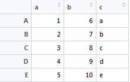

```{r include=FALSE}
list.of.packages <- c("rvest")
new.packages <- list.of.packages[!(list.of.packages %in% installed.packages()[,"Package"])]
if(length(new.packages)) install.packages(new.packages, repos="http://cran.us.r-project.org")

library(rvest)

getNumPackages <- function() {
  page <- read_html("http://cran.r-project.org/web/packages/available_packages_by_date.html")
  packages <- html_node(page, xpath="//table") %>% html_table()
  nrow(packages)
}
```


# Типы данных. векторы и матрицы

## Арифметические операции и присваивание

Арифметические операции в R выглядят так же, как и во многих других языках программирования:
  
```{r results='hold'}
3+2
2*(4-1)/6
3^2; sqrt(4) # ';' служит для разделения выражений в строке
1/0
```

А вот запись операции присваивания имеет особенности. Оно может обозначаться знаком равенства `'='` или "стрелками", позволяющими присваивать как влево (`a <- b`), так и вправо (`b -> a`).

```{r}
a <- 2   # присвоим значение а - традиционная форма записи для R
3 -> b   # присвоим значение b
c = a+b  # и это - то же присваивание
c        # напечатаем значение с
```

Мы будем использовать обозначение `'<-'` как из соображений совместимости со старыми версиями R, так и чтобы отличать присваивание от других операций. Например, от задания имён столбцов в таблицах -- в последнем случае всегда используется `'='`.


## Имена

При назначении имён переменных и функций придерживаются следующих правил:

1. Использовать для имён только латинские буквы, символ подчёркивания `'_'`, цифры и точку `'.'`; при этом имя не должно начинаться с цифры или точки: `plot_new2` и `plot.new` -- это правильно, а `.plot` и `2plot` -- нет.
2. Помнить, что R чувствителен к регистру: `Var`, `var` и `VAR` -- это разные имена.
3. Не давать объектам имена, занятые распространёнными функциями (например, не следует создавать функцию с именем `c()`) или ключевыми словами (особенно это касается `T`, `F`, `NA`, `NaN`, `Inf`).

Одна из особенностей R состоит в том, что в именах объектов допустимо использовать точку. Её применяют для разделения смысловых частей имени, подобно тому как в других языках используют символ подчёркивания. Так, функция `install.packages()` служит для установки новых пакетов расширений, но это именно функция, а не метод `packages()` объекта `install`. 

Проверить, существует ли переменная или функция с заданным именем, можно при помощи функции `exists`:

```{r}
exists('a')    # переменная 'a' уже определена,
exists('d')    # ...а `d` - ещё нет
exists('all')  # существует функция с именем 'all'
```

Параметр `mode` позволяет указать вид объектов, среди которых выполняется поиск. Так, переменная `a` существует, а вот функция `a` -- нет:

```{r}
exists("a", mode="function")
```


## Простые типы данных

Простые типы данных -- это такие данные, которые нельзя разделить на составляющие элементы. В R существует три вида простых типов данных: числовые, символьные и логические.

### Числовой тип

R различает три вида чисел:

* `numeric` -- вещественные двойной точности (= `double`);
* `integer` -- целые;
* `complex` -- комплексные.

Числа по умолчанию создаются вещественными

```{r}
a <- 1 # или a <- 1.0
class(a)
str(a)
```

Функция `class` отвечает на вопрос, к какому типу данных (классу) относится объект. Функция `str` возвращает структуру объекта: тип данных, к которому относится объект (`num` -- сокращение от `numeric`) и его значение (в нашем случае -- `1`).

Чтобы создать целое число, его запись нужно завершить буквой `L`. 

```{r}
b <- 1L
class(b)
```

Другой вариант: целое число можно преобразовать из вещественного с помощью функции `as.integer`:

```{r}
b <- as.integer(a)
```

Для проверки, относится ли объект к тому или иному типу данных используют функции семейства `is.*`, например, `is.integer`, `is.numeric` и т.п.

```{r}
is.integer(b)
is.integer(a)
is.numeric(a)
```

Добавляя к целому или вещественному числу мнимую часть, обозначаемую символом `i`, получаем комплексное число:

```{r}
c <- sqrt(-1)     # так не пойдёт!
str(c)
c <- sqrt(-1+0i)  # правильный способ
class(c)
str(c)
is.numeric(c)
is.complex(c)
```

Неявное приведение числовых типов данных (type coercion) выполняется по следующей схеме:

```
integer -> numeric -> complex
```

Так, складывая целое и вещественное числа мы получим в результате вещественное число, а добавляя к сумме комплексное число получим комплексный же результат. Для введенных ранее переменных имеем:

```{r}
ab <- a+b
class(ab)
abc <- ab/c
class(abc)
```

Явное приведение типов данных выполняется при помощи функций семейства `as.*`:

```{r}
as.numeric(1.5+1i) # при потере мнимой части выдается предупреждение
dn <- as.numeric(1.5+0i)
str(dn)
di <- as.integer(1.5+0i)
str(di)
as.complex(di)
```

### Символьный тип

Данные символьного типа `character` представляют собой строки, состоящие из символов, заключённых в одинарные или двойные кавычки.

```{r}
s1 <- "Text string."
s2 <- 'Another string.'
s12 <- paste(s1,s2)
str(s12)
```

Соединение строк или *конкатенация* выполняется функцией `paste`.

Кавычки одного типа могут находиться внутри кавычек другого типа:

```{r eval=FALSE}
"First 'attempt'"
'Second "attempt"'
```

Если тип внутренних и внешних кавычек совпадает, то внутренние кавычки нужно экранировать при помощи `'\'`:

```{r eval=FALSE}
"Third \"attempt\""
```

Иногда удобней создать строку с помощью функции `sprintf`, которая похожа на одноимённую функцию языка C:

```{r}
sprintf("%s was founded in AD %d.", "London", 43) 
```

Выделить подстроку позволяет функция `substr`:

```{r}
substr("abcdefg",3,5) # выделить подстроку с 3-го по 5-й элемент
```

Функции `sub` и `gsub` позволяют заменить часть строки, соответствующую заданному образцу. При этом `sub` заменяет только первое вхождение, а `gsub` выполняет глобальную замену подстроки.

```{r}
#     что менять # на что заменить  # где искать
# sub("a",        "A",               "rama")
sub("a","A","rama")  # sub = substitute
gsub("a","A","rama") # gsub = global substitute
sub("a","A",c("mama","rama","banana"))
```

Числа преобразуются в строки "сами собой". Обратное преобразование выполняется с помощью функций `as.*`.

```{r}
paste("the value of PI is", 3.14)
as.numeric("3.14")
as.numeric("a")
as.character(3.14)
```

Вот как можно преобразовать число с десятичной запятой из символьной формы записи (`"9,1"`) в числовую `9.1`:

```{r}
r <- "9,1"
as.numeric( gsub(",", ".", r) )
```

### Логический тип

Данные, относящиеся к логическому типу `logical`, имеют всего два значения: `TRUE` ("истина") и `FALSE` ("ложь").

Чаще всего, данные этого типа возникают при сравнении переменных:

```{r}
x = 2; y = 5
z = x > y      # x больше y? 
z              # напечатаем полученное логическое значение
class(z)
```

Основные логические операции: `&` (И), `|` (ИЛИ) и "!" (НЕ):

```{r}
a = TRUE; b = FALSE # Запись можно сократить: a = T; b = F
a & b          # u И v 
a | b          # u ИЛИ v 
!a             # НЕ-u
```

Находясь в одном выражении с числами, данные логического типа приводятся к соответствующему числовому типу данных. При этом `FALSE` представляется как `0`, а `TRUE` -- как `1`:

```{r}
1 + FALSE
1 + TRUE
class(as.integer(1) + TRUE)
```

Общая схема неявного приведения типов в R выглядит так:

```
logical -> числовые типы -> character
```

Например:
```{r}
paste(FALSE, 1.0, "test")
```

Напомним, что явное приведение типов выполняется функциями семейства `as.*`, а проверку можно выполнить с помощью функций `is.*`.


### Особые величины

`Inf`, `-Inf` -- бесконечности $\infty$ и $-\infty$, `NaN` -- не-число (Not-a-Number), `NA` (Not Available) -- пропуск в данных

```{r}
-1 / 0
```
```{r}
0 / 0
```
```{r}
Inf / NaN
```
```{r}
log(Inf)
```
```{r}
Inf + NA
```


## Векторы

Основным типом данных в R является вектор. *Вектор* -- это последовательность элементов *одного* типа:

```{r}
# числовой вектор
x <- c(1.5, 6, 8.3, 9, 6, .6, 2e-4)
# символьный вектор
s <- c("s", "t", "r", "i", "n", "g", "another string")
# логический вектор
b <- c(TRUE, FALSE, TRUE, TRUE, FALSE, TRUE, TRUE)
```

Функция `c()` служит для создания вектора. Её название происходит от английского `concatenate' -- собирать, то есть она как бы собирает отдельные элементы в вектор.

Элементы векторов нумеруются, начиная с единицы. Чтобы выбрать тот или иной элемент вектора, нужно указать его номер в квадратных скобках:

```{r}
x[1]
```

Векторы в R играют особую роль: из них строятся все остальные типы данных. Скаляров как таковых в R нет: обычное число представляет собой числовой вектор единичной длины:

```{r}
a <- 3
a[1]
# но:
a[2]
```
`NA` -- `Not Available' -- означает недоступность данных, пропуск в данных.

Возможно, вас интересовало, почему выводу результатов в консоли R всякий раз предшествует `[1]`. Так вот, это номер элемента вектора, с которого начинается строка вывода:

```{r}
c("s", "t", "r", "i", "n", "g", "another string")
```
Просто до сих пор мы работали с весьма короткими векторами.

Отрицательный индекс в квадратных скобках означает: выбрать все элементы, кроме указанных:

```{r}
v <- c(1.1, 2.2, 3.3, 4.4, 5.5)
v[1:4]
v[-5]
```

Векторы в R, как массивы в С, занимают непрерывный блок памяти, поэтому вставлять или удалять элементы в них *невозможно*. При попытке изменить вектор `x` в действительности создается новый вектор, который сохраняется с именем исходного (`х`). 

Тип данных, составляющих вектор, и его структуру, как и раньше можно определить с помощью функций `class` и `str` соотвественно:

```{r}
class(v)
str(v)
```

Частным случаем векторов являются последовательности элементов, изменяющихся по определённому закону. Последовательность с шагом `1` можно создать при помощи двоеточия `':'`

```{r}
v = -5:5
v
```

Отличие последовательностей, создаваемых ':' от явного перечисления элементов состоит в том, что последовательности создают целые числа, тогда как при явном перечислении создаются вещественные:

```{r}
x <- 1:2
y <- c(1,2)
identical(x,y)
typeof(x)
typeof(y)
```

Обратите внимание: 

```{r}
i <- 3 
1:i-1   # Это означает (1:i) - 1, а не 1:(i-1) 
```

`:` обладает более высоким приоритетом, чем вычитание. Поэтому для создания последовательности чисел от `1` до `i-1`, последнее число необходимо заключить в скобки

```{r}
1:(i-1)
```

Значительно больше возможностей даёт функция `seq`. Она позволяет создавать последовательности с заданным шагом

```{r}
seq(5,1,by=-.5)
```

и заданной длины

```{r}
seq(1,10,length=6)
```

Как и во многих других функциях R, в `seq` есть необязательные аргументы. Их можно не указывать явно, и тогда будут использованы значения, заданные для этих аргументов по умолчанию. Узнать, что это за аргументы и какие значения по умолчанию они принимают можно из справки по функции `seq`:

```{r eval=FALSE}
?seq # help(seq)
```

Функция `rep` позволяет повторить объект заданное число раз

```{r}
rep(1:3,5)
```

А вот вариант похитрее

```{r}
rep(1:3,c(5,5,5))
```

Эту команду можно сократить, используя ещё один `rep`:

```{r}
rep(1:3,rep(5,3))
```

Арифметические операции над векторами выполняются поэлементно:

```{r}
u <- c(1,2,3)
v <- c(4,5,6)
u+v
u*v
u/v
```

Скалярное произведение векторов записывается как: 

```{r}
u %*% v
```

Деление на ноль даёт в результате `Inf` -- бесконечность

```{r}
w <- c(v[1:2],0) # добавляем элемент к фрагменту вектора v
u/w
```
которая при последующих операциях "поглощает" все конечные значения:

```{r}
u+u/w
```

Сложим два вектора разной длины. "Будет ошибка", -- скажите вы. А вот и нет:

```{r}
c(1,2,3) + c(4,5,6,7,8,9,10)
```

Операция будет выполнена, но R предупредит, что длины векторов-операндов различаются. 

При этом сложение и другие подобные операции, требующие в "обычном" состоянии равной длины операндов, выполняется так: более короткий вектор `u` повторяется столько раз, сколько нужно, чтобы его длина сравнялась с длиной `v`, после чего выполняется заданная операция. Фактически, складываются векторы:

```{r}
c(1,2,3,1,2,3,1) + c(4,5,6,7,8,9,10)
```

Добавление элементов в вектор осуществляется функциями `c` и `append` ('добавить'):

```{r}
vec = c('a','b')
vec = c(vec,'c','d')
vec
values = c('e','f','g')
vec <- append(vec, values)
vec
```

Удаление элементов из вектора выполняется следующим образом:

```{r results='hold'}
a <- sample(1:10)  # генерируем случайные целые числа от 1 до 10
a
remove <- c(3,5,7) # выберем для удаления 3-й, 5-й и 7-й элементы 
a <- a[-remove]    # удалим выбранные элементы
a
```

Длина вектора, то есть число его элементов, вычисляется функцией `length()`:

```{r}
length(a)
```

Указать последний элемент вектора можно так:

```{r}
a[length(a)]
```


## Векторизация и логическая индексация

*Векторизация* -- подход к программированию, позволяющий выполнять операции над вектором в целом, а не над отдельными его элементами (скалярами). Такой подход естественен для R, в котором вектор является простейшим элеметом данных.

```{r}
a <- c(1,2,3); b <- c(4,5,6)
c1 <- vector() # создаём пустой вектор
# Вместо того,чтобы делать так:
for (i in 1:3) {
  c1[i] <- a[i] + b[i] # с1 обязательно нужно заранее создать
}
# Проще сделать так:
c2 <- a + b
```

Для векторизации расчётов широко используется логическая индексация:

```{r}
a <- c(6,-2,1,8,0,9)
ind_a <- a > 0
ind_a
```

*Логический индекс* (`ind_a`) -- вектор, длиной равный исходному (`a`), элементы которого равны `TRUE`, если соответствующий элемент исходного вектора удовлетворяет логическому условию (`a > 0`) и `FALSE` -- в противном случае.

Логическая индексация позволяет заменить связку "цикл + условный оператор". Например, чтобы выбрать положительные элементы `a` не нужно организовывать цикл с проверкой в его теле условия `a[i] > 0`, а можно поступить так: 

```{r}
# Выбрать положительные элементы а
a[a > 0] # или a[ind_a]
# Подсчитать их количество...
length(a[ind_a])
# ... или сумму
sum(a[a > 0])
```

Обозначение | Значение
------------|-------------------------------------------------------
`a == b`    | `а` равно `b`
`a != b`    | `а` не равно `b`
`&`, `|`    | И, ИЛИ (поэлементные)
`&&`, `||`  | И, ИЛИ (сравниваются левые крайние элементы векторов)
`xor(a,b)`  | Исключающее ИЛИ
`any(a)`    | `TRUE`, если хотя бы один из элементов `a` истинен
`all(a)`    | `TRUE`, если все элементы `a` истинны

Table: Логические операции

Примеры использования логических операций:

```{r warning=FALSE}
a <- c(6,-2,1,8,0,9)
a > 0 & a < 9
a < 2 | a > 8
any(a>0)
all(a>0)
```

Если данные содержат пропуски (`NA`), это может повлиять на результат вычислений. Проверка таких случаев реализуется с помощью `is.na()`

```{r}
# Данные с пропусками:
a <- c(6,-2,NA,1,8,0,NA,9)
# Их сумма даёт:
sum(a)
# Является ли элемент пропуском в данных?
is.na(a)
```

У многих функций есть аргумент `na.rm`, управляющий предварительным удалением пропусков

```{r}
# Cуммирование элементов, с предварительным удалением NA
sum(a, na.rm=T)
```

Покажем как с помощью векторизации можно легко вычислить определённый интеграл.

Вычислим интеграл $\int_1^2 x^2 dx$, воспользовавшись методами [прямоугольников](https://ru.wikipedia.org/wiki/%D0%9C%D0%B5%D1%82%D0%BE%D0%B4_%D0%BF%D1%80%D1%8F%D0%BC%D0%BE%D1%83%D0%B3%D0%BE%D0%BB%D1%8C%D0%BD%D0%B8%D0%BA%D0%BE%D0%B2) и [трапеций](https://ru.wikipedia.org/wiki/%D0%9C%D0%B5%D1%82%D0%BE%D0%B4_%D1%82%D1%80%D0%B0%D0%BF%D0%B5%D1%86%D0%B8%D0%B9) (для проверки: интеграл равен $7/3 = 2.333(3)$)^[Вспомнить их можно по книге: *Турчак Л. И., Плотников П. В.* Основы численных методов. – М.: Физматлит, 2003.].

```{r}
a <- 1; b <- 2             # границы промежутка интегрирования
n <- 1000                  # число узлов интегрирования
x <- seq(a,b,length.out=n) # координаты узлов сетки
h <- x[2]-x[1]             # шаг сетки
y <- x^2                   # значения подынтегральной функции в узлах сетки
```

Значения нижней и верхней интегральных сумм дают оценки величины интеграла снизу и сверху соотвественно. Любая их этих сумм даёт  приближённое значение интеграла, вычисленное методом прямоугольников:

```{r}
sd <- h*sum(y[-length(y)])  # Нижняя интегральная сумма
sd
su <- h*sum(y[-1])          # Верхняя интегральная сумма
su
```

Метод трапеций даёт более точный результат:

```{r}
(su+sd)/2
```


## Матрицы и массивы

Матрица (`matrix`) в R -- это специальный тип вектора, обладающий дополнительными атрибутами, которые позволяют трактовать его как совокупность строк и столбцов. 

```{r}
v1 = 1:4
v2 = -2:1 
# Создадим из элементов v1 матрицу размера 2х2
m1 = matrix(v1, nrow=2, ncol=2)
m1
class(m1) 
attributes(m1) 

# Создать матрицу можно, объединяя векторы по строкам
m2 = rbind(v1,v2)
m2
# ... или по столбцам
m3 = cbind(v1,v2)
m3

# Матрица - это еще и вектор, поэтому
length(m1)
```

При выборе элементов матрицы указывают индексы строк и столбцов:

```{r}
# Элемент 4-й строки и 2-го столбца матрицы m3
m3[4,2]
```

Кроме того, у строк и столбцов матриц могут быть заданы имена. Например, у матрицы `m2` имена строк (а у `m3` -- имена столбцов) равны `v1` и `v2`, так что к её элементам можно обратиться так: 

```{r}
m2["v2",1] # эквивалентно m2[2,1]
```

Размерность вектора и матрицы можно задать функцией `dim`:

```{r}
A <- 1:9
dim(A) <- c(3,3) # формируем из вектора матрицу размерности 3 х 3
A
```

Транспонирование матрицы выполняется функцией `t()`:

```{r}
t(A)
```

Многомерные массивы в R создаются при помощи функции `array`. Размерность массива задаётся атрибутом `dim`:

```{r}
arr <- array(1:24, dim=c(2,4,3))
arr
```


## Рецепты

### Как перевести числа с запятой из символьной формы в числовую: "9,1" -> 9.1  

Пример: есть `"9,1"`, нужен `9.1`.

```r
r <- "9,1"
as.numeric( gsub(",", ".", r) )
```

### Добавление элементов в вектор

```r
> vec = c()
> values = c('a','b','c','d','e','f','g')
> vec <- append(vec, values)
> vec
[1] "a" "b" "c" "d" "e" "f" "g"
```

### Удаление элементов из вектора

```r
a <- sample(1:10)
# [1]  3 10  1  6  7  4  8  2  5  9
remove <- c(3,5,7) # удалить 3,5,7-й элементы 
# [1] 3 5 7
a <- a[-remove]
# [1]  3 10  6  4  2  5  9
```

### Удаление NA из вектора

```r
x <- c(NA, 3, NA, 5)
# Вариант 1:
x[!is.na(x)]
[1] 3 5
# Вариант 2:
na.omit(x)
[1] 3 5
```

### Последний элемент вектора

Очевидное решение:

```{r,eval=FALSE}
x[length(x)]                                  # последний элемент x
last <- function(x) { return (x[length(x)]) } # превращаем в функцию
```

Однако этот подход не сработает для таблиц (data frames), так как у них `length(x) == ncol(x)`. Другое решение:

```{r,eval=FALSE}
tail(x, n=1)                                  # последний элемент x
last <- function(x) { tail(x, n = 1) }
```

Вектор без последнего элемента:

```{r,eval=FALSE}
x[-length(x)]
```

### Как упорядочить элементы вектора

```r
# order() возвращает индексы элементов, 
# чьи значения упорядочены по возрастанию
a <- c(12,7,3,9,6)
order(a)
[1] 3 5 2 4 1
# самое маленькое число (3) расположено в исходном векторе 
# на 3-й позиции, следующее число (6) -- на 5-й и т.д.

# Вектор, упорядоченный по возрастанию
a[order(a)]
[1]  3  6  7  9 12

# Вектор, упорядоченный по убыванию
a[order(a, decreasing = TRUE)]
[1] 12  9  7  6  3
```

### Удаление повторяющихся элементов

```r
a = c(1,2,3,3,4,5,6,7,7,8)

# 1. Удаление повторяющихся элементов с сохранением первого вхождения элемента
# Результат: c(1,2,3,4,5,6,7,8)

# Возвращает TRUE, если элемент уже существует в векторе (списке, таблице).
duplicated(a)
##[1] FALSE FALSE FALSE  TRUE FALSE FALSE FALSE FALSE  TRUE FALSE

# Возвращает вектор с удаленными повторяющимися элементами.
unique(a)
# или
a[!duplicated(a)]
##[1] 1 2 3 4 5 6 7 8

# 2. Удаление всех элементов, присутствующих в векторе более одного раза
# Результат: c(1,2,4,5,6,8)

a[!(duplicated(a) .html)", "", string_with_nums)
> string_without_nums
[1] "4567"
```

### Выделение цифр из строки

```r
> string_with_nums <- " dfg45h 67 h"
> string_without_nums <- gsub("[^[:digit:]]", "", string_with_nums)
> string_without_nums
[1] "4567"
```

### Двойные кавычки в строке

Если внутри строки есть двойные кавычки, то сама строка должна быть или взята в одинарные кавычки или двойные кавычки нужно экранировать с помощью `\`

```r
> s1 = 'Learning "R" is fun!'
> s2 = "Learning \"R\" is fun!"
> s1
[1] "Learning \"R\" is fun!"
> s2
[1] "Learning \"R\" is fun!"
```

Показать строку с двойными кавычками "как есть", без экранирующих бэкслешей, можно с помощью функции `cat()`

```r
> cat(s1)
Learning "R" is fun! 
> cat(s2)
Learning "R" is fun!
```

### Как удалить пробелы в начале и в конце строки

```r
s <- "\t\n\r    Test Text  \t\t\n\r\t"
# Вариант 1
trimws(s)
## [1] "Test Text"
# Вариант 2
stringr::str_trim(s)
## [1] "Test Text"
# Вариант 3
trim <- function (x) gsub("^s+|s+$", "", x)
trim(s)
## [1] "Test Text"
```

### Как проверить, существует ли объект

```r
# Как проверить, существует ли объект obj_name
exists("obj_name")
```


## Резюме

Синтаксис R имеет две очевидных особенности: в именах переменных можно использовать точку `'.'`, а операция присваивания обозначается стрелкой `->`.

Особую роль в R играют векторы -- числовые, символьное и логические. Из них строятся все остальные типы данных. Даже скаляры представляют собой лишь векторы единичной длины. Это приводит к тому, что все операции осуществляются над векторами в целом, а не над отдельными их элементами. В результате в R сравнительно редко используются циклы с перебором по элементам.


# Списки и таблицы

Векторы и матрицы состоят из данных одного типа. Чтобы сохранять наборы данных, относящихся к различным типам, в R существуют списки и таблицы. 


## Списки

Список (`list`) напоминает вектор, но может содержать объекты разных типов. Создаётся список функцией `list`: 

```{r}
lst <- list(n=1:3, s="test", b=c(T,F,F,F,T))
# или
n <- 1:3
s <- "test"
b <- c(T,F,F,F,T)
lst <- list(n,s,b) # состоит из копий векторов n,s,b
lst
```

Структура созданного списка имеет вид:

```{r}
str(lst)
```
-- список `lst` состоит из трёх элементов, каждый из которых является вектором: числовым, символьным и логическим соотвественно.

Элементы списков, так же как элементы векторов и матриц, могут иметь имена. Узнать или присвоить эти имена можно при помощи функции `names`:

```{r}
names(lst)
```
-- в настоящий момент имена элементов `lst` не заданы. 

Присвоим элементам списка `lst` имена `num`, `cha` и `log`:

```{r}
names(lst) <- c("num","cha","log")
```
и посмотрим, что получилось:

```{r}
str(lst)
```

Элементы списка можно выбрать одним из следующих способов:

1. с помощью квадратных скобок `[`,`]`. Полученный в результате объект в свою очередь будет являться списком, даже если длина его окажется единичной

```{r}
lst[1]  # или lst["num"]
class(lst[1])
```

2. с помощью двойных квадратных скобок `[[`,`]]`. Возвращенный объект будет того же типа, каким он был до включения в список

```{r}
lst[[1]] # или lst[["num"]]
class(lst[[1]])
```

3. использовать имена элементов списка и знак доллара `$`:

```{r}
lst$num
class(lst$num)
```

Удалять имена элементов можно следующим образом:

```{r eval=FALSE}
names(lst) <- NULL
```
но мы пока делать этого не будем.

Добавить элемент в список можно так же, как и в вектор -- при помощи функций `c()` или `append()`:

```{r}
v <- 5:10             # создадим числовой вектор
l1 <- c(lst,list(v))  # преобразуем его и добавим в список
str(l1)
```

Заметим, что если вектор не преобразовать при помощи `list()`, то к списку будет добавлен не одни элемент-вектор, а шесть элементов-чисел:

```{r}
l2 <- c(lst,v)
str(l2)
```

Функции `c` и `append`, помимо векторов, позволяют объединять и списки:

```{r}
l12 <- c(l1,l2)
```

Удаляются элементы списка так же, как элементы вектора:

```{r}
remove <- c(2,3)      # удалить 2-й и 3-й элементы 
lst <- lst[-remove]
str(lst)
```

Определим количество элементов в списке `lst`:

```{r}
length(lst)
```

Обратите внимание, что функция `length` возвращает нам число элементов списка. В нашем случае такой элемент один. Другое дело, что сам этот элемент является числовым вектором. Чтобы найти длину этого последнего нужно применить двойные квадратные скобки

```{r}
length(lst[[1]])
```

или преобразовать список в вектор при помощи `unlist()`: 

```{r}
vec_from_lst <- unlist(lst)
class(vec_from_lst)
length(vec_from_lst)
```


## Таблицы

Таблицы (data frames) хранят двумерные данные, но, в отличие от матриц, позволяют находится в разных колонках данным разных типов. По своему внутреннему устройству, таблица -- это список колонок равной длины. Можно сказать и так: если вы когда-нибудь видели таблицу в Microsoft Excel, то вам уже знакомы таблицы в R.

Создаются таблицы с помощью функции `data.frame`:

```{r}
df1 <- data.frame(a=1:5,b=6:10,c=letters[1:5])
str(df1)
```

Таблицы можно объединять по строкам:

```{r}
df2 <- data.frame(a=6:10,b=11:15,c=letters[6:10])
rbind(df1,df2)
```
или по столбцам:

```{r}
df2 <- data.frame(c=6:10,d=11:15,e=letters[6:10])
cbind(df1,df2)
```

Ещё один способ объединения таблиц даёт в результате список:

```{r}
l3 <- c(df1,df2)
str(l3)
```

Если нужно объединить таблицы, имеющие общие колонки, то используется функция `merge`. Как правило, она используются для объединения таблиц с общими ключами:

```{r}
first <- data.frame(id=1:5, COL=LETTERS[1:5], col=letters[1:5])
secnd <- data.frame(id=1:5, col=letters[1:5])

# объединяем таблицы по колонке id
total <- merge(first,secnd,by="id")

# объединяем таблицы по колокам id и col
total <- merge(first,secnd,by=c("id","col")) 
```

Размеры таблицы определяются следующим образом:

```{r}
length(df1) # длиной таблицы является длина списка, состоящего из колонок
ncol(df1)   # число колонок
nrow(df1)   # число строк
```

Выбор элементов таблицы рассмотрим на примерах:

```{r}
df <- data.frame(a=1:5,b=6:10,c=letters[1:5])
df                # вся таблица
df[1,]            # 1-я строка
df[,2]            # 2-ая колонка
df[4,3]           # элемент 4-й строки 3-й колонки
df[4,c(1,3)]      # элемент 4-й строки из 1-ой и 3-й колонок
```

Иногда для выбора нужного фрагмента таблицы удобно использовать логические условия:

```{r error=TRUE}
df[df$c == 'd', ] # 4-я строка
df[,df$c == 'a']  # 1-ая колонка
df[,df$c == 'd']  # Нет такой колонки!
```

Другой способ, позволяющий выделить фрагмент таблицы -- использование функции `subset`.

Для работы с именами колонок, помимо функции `names`, существует отдельная функция:

```{r}
colnames(df)
```

Можно также задать имена строк таблицы. Делается это с помощью функции `rownames()`:

```{r}
rownames(df) <- LETTERS[1:nrow(df)]
```

Теперь выбирать элемент таблицы `df` можно так:

```{r}
df["A","b"] # df[1,2]
```

Функция `View` отображает таблицу в Excel-eподобном виде (рис. \ref{view})

```{r eval=FALSE}
View(df)
```



Большую таблицу отображать на экране нецелесообразно. Чтобы понять, как она устроена, достаточно рассмотреть её "голову" (`head`) или "хвост" (`tail`). Если данные в таблице упорядочены по времени, это позволит увидеть наиболее свежие или, наоборот, самые старые данные. Число выводимых строк таблицы регулируется параметром `n` и по умолчанию равно 6: 

```{r}
df <- data.frame(col1=1:20, col2=letters[1:20])
head(df)
tail(df, n=3)
```

Функции `head` и `tail` можно также применять для вывода частей векторов, матриц, списков и даже функций.


## Функции, применяемые к составным данным

Весьма распространённой причиной использования циклов является необходимость применить один и тот же набор операций (тело цикла) к элементам вектора, списка и т.п. Для решения этой задачи в R существует множество функций, большинство из которых относится к семейству `*apply` (`применить'). Благодаря этим функциям во многих случаях удаётся избежать использования циклов, что делает код на более компактным.

Мы рассмотрим три функции из семейства `*apply` (об остальных можно узнать в справке: `?lapply`) и дополняющую их функцию `do.call`.

### apply

`apply()` применяет  функцию `fun` к строкам или столбцам матрицы и имеет вид:

```{r eval=FALSE}
apply(матрица, размерность, fun)
```

Например:

```{r}
# Создадим матрицу M размера 4х4
M <- matrix(1:16,4,4)
M
# Найдём минимальные элементы среди строк M
apply(M,1,min)
# Найдём среднее арифметическое столбцов M
apply(M,2,mean)
# Проверим, являются ли столбцы M векторами
apply(M,2,is.vector)
```

### lapply

`lapply()` (от 'list apply') применяет функцию `fun` к элементам списка или таблицы:

```{r eval=FALSE}
lapply(список, fun)
```

Пример:

```{r}
x <- list(a = 1, b = 1:3, c = 10:50)
# Вычислим длину каждого элемента
lapply(x, length)
# ... и сумму его значений
lapply(x, sum) 
```

Функции можно задавать самому:

```{r}
lapply(c(1,2,4), function(x) x^2)
```

Функция `fun` может зависеть и от нескольких аргументов:

```{r}
lapply(c(1,2,4), function(x,y) 
                    x^2+y, 
                        3 # значение, передаваемое y
       )
```

### sapply

Функция `sapply` работает аналогично `lapply`, но старается упростить тип результата. Например, если `lapply` возвращает список:

```{r}
li <- lapply(c(1,2,4), function(x) x^2)
str(li)
```
то `sapply` удаётся получить вектор:
```{r}
ve <- sapply(c(1,2,4), function(x) x^2)
str(ve)
```
или матрицу:
```{r}
x <- list(1:4, 5:8)
sapply(x, function(x) x^2)
```

А вот как с помощью `sapply` преобразовать хранящиеся в таблице данные к числовому типу:

```{r eval=FALSE}
# Преобразуем 1-ю и 3-ю колонки таблицы data:
data[, c(1,3)] <- sapply(data[, c(1,3)], as.numeric)
```

### do.call

Если `*apply` применяют заданную функцию к каждому элементу, выполняя таким образом множество вызовов функции, то `do.call` применяет функцию один раз ко всему списку аргументов:

```{r eval=FALSE}
do.call(fun, список_аргументов)
```

Примеры:

```{r results='hold'}
do.call(sum, list(1,2,4,1,2))
# Без do.call понадобилось бы избавится от списка:
# li <- list(1,2,4,1,2)
# sum(unlist(li))
```

```{r}
A <- list(1:3,4:6,7:9)
do.call(rbind,A)
```


## Преобразование из широкой таблицы в длинную и обратно

Источник: <http://www.cookbook-r.com/Manipulating_data/Converting_data_between_wide_and_long_format/>

Преобразование таблиц из широкой формы в длинную часто используется перед визуализацией данных в ggplot2.

Исходная таблица в широком форме -- каждой переменной соответствует колонка:

```{r}
olddata_wide <- read.table(header=TRUE, text="
 subject sex control cond1 cond2
       1   M     7.9  12.3  10.7
       2   F     6.3  10.6  11.1
       3   F     9.5  13.1  13.8
       4   M    11.5  13.4  12.9
 ")
```

Та же таблица в длинной форме: "subject" и "sex" идентифицируют  наблюдения, в колонке "condition" -- названия измеряемых величин, в "measurement" -- их значения.

```{r,echo=F}
library(reshape2)
melt(olddata_wide, id.vars = c("subject", "sex"), 
     measure.vars = c("control", "cond1", "cond2"),
     variable.name = "condition",
     value.name = "measurement")
```


Для перевода в длинную форму понадобятся пакет `reshape2` и функция `melt`. 

Любой пакет устанавливается функцией `install.packages("имяПакета")` или с помощью меню *Tools/Install Packages...* RStudio.


```{r}
# install.packages("reshape2")
library(reshape2)

# Укажем id.vars: эти переменные останутся неизменными после преобразования
melt(olddata_wide, id.vars=c("subject", "sex"))
```

Осталось сменить названия колонок "variable" и "value" на "condition" и "measurement". Это можно было сделать сразу:

```{r}
data_long <- melt(olddata_wide,
                  # ID переменные останутся неизменными
                  id.vars = c("subject", "sex"),
                  # Имена колонок, подлежащих преобразованию
                  measure.vars = c("control", "cond1", "cond2" ),
                  # новые имена колонок
                  variable.name = "condition",
                  value.name="measurement")
data_long
```

Для перевода в длинную форму понадобятся пакет `reshape2` и функция `dcast`:

```{r}
data_wide <- dcast(data_long, 
                   subject + sex ~ condition, 
                   value.var = "measurement")
data_wide
```


## Рецепты

### Добавление элемента в список

```r
# Добавим в список list элемент newobj и дадим ему имя name
list.new <- append(list, list(name=newobj))
# При этом имена элементов из списка list сохраняются
```

### Удаление элементов из списка

```r
# Удаление 3-го элемента списка myList
myList[[3]] <- NULL
# При удалении нескольких элементов,
# подход тот же, что и при удалении элементов вектора
```

### Преобразование списка списков в таблицу

```r
# Создаем список списков
listoflists = list(list(c1=1, c2='a', c3=3, c4=4),
                   list(c1=5, c2='b', c3=6, c4=7))
# Преобразуем список в матрицу, транспонируем ее
# и преобразуем полученный результат в таблицу
df = as.data.frame(t(sapply(listoflists, unlist)))
```

### Поиск строки в таблице

```r
# Создадим тестовую таблицу данных.
> mydata <- data.frame(name = c("Antony", "Bob", "Cecilia", "Jack", "Mary", "Tony"),
+                      col_a = c(0, 1, 0, 1, 2, 3),
+                      col_b = c(3, 0, 3, 3, 1, 0),
+                      stringsAsFactors=FALSE)
> mydata
     name col_a col_b
1  Antony     0     3
2     Bob     1     0
3 Cecilia     0     3
4    Jack     1     3
5    Mary     2     1
6    Tony     3     0

# Нужные нам строки - 1-ая и 6-ая
> grep('[t,T]ony', mydata$name)
[1] 1 6

> mydata[grep('[t,T]ony', mydata$name),]
    name col_a col_b
1 Antony     0     3
6   Tony     3     0
```

### Создание пустой таблицы с заданными именами колонок

```r
# Создадим пустую таблицу mydata с числовыми колонками First, Second
# и символьной колонкой Third:
mydata <- data.frame(First=numeric(0),
                     Second=numeric(0),
                     Third = character(0),
                     stringsAsFactors=FALSE)
str(mydata) # проверим:

## 'data.frame':    0 obs. of  3 variables:
##  $ First: num 
##  $ Second: num 
##  $ Third: chr
```

### Добавление в таблицу пустых колонок с заданными именами

```r
# Задана таблица с единственной колонкой
df <- data.frame(id=1)
# Имена других колонок заданы заранее
namevector <- c("col2","col3","col4")
# Добавляем эти пустые колонки в таблицу
df[,namevector] <- NA
print(df)

##  id col1 col2 col3
##1  1   NA   NA   NA

# Заметим, что names() воспользоваться нельзя, т.к. изначально
# df имеет всего одну колонку, которой нельзя дать три имени.
```

### Создать пустую таблицу заданного размера

```{r}
# Создадим таблицу: 2 строки x 5 столбцов
df <- data.frame(matrix(NA, nrow = 2, ncol = 5))
str(df)
```


### Изменение кодировки таблицы

```r
# Используем функцию Encoding().

# Для одной колонки:
Encoding(table$colname) <- "UTF-8"

# Для всей таблицы:
for (i in 1:length(table))
  Encoding(table$[[i]]) <- "UTF-8"
```

### Сортировка строк таблицы по содержимому одной из колонок

```r
# Создаем тестовую таблицу
numPeople = 10
sex=sample(c("male","female"),numPeople,replace=T)
age = sample(14:102, numPeople, replace=T)
income = sample(20:150, numPeople, replace=T)
population = data.frame(sex=sex, age=age, income=income)
# Выводим ее содержимое
population
# sex age income
# 1  female  42     40
# 2  female  99     41
# 3    male  28     75
# 4  female  20     62
# 5  female  25    113
# 6    male  52     51
# 7    male  16    137
# 8    male  53     37
# 9    male  14     22
# 10   male  60     76

# Упорядочиваем строки таблицы по возрастанию значений из колонки age
population[order(population$age),]
# sex age income
# 9    male  14     22
# 7    male  16    137
# 4  female  20     62
# 5  female  25    113
# 3    male  28     75
# 1  female  42     40
# 6    male  52     51
# 8    male  53     37
# 10   male  60     76
# 2  female  99     41
```

### Запись таблицы в файл .csv без заголовков столбцов

```r
# Обычно верхний столбец в записанном csv-файле содержит заголовки строк.
# Если такой заголовок не нужен, делаем так:

write.table(my_data_frame, sep=",",  col.names=FALSE)

# Обратите внимание: используется write.table, а не write.csv.
```

### Преобразовать колонки таблицы в числовой тип данных

```r
# Преобразуем 1-ю и 3-ю колонки таблицы data:
data[, c(1,3)] <- sapply(data[, c(1,3)], as.numeric)
```

### Удалить пустые колонки таблицы

```r
# Создадим тестовую таблицу с двумя пустыми колонками:
dat <- data.frame(a=1:5, b=1:5, c=rep(NA,5), d=1:5, e=rep(NA,5))
# Удалим колонки, целиком состоящие из NA из таблицы dat:
dat <- dat[, !sapply(dat, function(x) all(is.na(x))), drop=F]
```

### Удалить строки с NA из таблицы

```r
df <- data.frame(first=letters[1:5], 
                 second=c(1,2,NA,4,NA), 
                 third=c(8,7,NA,5,4))
#   first second third
# 1     a      1     8
# 2     b      2     7
# 3     c     NA    NA
# 4     d      4     5
# 5     e     NA     4

# Удалить все строки с NA - вариант 1
na.omit(df)
# или, что то же самое, оставить только 
# строки без NA
df[complete.cases(df),]
#   first second third
# 1     a      1     8
# 2     b      2     7
# 4     d      4     5

# Удалить строки с NA в заданном столбце
# В примере - в 3-ем
df[complete.cases(df[,3]),]
# first second third
# 1     a      1     8
# 2     b      2     7
# 4     d      4     5
# 5     e     NA     4
```

### Поменять местами строки и столбцы таблицы

```r
df <-  data.frame(A=1:3, B=letters[1:3], stringsAsFactors = T)
data.frame(t(df))
```

### Удалить из таблицы колонки с заданными именами

```r
# Создаем таблицу
df = data.frame(c1=1:4, c2=letters[1:4], c3=5:8)
# Удаляем колонку "с2"
df_new = df[ , -which(names(df) %in% c("c2"))]
```


## Резюме

Списки представляют собой одномерные наборы разнотипных данных. На их основе создаются таблицы (data frame), представляющие собой списки колонок. Как правило, данные, которые нам предстоит собирать, будут сохраняться именно в виде таблиц.

Функции семейства `*apply` позволяют применить один и тот же набор операций к элементам матрицы, списка, таблицы и т.п., что позволяет во многих случаях избежать использование циклов.


# Управление процессом вычислений

## Циклы

Циклы в R используются сравнительно редко. "Винить" в этом следует векторизацию вычислений. Тем не менее, иногда именно циклы являются наиболее простым путём решения задачи.

Синтаксис циклов R очень похож на синтаксис циклов C-подобных языков программирования. Циклы в R могут вкладываться друг друга в соответствии с обычными правилами вложения циклов.

### Цикл со счётчиком

Цикл со счётчиком записывается следующим образом: 

```{r eval=FALSE}
for (i in start:stop) {
  <тело цикла>
}
```

Его удобно применять, когда количество повторений команд, помещённых в тело цикла, известно заранее. Предположим, например, что в банк положена сумма в 1000 долларов сроком на 5 лет с процентной ставкой 12\% годовых, и нужно узнать, сколько денег окажется на счету вкладчика по окончании срока вклада.

```{r}
sum0 <- 1000     # исходная сумма
rate <- .12      # процент
num_years <- 5   # срок хранения
sum <- sum0      # текущая сумма
for (i in 1:num_years) {
  sum <- sum + rate*sum0
  print(c(i,sum)) # выводим на печать номер года и накопленную сумму
}
```

Заметим что "эхо" внутри цикла не работает и для вывода промежуточных данных используется функция `print`.

Решение при помощи цикла -- простое и прямолинейное, но не самое короткое. Немного подумав, можно прийти к формуле:

```{r}
sum0*(1+num_years*rate)
```

Оценим время, затраченное на заполнение при помощи цикла элементов динамического массива (вектора `x`): 

```{r eval=FALSE}
n <- 50000             # число элементов
x <- c()               # создадим пустой вектор
system.time(
  for (i in 1:n) {
    x <- c(x,i)        # дополним вектор x очередным элементом
  }
)
```
```
##   user system elapsed
##  5.348  0.072   5.426
```

Обратите внимание на то, как вкладывается цикл в функцию оценки времени `system.time`.

Аргумент `user` функции `system.time` возвращает процессорное время в секундах, затраченное текущим процессом (сеансом работы с R). `system` -- это процессорное время, затраченное операционной системой на выполнение работ, связанных с текущим процессом (открытие файлов, операции ввода/вывода, запуск других процессов и т.п.). Наконец, `elapsed = user+system` содержит полное время работы скрипта.

Использованный нами способ инициализации вектора, очевидно, неэффективен. В первую очередь, желательно зарезервировать место под элементы вектора:

```{r eval=FALSE}
x <- vector(length = n) # создадим вектор заданной длины
system.time(
  for (i in 1:n) {
    x[i] <- i
  }
)
```
```
##   user system elapsed
##  0.096  0.008   0.103
```

Экономия времени налицо. Однако лучший результат достигается при использовании векторизации:

```{r eval=FALSE}
system.time(x <- 1:n)
```
```
##   user system elapsed
##      0      0       0
```

Такая ситуация типична для R: циклы работают медленнее, чем векторизованные функции. 

Всё происходит так быстро, что `system.time` не успевает отследить изменения. Для более точной оценки времени выполнения скрипта используем пакет [tictoc](https://cran.fhcrc.org/web/packages/tictoc/):

```{r eval=FALSE}
# install.packages("tictoc")
library(tictoc) # загрузим пакет tictoc
tic()           # засечём время
x <- 1:n
toc()           # остановим таймер и выведем результат
```
```
## 0.004 sec elapsed
```

### Цикл с предусловием

Цикл с предварительным условием используется тогда, когда число повторений тела цикла неизвестно, зато известно условие, которое должно быть выполнено в результате этих повторений.

Тело цикла выполняется до тех пор, пока истинно `логическое условие`:

```{r eval=FALSE}
while (логическое_условие) {
 <тело цикла>
}
```

Вновь рассмотрим задачу о банковском вкладе. Только теперь процент будет не простой, а сложный, то есть будет добавляться к исходной сумме вклада. Определим, через сколько лет сумма, накапливаемая таким способом, превысит ту, что удалось скопить с помощью простого процента (`1600`) и сколько именно денег удасться скопить.

```{r}
sum0 <- 1000
rate <- .12
i <- 0
sum <- sum0
while (sum < 1600) {
 sum <- sum + rate*sum
 i <- i + 1
 print(c(i,sum))
}
```

Естественно, что и в этом случае можно было записать формулу:

```{r}
sum0*(1+rate)^num_years
```

Для преждевременного выхода из цикла используется команда `break`. После неё управление передаётся во внешний цикл, команде, следующей за циклом из которого мы вышли:

```{r}
for (i in 1:3) {
  for (j in 1:3) {
    if (j==2) break
    cat(sprintf('  loop: i=%d j=%d\n',i,j))
  }
  cat(sprintf('breake: i=%d j=%d\n',i,j))
}
```

Команда `next` выполняет переход к следующей итерации цикла.


## Условные операторы

Скалярный условный оператор `if` или, проще говоря, обычный `if` записывается так:

```{r eval=FALSE}
if (логическое_условие) {
  операторы выполняются
  если логическое_условие истинно
} else {
  операторы выполняются
  если логическое_условие ложно
}
```

Конструкции `else-if` в R нет.

Обратите внимание! Если в коде записано:

```{r eval=FALSE}
if (condition == TRUE) x <- TRUE
else x <- FALSE
```
то R воспринимает первую строку как закончившуюся. Вторая строка начинается с `else`, который будет истолкован как самостоятельный оператор. Поскольку такого оператора не существует, будет выдано сообщение об ошибке

```{r eval=FALSE}
##    Error: unexpected 'else' in " else"
```

Чтобы R интерпретировал `else` как часть предшествующего `if`’а, нужно указать ему при помощи фигурных скобок, что `if` ещё не закончился:

```{r eval=FALSE}
if (condition == TRUE) { 
  x <- TRUE
} else {x <- FALSE}
```

Есть в R и скалярный `switch`, но используется он редко.

Векторный условный оператор `ifelse` выполняет проверку условия сразу для всего вектора и возвращает логический индекс, в соответствии с которым выполняется то или иное действие:

```{r eval=FALSE}
ifelse(логическое_условие, выполнить_если_ИСТИНА, выполнить_если_ЛОЖЬ)
```

Пример:

```{r}
x <- c(6:-4)
sqrt(x) # выдаёт предупреждение из-за наличия отрицательных аргументов
```

`NaN` означает `Not-a-Number', то есть результат не является числом. 

Значения аргументов вначале необходимо отфильтровать, заменив отрицательные числа какими-нибудь другими значениями (в нашем случае удобно использовать `NA`), и лишь затем приступать к вычислению корня.

```{r}
x1 <- ifelse(x>=0,x,NA) # фильтр для данных
x1
sqrt(x1)
```

Однако мы снова получим предупреждение в ситуации:

```{r}
ifelse(x>0,sqrt(x),NA)
```

-- потому что, несмотря на условие, `sqrt()` выполняет операцию над исходным "нефильтрованным" вектором.


## Резюме

Циклы в R используются сравнительно редко: вместо них используется векторизация и функции семейства `*apply`, выполняющие групповые операции над элементами массивов, списков и таблиц. Синтаксис циклов R мало чем отличается от большинства С-подобных языков программирования. 

Особенностью R является наличие векторного условного оператора `ifelse`.


# Базовая графика

Рассмотрим основы работы с базовой двумерной графикой R. "Базовой" она названа потому, что реализована в пакете `graphics`, который поставляется вместе с R и подключается автоматически. 

Графические возможности R весьма богаты и их описанию посвящён ряд монографий. Так, в R существуют пакеты [lattice](https://cran.r-project.org/web/packages/lattice/) и [ggplot2](https://cran.r-project.org/web/packages/ggplot2/), возможности которых даже шире, чем у `graphics`, и которые используют другую идеологию построения графиков.

Графики в R выводятся в различные графические устройства: окна, если вывод осуществляется на экран, или файлы, если данные сохраняются на диске.


## Функции низкого и высокого уровней

Построим график синусоиды, координаты которой хранятся в векторах `x` и `y`:

```{r}
x <- seq(-pi,pi,.1)
y <- sin(x)
```

График можно составить из отдельных элементов:

```{r results='hold', fig.align='center', out.width='.8\\linewidth'}
plot.new() # пустое окно, готовое к добавлению графиков
plot.window(xlim = c(-pi,pi), ylim = c(-1,1))
points(x,y)
axis(1)
axis(2)
box()
title(xlab = "x")
title(ylab = "y")
```

Функции, реализующие тот или иной элемент графика, называются функциями низкого уровня или *низкоуровневыми*. В данном случае это:

* `plot.new`, которая создаёт новое графическое окно;
* `plot.window` -- задаёт пределы изменения $x$ и $y$-координат на графике и другие графические параметры (те же, что и в функции `par()` -- см. далее);
* `points` -- строит график в виде точек;
* `axis` -- добавляет на график оси координат: 1 -- снизу, 2 -- слева, 3 -- сверху, 4 -- справа;
* `box` -- строит вокруг графика рамку;
* `title` -- выводит пояснения к графикам. Например: параметры `xlab`, `ylab` задают обозначения осей координат, а `main` -- заголовок графика.

Тот же график можно построить при помощи всего лишь одной функции:

```{r eval=FALSE}
plot(x,y)
```

`plot` представляет собой пример функций высокого уровня, которые нацелены на реализацию наиболее распространённых видов графиков.

Как правило, в функциях высокого и низкого уровней используются одни и те же графические параметры. Вот, например, как можно оформить пояснения к графику при помощи параметров `main`, `xlab`, `ylab` функции `plot`:

```{r warning=FALSE, fig.align='center', out.width='.8\\linewidth'}
plot(x, y,
     main = "2d-Graph",
     xlab = "Axis X",
     ylab = "Axis Y"
     )
```

По умолчанию, точки данных изображаются в виде незакрашенных кружков чёрного цвета. Символы для отображения точек (маркеры) настраиваются параметром `pch` (plot character), цвет -- параметром `col`. 

Пусть, например, точки данных будут отображаться красными "звёздочками":

```{r, fig.align='center', out.width='.8\\linewidth'}
plot(x,y,pch="*",col="red")
```

Маркеры можно задавать не только при помощи строк, но и по номерам. Первые двадцать видов маркеров приведены ниже

```{r, echo=FALSE, fig.cap="Маркеры", fig.width=7, fig.height=3}
plot.new()
plot.window(xlim=c(0,2.1), ylim=c(.8,1.1), yaxs="i")
n <- 20
x <- seq(0.1,2,length=n)
points(x,rep(1,length(x)),pch=1:n,cex=2)
text(x,rep(.9,length(x)),1:n)
```

Помимо вида маркера в целом, можно настраивать отдельно цвет заполнения и цвет границы маркера.

Цвета можно задавать по номерам, названиям цветов на английском языке (["red", "green" и т. п.](https://www.datanovia.com/en/blog/awesome-list-of-657-r-color-names/)), а также шестнадцатиричным строкам вида `#RRGGBB` как в языке HTML

```{r, echo=FALSE, fig.cap="Цвета и их номера", fig.width=7, fig.height=3}
plot.new()
plot.window(xlim=c(0,1.1), ylim=c(.8,1.2), yaxs="i")
n <- 8
x <- seq(0.1,1,length=n)
points(x,rep(1,length(x)),pch=19,col=1:n,cex=2)
text(x,rep(.9,length(x)),1:n)
```

Названия цветов, поддерживаемых R, возвращает функция `colors`. В настоящее время таких цветов `r length(colors())`.

`col2rgb` преобразует название цвета в его RGB-представление, а `rgb` вычисляет по этому представлению строку `#RRGGBB`.

Строить ли кривые на графике при помощи точек, линий или -- и так и этак -- определяет параметр `type`. Кроме того, для этой цели существуют специальные низкоуровневые функции, например, `lines`:

```{r, fig.align='center', out.width='.8\\linewidth'}
x <- seq(-pi,pi,.3)
y <- sin(x)
plot(x,y,
     col="#00FF00",
     type="b"     # тип отображения кривой 
                  #  "p" - точки (по умолчанию), 
                  #  "l" - линия, 
                  #  "b" - точки и линия (both))
    )
lines(x+.3, y, col="#0000FF")
```

Тип линии (сплошная, штриховая, пунктирная и т.п.) определяется параметром `lty` (`solid`, `dashed`, `dotted`... или по номерам). Параметр `lwd` задёт толщину линии в пунктах.

```{r, fig.align='center', out.width='.8\\linewidth'}
x <- seq(-pi,pi,.1)
y <- sin(x)
plot(x,y,
     type="l",     # линия
     lty="dashed", # штриховая
     lwd=2         # толщиной 2 пт.
     )
```

Значение параметра `type="n"` позволяет создать пустой график.

```{r, fig.align='center', out.width='.8\\linewidth'}
plot(x, y, type="n")
```


## Глобальные и локальные параметры графиков

Для глобальной настройки параметров графиков используется функция `par`. Вызванная без аргументов, она позволяет узнать текущие значения всех графических параметров (в R версии `r paste0(version$major,".",version$minor)` их `r length(par())`).

Указав в качестве аргумента строку с именем графического параметра, получим значение одного этого параметра:

```{r}
par("col")
```
-- по умолчанию, для рисования используется чёрный цвет.

Покажем, чем отличаются локальные параметры, которые задаются в конкретной функции построения графика (`plot`, `points`, `lines`) от глобальных параметров, устанавливаемых в `par`.

```{r, fig.align='center', out.width='.9\\linewidth'}
x <- seq(-pi,pi,.3)
y <- sin(x)
par(col="red")
plot(x,y,type="b")
lines(x+.3, y)
points(x-.3, y, col="blue")
```

Функция `par` устанавливает единый для всех графиков цвет вывода кривых и осей координат (красный). Локальное значение параметра (синий цвет последнего графика) ожидаемо перекрывает действие глобального.

Действие настроек, сделанных в `par`, продолжается до конца сеанса работы с R. Чтобы восстановить предыдущие значения графических параметров, используют следующий приём:

```{r eval=FALSE}
par()              # узнать текущие настройки
old_par <- par()   # сделать их копию
par(...)           # создать новые настройки
<plot>             # построить необходимые графики
par(old_par)       # восстановить прежние настройки
```

Список наиболее употребительных графических параметров приведен в таблице 1.

Обозначение    | Значение
---------------|----------
`main`         | Заголовок графика
`xlab`, `ylab` | Подписи к осям $x$ и $y$
`xlim`, `ylim` | Диапазон изменения данных по осям $x$ и $y$
`pch`          | Маркер, которым отображается точка данных
`cex`          | Размер маркера
`col`          | Цвет
`lty`          | Тип линии (`solid`, `dashed`, `dotted`...)
`lwd`          | Толщина линии

Table: Наиболее употребительные графические параметры


## Легенда

Функция `legend` добавляет к текущему графику легенду -- список пояснений, касающихся построенных на графике кривых. Рассмотрим построение легенды к графику на следующем примере:

```{r, fig.align='center', out.width='.8\\linewidth'}
# Строим три графика
x <- seq(-pi, pi, len=20)
plot(x, sin(x), type="l", ylim=c(-1.2, 2.1), col=2, lty=4, lwd=2)
points(x, cos(x), pch=8, col=3)
lines(x, tan(x), type="b", lty=1, pch=4, col=4)
# Строим легенду
legend(-1.5, 2.1,              # координаты левого верхнего угла
       c("sin", "cos", "tan"), # подписи
       col = c(2, 3, 4),       # цвет линии в легенде
       text.col = "green4",    # цвет подписи 
       lty = c(4, -1, 1),      # тип линии в легенде
       pch = c(NA, 8, 4),      # маркер в легенде
       bg = "gray90"           # цвет фона в легенде
       )
```

Параметр `ylim` в `plot` нужен, чтобы качественно отобразить график  тангенса. Иначе диапазон изменения $y$-координаты будет рассчитываться автоматически по значениям синуса и график тангенса окажется сплюснут.

Каждое из значений `-1` и `NA` в параметрах `lty` и `pch` легенды означает отсутствие соответствующего элемента: для `lty` -- это отсутствие линий у графика, построенного точками; для `pch` -- отсутствие маркеров у кривой, построенной c помощью линий.


## Комбинации графиков

Построим два графика в общих осях координат:

```{r, fig.align='center', out.width='.8\\linewidth'}
x <- seq(-pi,pi,.1)
y1 <- sin(x)
y2 <- dnorm(x)
plot(x, y1, type="l", col="red")
lines(x, 2*y2, col="green")
grid()
```

Функции `lines` и `points`, в отличие от `plot`, не перерисовывают содержимое графического окна, а просто добавляют в него график.

Функция `grid` строит на графике сетку.

Построить несколько графиков в общем окне, но разных осях координат, можно при помощи параметра `mfrow` (или `mfcol`):

```
mfrow = c(число_строк,число_столбцов)
```

Расположение графиков в графическом окне можно представить в виде матрицы. Допустим, что в одной строке мы хотим разместить два графика. Выглядеть это будет так:

```{r, fig.align='center', out.width='.8\\linewidth'}
par(mfrow=c(1,2))
plot(x,y1,mfrow=c(1,2))
plot(x,y2)
```

Заметим, что поскольку `mfrow` является глобальной настройкой, то все последующие графики в текущем сеансе работы будут отображаться по два в строке. Чтобы вернутся к обычному способу отображения графиков, нужно восстановить с помощью `par` настройки, принятые по умолчанию:

```{r}
par(mfrow=c(1,1))
```

Чтобы построить каждый график в отдельном окне, нужно перед очередным вызовом `plot` создавать новое графическое окно (устройство). 

```{r eval=FALSE}
# dev.new() - при первом вызове plot создаётся новое графическое устройство
plot(x,y1) # ... и дополнительно вызывать dev.new() не нужно
dev.new()  # Создать новое графическое устройство
plot(x,y2) # Вывести в него график

```

Кроме того:

* `dev.off()` -- закрывает текущее графическое окно;
* `graphics.off()` -- закрывает все графические окна в сессии.


## Графики функций

Для построения графиков функций вида $y=f(x)$ существует специальная функция:

```{r, fig.align='center', out.width='.8\\linewidth'}
curve(x^2, from=-1, to=1, main="sqr(x)", ylab="y = x^2")
```


## Экспорт в файлы

Справка по доступным графическим устройствам:

```{r eval=F}
?Devices
```

Узнать, в каких форматах можно сохранить график, позволяет также функция `capabilities`:

```{r}
capabilities()
```

Она, в частности, возвращает имена функций, настраивающих параметры вывода в тот или иной графический формат.

Вот как происходит сохранение графика в файл формата PNG:

```{r eval=F}
# Описание устройства вывода
png("myfile.png", width=420, height=340, units="px")
# Вывод графика в устройство
plot(x,y1)
# Закрыть устройство
dev.off()
# Теперь можете посмотреть полученный файл
```


## Рецепты

### Несколько графиков на странице

Источник: <http://rstudio-pubs-static.s3.amazonaws.com/2852_379274d7c5734f979e106dcf019ec46c.html>

```{r}
par(mfrow = c(3, 2))  # 3 строки, 2 колонки
for (i in c("Sturges", "st", "Scott", "sc", "FD", "fr")) {
    hist(cars$speed, breaks = i, main = paste("method is", i, split = ""))
}
```


### Как найти координаты точки на графике

Для определения нужных строк и столбцов на графике можно воспользоваться функцией `locator`. При вызове этой функции R ждет, когда пользователь щелкнет на точке внутри изображения, и возвращает точные координаты этой точки. Так можно, например, расставлять текстовые пометки в заданных точках графика.


## Резюме

За пределами нашего рассказа остались мощнейшие пакеты [lattice](https://cran.r-project.org/web/packages/lattice/) и [ggplot2](https://cran.r-project.org/web/packages/ggplot2/). Последний мы рассмотрим позднее. По lattice есть книга:

* *Sarkar D.* Lattice: Multivariate Data Visualization with R. – Springer-Verlag New York, 2008.


# Функции

Функция -- это фрагмент кода, предназначенный для решения какой-либо конкретной задачи. Мы уже знакомы с большим количеством готовых функций R и теперь научимся создавать функции сами, чтобы расширить возможности этого языка.


## Создание функций

Синтаксис функции имеет вид:

```{r eval=FALSE}
function(список_аргументов) {
  тело функции
}
```

Например:

```{r eval=FALSE}
function(x) {
  x^2
}
```
или, короче,

```{r eval=FALSE}
function(x) x^2
```

У функции должно быть имя, чтобы её можно было вызвать:

```{r}
sqr <- function(x) x^2
sqr(2)
```

Но можно использовать и анонимные функции:

```{r}
(function(x) x^2)(3)
```

Обратите внимание, что присваивание имени функции выглядит так же, как присваивание значения переменной. И действительно, переменная `sqr` теперь относится к классу функций ("function"):

```{r}
class(sqr)
```

Вы можете проанализировать структуру функции, используя:

* `имя_функции` -- без круглых скобок оно возвращает код функции;
* `body()` -- возвращает код, помещённый в теле функции;
* `formals()` -- возвращает список формальных параметров.

```{r}
sqr
body(sqr)
formals(sqr)
```

По умолчанию, функция в R возвращает то значение, которое возвращается последней строкой её кода. Но для определённости лучше использовать `return()`:

```{r}
sqr <- function(x) {
  return(x^2)
}
```

Список аргументов функции может быть пуст и тогда после имени функции указываются лишь круглые скобки `()`. В списке можно задавать значения аргументов по умолчанию в виде `x = a`, а также формировать список аргументов переменной длины, добавляя `...` в конце списка.

Таким образом, открывается широкий простор для создания функций-"обёрток". Например, нам нужна функция, строящая графики линиями красного цвета. Все остальные её параметры -- такие же, как у стандартной `plot`.

Создадим функцию-обёртку над `plot`, то есть функцию, основу которой составляет `plot`, но с некоторыми "доработками" -- в данном случае, с фиксированным значением параметра цвета (`col`):

```{r}
plot.red <- function(x, y, ...) {
  plot(x, y, col = "red", ...)
}
```

Вот как это работает:

```{r}
x <- seq(-pi,pi,.1)
y <- sin(x)
plot.red(x,y)
```

Функции в R могут возвращать несколько объектов, относящихся к разным типам данных. Для этого такие объекты нужно предварительно поместить в список:

```{r}
sqr <- function(x) {
  val <- x^2
  txt <- "Squaring"
  ret <- list(value=val,text=txt)
  return(ret)
}
sqr(2)
```


## Локальные и глобальные переменные. Области видимости

Переменные, созданные внутри функции, являются локальными, то есть их значения доступны (видимы) только внутри данной функции или вложенных в неё функций. Соотвественно и функция "видит" переменные, заданные вне её пределов:

```{r error=TRUE}
a <- 5

foo <- function() {
  b <- 10  # локальная переменная foo
  print(a) # foo видит a
  print(b) # foo видит b
}

foo()
print(b)   # b в основной программе не определена
```

Хотя `a` задана вне функции и не передаётся в неё через входные параметры, проблем с ней не возникает (рис. 1).

[Глобальная и локальная области видимости переменных](images/scoping1.png)

Области видимости вкладываются друг в друга (рис. 2).

[Вложение областей видимости](images/scoping2.png)

Глобальные переменные внутри функции можно задать при помощи оператора присваивания `<<-`:

```{r}
a <- 5
foo <- function () {
   b <<- 10
   # другой вариант:
   # assign("b", "new", envir = .GlobalEnv)
}
foo()
b  # теперь b видима из основной программы
```

Локальность и глобальность считается по отношению к конкретному окружению. Так, в следующем примере функция `g()` является глобальной по отношению к `h()`:

```{r}
g <- function(x) {
  h <- function(x) {x-1}
  print(environment(h))
  print(h(x))
  return(x+1)
}
g(2)
```

```{r}
w <- 12
f <- function(y) {
  d <- 8
  w <- w + 1
  y <- y - 2
  print(w)
  h <- function() {
    return(d*(w+y))
  }
  return(h())
}

t <- 4
f(t)
w
t
```

Переменная `w` на верхнем уровне не изменилась, изменилась только локальная копия `w` внутри `f()`. Переменная `t` на верхнем уровне осталась неизменной, хотя изменился связанный с ней формальный аргумент `у`.


## Диагностические сообщения

Для вывода диагностических сообщений используются функции:

* `message` -- выводит сообщение;
* `warning` -- выводит сообщение об ошибке, не останавливая выполнения команд;
* `stop` -- выводит сообщение об ошибке и останавливает выполнение.


## Функции в качестве аргументов

В R функцию можно передавать в качестве аргумента в другие функции.

Допустим, у вас есть функция `toPercent`, преобразующая вектор чисел – процентов -- в вектор строк со знаком `'%'`. В ней используется округление, выполняемое с помощью функции `round`:

```{r}
toPercent <- function(x) {
  percent <- round(x * 100)
  paste(percent, "%", sep = "")
}

a <- c(0.15, 1.26, 0.98, 1.02)
toPercent(a)
```

Вдруг, неизвестно по какой причине, вам понадобилось выполнить округление при помощи другой функции – `signif`. Эта функция позволяет указывать, после какого знака следует округлять число.

Что делать? Писать новую функцию `toPercent` не слишком разумно, так как она будет почти точной копией предыдущей. Вместо этого слегка изменим `toPercent`:

```{r}
toPercent <- function(x, FUN = round, ...) {
  percent <- FUN(x * 100, ...)
  paste(percent, "%", sep = "")
}
```

Если не указывать явно аргумент `FUN`, то новая функция будет работать так же, как прежняя – ведь по умолчанию используется всё тот же `round`. Покажем это:

```{r}
a <- c(0.15, 1.26, 0.98, 1.02)
toPercent(a)
```

Вместо многоточия `'...'` можно указывать дополнительные аргументы, которые будут передаваться функции `FUN`. Например:

```{r}
toPercent(a, FUN = signif, digits = 3)
```

Здесь:

* R присваивает код функции `signif` аргументу `FUN` и функция `FUN()` становится точной копией `signif()`;
* `toPercent` принимает аргумент `digits` (число знаков, после которых `signif` выполняет округление) и передает его в `FUN()`.

Обратите внимание, что при передаче функции в качестве аргумента используется только имя функции, но не скобки – `signif`, а не `signif()`. Последний вариант R трактует как вызов функции, к тому же ошибочный из-за отсутствия аргументов.

Функция может быть неявным аргументом другой функции. Так, если в вызове функции `g()`

```{r}
g <- function(x, FUN = NULL) {
  if (missing(FUN))
    FUN <- function(x) x^2
  FUN(x)
}
```

используется только первый аргумент `x`, без которого никак не обойтись, то "скрытая" функция `FUN` возводит значение `x` в квадрат

```{r}
g(2)
```

`missing` проверяет, не пропущен ли аргумент при вызове функции и, если это так, то запускает `FUN`.

Функцию `FUN` можно задать явно. Например, в виде анонимной функции:

```{r}
g(2, FUN = function(x) x^3)
```


## Функциональное программирование

По сути, R является языком функционального программирования. Поэтому практически всё в нём делается при помощи функций. Например, элементы векторов выбираются при помощи функции-квадратной скобки:

```{r}
x <- c(1,2,3)
x[1] 
```

Такая форма записи привычна, но функцию-квадратную скобку можно переписать и в более "функциональном" виде:

```{r}
`[`(x,1)
```

За следующей записью:

```{r eval=FALSE}
`+`(1,`*`(2,3))
```

кроется обычное

```{r eval=FALSE}
1+2*3
```

а операцию присваивания можно выполнить и так:

```{r}
assign("a",1)
a
```

Создадим и мы какой-нибудь оператор. Так, в R нет готового оператора `+=`. Ликвидируем этот пробел:

```{r}
`%+=%` <- function(o1,o2) eval.parent(substitute(o1 <- o1 + o2))

x <- 1
x %+=% 2
x
```


## Рецепты

### Оператор `+=`

Готового оператора `+=` в R нет, но его можно создать:

```r
`%+=%` = function(o1,o2) eval.parent(substitute(o1 <- o1 + o2))
x <- 1
x %+=% 2 
```

### Глобальные переменные в функции

Оператор `<<-` внутри функции позволяет присвоить значение одноименной глобальной переменной:

```r
a <- "old"
test <- function () {
   a <<- "new"
   # другой вариант:
   # assign("a", "new", envir = .GlobalEnv)
}
test()
a
 [1] "new"
```

### Сохранение результатов работы функции в текстовом файле

Если результатом выполнения функции является вектор строк, то проблема решается функцией `writeLines()`. А если это нечто более хитрое? Тогда перенаправим вывод нашей функции с экрана (`stdout`) в файл:

```r
sink("myfile.txt") # перенаправим вывод из stdout в файл myfile.txt
my.func()          # запустим функцию, которая что-то выводит
sink()             # направим вывод назад в stdout
```

### Проверка на равенство числа нулю

```r
# Вариант 1
is.empty <- function(x) {
    return(length(x)==0)
}
# Вариант 2
is.empty <- function(x) {
    return(identical(x, numeric(0)))
}
```


## Резюме

В R можно присваивать функции как значения переменных, передавать их в виде аргументов в другие функции, хранить функции в списках, создавать функции внутри функций и даже возвращать в качестве результата выполнения функции. Подробности можно найти во второй части книги Хэдли Уикэма:

* *Wickam H.* Advanced R. -- CRC Press, 2015.


# Факторы и даты

Помимо количественных данных, нам будут встречаться данные качественные, которые нельзя представить в виде чисел. Для таких данных в R есть специальный тип данных -- факторы. Кроме того, нам предстоит научиться работать с датами, поскольку многие данные привязаны к конкретным моментам времени.


## Категориальные данные

Данные, которые мы рассматривали до сих пор -- числовые, строковые и логические -- так или иначе можно представить при помощи "обычных" чисел. Но есть данные, с которыми так поступить не получится.

Рассмотрим, например, список товаров в магазине. Число наименований товаров (категорий) всегда ограничено. При этом каждый товар относится только к одной категории. Мы может отличить `"йогурт"` от `"велосипед"`, может определить количество йогуртов и велосипедов в нашем магазине. Мы даже можем упорядочить наименования товаров по алфавиту. Но нет смысла складывать йогурты и велосипеды. И даже если каждой категории товара присвоить уникальное число, то складывать такие числа всё равно бессмысленно.

Итак, существуют данные, которые обычно представляют собой строковые значения из ограниченного набора категорий (названия городов, ФИО сотрудников, марки автомобилей и т.п.) и для которых нельзя ввести алгебраические операции. Такие данные называются категориальными данными или *факторами*.

Но если данные представляются в виде строк, то может быть стоит и обойтись строками, не вводя нового типа данных? Посмотрим, какие преимущества даёт нам использование факторов.

Пусть у нас есть три вида фруктов и мы хотим подсчитать количество фруктов каждого вида и построить график.

```{r}
fruits <- c("apple", "orange", "orange", "banana", "apple", "orange")
is.character(fruits)
is.vector(fruits)
```

Пока всё идёт хорошо. Но если мы захотим узнать количество фруктов одного вида, то нам придётся считать количество вхождений строки с наименованием этого вида фруктов в вектор `fruits`. Сделать это несложно, но всё же... И если понадобится построить график, например столбчатую диаграмму "вид фруктов-количество", то нам также придётся повозится.

А что факторы? Для начала построим из вектора `fruits` одноимённый фактор:

```{r}
fruits <- as.factor(fruits)
```

Теперь это больше не строковый вектор -- это фактор:

```{r}
is.character(fruits)
is.vector(fruits)
is.factor(fruits)
```

Создавать факторы "с нуля" можно функцией `factor`.

У нас есть три категории фруктов:

```{r}
levels(fruits)
```

Функция `levels` позволяет как узнать, так и установить число категорий или *уровней* данного фактора. Сделать это можно и при создании фактора, управляя параметром `levels` в `factor()`. Есть в этой функции и возможность упорядочить категории (`ordered`), а также ввести для них специальные метки (`labels`).

"Всё это чудесно", -- скажет нетерпеливый читатель, "но как насчёт решения задачи?" А она уже решена.

Вот количество фруктов каждого вида:

```{r}
table(fruits)
```

А вот и диаграмма:

```{r,out.width='.8\\textwidth',fig.align='center'}
plot(fruits)
```

Функция `which.max` позволяет определить уровень, встречающийся чаще всего:

```{r}
which.max(table(fruits))
```


## Дата и время

Работать с датами... непривычно. Даты нельзя складывать, но их можно вычитать, отвечая на вопрос: "Через сколько дней (часов, минут,...) после одного события произошло другое событие?". При этом стоит учитывать возможные различия в часовых поясах. К датам можно добавлять и вычитать из них целые числа. Даты могут быть представлены в разных форматах... В общем, для работы с датами существует специальный тип данных -- `Date`.

Создадим переменную типа `Date` при помощи функции `as.Date`, указав в качестве даты День космонавтики: 

```{r}
cd <- as.Date("1961-04-12")
str(cd)
```

Какой день недели это был?

```{r}
weekdays(cd)
```

Какой месяц?

```{r}
months(cd)
```

А какой квартал года?

```{r}
quarters(cd)
```

Какая дата наступила через 7 дней?

```{r}
cd + 7
```

Сколько дней оставалось до старта Германа Титова?

```{r}
as.Date("1961-08-6") - cd
```

Функция `Sys.Date` возвращает текущую дату, а функция `Sys.time` -- текущие дату и время.

```{r}
Sys.Date()
Sys.time()
```

Здесь `EEST` -- восточно-европейское летнее время (Eastern European Summer Time, EEST). Оно соотвествует времени Гринвичского меридиана (GMT) + 3 часа: EEST = GMT + 3.

`Sys.timezone()` возвращает часовой пояс, установленный в локальных настройках операционной системы (локали).

По умолчанию, число, месяц и год разделяются в строке даты символами `'-'`, иначе выражение не будет истолковано как дата. Формой представления даты можно управлять при помощи параметра `format`. Виды форматов даты и времени приведены в табл. 1 и 2.

Формат  |  Описание
--------|--------------------------------------------------------
`%y`    |  Год без указания столетия
`%Y`    |  Год с указанием столетия
`%m`    |  Месяц в виде числа (от 01 до 12)
`%b`    |  Сокращённое название месяца, в соответствии с текущей локалью
`%B`    |  Полное название месяца в текущей локали
`%d`    |  День месяца (от 1 до 31)
`%a`    |  Сокращённое название дня недели, в соответствии с текущей локалью
`%A`    |  Полное название дня недели в текущей локали
`%w`    |  День недели в виде числа (от 0 до 6, где Sunday соотвествует 0)

Table: Форматы представления даты.

Формат |  Описание
-------|-------------------------------------------------------
`%I`   | Часы (от 01 до 12)
`%H`   | Часы (от 00 до 23)
`%M`   | Минуты (от 00 до 59)
`%S`   | Секунды (от 00 до 61)
`%p`   | индикатор AM/PM

Table: Форматы представления времени.

Пусть число, месяц и год в исходных данных разделены пробелами:

```{r}
as.Date("12 4 1961", format="%d %m %Y")
```

Если бы мы не указали нужный формат, то получили бы сообщение об ошибке:

```{r, error=TRUE}
as.Date("12 4 1961")
```

Добавим к дате время запуска космического корабля "Восток-1" -- 9 ч. 7 мин. по Московскому времени:  

```{r}
# Запишем строку с датой и временем
cd_datetime <- "12 Апрель 1961 09:07:00"
# Зададим формат представления даты
cd_format <- "%d %B %Y %H:%M:%S"
# Воспользуемся функцией as.POSIXct, которая похожа на as.Date, 
# но позволяет дополнительно задавать часовой пояс tz (time zone)
cd <- as.POSIXct(cd_datetime, format = cd_format, tz = "MSD")
cd
```

Сменим формат представления даты на `Число/Месяц/Год`, для чего используем функцию `format`:

```{r}
format(cd, "%d/%m/%y")
```

А теперь вернёмся к `cd_format`:

```{r}
format(cd, cd_format)
```

Иногда может понадобится извлечь из даты, какой-то определённый элемент, например, минуты. В этом случае дату необходимо вначале преобразовать в тип данных `POSIXlt`, а затем извлечь из неё минуты (`min`):

```{r}
# преобразуем дату к типу POSIXlt
cd <- as.POSIXlt(cd)
str(cd)
# и извлечём из неё минуты
cd$min
```


## Рецепты

### Преобразование фактора в numeric

```{r}
f <- factor(sample(runif(5), 20, replace = TRUE))
(numeric_f <- as.numeric(levels(f)[f]))
```

### Как найти наиболее часто встречающийся уровень фактора

```r
y <- iris[c(-1,-150),5]
# table() покажет уровни фактора и их частоту
table(y)
y
    setosa versicolor  virginica 
        49         50         49

# which.max() определить уровень, встречающийся чаще всего
# names() выведет имя этого уровня
names( which.max(table(y)) )
[1] "versicolor"
```

### Преобразовать год и номер дня в календарную дату

```{r}

as.Date("2019-32", format = "%Y-%j")
```


## Резюме

Категориальные данные -- это данные, значения которых делятся на категории. Такие данные отображают качественную информации об объекте, к которой не применимы арифметические операции. Для хранения категориальных данных в R существует специальный тип данных -- факторы.

R позволяет манипулировать датами, представленными в разных форматах, с учётом часовых поясов. Для работы с датами существуют типы данных `Date`, `POSIXct` и `POSIXlt`.


# Ввод и вывод данных. Работа с файлами

Разнообразные операции ввода/вывода в R реализуются через единый механизм, называемыей соединением (connection). Соединение создается вызовом `file()`, `url()` или другой функции R. Соединение закрывается вызовом `close()`. 

Перед тем как приступить к чтению или к записи данных, пользователь должен указать имя файла с которым ему предстоит работать. По умолчанию, поиск файла происходит в текущем рабочем каталоге пользователя.

Узнать текущий рабочий каталог можно с помощью функции `getwd` (*get working directory* – 'узнать рабочий каталог'):

```{r}
getwd() 
```

а установить -- при помощи `setwd`:

```{r eval=F}
setwd("/path/to/dir")    # слэши '/' - как в Linux
setwd("\\path\\to\\dir") # или так
```

В начале рассмотрим функции R для записи данных. С их помощью мы создадим файлы, которые затем будем считывать.


## Запись данных в стандартное устройство вывода

По умолчанию, стандартным устройством вывода является консоль. Мы уже знакомы с одной из функций, которая выводит данные в консоль -- это функция `print`. Но сейчас речь пойдёт о функции `cat`, обладающей гораздо большими возможностями.

По умолчанию, `cat` выводит данные в консоль:

```{r eval=F}
cat("Hello,\n", "world!\n")
```

Этот код можно улучшить, поскольку `cat` позволяет указать символ-разделитель строк в параметре `sep`:

```{r eval=F}
cat("Hello,", "world!", sep="\n")
```

Вот что получится в результате:

```
## Hello,
## world!
```

Кроме того, `cat` может выводить данные в файл, имя которого указывается в качестве значения параметра `file`.

```{r eval=F}
cat("Hello,", "world!", sep="\n", file="hello.txt")
```
В этом случае данные выводятся в файл `hello.txt`, расположенный в рабочем каталоге.

Направление вывода данных можно изменить при помощи функции `sink`. Например, перенаправим вывод из консоли в файл, а затем снова вернём его в консоль:

```{r eval=F}
sink("hello.txt")               # Перенаправляем вывод в файл hello.txt
cat("Hello,","world!",sep="\n") # Выводим данные в новую "консоль"
sink()                          # Возвращаем вывод в обычную консоль
```


## Запись в текстовые файлы

Не вдаваясь в подробности, примем, что текстовые файлы содержат текст, то есть строки символов, которые могут быть прочитаны и поняты человеком. Напротив, бинарные файлы содержат "нечитаемые" данные: звук, видео, текст в закодированном виде и т.п.

Заметим, что одним из самых распространённых средств подготовки данных для их последующего анализа в R является Microsoft Excel. Чтобы сохранить таблицу Excel в виде txt- или csv-файла в версиях Excel 2007 и более новых используют пункт \textsf{Сохранить как} (\textsf{Save as}), меню кнопки \textsf{Office}^[В более ранних версиях Excel -- меню \textsf{Файл} (\textsf{File}).]. 

Ещё один простой способ экспорта данных из Excel: создать в редакторе "Блокнот" ("Notepad") новый файл и перенести туда через буфер обмена всю таблицу Excel или её выделенную часть.

Вопросы чтения данных с помощью R непосредственно из таблиц Excel мы рассмотрим в Главе 12.

### Таблицы

Создадим таблицу данных и запишем ее в файл `myfile.txt`:

```{r, eval=FALSE}
height = c(180.5, 163.7, 177.2)
weight = c(75, 48, 72)
age = c(18, 17, 17)
df <- data.frame(height,weight,age)
names(df) <- c("Height","Weight","Age")
row.names(df) <- c("John","Mary","Sam")
write.table(df, file="myfile.txt")
df
```

```
##      Height Weight Age
## John  180.5     75  18
## Mary  163.7     48  17
## Sam   177.2     72  17
```

Самое важное в этом фрагменте -- функция `write.table`, аргументами которой выступают имя таблицы данных и имя файла, куда эту таблицу предстоит записать. 

`write.table` насчитывает более десятка параметров. Например, параметр `append` определяет, будет ли файл `myfile.txt`, если он уже существует, создаваться заново (теряя прежнее содержимое) или только дополнятся. По умолчанию, `append = FALSE` и файл создаётся заново.

Параметр `sep` задаёт символ-разделитель между данными. По умолчанию разделителем служит пробел. Широко используются в качестве разделителей табуляция (`sep="\t"`) и запятая (`sep=","`). Последняя применяется настолько широко, что для неё существует специальная функция-обёртка над `write.table` -- `write.csv` (CSV означает *comma separated values*  -- 'значения, разделённые запятыми').

Параметр `dec` устанавливает вид разделителя между целой и дробной частями числа. По умолчанию, разделителем является точка: `dec="."`.
Кроме точки, в этом качестве используются запятую: `dec=","` (в частности, запятая применяется в странах СНГ и в континентальной Европе).

Для записи таблиц, содержащих числа с запятой в качестве разделителя целой и дробной частей, существует функция `write.csv2` -- ещё одна обёртка `write.table`.

Заметим, что если запятая используется для разделения целой и дробной частей числа, то в качестве разделителя данных в файлах CSV применяется точка с запятой `';'`.

Записанный нами файл `myfile.txt` содержит в первой строке заголовки колонок таблицы. Точно также поступают функции `write.csv` и `write.csv2`. 
Чтобы записать данные, не помещая в файл заголовки колонок, воспользуемся параметром `col.names`:

```{r eval=F}
write.table(df, sep=",",  col.names=FALSE)
```

Обратите внимание: мы создаём CSV-файл, используя `write.table`, а не `write.csv`, так как в последней параметра `col.names` просто нет.

### Строки

Запись строк удобно выполнять функцией `writeLines`:

```{r eval=F}
writeLines(text, con="myfile.txt", sep="\n")
```

которая в данном случае сохраняет вектор строк `text` в файле `myfile.txt`. Параметр `sep` задаёт строку символов, печатаемых в конце каждой строки из `text`.


## Чтение из текстовых файлов

### Элементы данных: scan

Функция `scan` считывает данные из текстового файла и возвращает в результате вектор или список. Создадим текстовый файл следующего вида:

```
24 1991
21 1993
53 1962
```
с помощью функции `cat`

```{r, eval=F}
cat("24 1991", "21 1993", "53 1962", file = "ex.data", sep = "\n")
```

Прочитав `ex.data` с помощью `scan`, получим вектор действительных чисел:

```{r,eval=F}
data <- scan("ex.data")
str(data)
```
```{r,echo=F}
data <- c(24, 1991, 21, 1993, 53, 1962)
str(data)
```


Но ведь в файле явно хранилась таблица! Воспользуется тем, что `scan` возвращает вектор и преобразуем этот вектор при помощи функции `matrix`: 

```{r}
data <- matrix(scan("ex.data"), nrow=2, byrow=TRUE)
data
```

Аргумент `n` определяет число считываемых элементов данных. Если `n = -1` (установлено по умолчанию) или равно любому отрицательному числу, то считывать данные нужно до конца файла. Считаем первое число:

```{r}
data <- scan("ex.data", n=1)
data
```

По умолчанию `scan` выводит сообщения о том, сколько элементов данных она считала. Настройка `quiet=TRUE` отменяет вывод этих сообщений.

Если в первой строке файла находится текст заголовка, тогда как остальные строки содержат числовые данные, то `scan` выведет сообщение об ошибке. Этого можно избежать, указав что именно (`what`) считывается. Например, так `scan` будет считывать строки:

```{r}
data <- scan("myfile.txt", what = character(), quiet=TRUE)
str(data)
```

С другой стороны, первую строку можно при чтении пропустить. Число пропускаемых строк задаётся параметром `skip`. Считаем данные из файла `ex.data`, пропустив первую строку и сохранив результат в виде списка, состоящего из двух числовых векторов:

```{r}
data <- scan("ex.data",
             what = list(Age = 0,
                         Birthyear = 0),
             skip=1,
             quiet=TRUE)
```

Параметр `what` определяет, что понимается под элементом данных, и косвенно влияет на другие настройки `scan`. Например, указав считать один элемент, мы теперь получим в результате весь список: 

```{r}
data <- scan("ex.data",
             what = list(Age = 0,
                         Birthyear = 0),
             n=1,
             quiet=TRUE)
str(data)
```

Структура таблицы, хранящейся в `myfile.txt`, немного сложнее: в первом столбце находятся строки, а в остальных -- числовые данные. Внесём необходимые изменения в список, заданный `what`:  

```{r}
data <- scan("myfile.txt",
             what = list(Name= "",
                         Heigth = 0,
                         Weight = 0,
                         Age = 0),
               skip=1,
               quiet=TRUE)
```

До получения таблицы остался один шаг:

```{r}
df <- data.frame(data)
```

### Строки: readLines

Для чтения строк текстового файла воспользуемся  функцией `readLines`:

```{r}
dat <- readLines("myfile.txt")
str(dat)
```
противоположной по смыслу уже знакомой нам `writeLines`.

`readLines` создаёт вектор `dat` из строк считанного ею файла `myfile.txt`. Число элементов `dat` равно числу прочитанных строк. В нашем случае их `r length(dat)`.

Число считываемых строк задаётся параметром `n`.

```{r}
dat <- readLines("myfile.txt", n=1)
str(dat)
```

Чтение строк удобно использовать, когда данные в файле не имеют структуры (как, например, в `hello.txt`). В нашем случае такая структура -- таблица -- существует, и ею нужно воспользоваться.

### Таблицы

Чтение таблиц выполняется функцией `read.table`. Среди входных параметров этой функции наиболее часто используются: 

* имя файла из которого предстоит читать данные (`"myfile.txt"`);
* разделитель данных `sep` (в нашем случае -- пробел);
* параметр `header`, указывающий использовать ли первую строку файла в качестве заголовка таблицы (`TRUE` означает -- использовать).

```{r}
dat <- read.table("myfile.txt", sep=" ", header=TRUE)
dat
```

Если в строке файла `myfile.txt` обнаруживается символ комментария ``#``, то остальная часть строки считается комментарием и при чтении игнорируется.

Для наиболее популярных разделителей данных -- запятой и табуляции --  существуют специальные функции (обёртки `read.table`):

+ `read.csv`: `sep=","` или `sep="csv"`;
+ `read.delim`: `sep="\t"`.

В обеих указанных выше функциях предполагается, что символом, служащим разделителем целой и дробной частей числа, является точка `dec="."`.

Для чтения данных, в которых целая и дробная части числа разделены запятой, используются функции:

* `read.csv2`: `sep=","`, `dec=","`;
* `read.delim2`: `sep="\t"`, `dec=","`.

Очень полезным может оказывается аргумент `fill` ('заполнить') функции `read.table`^[Есть он и у `scan`.]. Если файл содержит строки разной длины, что означает пропуски в данных, то c `fill = TRUE` эти строки будут дополнены пробелами, а в полученной таблице на месте дополненных элементов будут стоять `NA`. В противном случае `read.table` выведет сообщение об ошибке чтения таблицы. В `read.csv*` и `read.delim*`, в отличие от `read.table`, `fill = TRUE` установлено по умолчанию. 

Следует иметь в виду, что таким способом можно корректно заполнить только отсутствие элементов, стоящих в крайних правых колонках таблицы (то есть тех, что находятся в конце строки). Пропуски элементов из глубины таблицы, дополненные `fill = TRUE`, приведут к путанице элементов между колонками.

Отметим, что все рассмотренные нами функции чтения данных (`scan`, `readLines`, `read.*`), могут считывать данные как из файлов, хранящихся на локальном компьютере, так и с Интернет-ресурсов. Например, вот как можно получить текст заглавной страницы сервиса [RDocumentation](http://www.rdocumentation.org/):

```{r eval=FALSE}
rdoc <- readLines("http://www.rdocumentation.org/")
```


## Работа с данными в бинарном формате

CSV и другие текстовые форматы очень удобны для хранения таблиц, но далеко не все объекты R являются таблицами. Чтобы сохранить произвольный объект R, используется функция `save`. Эта функция также может сохранить набор объектов:

```{r eval=F}
df1 <- data.frame(a=1:5, b=6:10)
df2 <- data.frame(c=11:15, d=16:20)
save(df1, df2, file="myfile.RData") # сохраняем объекты
rm(df1, df2)                        # удаляем их из рабочего пространства
```
```{r error=T}
# Проверяем: существует ли объект?
df1                                 
```

Для загрузки данных используется функция `load`:

```{r,eval=F}
load("myfile.RData")
df1
```
```{r,echo=F}
(df1 <- data.frame(a=1:5, b=6:10))
```


## Управление файлами и каталогами

Работа с файлами и каталогами подробно описана в справке по R (`?files` и `?dir.create`). Мы рассмотрим всего один пример: создадим каталог, скачаем в него файл, проверим, что этот файл существует, а затем удалим и файл и каталог.

```{r eval=FALSE}
# Создадим каталог
dir.create("test")

# Сделаем его рабочим
setwd("test")

# Скачаем в него файл
url <- "https://data.baltimorecity.gov/api/views/dz54-2aru/rows.csv?
        accessType=DOWNLOAD"
download.file(url, destfile="./rows.csv", method="curl")
```
```
  % Total    % Received % Xferd  Average Speed   Time    Time     Time  Current
                                 Dload  Upload   Total   Spent    Left  Speed
100  9294  100  9294    0     0   1435      0  0:00:06  0:00:06 --:--:--  1439
```
```{r eval=FALSE}
# Посмотрим список файлов в текущем каталоге
list.files(".")
```
```
[1] "rows.csv"
```
```{r eval=FALSE}
# Удалим файл rows.csv
file.remove("rows.csv")
```
```
[1] TRUE
```
```{r eval=FALSE}
# Проверим, существует ли файл?
file.exists("rows.csv")
```
```
[1] FALSE
```
Ну, еще бы.

```{r eval=FALSE}
# Сделаем рабочим родительский каталог для test
setwd("..")

# Удалим каталог test
unlink("test", recursive = TRUE)
```

Если указано `recursive = FALSE`, то даже пустой каталог не будет удалён.


## Взаимодействие с базами данных

Рассмотрим, как с помощью R:

* создать в базе данных таблицу на основе файла с данными (.csv);
* загрузить данные из таблицы базы данных в R. 

Для работы с базами данных в R широко используются пакеты [`DBI`](https://cran.r-project.org/web/packages/DBI/) и [`sqldf`](https://cran.r-project.org/web/packages/sqldf/).

### DBI + RSQLite

Пакет `DBI` обеспечивает единый интерфейс доступа ко множеству систем управления базами данных (СУБД), в частности, к SQLite, MySQL и PostgreSQL.

Для работы с конкретной СУБД нужно установить её драйвер, реализованный в виде отдельного пакета. Для SQLite это пакет [`RSQLite`](https://cran.r-project.org/web/packages/RSQLite/), для PostgreSQL -- [`RPostgreSQL`](https://cran.r-project.org/web/packages/RPostgreSQL/) и т. п. 

Рассмотрим принципы работы с базами данных на примере с СУБД SQLite. 

```{r eval=FALSE}
library(DBI)

# Загружаем общий интерфейс и соединяемся с базой, используя её драйвер.
# Если базы не существует, то она будет создана.

db <- dbConnect(RSQLite::SQLite(), dbname="Test.sqlite")

# Скачиваем файл из репозитория и сохраняем в таблицу (iris)

fname <- "http://archive.ics.uci.edu/ml/machine-learning-databases/
          iris/iris.data"
iris <- read.table(file=fname, sep=",", header=FALSE)

# Запишем таблицу в базу.

dbWriteTable(conn = db, name = "Iris", value = iris,
             row.names = FALSE)

# Просмотрим список существующих в базе таблиц.

dbListTables(db)

# Извлечём содержимое таблицы в data.frame.

df1 <- dbGetQuery(db, "SELECT * FROM iris")

# Теперь с ней можно работать в R.

# Закрываем соединение.

dbDisconnect(db)
```


### sqldf

Пакет `sqldf` импортирует DBI, но предлагает несколько иной способ работы с базами данных. В частности, он позволяет манипулировать с таблицами R (`data.frame`) при помощи языка SQL.

```{r eval=FALSE}
library(sqldf) # загружает также DBI и RSQLite

# Создаём новую базу данных.

sqldf("attach 'Test1.sqlite' as new")

# Скачиваем файл данных и сохраняем его на диск.

download.file("http://archive.ics.uci.edu/ml/
              machine-learning-databases/iris/iris.data",
              "iris.csv")

# Создаём в базе таблицу и заполняем её данными из файла.

read.csv.sql(file   = "iris.csv",
             header = FALSE,
             sql    = "CREATE TABLE Iris AS SELECT * FROM file",
             dbname = "Test1.sqlite"
             )

# Извлекаем содержимое таблицы базы данных для работы в R.

df2 <- sqldf("SELECT * FROM Iris", dbname = "Test1.sqlite")
```

Проверим идентичность созданных таблиц:

```{r eval=FALSE}
identical(df1,df2)

##[1] TRUE
```


## Рецепты

### Список всех доступных наборов данных

```r
data()
```

### Проверка существования файла на диске

```r
if(!file.exists(destination_file)) {
  # выполнить, если файла не существует
}
```

### Чтение нескольких однотипных файлов

```r
# На примере файлов MS Excel *.xlsx
library(readxl)
file.list <- list.files(pattern='*.xlsx')
df.list <- lapply(file.list, read_excel)
# Вместо read_excel можно использовать read.table, read.csv, ...
# с соответствующим шаблоном в list.files

# Если колонки таблиц одинаковы, их можно объединить
library(dplyr)
df <- bind_rows(df.list, .id = "id")
# Опция .id добавляет колонку,
# для идентификации отдельных таблиц 
# внутри объединенной таблицы.
```

### Как сохранить прочитанный файл в виде строки

```r
# Объединим прочитанные readLines строки в одну:
singleString <- paste(readLines("filename.txt"), collapse="\n")
```


## Резюме

Функции чтения данных в R одинаково пригодны для считывания данных, хранящихся как на локальных компьютерах, так и на Интернет-ресурсах.  Более подробно об импорте/экспорте данных в R можно узнать из руководства [R Data Import/Export](https://cran.r-project.org/doc/manuals/R-data.pdf).


# Работа с пакетами

Одной из привлекательных сторон R является наличие многочисленных пакетов, расширяющих  возможности языка. На `r format(Sys.time(), '%d.%m.%Y')` в CRAN -- основном хранилище пакетов R -- доступно для загрузки `r getNumPackages()` пакетов.

Пакет (package) в R представляет собой набор функций, данных и скомпилированного кода, предназначенный для решения какой-то определённой задачи.

Среди пакетов есть как библиотеки, созданные специально для R, так и интерфейсы к сторонним библиотекам и сервисам (например, к API социальных сетей). Пользователь может, не покидая R, применять лучшие (или наиболее известные) программные инструменты, разработанные на других языках. При этом одна и та же задача может решаться разными способами и при помощи разных пакетов. 

Для установки пакета, наберём в командном окне R:
  
```{r eval=FALSE}
install.packages("имяПакета")
```

Чтобы использовать пакет, его нужно загрузить в память:

```{r eval=FALSE}
library(имяПакета)
```

Особняком стоят базовые (base) и рекомендованные (recommended) пакеты. Они поставляются вместе с R и устанавливать их отдельно не нужно. Базовые пакеты, кроме того, автоматически загружаются в память. 

В принципе, этой информации достаточно, чтобы начать работать с пакетами. Но аппетит приходит во время еды. Разберемся, какие именно пакеты у вас установлены и где они находятся:
  
```{r eval=FALSE}
library()   # вывод списка установленных пакетов
search()    # вывод списка пакетов, загруженных в память
.libPaths() # возвращает каталог, в который установлены пакеты
```

Установлен ли интересующий вас пакет?

```{r eval=FALSE}
any(grepl("имяПакета", installed.packages()))
```

Возможно, потребуется установить сразу несколько пакетов:

```{r eval=FALSE}
install.packages( c("пакет1","пакет2",...) )
```

И, наверняка, понадобится периодически их обновлять:

```{r eval=FALSE}
update.packages() # обновляет все установленные пакеты в диалоговом режиме
```

Устанавливать пакеты удобно при помощи графического интерфейса. Так, в RStudio команды для работы с пакетами сгруппированы в меню \textsf{Tools}. Однако, даже если в своей ежедневной практике вы пользоваться только графическим интерфейсом, помните, что его команды реализованы при помощи вызовов всё тех же функций R, с которыми мы познакомились выше.

Для загрузки пакетов кроме функции `library` используется функция `require`. Отличие между ними в том, что в случае, когда загружаемый пакет не установлен, `library` выдаёт сообщение об ошибке, а `require` возвращает `FALSE`. Потому её удобно использовать в условиях вида:

```{r eval=FALSE}
if (!require(package)) {
    install.packages(package)
    library(package)
}
```

которые обеспечивают загрузку нужного пакета.

В ходе загрузки пакет может сообщать различную диагностическую информацию. Подавить вывод этой информации можно функцией `suppressPackageStartupMessages`. Вот как с её помощью загрузить пакет `rvest`:
  
```{r eval=FALSE}
suppressPackageStartupMessages(library(rvest))
```

Иногда нужен не весь пакет, а лишь одна функция из него. В этом случае функцию удобно вызвать в виде: `имя_пакета::имя_функции()`, не используя `library` или `require`. Например, вызвать `as.matrix()` из пакета `raster`, для преобразования растрового изображения в матрицу можно так: 

```{r}
raster::as.matrix(x)
```


## Рецепты

### Вывод списка установленных пакетов

```r
# Вывод списка пакетов, установленных пользователем,
# и номеров версий этих пакетов
# (пакеты, поставляемые вместе с R, игнорируются).
user_installed <- as.data.frame(installed.packages()[,c(1,3:4)])
rownames(user_installed) <- NULL
user_installed <- user_installed[is.na(user_installed$Priority),1:2,drop=FALSE]
print(user_installed, row.names=FALSE)
```

### Автоматическая установка и загрузка списка пакетов

```r
# Задаем список нужных пакетов.
list.of.packages <- c("a", "b") # замените a и b на имена нужных пакетов
new.packages <- list.of.packages[!(list.of.packages %in% installed.packages()[,"Package"])]
# Если есть пакеты, которые нужно установить, то устанавливаем их.
if (length(new.packages)) install.packages(new.packages)
# Загружаем установленные пакеты.
lapply(new.packages, require, character.only=T)
```

### Установка пакета из заданного репозитория

Адрес репозитория устанавливается параметром `repos`:

```r
install.packages("имя.пакета", repos = "http://cran.us.r-project.org")
```

### Обновление пакетов

```r
old.packages()               # возвращает список установленных пакетов, которые уже устарели
update.packages()            # обновляет все установленные пакеты в режиме диалога с пользователем
update.packages(ask = FALSE) # обновляет все установленные пакеты, не задавая вопросов
```
В **RStudio**: Tools -> Check for Package Updates...


### Установка пакета из GitHub

```r
# 1) Если не установлен пакет devtools, то его нужно установить.
install.packages("devtools")
# 2) Загрузить devtools.
library(devtools)
# 3) Загрузить пакет из GitHub функцией
#
# install_github("автор/название_пакета")
#
# Например, для установки пакета activelearning, находящегося в репозитории 
# github.com/ramhiser/activelearning
# нужно задать
install_github("ramhiser/activelearning")
```
Если при попытке загрузки devtools возникло предупреждение вида:

```bash
WARNING: Rtools is required to build R packages, but is not currently installed.

Please download and install Rtools 3.3 from http://cran.r-project.org/bin/windows/Rtools/ and then run find_rtools().
```
то скачиваем по указанному адресу Rtools и устанавливаем его.
Убеждаемся, что R находит Rtools:

```r
> find_rtools()
[1] TRUE
```
и возвращаемся к загрузке devtools.

### Информация об оборудовании и текущем сеансе работы с R

Функция

```r
sessionInfo()
```
возвращает информацию о версии R, операционной системе, настройках локали и загруженных в текущей сессии пакетах. Например:

```r
> sessionInfo()

R version 3.2.2 (2015-08-14)
Platform: x86_64-w64-mingw32/x64 (64-bit)
Running under: Windows 7 x64 (build 7601) Service Pack 1

locale:
[1] LC_COLLATE=Russian_Russia.1251  LC_CTYPE=Russian_Russia.1251   
[3] LC_MONETARY=Russian_Russia.1251 LC_NUMERIC=C                   
[5] LC_TIME=Russian_Russia.1251    

attached base packages:
[1] stats     graphics  grDevices utils     datasets  methods   base     
```


# ggplot2 — грамматика графики

Особенность ggplot2 в том, что он фокусируется не на рисовании линий и точек, а на визуализации данных. Более высокий уровень абстракции достигается за счет использования грамматики графики, аналогичной грамматике в языках 
программирования. Можно сказать, что ggplot2 — это язык графики внутри языка R. Он предоставляет строительные блоки для визуализации данных. 


## Элементы графика

В ggplot2 график является результатом взаимодействия ряда элементов:

* Таблица данных (data)
* Схема соответствия переменных из таблицы визуальным средствам (aesthetic)
* Геометрический объект (geom)
* Статистическое преобразование (stat)
* Координатная система (coord)
* Ориентиры (guide)
* Панели (facet)
* Художественное оформление (theme)
* ...


## Первый график

```{r}
library(ggplot2)
```

```{r, echo=FALSE}
knitr::kable(mtcars[1:5,], caption = "Набор данных mtcars")
```

Рассмотрим как зависит пробег на одном галлоне топлива (mpg, в милях) от 
веса автомобиля (wt, в тысячах фунтах).

```{r}
ggplot(data = mtcars, mapping = aes(x = wt, y = mpg)) + geom_point()
```

Мы задали набор данных (data), схему отображения части переменных (wt, mpg) в 
координаты (x, y) и визуализацию в виде геометрических объектов — точек 
(geom_point). Все остальные элементы графика (статистическое преобразование, 
координатная система, ...) имеют значения, принятые по умолчанию.

Для точек по умолчанию статистические преобразования не выполняются, но 
они могут понадобится.


## Статистические преобразования

Добавим сглаживание данных stat_smooth с помощью линейной регрессии (lm):

```{r}
ggplot(data = mtcars, mapping = aes(x = wt, y = mpg)) + geom_point() + 
  stat_smooth(method = 'lm')
```


## Столбчатая диаграмма

Если заказать отображение в виде "столбиков" (geom_bar), то наблюдения в 
исходной переменной (cyl) будут сгруппированы, а результатом применения статистики станет количество наблюдений в каждой группе. Мы получим столбчатую диаграмму.

```{r}
ggplot(data = mtcars, aes(x = cyl)) + geom_bar()
```


## Не только координаты. Цвета = классы

В данных mtcars много колонок (переменных). Координатами стали переменные wt и mpg, но другие переменные тоже можно использовать в визуализации.

Разделим автомобили на классы в зависимости от числа цилиндров двигателя (cyl). Каждому классу соотвествует свой цвет color:

```{r}
ggplot(data = mtcars, mapping = aes(x = wt, y = mpg, color = as.factor(cyl))) + 
  geom_point()
```

Как только мы разделили данные на классы, ggplot2 сам догадается, 
что сглаживать нужно каждый класс по отдельности

```{r}
ggplot(data = mtcars, mapping = aes(x = wt, y = mpg, color = as.factor(cyl))) + 
  geom_point() + 
  stat_smooth(method = 'lm')
```

Обратите внимание, что если не сделать переменную cyl фактором, ggplot будет считать ее непрерывной:

```{r}
ggplot(data = mtcars, mapping = aes(x = wt, y = mpg, color = cyl)) + 
  geom_point() + 
  stat_smooth(method = 'lm')
```


## Непрерывные переменные

Вместо факторов можно использовать непрерывные переменные. Свяжем размер точки с переменной qsec (время, за которое автомобиль проедет четверть мили): 

```{r}
ggplot(data = mtcars, mapping = aes(x = wt, y = mpg, size = qsec)) + geom_point()
```

Разделим данные на две группы: в первую поместим автомобили весом не больше
5000 фунтов, во второй — более тяжелые автомобили. Построим боксплот 
("ящик с усами"). Он покажет нам информацию о медиане, квартилях и наличии выбросов. 

```{r}
ggplot(data = mtcars, mapping = aes(x = wt > 5, y = mpg)) + geom_boxplot()
```

Если вам надоели фунты, переведем их в килограммы. Чтобы подпись оси х 
не отображалась в виде `0.453592*wt`, применим элемент labs (подписи):

```{r}
ggplot(data = mtcars, mapping = aes(x = 0.453592*wt, y = mpg)) + 
  labs(x = "wt_kg") + geom_point()
```

Заметим, что с aes можно связать комбинации переменных: 
`aes(x = column_a + column_b / column_c)`.


## Панели

Каждый класс cyl можно отобразить каждый класс в отдельной панели (facet):

```{r}
ggplot(data = mtcars, mapping = aes(x = wt, y = mpg)) + geom_point() + 
  stat_smooth(method = 'lm') + facet_wrap(~ cyl)
```

В заголовке панели показано число цилиндров.

Обычно оси координат одинаковы для всех панелей. В нашем случае удобно "освободить" ось x, позволив ggplot2 настроить свой интервал отображения данных для каждой панели:

```{r}
ggplot(data = mtcars, mapping = aes(x = wt, y = mpg)) + geom_point() + 
  stat_smooth(method = 'lm') + facet_wrap(~ cyl, scales = 'free_x')
```

scales = 'free_x' позволяет оси x изменяться от панели к панели.

Можно создавать панели по двум группирующим переменным. Добавим к cyl переменную am, характеризующую тип коробки передач (0 = автоматическая, 1 = ручная). Вместо facet_wrap потребуется facet_grid:

```{r}
ggplot(data = mtcars, mapping = aes(x = wt, y = mpg)) + geom_point() + 
  stat_smooth(method = 'lm') + facet_grid(am ~ cyl)
```

Панели создаются для всех уникальных комбинаций cyl и am.


## Координатные системы

Координатная система по умолчанию — декартова (coord_cartesian). Можем заменить ее на полярные координаты (coord_polar):

```{r}
ggplot(data = mtcars, aes(x = cyl)) + geom_bar() + coord_polar()
```


## Темы оформления

По умолчанию графики строятся на сером фоне (theme_grey). Предполагается, что пользователь поместит график в бумажную публикацию и серый фон уравновесит цветовой баланс страницы: цвет бумаги — белый, цвет букв — черный, в среднем цвет страницы — серый. 

График на белом фоне будет резко выделяться на странице, но иногда именно это и нужно:

```{r}
ggplot(data = mtcars, mapping = aes(x = wt, y = mpg)) + geom_point() + theme_bw()
```

theme_bw() — черно-белая тема оформления.


## Рецепты для ggplot2

### Форматирование дат по оси X

Данные из: <https://stackoverflow.com/questions/11748384/formatting-dates-on-x-axis-in-ggplot2>

```{r}
df <- data.frame(Month = c("2011-07-31", "2011-08-31", "2011-09-30", "2011-10-31", "2011-11-30", "2011-12-31", "2012-01-31", "2012-02-29", "2012-03-31", "2012-04-30", "2012-05-31", "2012-06-30"), AvgVisits = c(6.99,7.66, 7.70, 7.54, 7.24, 6.32, 6.67, 7.21, 7.60, 6.70, 6.58, 6.75))
knitr::kable(df)
```

```{r}
library(ggplot2)
# Делаем даты Date'ами
df$Month <- as.Date(df$Month)
q <- ggplot(df, aes(x = Month, y = AvgVisits)) + 
  geom_bar(stat = "identity") +
  scale_x_date(date_breaks = "1 month", date_labels =  "%m-%Y") 
q
```


### Поворот текста подписи на 90 град.

```{r}
q + theme(axis.text.x = element_text(angle = 90, hjust = 1))
```


### Несколько графиков на странице

```{r}
library(ggplot2)
library(cowplot)
p1 <- ggplot(mtcars, aes(disp, mpg)) + geom_point()
p2 <- ggplot(mtcars, aes(qsec, mpg)) + geom_point()
plot_grid(p1, p2, align = 'v', ncol = 1, labels = c('A', 'B'))
```

### Построить несколько кривых, каждую своим цветом

Источник: <https://stackoverflow.com/questions/14860078/plot-multiple-lines-data-series-each-with-unique-color-in-r>

```{r}
# dummy data
set.seed(45)
df <- data.frame(x=rep(1:5, 9), 
                 val=sample(1:100, 45), 
                 variable=rep(paste0("category", 1:9), each=5))
# plot
ggplot(data = df, aes(x=x, y=val)) + geom_line(aes(colour=variable))
```

Для временных рядов xts autoplot() сделает это автоматом.


### Построить линию тренда

... можно, добавив `+ geom_smooth(method = "lm")` к командам ggplot:

```{r}
ggplot(mpg, aes(displ, hwy)) + geom_point() + geom_smooth(method = "lm")
```


## Резюме

Дополнительную информацию о настройке внешнего вида графика можно найти на сайте одного из разработчиков ggplot2 -- Уинстона Чанга: [Cookbook for R >> Graphs](http://www.cookbook-r.com/Graphs/).


# data.table -- большие быстрые таблицы

Синтаксис data.table похож на SQL и выглядит так:

`dt[i, j, by]`

где:

* `dt` -- имя таблицы;
* `i` <=> `where`: номера строк или условие для выбора строк;
* `j` <=> `select`: номера колонок (полей) или условие для их выбора;
* `by` <=> `group_by`: любая категориальная переменная, с помощью которой можно сгруппировать выбранное.

Создадим простую таблицу `data.table`:
```{r, echo=FALSE}
set.seed(123)
```
```{r}
library(data.table)

dt <- data.table(ID = 1:50,
                Capacity = sample(100:1000, size = 50, replace = F),
                Code = sample(LETTERS[1:4], 50, replace = T),
                State = rep(c("Alabama","Indiana","Texas","Nevada"), 50))

dt
```

Ограничивать вывод частью таблицы не пришлось -- `data.table` сделал это за нас.

Выберем элементы, стоящие в 1 и 2 строках 4-й колонки (`State`):

```{r}
dt[1:2, 4]
```

Похоже на `data.frame`, но есть и отличия. Создадим для сравнения аналогичный `data.frame`
и выполним ту же команду.
```{r, echo=FALSE}
set.seed(123)
```
```{r}
df <- data.frame(ID = 1:50,
                Capacity = sample(100:1000, size = 50, replace = F),
                Code = sample(LETTERS[1:4], 50, replace = T),
                State = rep(c("Alabama","Indiana","Texas","Nevada"), 50))
df[1:2,4]
```

`data.table` возвращает таблицу, а `data.frame` -- содержимое колонки. Кроме того, 
`data.frame` по умолчанию преобразует строки в факторы. `data.table` так не делает.

В `data.table` при выборе колонок не нужно указывать имя самой таблицы. 
Выберем из таблицы строки c полем `Code` равным `C`. 

```{r, eval=F}
dt[Code == "C", 4]
# или
dt[Code == "C", "State"]
```

В `data.frame` было сложнее:

```{r, eval=F}
df[df$Code == "C", 4]
```

Теперь для строк с кодом `C` вычислим среднее `Capacity`:

```{r}
dt[Code == "C", mean(Capacity)]
```

Сначала выбирается колонка `Capacity`, потом вычисляется ее среднее. Все логично.
В `data.frame` это выглядело так:

```{r, eval=F}
mean(df$Capacity[df$Code == "C"])
```

Теперь вычислим среднее `Capacity` отдельно по каждому штату (`State`):

```{r}
dt[Code == "C", mean(Capacity), State]
```

В `data.frame` нам понадобится помощь `aggregate`:
```{r}
aggregate(Capacity~State, data=df[df$Code=="C",], mean)
```

```{r}
dt[Code == "C", .(mean = mean(Capacity)), State]
```

Теперь нам понадобится пример побольше. Скачаем файл с британскими почтовыми индексами:

```{r, eval=F}
download.file("http://download.geonames.org/export/zip/GB_full.csv.zip", 
              "GB_full.csv.zip", mode = "w")
unzip("GB_full.csv.zip")
```

В `data.table` файлы считываются функцией `fread`:
```{r, eval=F}
system.time(dt <- fread("GB_full.csv"))
```
```
##    user  system elapsed 
##    1.47    0.05    1.25
```

Вcе работает быстро, хотя файл объемистый:
```{r, eval=F}
file.size("GB_full.csv")
```
```
## [1] 175670518
```
```{r, eval=F}
dim(dt)
```
```
## [1] 1756107      12
```

Стандартные `read.table`, `read.csv` и `read.delim` работают значительно медленнее:
```{r, eval=F}
system.time(df <- read.delim("GB_full.csv", header = F))
```
```
##    user  system elapsed 
##   17.78    0.20   17.99
```

Уже одно это -- повод для использования `data.table`.

Кроме того, `fread` может считать данные из архива
```{r, eval=F}
dt <- fread("unzip -cq GB_full.csv.zip")
```

Выберем строки
```{r, eval=F}
(sub_rows <- dt[V4 == "England" & V3 == "Birmingham"])
```

Запятая после условия выбора строк не понадобилась, но результатом все равно 
является таблица
```
##       V1      V2         V3      V4  V5             V6        V7
##    1: GB B10 0AB Birmingham England ENG  West Midlands          
##    2: GB B10 0AD Birmingham England ENG  West Midlands          
##    3: GB B10 0AE Birmingham England ENG  West Midlands          
##    4: GB B10 0AL Birmingham England ENG  West Midlands          
##    5: GB B10 0AR Birmingham England ENG  West Midlands          
##   ---                                                           
##21298: GB B47 6NG Birmingham England ENG Worcestershire E10000034
##21299: GB B90 1PJ Birmingham England ENG Worcestershire E10000034
##21300: GB B90 1PL Birmingham England ENG Worcestershire E10000034
##21301: GB B90 1PP Birmingham England ENG Worcestershire E10000034
##21302: GB B90 1PQ Birmingham England ENG Worcestershire E10000034
##                            V8        V9     V10     V11 V12
##    1: Birmingham District (B) E08000025 52.4706 -1.8750   6
##    2: Birmingham District (B) E08000025 52.4691 -1.8737   6
##    3: Birmingham District (B) E08000025 52.4661 -1.8637   6
##    4: Birmingham District (B) E08000025 52.4697 -1.8682   6
##    5: Birmingham District (B) E08000025 52.4654 -1.8604   6
##   ---                                                      
##21298:     Bromsgrove District E07000234 52.3846 -1.8936   6
##21299:     Bromsgrove District E07000234 52.3909 -1.8671   6
##21300:     Bromsgrove District E07000234 52.3925 -1.8680   6
##21301:     Bromsgrove District E07000234 52.3940 -1.8683   6
##21302:     Bromsgrove District E07000234 52.3927 -1.8673   6
```

Теперь выберем колонки `V2`, `V3`, `V4`:
```{r, eval=F}
sub_columns <- dt[,.(V2,V3,V4)]
```

В `data table` колонки трактуются как переменные внутри таблицы, поэтому не нужно дополнительно указывать ее имя. Если мы потребуем
```{r, eval=F}
dt[,c(V2,V3,V4)][1:10]
```
то получим вектор значений. Функция `.()` служит сокращением для `list()` 
и возвращает нам таблицу. 
```{r, eval=F}
sub_columns
```
```
##               V2             V3      V4
##       1: AL3 8QE       Slip End England
##       2: AL5 3NG      Harpenden England
##       3: AL5 3NS           Hyde England
##       4: AL5 3QF           Hyde England
##       5: B10 0AB     Birmingham England
##      ---                               
## 1756103: SY5 9GN  Llandrinio ED   Wales
## 1756104: SY5 9LD  Llandrinio ED   Wales
## 1756105: SY5 9SB     Trewern ED   Wales
## 1756106: SY7 8PS       Kerry ED   Wales
## 1756107: SY9 5JP Churchstoke ED   Wales
```

Упорядочиваем строки таблицы по содержимому выбранных колонок:
```{r, eval=F}
dt_order <- dt[order(V4, -V8)]
```
Знак `-` означает сортировку по убыванию.

Добавим в таблицу новую колонку:

```{r, eval=F}
dt[, V_New := V10 + V11]
```

Мы не можем присвоить результат обратно `dt`, поскольку оператор `:=` выполняет операции со ссылками на переменные (`V10`, `V11`). Это позволяет экономнее расходовать память.

Заметим, что результат не выводится на экран. Разумное поведение, если учесть, что `data.table` разрабатывался для работы с большими массивами данных.

Заменим содержимое выбранных строк:

```{r, eval=F}
dt[V8 == "Aberdeen City", V8 := "Abr City"]
```

Строки колонки V8, содержащие "Aberdeen City", заменяются на "Abr City". Раньше для этого потребовался бы `gsub`.

Удалим колонки V6 и V7. Обращаться к колонкам, как и в `data.frame`, можно по именам

```{r, eval=F}
dt[,c("V6","V7") := NULL]
```

Выполним последние операции в одной команде

```{r, eval=F}
dt[V8 == "Aberdeen City", V8 := "Abr City"][, V_New := V10 + V11][,c("V6","V7") := NULL]
```

Вычислим среднее от переменной V10, сгруппированной по переменной V4 (названию области).

```{r, eval=F}
dt[, .(average = mean(V10)), by = V4]
```
```
##                  V4  average
## 1:          England 52.36521
## 2:                  51.49444
## 3: Northern Ireland 54.60173
## 4:         Scotland 56.19995
## 5:            Wales 52.11801
```

Подсчитаем, сколько всего значений имеет переменная V10, сгруппированная по V4:

```{r, eval=F}
dt[, .N, by = V4]
```
```
##                  V4       N
## 1:          England 1448757
## 2:                     9953
## 3: Northern Ireland   48990
## 4:         Scotland  157436
## 5:            Wales   90971
```

`.N` -- специальная переменная `data.table`, которая вычисляет число значений переменной. 

Если значения переменной V4 по которой выполняется группировка нужно упорядочить, вместо `by` используется `keyby`. `keyby` упорядочивает значения группирующей переменной в порядке возрастания.

Работа с колонками как с переменными заметно упрощает код. Но его можно упростить еще при помощи ключей (`key`). В качестве ключа может использоваться колонка (переменная!) любого простого типа (`numeric`, `factor`, `integer`, ...). Как только колонка сделана ключом, наблюдения в ней (строки) упорядочиваются в восходящем порядке.

Сделаем ключом колонку `V4`:

```{r, eval=F}
setkey(dt, V4)
```

Теперь выберем из таблицы строки со значением `V4=="England"`:

```{r, eval=F}
dt[.("England")]
```

Имя колонки-ключа не нужно указывать при выделении фрагмента таблицы. 

Можно выделить подтаблицу по нескольким значениям ключа:

```{r, eval=F}
dt[.(c("England", "Scotland"))]
```

Можно задать несколько ключей:

```{r, eval=F}
setkey(dt, V3, V4)
```

Теперь, чтобы выделить подтаблицу, нужно задать значения для двух колонок:

```{r, eval=F}
dt[.("Shetland South Ward","Scotland")]
```
